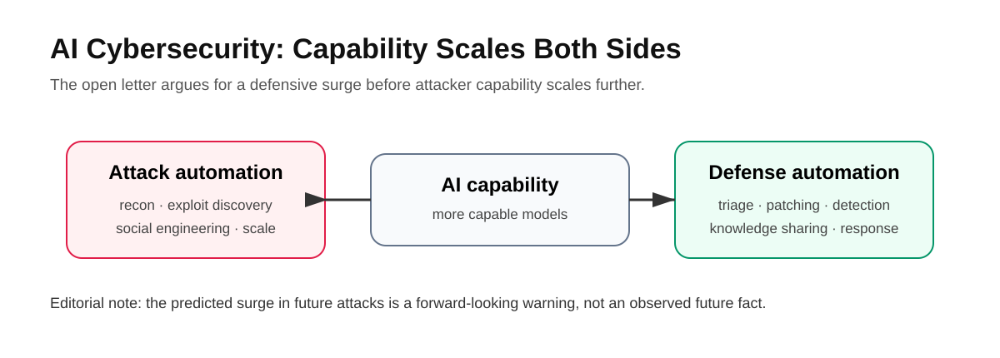
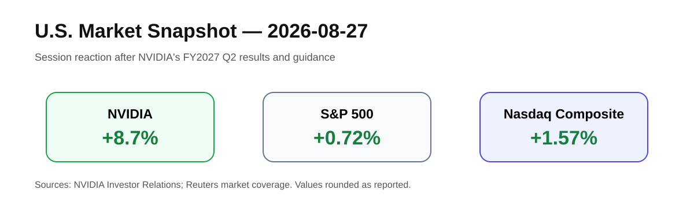

# Daily Global Tech Intelligence Report — 2026-08-28

> **Coverage cutoff:** 2026-08-28 08:52 KST / 2026-08-27 23:52 UTC  
> **Rule:** 새로운 발전을 우선하고, FACT / ANALYSIS / UNCERTAINTY를 분리한다.  
> **Source ledger:** [sources/2026/08/2026-08-28.md](../../../sources/2026/08/2026-08-28.md)

## Executive Summary

오늘의 핵심은 세 가지다. 첫째, AI 인프라 수요가 GPU에서 **HBM·첨단 패키징·전력·데이터센터**까지 공급망 전체를 끌어당기고 있다. 둘째, AI 능력 향상은 생산성뿐 아니라 사이버보안의 공격·방어 양쪽을 동시에 가속하면서 산업 차원의 공동 대응을 요구하고 있다. 셋째, Physical AI는 투자와 하드웨어 발전 속도에 비해 실제 공장 작업의 신뢰성·경제성 검증이 느려, **데모와 상용화 사이의 간극**이 핵심 리스크로 남아 있다.

우주·과학에서는 ESA의 MTG-I2 발사가 고빈도 기상관측 인프라를 확장했고, 시장에서는 NVIDIA의 강한 실적 전망이 AI 투자 사이클에 대한 신뢰를 다시 높였지만 상승이 기술주에 집중됐다는 점도 확인됐다.

## Evidence Snapshot

| # | Category | Development | Evidence | Confidence |
|---|---|---|---|---|
| 1 | AI / Semiconductors | SK hynix, 미국 HBM 생산·패키징 거점 착공 | SK hynix + Reuters | High |
| 2 | AI / Cybersecurity | 100개 이상 조직, AI 시대 공동 사이버 방어 촉구 | OpenAI letter + Reuters | High |
| 3 | Robotics | 중국 휴머노이드의 공장 상용화 병목 부각 | Reuters investigation | Medium-High |
| 4 | Space / Earth Science | ESA MTG-I2 발사 성공 | ESA | High |
| 5 | Economy / Investment | NVIDIA 전망 후 미국 기술주 강세 | NVIDIA IR + Reuters | High |

---

## 1. AI & Semiconductors — SK hynix, 미국 HBM 생산 거점 착공


**Priority:** High  
**Event date:** 2026-08-27 local time, West Lafayette, Indiana

### FACT

SK hynix는 인디애나주 웨스트라피엣에서 **40억 달러 이상**을 투자하는 AI 메모리용 첨단 패키징 생산시설 착공식을 열었다. 회사는 미국 내 차세대 HBM 양산을 **2029년 하반기** 시작한다는 계획을 제시했고, 100개 이상의 파트너와 생태계를 구축하며 직접·간접적으로 약 7,000개의 일자리를 만들겠다고 밝혔다. Purdue University와 차세대 첨단 패키징 R&D 협력도 추진한다.

Reuters는 이 시설에서 **HBM4E** 생산을 2029년 3분기부터 시작할 계획이라고 보도했다.

### ANALYSIS

AI 인프라의 병목이 GPU 설계에만 있지 않다는 점이 더 선명해졌다. HBM과 첨단 패키징은 AI 가속기의 실제 공급량과 성능을 결정하는 핵심 요소이며, 미국 현지 생산은 비용 최적화보다 **공급망 안정성·정책 지원·대형 고객 근접성**이 더 큰 전략 변수로 올라오고 있다는 신호다.

### UNCERTAINTY

SK hynix의 공식 발표는 제품을 넓게 **“next-generation HBM”**으로 표현하는 반면 Reuters는 **HBM4E**라고 특정한다. 따라서 본 리포트는 생산 시점은 공식 발표의 “2029년 하반기”를 기준으로 하고, 제품명 HBM4E는 Reuters의 추가 식별 정보로 구분한다.

### WATCH

- 2029년 실제 양산 시점과 램프업 속도
- HBM4/HBM4E 고객 인증과 공급계약
- 첨단 패키징 장비·소재 공급망의 미국 현지화

**Sources:**  
[Primary — SK hynix Newsroom](https://news.skhynix.com/en/groundbreaking-ceremony-in-indiana/) · [Secondary — Reuters](https://www.reuters.com/world/asia-pacific/sk-hynix-holds-groundbreaking-ceremony-4-billion-indiana-ai-chip-packaging-2026-08-27/)

---

## 2. AI & Cybersecurity — 100개 이상 조직이 “공동 방어” 촉구



**Priority:** High  
**Published:** 2026-08-27

### FACT

OpenAI가 공개한 **“A call for collective action on cyber defense”**에는 Anthropic, AWS, Google, Microsoft, AMD, Arm, Cisco, Cloudflare, CrowdStrike, IBM, Mastercard, Visa 등 기술·보안·금융·인프라 분야의 100개 이상 조직이 이름을 올렸다. 공개서한은 기존 보안 관행만으로는 충분하지 않으며, 방어자에게 AI 기반 보안 역량을 더 넓게 제공하고 정부·기업 간 공동 대응을 강화해야 한다는 세 가지 원칙을 제시했다.

Reuters도 같은 날 이 공동서한을 보도하며 AI 기반 공격이 확대될 수 있다는 업계의 경고와 방어 투자의 필요성을 전했다.

### ANALYSIS

AI 사이버보안 경쟁의 핵심은 모델의 공격 능력 자체보다 **누가 더 빠르게 취약점을 찾고 패치하며 방어 지식을 확산할 수 있는가**로 이동할 가능성이 있다. 이는 AI 모델 접근정책, 보안 자동화, 중요 인프라의 기술부채가 하나의 정책 문제로 연결된다는 뜻이다.

### UNCERTAINTY

“향후 몇 달 안에 AI 기반 공격이 훨씬 더 광범위하고 정교해질 것”이라는 표현은 서명 조직들의 **전망·경고**다. 미래 공격 증가가 이미 관측된 확정 사실인 것처럼 해석해서는 안 된다.

### WATCH

- 실제 AI 기반 침해사고의 빈도와 피해 규모
- 중요 인프라에 대한 방어용 AI 접근 프로그램
- 정부의 보안 예산·규제·정보공유 정책

**Sources:**  
[Primary — OpenAI open letter](https://openai.com/collective-cyberdefense/) · [Secondary — Reuters](https://www.reuters.com/legal/litigation/major-tech-companies-call-defensive-surge-defeat-ai-driven-hacks-2026-08-27/)

---

## 3. Robotics — 중국 휴머노이드, 하드웨어 발전과 공장 실용성 사이의 간극


*Representative image only: Unitree G1 at UAV Expo 2024. Photo by Sayanesy, CC0 1.0. The image is not evidence for the Reuters investigation's specific claims.*

**Priority:** High  
**Published:** 2026-08-27

### FACT

Reuters의 현장·산업 취재는 중국에서 150개가 넘는 기업이 휴머노이드 개발 경쟁에 참여하고 정부 지원과 투자가 빠르게 늘고 있지만, 실제 제조현장에서 기존 산업용 로봇을 대체할 정도의 **지능·정밀도·신뢰성·비용 경쟁력**은 아직 충분하지 않다고 평가했다. 보행·격투·댄스 등 데모 능력은 빠르게 향상됐지만, 변화가 많은 공장 작업을 장시간 안정적으로 수행하는 능력은 별도의 난제로 지적됐다.

### ANALYSIS

휴머노이드의 다음 경쟁 지표는 “얼마나 사람처럼 보이는가”가 아니라 **작업 성공률, 무개입 작동시간, 고장 간 평균시간, 시간당 비용, 새로운 작업 학습 속도**가 될 가능성이 높다. Physical AI의 경제성이 검증되려면 로봇 하드웨어와 함께 대규모 행동 데이터와 안정적인 제어 소프트웨어가 필요하다.

### UNCERTAINTY

이 항목은 단일 기업의 공식 발표가 아니라 Reuters의 산업 조사에 기반한다. “상용화가 몇 년 남았다”는 시간 추정은 기업·작업 종류에 따라 크게 달라질 수 있어 구체적인 연도 예측은 하지 않는다.

### WATCH

- 실제 유료 고객 배치 수
- 공장 내 무개입 작동시간과 작업 성공률
- 기존 로봇팔 대비 총소유비용(TCO)
- 로봇 행동 데이터 수집·학습 방식

**Source:** [Reuters investigation](https://www.reuters.com/investigations/chinas-humanoid-robots-arent-smart-enough-take-your-job-yet-2026-08-27/)

**Image license:** [Wikimedia Commons — Unitree G1](https://commons.wikimedia.org/wiki/File:Unitree_G1.jpg), CC0 1.0.

---

## 4. Space & Earth Science — ESA MTG-I2 발사, 유럽 기상관측망 확장


*Representative MTG-I family render. Credit: ESA, CC BY-SA 3.0 IGO.*

**Priority:** Medium-High  
**Launch:** 2026-08-27 22:11 CEST

### FACT

ESA는 **Meteosat Third Generation Imager 2 (MTG-I2)**가 Ariane 6 VA270편으로 프랑스령 기아나 유럽 우주기지에서 발사됐다고 발표했다. MTG-I2는 첫 번째 MTG 위성군의 구성을 완성하며, 유럽과 북아프리카의 대기를 고해상도로 더 자주 관측한다. ESA는 지역 관측에서 **2.5분 간격**의 고빈도 영상을 제공해 빠르게 발달하는 기상현상, 산불, 대기오염 감시와 조기경보 개선에 기여할 것으로 설명했다.

### ANALYSIS

우주 인프라의 가치는 단순히 “새 위성을 발사했다”는 데 있지 않다. 관측 주기가 짧아질수록 날씨·산불·대기질처럼 빠르게 변하는 현상에 대한 **실시간에 가까운 데이터 제품**의 가치가 커진다. 이 흐름은 위성·지상국·기상모델·AI 분석을 하나의 데이터 인프라로 묶는다.

### UNCERTAINTY

발사 성공과 실제 서비스 품질은 구분해야 한다. 본격적인 운영 성능은 궤도상 시험과 commissioning 이후 확인해야 한다.

### WATCH

- commissioning 완료와 정규 데이터 서비스 개시
- 예보 정확도와 조기경보 개선 효과
- AI 기반 nowcasting과 MTG 데이터 결합

**Source:** [Primary — ESA](https://www.esa.int/Newsroom/Press_Releases/MTG-I2_completes_Europe_s_latest_weather_trio)

**Image license:** [Wikimedia Commons — MTG-I render](https://commons.wikimedia.org/wiki/File:Meteosat_Third_Generation_ESA418057_(MTG-I_cropped).jpg), ESA, CC BY-SA 3.0 IGO.

---

## 5. Economy & Investment — NVIDIA 전망이 AI 투자심리 재점화, 그러나 시장 집중도는 높음


*Photo: Coolcaesar, CC BY-SA 4.0, Wikimedia Commons.*

**Priority:** High  
**Market session:** 2026-08-27 U.S.

### FACT

NVIDIA는 8월 26일 발표한 FY2027 2분기 실적에서 매출 **962억 달러**, 데이터센터 매출 **890억 달러**를 기록했고 각각 전년 동기 대비 106%, 117% 증가했다고 밝혔다. 다음 분기 매출 가이던스는 **1,080억 달러 ±2%**다.

이후 8월 27일 미국 시장에서 NVIDIA 주가는 약 **8.7%** 상승했고, S&P 500은 **0.72%**, Nasdaq Composite는 **1.57%** 올랐다. Reuters는 NVIDIA의 강한 전망이 AI 투자 사이클에 대한 신뢰를 높였다고 전했다.



### ANALYSIS

강한 데이터센터 성장과 다음 분기 가이던스는 AI 인프라 투자 사이클이 아직 둔화 신호보다 확장 신호를 더 강하게 보내고 있음을 보여준다. 다만 지수 상승이 소수 기술주에 크게 의존하면 **시장 폭(breadth)**이 약해질 수 있어, AI 성장과 전체 시장 건전성을 같은 것으로 보면 안 된다.

### UNCERTAINTY

기업 가이던스는 미래 실적의 보장이 아니다. 또한 하루의 주가 반응은 장기 수익성보다 포지셔닝·금리 기대·시장 심리의 영향을 크게 받을 수 있다.

### WATCH

- AI CAPEX 증가율과 실제 고객의 AI 매출화
- NVIDIA 데이터센터 성장률과 총마진
- 시장 폭과 기술주 집중도
- 미국 금리·인플레이션 경로

**Sources:**  
[Primary — NVIDIA Investor Relations](https://investor.nvidia.com/news/press-release-details/2026/NVIDIA-Announces-Financial-Results-for-Second-Quarter-Fiscal-2027/default.aspx) · [Secondary — Reuters](https://www.reuters.com/business/nasdaq-futures-take-lead-after-nvidia-forecast-refuels-ai-trade-2026-08-27/)

**Image license:** [Wikimedia Commons — NVIDIA Headquarters](https://commons.wikimedia.org/wiki/File:NVIDIA_Headquarters.jpg), Coolcaesar, CC BY-SA 4.0.

---

# Cross-Sector Intelligence

```text
AI capability
   ↓
Compute demand ──→ GPU / HBM / Packaging ──→ Data centers / Power
   │
   ├──→ Cyber offense & defense automation
   │
   └──→ Physical AI / Robotics
                     ↓
              Real-world reliability

Space sensors ──→ Higher-frequency data ──→ Models / AI analysis ──→ Operational decisions
```

## Current Thesis

1. **AI infrastructure is broadening:** 칩 한 종류보다 메모리·패키징·네트워크·전력 전체가 투자 대상이 된다.
2. **AI security is becoming infrastructure policy:** 모델 능력 향상은 사이버 방어 역량 배포 문제와 연결된다.
3. **Physical AI remains a commercialization test:** 하드웨어 데모와 실제 공장 경제성 사이의 격차가 핵심이다.
4. **Space is becoming a data platform:** 위성의 가치가 센서 성능에서 데이터 주기·처리·분석 속도로 확장된다.
5. **Markets are rewarding AI growth, but concentration matters:** AI 실적 강세와 금리·시장 폭을 동시에 봐야 한다.

## 30–90 Day Watchlist

- HBM4/HBM4E 공급계약과 패키징 투자 확대
- AI 보안 공동서한이 실제 정책·프로그램으로 이어지는지
- 휴머노이드 유료 배치와 운영 신뢰성 데이터 공개
- MTG-I2 commissioning 및 첫 운영 데이터
- NVIDIA 가이던스와 hyperscaler CAPEX의 실제 집행 속도
- 미국 금리 변화와 AI 성장주의 밸류에이션

## Verification Notes

- 모든 핵심 수치는 원문 또는 고신뢰 보도로 다시 확인했다.
- SK hynix의 제품명 표현 차이는 UNCERTAINTY에 별도 기록했다.
- Reuters의 휴머노이드 조사는 독립 취재이므로 공식 발표와 동일한 종류의 증거로 취급하지 않았다.
- 공개서한의 미래 사이버공격 전망은 “예측”으로 분리했다.
- 이미지별 라이선스와 대표 이미지 여부를 캡션 및 [asset manifest](../../../assets/2026-08-28/README.md)에 기록했다.

---

*Global Tech Intelligence Report · Verified edition · 2026-08-28*
