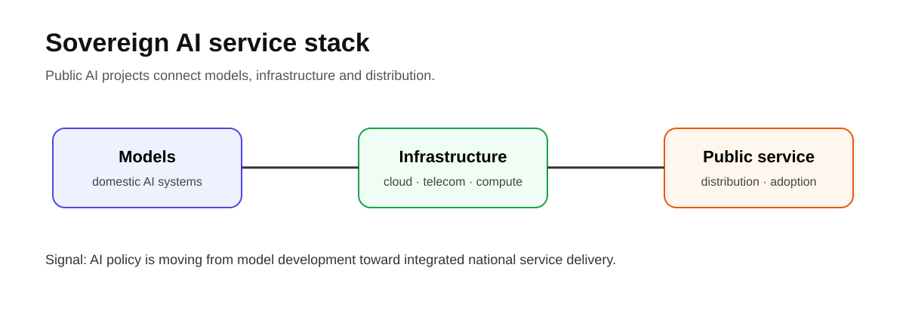
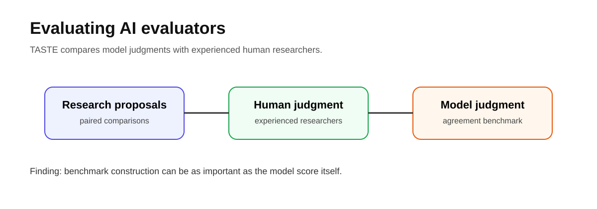
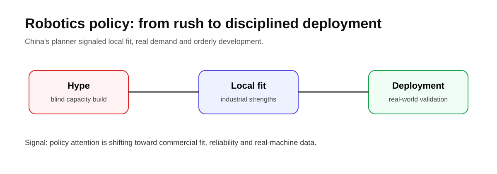
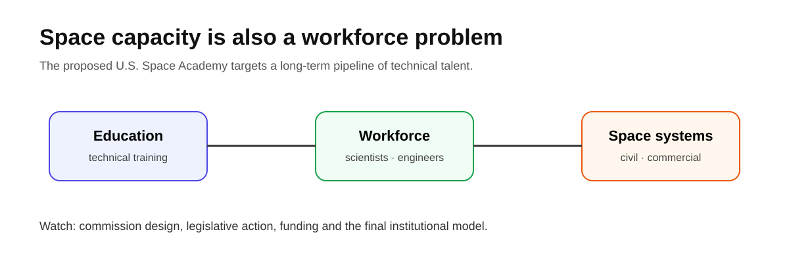
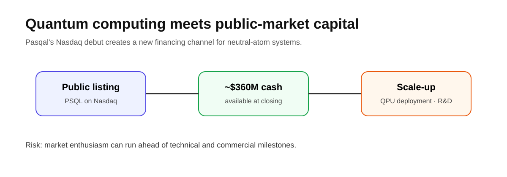

# Daily Global Tech Intelligence Report — 2026-08-29

> **Coverage cutoff:** 2026-08-29 08:08 KST / 2026-08-28 23:08 UTC  
> **Rule:** 새로운 발전을 우선하고 FACT / ANALYSIS / UNCERTAINTY / WATCH를 분리한다.  
> **Source ledger:** [sources/2026/08/2026-08-29.md](../../../sources/2026/08/2026-08-29.md)

## Executive Summary

오늘의 핵심은 **AI가 모델 경쟁을 넘어 국가 서비스·평가 체계·산업정책으로 확장되고 있다는 점**이다. 한국에서는 통신·플랫폼 기업이 참여하는 국가 AI 서비스 프로젝트가 구체화됐고, Anthropic은 AI가 AI 안전 연구 제안을 얼마나 잘 평가할 수 있는지를 측정하는 TASTE 벤치마크를 공개했다. 중국에서는 로봇 산업의 무분별한 확장보다 지역 산업 기반과 실제 수요에 맞춘 질서 있는 발전을 강조하는 정책 신호가 나왔다.

우주 분야에서는 미국이 NASA 주도 연방 우주 아카데미 설립안을 검토할 대통령 위원회를 만들었고, 투자시장에서는 프랑스 양자컴퓨팅 기업 Pasqal이 Nasdaq 거래를 시작하면서 첨단컴퓨팅 기업의 공공시장 자본조달이 다시 주목받았다.

## Evidence Snapshot

| # | Category | Development | Evidence | Confidence |
|---|---|---|---|---|
| 1 | AI / Public infrastructure | 한국, 국가 AI 서비스 사업자에 SKT·카카오·KT 선정 보도 | Reuters / Yonhap | Medium-High |
| 2 | AI / Research | Anthropic, AI 안전 연구 제안 평가 벤치마크 TASTE 공개 | Anthropic | High |
| 3 | Robotics | 중국 NDRC, 로봇 산업의 지역 적합성·질서 있는 발전 강조 | Reuters + secondary context | Medium-High |
| 4 | Space | 미국, Space Academy 설계 위원회 설치 | White House + Reuters | High |
| 5 | Quantum / Investment | Pasqal, Nasdaq 데뷔 및 약 3.6억 달러 자본 기반 확보 | Pasqal + Reuters | High |

---

## 1. AI Infrastructure — 한국 국가 AI 서비스, 모델에서 서비스 운영 경쟁으로

<p align="center"></p>

| Priority | Published | Confidence |
|---|---|---|
| High | 2026-08-28 | Medium-High |

### FACT

Reuters는 연합뉴스를 인용해 한국이 **SK Telecom, Kakao, KT**를 국내 AI 서비스를 구축·운영하는 국가 프로젝트의 사업자로 선정했다고 보도했다. 이번 뉴스의 정보가치는 단순한 모델 개발 지원이 아니라, 통신망·클라우드·플랫폼 유통을 가진 대형 사업자가 실제 공공 AI 서비스 운영 단계에 참여한다는 데 있다.

### ANALYSIS

소버린 AI 경쟁은 점점 `모델 자체 성능`에서 `모델 + 컴퓨팅 + 통신/클라우드 + 서비스 유통`의 통합 능력으로 이동하고 있다. 한국 사례는 국가 AI 정책이 모델 연구만 지원하는 단계에서 **대규모 사용자 접점과 운영 인프라를 묶는 단계**로 확장되는 신호로 볼 수 있다.

### UNCERTAINTY

본 조사 컷오프 시점에는 세부 계약조건·정부 지원규모·성과지표가 담긴 공식 부처 원문을 안정적으로 확인하지 못했다. 따라서 사업 구조와 경제적 효과에 대한 단정은 피한다.

### WATCH

- 공식 사업 범위와 예산
- 모델·클라우드·통신사별 역할 분담
- 실제 사용자 대상 서비스 출시 일정
- 국내 AI 반도체·데이터센터 공급망 참여 여부

**Source:** [Reuters](https://www.reuters.com/world/asia-pacific/south-korea-picks-sk-telecom-kakao-kt-national-ai-project-yonhap-reports-2026-08-28/)

---

## 2. AI Research — Anthropic TASTE, AI가 AI 안전 연구를 평가할 수 있는가

<p align="center"></p>

| Priority | Published | Confidence |
|---|---|---|
| Medium-High | 2026-08-28 | High |

### FACT

Anthropic Fellows Program 연구진은 **TASTE(The AI Safety Taste Evaluation)**를 공개했다. 이 벤치마크는 AI 안전 연구 제안 두 개를 비교해 어떤 제안이 더 유망한지 판단하도록 하고, 경험 많은 인간 연구자의 선호와 모델 판단이 얼마나 일치하는지를 측정한다. 공개된 버전은 **92개 제안 쌍**, 추정 인간 합의도 **77%**를 사용하며, 연구진이 평가한 Fable 5 모델은 **60%**의 성능을 기록했다.

### ANALYSIS

AI 연구 자동화의 병목은 답을 생성하는 능력뿐 아니라 **무엇이 좋은 연구 질문인지 평가하는 능력**이다. TASTE는 모델이 연구 아이디어의 질을 평가하는 메타 수준의 작업에서 아직 인간 전문가를 안정적으로 대체하지 못한다는 근거를 제공한다. 동시에 벤치마크 설계에서 평가자 간 합의와 자신감 필터링이 중요하다는 점도 보여준다.

### UNCERTAINTY

TASTE는 특정 연구영역과 제한된 제안 쌍으로 구성된 초기 벤치마크다. 한 모델의 60% 점수를 AI 연구능력 전체로 일반화할 수 없다.

### WATCH

- 더 큰 표본과 외부 연구기관의 재현
- 다양한 모델의 TASTE 성능
- 모델 평가와 실제 연구 성과의 상관관계
- AI가 연구 제안 생성과 평가를 함께 수행할 때의 편향

**Source:** [Anthropic — TASTE](https://alignment.anthropic.com/2026/taste/)

---

## 3. Robotics — 중국, 로봇 투자 과열보다 실제 수요와 지역 적합성 강조

<p align="center"></p>

| Priority | Published | Confidence |
|---|---|---|
| High | 2026-08-28 | Medium-High |

### FACT

Reuters에 따르면 중국 국가발전개혁위원회(NDRC) 대변인은 로봇 산업 발전이 **지역별 자원과 산업 강점에 맞춰 질서 있게 진행돼야 하며, 유행을 맹목적으로 따라서는 안 된다**고 밝혔다. 추가 보도에서는 실제 환경 데이터 수집, 다양한 embodied-AI 기술 경로, 실제 시나리오 확대와 신뢰성·안전성 검증을 강조하는 정책 맥락도 제시됐다.

### ANALYSIS

전날까지의 핵심 질문이 '휴머노이드가 얼마나 빨리 발전하는가'였다면, 이번 정책 신호는 '어디에 배치해야 경제성과 데이터가 함께 쌓이는가'로 초점을 옮긴다. 이는 중국의 로봇 산업에서도 **데모·설비확장보다 실제 배치와 데이터 폐루프**가 중요해지고 있음을 보여준다.

### UNCERTAINTY

대변인 발언은 곧바로 투자 제한이나 산업 구조조정을 의미하지 않는다. 구체적 지원정책·프로젝트 심사 기준이 뒤따르는지 확인해야 한다.

### WATCH

- 지방정부의 신규 로봇 산업단지·보조금 정책 변화
- 실제 공장·물류·서비스 배치 데이터
- 실기기 데이터 수집 인프라 투자
- 신뢰성·안전성 평가 기준의 공식화

**Sources:** [Reuters](https://www.reuters.com/world/asia-pacific/china-says-robot-industry-development-must-be-tailored-local-conditions-2026-08-28/) · [Global Times context](https://www.globaltimes.cn/page/202608/1369250.shtml)

---

## 4. Space — 미국 Space Academy, 우주 경쟁의 병목을 인력으로 확장

<p align="center"></p>

| Priority | Published | Confidence |
|---|---|---|
| Medium-High | 2026-08-28 | High |

### FACT

미국 백악관은 **United States Space Academy** 설립안을 구체화하기 위한 대통령 위원회를 만드는 행정명령을 발표했다. 위원회는 NASA Administrator가 이끌며, NASA 주도 연방 아카데미 방안을 포함해 조직구조·인증·기관 간 역할·실행전략을 검토하고 **120일 이내**에 보고서를 제출하도록 되어 있다. 실제 설립은 이후 필요한 행정·입법·예산 절차를 거쳐야 한다.

### ANALYSIS

우주 산업의 병목은 발사체와 위성 하드웨어뿐 아니라 **과학자·엔지니어·운영 인력의 장기 공급**이기도 하다. 이번 조치는 미국의 우주 경쟁력이 시설 투자뿐 아니라 인재 파이프라인을 제도화하는 방향으로 확장되고 있음을 보여준다.

### UNCERTAINTY

현재 단계는 '학교 설립 완료'가 아니라 **설계 위원회 설치**다. 위치, 규모, 예산, 학생 선발과 실제 개교 일정은 정해지지 않았다.

### WATCH

- 120일 보고서의 구체안
- 의회 입법과 예산 확보 여부
- NASA·대학·산업계의 역할 분담
- 기존 우주 인력양성 프로그램과의 중복·통합

**Sources:** [White House](https://www.whitehouse.gov/presidential-actions/2026/08/establishing-the-united-states-space-academy/) · [Reuters](https://www.reuters.com/business/aerospace-defense/trump-will-sign-order-create-us-space-academy-2026-08-28/)

---

## 5. Quantum & Investment — Pasqal Nasdaq 데뷔, 양자컴퓨팅에 공공시장 자본 유입

<p align="center"></p>

| Priority | Market date | Confidence |
|---|---|---|
| High | 2026-08-28 | High |

### FACT

중성원자 방식 양자컴퓨팅 기업 **Pasqal**은 Bleichroeder Acquisition Corp. II와의 기업결합을 마치고 8월 28일 Nasdaq에서 `PSQL`로 거래를 시작했다. 회사는 거래 종결 시점에 약 **3억6천만 달러**의 현금을 확보해 QPU 생산·배치 확대, fault-tolerant quantum computing 로드맵, 클라우드·소프트웨어 플랫폼과 상업화 확대에 사용할 계획이라고 밝혔다. Reuters는 첫 거래일 주가가 장중 크게 상승했다고 보도했다.

### ANALYSIS

양자컴퓨팅은 아직 기술 리스크가 큰 분야지만, 상장으로 대규모 장기자본에 접근할 수 있게 되면 연구개발과 시스템 배치 속도를 높일 수 있다. 동시에 공공시장에서는 기술적 진전보다 **테마 기대가 가치평가를 앞설 위험**도 커진다.

### UNCERTAINTY

상장 첫날 주가와 장기 기술경쟁력은 별개다. 오류율, 실제 고객 활용, 양자우위 입증과 매출 성장 등 기술·상업적 마일스톤이 뒤따라야 한다.

### WATCH

- QPU 배치 대수와 신규 고객
- 현금 사용 속도와 추가 자본조달
- fault-tolerant 로드맵의 실제 기술 진전
- 상장 후 매출·손실·현금흐름 변화

**Sources:** [Pasqal](https://www.pasqal.com/newsroom/pasqal-and-bleichroeder-acquisition-corp-ii-complete-business-combination/) · [Reuters](https://www.reuters.com/business/frances-quantum-computer-maker-pasqal-surges-nasdaq-debut-2026-08-28/)

---

# Cross-Sector Intelligence

```text
National AI policy ──→ Models + Infrastructure + Distribution
                         ↓
                  Evaluation / governance

Robotics investment ──→ Real-world deployment ──→ Operational data

Space systems ──→ Workforce pipeline

Frontier computing ──→ Public-market capital ──→ Scale-up pressure
```

## Current Thesis

1. **AI policy is becoming service architecture:** 모델 개발만이 아니라 인프라와 유통까지 묶는 경쟁이 커진다.
2. **Evaluation is a capability of its own:** AI가 생성뿐 아니라 판단·선별을 얼마나 잘하는지가 연구 자동화의 핵심 병목이다.
3. **Physical AI is entering a discipline phase:** 로봇 산업은 투자 규모보다 실제 배치·신뢰성·데이터가 중요해지고 있다.
4. **Space capacity includes human capital:** 우주 인프라 경쟁이 인력양성 제도까지 확대되고 있다.
5. **Frontier-tech capital is returning to public markets:** 양자컴퓨팅처럼 장기 기술 분야도 상장 자본을 활용하려는 움직임이 커진다.

## 30–90 Day Watchlist

- 한국 국가 AI 서비스의 공식 계약·예산·출시 일정
- TASTE 외부 재현과 모델 비교 결과
- 중국 로봇 정책의 후속 규정과 실제 배치 데이터
- 미국 Space Academy 120일 설계 보고서
- Pasqal의 상장 후 운영지표와 QPU 배치

## Verification Notes

- 핵심 수치와 날짜는 1차 출처 또는 Reuters 고신뢰 보도로 재확인했다.
- 한국 국가 AI 프로젝트는 공식 부처 원문 미확보 상태를 명시하고 Confidence를 낮췄다.
- 중국 로봇 정책은 대변인 발언과 실제 규제조치를 구분했다.
- Space Academy는 '설립 완료'가 아닌 설계위원회 단계로 표현했다.
- 모든 시각자료는 저장소 제작 SVG이며 [asset manifest](../../../assets/2026-08-29/README.md)에 기록했다.

---

*Global Tech Intelligence Report · Verified edition · 2026-08-29*
