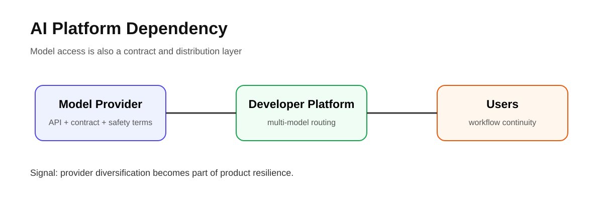
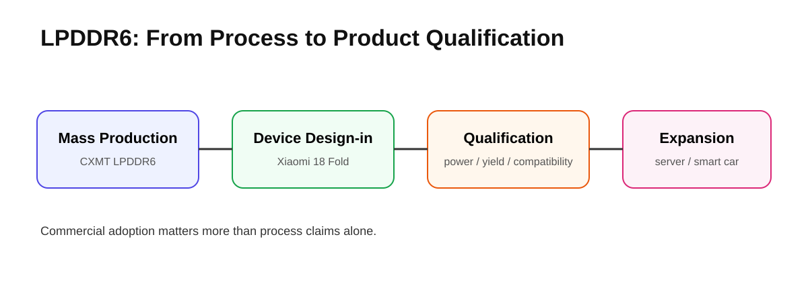
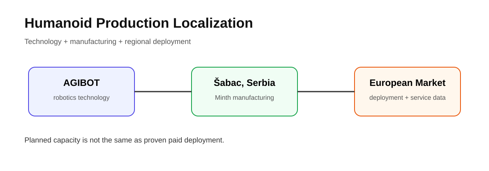
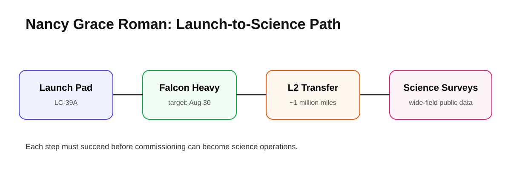
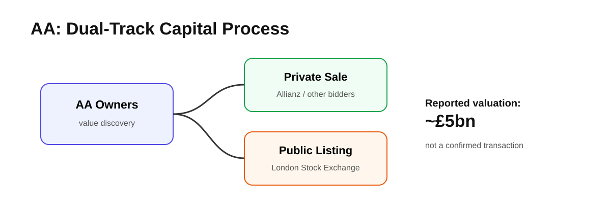

# Daily Global Tech Intelligence Report — 2026-08-30

> **Coverage cutoff:** 2026-08-30 08:30 KST / 2026-08-29 23:30 UTC  
> **Rule:** 새로운 발전을 우선하고 FACT / ANALYSIS / UNCERTAINTY / WATCH를 분리한다.  
> **Source ledger:** [sources/2026/08/2026-08-30.md](../../../sources/2026/08/2026-08-30.md)

## Executive Summary

오늘의 핵심 흐름은 **AI 생태계가 모델 성능만이 아니라 유통권·반도체 자립·물리적 생산능력으로 확장되고 있다는 것**이다. OpenAI는 SpaceX가 인수한 Cursor에 대한 직접 모델 공급 계약을 종료하겠다고 밝혀, 개발자 도구가 특정 모델 공급자와 맺는 계약·플랫폼 의존성이 새로운 경쟁 변수로 떠올랐다. 중국 CXMT는 Xiaomi의 차세대 폴더블 스마트폰에 LPDDR6를 공급한다고 밝혀 메모리 기술 자립이 모바일·서버·자동차까지 확장되는 신호를 보였다.

Physical AI에서는 Minth와 AGIBOT가 세르비아에서 휴머노이드 로봇 양산을 시작해 중국 로봇 공급망의 유럽 현지화가 구체화됐다. 우주 분야에서는 NASA의 Nancy Grace Roman 우주망원경이 발사대로 이동해 최종 발사 준비 단계에 진입했다. 경제·투자에서는 독일 Allianz가 영국 AA를 약 50억 파운드에 인수하는 방안을 검토 중이라는 보도가 나와 대형 금융·서비스 M&A 가능성이 부각됐다.

## Evidence Snapshot

| # | Category | Development | Evidence | Confidence |
|---|---|---|---|---|
| 1 | AI / Developer Platforms | OpenAI, SpaceX 소유 Cursor와 모델 공급 계약 종료 계획 | OpenAI + Reuters | High |
| 2 | Semiconductors | CXMT, Xiaomi 18 Fold에 LPDDR6 공급 | Reuters citing CXMT/Xiaomi | Medium-High |
| 3 | Robotics / Physical AI | Minth·AGIBOT, 세르비아에서 휴머노이드 양산 시작 | Development Agency of Serbia | High |
| 4 | Space / Science | NASA Roman, 발사대로 이동해 최종 준비 | NASA | High |
| 5 | Economy / Investment | Allianz, AA 약 £5bn 인수 검토 보도 | Reuters / Sky News | Medium-High |

---

## 1. AI Platforms — OpenAI, SpaceX 소유 Cursor에 직접 모델 공급 종료 계획

<p align="center"></p>
<p align="center"><sub>Repository-created diagram · model provider → developer platform → users</sub></p>

| Priority | Published | Confidence |
|---|---|---|
| High | 2026-08-29 coverage | High |

### FACT

OpenAI는 SpaceX가 인수한 Cursor에 자사 모델을 직접 제공하는 계약을 종료할 계획이라고 밝혔다. OpenAI의 공식 발표는 **2026년 11월 12일**을 제안된 공급 종료일로 제시했으며, 계약상 가능한 최대 통지기간을 제공한다고 설명했다. 회사는 SpaceX가 자사 기술을 이용약관과 계약 조건 안에서 사용할 것이라는 확신이 부족하다는 점을 이유로 들었다.

Reuters는 Cursor 측이 OpenAI와 해결 방안을 논의 중이며, OpenAI 모델이 Cursor 사용자 트래픽의 약 **5%**를 차지한다고 전했다. Anthropic 측은 Cursor에서 Claude 지원을 계속 확대하겠다는 입장을 밝혔다.

### ANALYSIS

AI 개발도구의 경쟁력은 UI나 에이전트 기능뿐 아니라 **어떤 모델 공급자와 얼마나 안정적으로 계약·통합할 수 있는가**에도 좌우된다. 이번 사례는 multi-model 플랫폼이라도 핵심 모델 공급자가 계약을 중단할 수 있다는 점을 보여주며, 개발자 도구 사업자에게 공급자 다변화와 자체 모델·컴퓨팅 역량의 전략적 가치가 커질 수 있음을 시사한다.

### UNCERTAINTY

공급 종료는 즉시 시행된 것이 아니라 제안된 종료일까지 협의가 이어질 수 있다. Cursor와 OpenAI가 조건을 조정해 관계를 유지할 가능성도 배제할 수 없다.

### WATCH

- 11월 12일 이전 계약 재협상 여부
- Cursor의 Claude·Grok·기타 모델 트래픽 변화
- 사용자가 직접 API 키를 사용하는 우회적 접근 방식의 비중
- 개발자 도구 업계의 multi-provider 계약 구조 변화

**Sources:** [Primary — OpenAI](https://openai.com/index/our-decision-on-cursor-following-its-acquisition-by-spacex/) · [Secondary — Reuters](https://www.reuters.com/business/media-telecom/openai-end-partnership-with-spacexs-cursor-2026-08-29/)

---

## 2. Semiconductors — CXMT LPDDR6, Xiaomi 폴더블에 공급

<p align="center"></p>
<p align="center"><sub>Repository-created diagram · domestic memory → device integration → broader qualification</sub></p>

| Priority | Published | Confidence |
|---|---|---|
| High | 2026-08-29 | Medium-High |

### FACT

Reuters에 따르면 중국 메모리 업체 **ChangXin Memory Technologies(CXMT)**는 LPDDR6 DRAM의 양산을 시작했고, Xiaomi의 차기 폴더블 스마트폰 **18 Fold**에 공급할 예정이다. Xiaomi도 공식 Weibo 계정에서 이 협력을 확인했으며, 해당 기기는 9월 출시 예정이고 자체 3nm **Xring O3** 프로세서가 LPDDR6를 지원한다고 전해졌다.

Reuters는 CXMT가 스마트폰뿐 아니라 서버와 스마트카용으로도 LPDDR6 샘플을 출하하고 있다고 보도했다.

### ANALYSIS

메모리 자립은 단순히 생산공정을 확보하는 것으로 끝나지 않는다. 실제 플래그십 기기에 채택되어 **전력·성능·수율·호환성 검증을 통과하는 것**이 중요하다. Xiaomi 채택은 CXMT가 모바일 DRAM에서 글로벌 선두업체와의 기술격차를 줄이려는 과정에서 의미 있는 상업적 검증 단계다.

### UNCERTAINTY

이번 보고서는 Reuters가 인용한 CXMT·Xiaomi의 Weibo 발표를 기반으로 한다. 독립적인 성능 벤치마크, 수율, 공급량, 장기 계약규모는 공개되지 않았다.

### WATCH

- Xiaomi 18 Fold 실제 출시와 메모리 사양
- LPDDR6 수율·전력효율·성능 벤치마크
- 서버·자동차 고객 인증 확대
- 삼성전자·SK hynix·Micron의 LPDDR6 대응

**Source:** [Reuters](https://www.reuters.com/world/asia-pacific/chinas-cxmt-supply-memory-chip-xiaomis-upcoming-folding-phone-2026-08-29/)

---

## 3. Robotics — Minth·AGIBOT, 세르비아에서 휴머노이드 양산 시작

<p align="center"></p>
<p align="center"><sub>Repository-created diagram · China robotics technology → Serbian manufacturing → European market</sub></p>

| Priority | Event date | Confidence |
|---|---|---|
| High | 2026-08-29 | High |

### FACT

세르비아 개발청(Development Agency of Serbia)은 Minth Group이 Šabac의 생산시설에서 AGIBOT와 협력해 **유럽 최초의 휴머노이드 로봇 양산**을 시작했다고 발표했다. 세르비아어 공식 발표에 따르면 1단계 생산기지 투자는 **2,000만 유로**, 향후 Inđija 로봇산업단지까지 포함한 계획 투자는 **2억 유로**, 완공 시 연간 최대 **2만 대**의 휴머노이드·사족보행 로봇 생산능력을 목표로 한다.

발표는 AGIBOT가 2026년 상반기 약 8,400대의 휴머노이드 로봇을 출하했다고 회사 데이터를 인용했다.

### ANALYSIS

Physical AI 경쟁에서 중요한 변화는 연구실 데모를 넘어 **대량생산과 지역 공급망 구축**으로 이동하는 것이다. 이번 세르비아 생산은 중국 로봇 기술과 유럽 인접 제조기반을 결합하는 사례로, 가격·납기·서비스 네트워크 측면에서 유럽 시장 접근성을 높일 수 있다.

### UNCERTAINTY

발표된 연간 2만 대 생산능력은 **계획 목표**이며 실제 수요와 가동률을 보장하지 않는다. 또한 출하량 수치는 회사 제공 자료이므로 독립적인 글로벌 시장점유율 검증과 구분해 봐야 한다.

### WATCH

- 실제 월별 생산량과 유료 고객 인도량
- 유럽 산업현장의 작업 성공률·MTBF·TCO
- Inđija 산업단지 투자 집행 속도
- 로봇 부품의 현지조달 비중

**Sources:** [Primary — Development Agency of Serbia](https://www.ras.gov.rs/minth-group-launches-europes-first-mass-production-of-humanoid-robots) · [Primary context — Serbian Ministry of Trade](https://must.gov.rs/vest/sr/21169/lazarevic-humanoidne-robote-u-srbiji-proizvodice-svetski-broj-jedan.php)

---

## 4. Space & Science — NASA Roman, 발사대로 이동

<p align="center"></p>
<p align="center"><sub>Repository-created diagram · rollout → launch → L2 transfer → science surveys</sub></p>

| Priority | Published | Confidence |
|---|---|---|
| High | 2026-08-29 | High |

### FACT

NASA는 Nancy Grace Roman Space Telescope를 실은 SpaceX Falcon Heavy가 Kennedy Space Center의 Launch Complex 39A 발사대로 이동했다고 발표했다. NASA와 SpaceX는 **8월 30일 07:26 EDT(11:26 UTC)** 발사를 목표로 하고 있으며, Roman은 발사 후 태양-지구 **L2** 지점으로 이동할 예정이다.

Roman의 Wide Field Instrument는 3억 화소급 가시광·근적외선 카메라를 이용해 넓은 하늘을 반복 관측하며 암흑에너지·암흑물질·외계행성 연구를 수행한다. NASA는 Roman의 시야가 Hubble보다 최소 100배 넓다고 설명한다.

### ANALYSIS

Roman은 '더 깊게 보는 망원경'보다 **넓은 영역을 반복적으로 조사해 대규모 공개 데이터셋을 만드는 관측 플랫폼**에 가깝다. 발사 성공 이후에도 commissioning과 데이터 파이프라인 안정화가 중요하며, 향후 천문학에서 AI 기반 분류·이상탐지·대규모 통계분석의 수요를 크게 늘릴 가능성이 있다.

### UNCERTAINTY

현재는 발사 전 최종 준비 단계다. 실제 발사, 궤도 투입, L2 전이, commissioning이 모두 성공해야 과학운영 단계로 넘어간다.

### WATCH

- Falcon Heavy 발사 성공 여부
- 분리 후 통신·전력 상태
- L2 전이와 초기 광학 점검
- 2027년 초기 과학데이터 공개 일정

**Sources:** [Primary — NASA launch-pad update](https://science.nasa.gov/blogs/roman/2026/08/29/nasa-roman-arrives-at-launch-pad-mission-briefings-scheduled/) · [Primary — NASA mission page](https://science.nasa.gov/mission/roman-space-telescope/)

---

## 5. Economy & Investment — Allianz, 영국 AA 약 £5bn 인수 검토

<p align="center"></p>
<p align="center"><sub>Repository-created diagram · private sale vs. public listing</sub></p>

| Priority | Published | Confidence |
|---|---|---|
| Medium-High | 2026-08-29 | Medium-High |

### FACT

Reuters는 Sky News를 인용해 독일 금융그룹 **Allianz**가 영국 도로긴급출동 기업 **AA**를 약 **50억 파운드(약 67.7억 달러)**에 인수하는 방안을 검토하고 있다고 보도했다. 보도에 따르면 Allianz는 AA의 자문사들과 논의한 소수 후보 중 하나이며, 사모펀드 EQT도 후보로 거론됐다.

AA의 현 소유주들은 회사 매각과 런던증권거래소 재상장을 동시에 검토하는 **dual-track** 절차를 진행 중인 것으로 전해졌다. Allianz와 AA는 논평을 거부했다.

### ANALYSIS

이 거래가 성사되면 보험·모빌리티 서비스의 고객기반과 데이터, 긴급출동 네트워크를 결합하는 대형 유럽 금융·서비스 M&A가 된다. 동시에 AA가 매각 대신 상장을 택할 수도 있어, 현재 뉴스의 핵심은 거래 완료가 아니라 **사모시장과 공개시장 중 어느 자본경로가 더 높은 가치를 인정하는지 시험하는 과정**이다.

### UNCERTAINTY

현재는 익명 관계자 기반의 인수 검토 보도이며 공식 제안이나 확정 거래가 아니다. 가격, 자금조달 구조, 경쟁당국 심사와 최종 거래 가능성은 모두 불확실하다.

### WATCH

- Allianz 또는 AA의 공식 확인
- 경쟁 입찰자와 제안가격
- 매각 vs. LSE 재상장 선택
- 거래 자금조달 및 규제심사 조건

**Source:** [Reuters](https://www.reuters.com/legal/transactional/german-insurer-allianz-weighs-677-billion-takeover-aa-roadside-rescue-giant-sky-2026-08-29/)

---

# Cross-Sector Intelligence

```text
Frontier models ──→ developer platforms ──→ contract / distribution power
        │
        └──→ compute & memory ──→ domestic semiconductor supply chains

Embodied AI ──→ robot design ──→ mass production ──→ regional deployment ──→ operating data

Space instruments ──→ large public datasets ──→ automated analysis / AI science

Capital markets ──→ sale / IPO / strategic acquisition ──→ scale-up capacity
```

오늘의 공통점은 **기술이 실제 산업이 되는 과정에서 '누가 만들 수 있는가'보다 '누가 공급망·유통·생산·자본을 안정적으로 연결할 수 있는가'가 더 중요해지고 있다는 것**이다.

## 30–90 Day Watchlist

- OpenAI–Cursor 계약 재협상과 모델 공급자 다변화
- CXMT LPDDR6의 실제 기기 성능과 추가 고객
- 세르비아 AGIBOT/Minth 공장의 실생산량과 고객 배치
- Roman 발사·L2 전이·commissioning
- Allianz–AA 거래의 공식화 또는 IPO 전환

## Verification Notes

- OpenAI 항목은 회사 공식 발표와 Reuters를 교차검증했다.
- CXMT 항목은 Reuters가 양사 공식 Weibo 발표를 인용했으나, 이번 조사에서 해당 원문을 독립적으로 보존하지 못해 Medium-High로 분류했다.
- 세르비아 로봇 공장 수치 중 향후 생산능력은 실적이 아닌 계획치로 구분했다.
- Roman은 발사 성공이 아니라 발사대 이동과 최종 준비 완료라는 현재 상태만 FACT로 기록했다.
- Allianz–AA는 공식 제안이 아닌 익명 관계자 기반 검토 보도이므로 불확실성을 명시했다.
- 오늘 시각자료는 모두 저장소 자체 SVG로 제작해 외부 이미지 저작권·깨진 링크 위험을 제거했다.

---

*Global Tech Intelligence Report · Verified edition · 2026-08-30*
