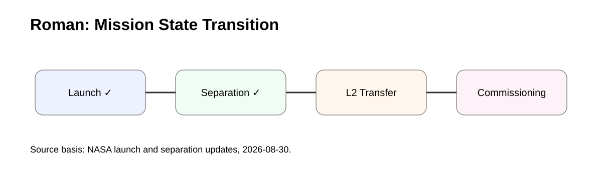
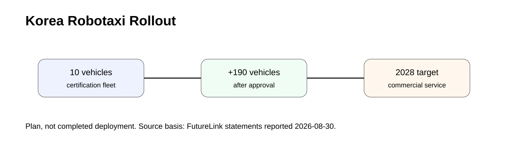
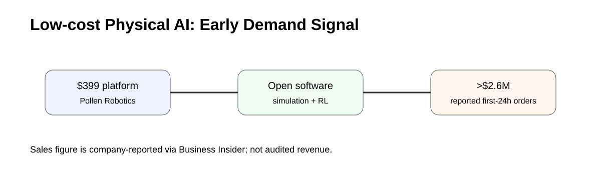
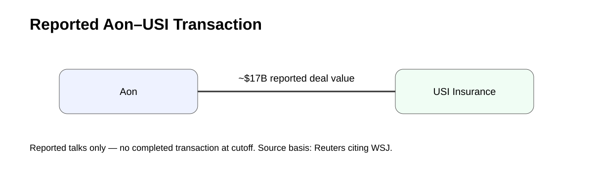
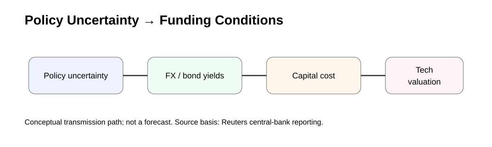

# Daily Global Tech Intelligence Report — 2026-08-31

> **Coverage cutoff:** 2026-08-31 08:25 KST / 2026-08-30 23:25 UTC  
> **Rule:** 새로운 발전을 우선하고 FACT / ANALYSIS / UNCERTAINTY / WATCH를 분리한다.  
> **Source ledger:** [sources/2026/08/2026-08-31.md](../../../sources/2026/08/2026-08-31.md)

## Executive Summary

오늘의 가장 큰 변화는 전날 발사 준비 단계였던 NASA의 Nancy Grace Roman Space Telescope가 **실제 발사와 우주선 분리까지 성공**하며 약 3개월의 L2 전이·commissioning 단계로 넘어간 것이다. 자율주행에서는 Pony.ai와 FutureLink가 한국에서 2028년까지 200대의 7세대 로보택시 도입을 추진한다고 공개해, 기술 실증이 차량 인증과 상업 운행 준비로 이동하는 신호가 나왔다.

Physical AI 쪽에서는 Hugging Face 산하 Pollen Robotics의 399달러 Microduck이 출시 직후 강한 초기 주문을 기록했다는 보도가 나와 저가·개방형 로봇 개발 플랫폼의 실제 수요를 가늠할 새로운 지표가 생겼다. 경제·투자에서는 Aon의 USI Insurance 약 170억달러 인수 협상 보도와, 유럽 중앙은행 관계자들의 미국 경제정책 예측가능성에 대한 우려가 각각 대형 M&A와 자본비용·금융안정 측면의 관찰 포인트로 부상했다.

## Evidence Snapshot

| # | Category | Development | Evidence | Confidence |
|---|---|---|---|---|
| 1 | Space / Science | NASA Roman 발사·우주선 분리 성공 | NASA + Reuters | High |
| 2 | Autonomy | Pony.ai·FutureLink, 한국 200대 로보택시 도입 계획 | FutureLink statements via multiple Korean outlets | Medium-High |
| 3 | AI / Robotics | Microduck 초기 주문 수요 확인 | Pollen Robotics + Business Insider | Medium-High |
| 4 | Economy / M&A | Aon, USI Insurance 약 $17bn 인수 협상 보도 | Reuters citing WSJ | Medium-High |
| 5 | Macro / Markets | 유럽 중앙은행권, 미국 정책 예측가능성 우려 | Reuters | Medium-High |

---

## 1. Space & Science — NASA Roman, 발사·분리 성공

<p align="center"></p>
<p align="center"><sub>Repository-created diagram · launch → separation → L2 transfer → commissioning</sub></p>

| Priority | Event time | Confidence |
|---|---|---|
| High | 2026-08-30 07:26 EDT | High |

### FACT

NASA의 Nancy Grace Roman Space Telescope는 8월 30일 오전 7시 26분 EDT에 Kennedy Space Center의 Launch Complex 39A에서 SpaceX Falcon Heavy로 발사됐다. NASA는 약 31분 뒤인 오전 7시 57분경 Roman이 Falcon Heavy 2단에서 분리되어 독립 비행에 들어갔다고 밝혔다.

Roman은 약 100만 마일 떨어진 태양-지구 L2 부근으로 이동하며, NASA는 전이·전개·보정·시험을 포함한 commissioning에 약 3개월을 예상한다. Reuters는 약 40억달러 규모의 이 임무가 암흑물질·암흑에너지·외계행성 연구를 위한 광시야 우주 관측소라고 보도했다.

### ANALYSIS

전날의 핵심 리스크가 '발사가 실제로 성공하는가'였다면 오늘부터 핵심은 **L2 전이, 전개, 열·전력 안정화, 광학·검출기 보정, 데이터 파이프라인**으로 이동한다. Roman의 과학적 가치는 발사 성공 자체보다 대규모 공개 데이터셋을 안정적으로 생산하는 단계까지 도달할 때 현실화된다.

### UNCERTAINTY

발사와 분리 성공은 과학운영 성공을 보장하지 않는다. 첫 고해상도 영상과 정식 과학운영 시점은 commissioning 성과에 따라 달라질 수 있다.

### WATCH

- 태양전지판·열차폐 등 초기 전개 상태
- L2 전이 궤적과 통신 상태
- 약 90일 commissioning 마일스톤
- 첫 고해상도 이미지와 공개 데이터 일정

**Sources:** [Primary — NASA launch release](https://www.nasa.gov/news-release/nasas-dark-universe-seeking-nancy-grace-roman-space-telescope-launches/) · [Primary — NASA separation update](https://science.nasa.gov/blogs/roman/2026/08/30/nasas-roman-space-telescope-flying-on-its-own/) · [Secondary — Reuters](https://www.reuters.com/science/nasa-launches-powerful-new-roman-space-telescope-florida-2026-08-30/)

---

## 2. Robotics & Autonomy — Pony.ai·FutureLink, 한국에 200대 로보택시 도입 추진

<p align="center"></p>
<p align="center"><sub>Repository-created diagram · certification fleet → 200 vehicles → commercial service target</sub></p>

| Priority | Published | Confidence |
|---|---|---|
| High | 2026-08-30 | Medium-High |

### FACT

Pony.ai와 한국의 FutureLink는 Pony.ai의 7세대 로보택시를 한국에 도입하는 전략적 협력 계획을 공개했다. 복수의 한국 매체가 FutureLink 발표를 인용해 **먼저 10대를 국내 인증용으로 도입하고, 인증 이후 190대를 추가해 총 200대 규모**를 목표로 한다고 보도했다.

초기 상용화 목표 시점은 2028년이며, FutureLink는 인증·현지화·운영을 맡고 Pony.ai는 차량과 자율주행 기술을 제공한다. 양사는 한국 내 합작법인 설립도 검토 중이라고 밝혔다.

### ANALYSIS

중요한 변화는 '서울에서 시험했다'는 수준에서 **형식승인·차량 도입·상업 운행 준비**로 단계가 이동했다는 점이다. 로보택시 경쟁의 핵심 지표도 모델 성능보다 인증 통과, 유료 승차량, fleet utilization, 원격 개입률, 차량당 비용으로 이동한다.

### UNCERTAINTY

2028년과 200대는 현재 계획이다. 인증 완료 시점, 실제 무인운행 허가 범위, 유료 서비스 지역과 차량 가동률은 확정되지 않았다. FutureLink가 제시한 기존 시험 주행거리와 무사고 기록은 회사 제공 수치이므로 독립 안전성 평가와 구분해야 한다.

### WATCH

- 10대 인증 차량의 실제 반입 시점
- 국토교통부 인증·운행 허가 진행
- 200대 배치가 실제 계약·차량 인도로 이어지는지
- 유료 운행, 원격개입률, fleet utilization

**Sources:** [Korea Times](https://www.koreatimes.co.kr/business/tech-science/20260830/ponyai-to-bring-200-level-4-robotaxis-to-korea-by-2028) · [Seoul Economic Daily](https://en.sedaily.com/finance/2026/08/30/chinese-robotaxis-head-to-seoul-roads-with-200-baic-vehicles) · [Asia Business Daily](https://view.asiae.co.kr/en/article/2026082909001049077)

---

## 3. AI & Robotics — Microduck, 저가 Physical AI 개발 플랫폼의 초기 수요 확인

<p align="center"></p>
<p align="center"><sub>Repository-created diagram · low-cost robot → open software → developer demand signal</sub></p>

| Priority | Development | Confidence |
|---|---|---|
| Medium-High | first 24-hour sales signal | Medium-High |

### FACT

Hugging Face 산하 Pollen Robotics의 Microduck은 25cm 크기의 이족 로봇으로, 399달러에 사전주문을 받고 있다. Pollen의 공식 press kit에 따르면 15개 모터, 카메라, 소형 LiDAR, 2개의 IMU를 탑재하고 소프트웨어 스택은 개방형으로 제공된다.

Business Insider는 Hugging Face 측이 출시 후 첫 24시간 동안 Microduck 주문액이 **260만달러를 넘었다**고 밝혔다고 보도했다. 단순 계산으로는 399달러 기본가격 기준 수천 대 수준의 주문에 해당하지만, 옵션·세금·취소 가능성이 있어 정확한 단위 판매량으로 환산하지 않는다.

### ANALYSIS

휴머노이드·Physical AI 시장은 수만달러 이상의 연구용 플랫폼과 대형 산업 로봇에 집중돼 있었다. 399달러급 제품에서 실제 주문 수요가 확인된다면 **sim-to-real 학습, 로봇 RL 교육, 개발자 커뮤니티 실험**의 진입장벽이 낮아질 수 있다. 중요한 것은 장난감 판매량 자체보다 개발 생태계가 얼마나 활성화되는지다.

### UNCERTAINTY

260만달러 수치는 회사 측이 언론에 제공한 초기 판매 데이터이며 감사된 매출이 아니다. 사전주문 취소, 배송 지연, 실제 활성 개발자 수는 별도 확인이 필요하다.

### WATCH

- 실제 출하량과 사전주문 취소율
- SDK·시뮬레이터·RL 저장소의 개발자 활동
- 커뮤니티가 만든 새로운 행동·응용 사례
- 교육·연구기관 도입 사례

**Sources:** [Primary — Pollen Robotics Microduck](https://pollen-robotics.com/microduck/) · [Primary — Press kit](https://pollen-robotics.com/microduck/press-kit/) · [Secondary — Business Insider](https://www.businessinsider.com/hugging-faces-duck-robot-hits-sales-roller-skate-2026-8)

---

## 4. Economy & Investment — Aon, USI Insurance 약 170억달러 인수 협상 보도

<p align="center"></p>
<p align="center"><sub>Repository-created diagram · reported transaction, not a completed deal</sub></p>

| Priority | Published | Confidence |
|---|---|---|
| Medium-High | 2026-08-30 | Medium-High |

### FACT

Reuters는 Wall Street Journal을 인용해 Aon이 KKR 등이 보유한 USI Insurance Services를 부채 포함 약 **170억달러**에 인수하는 협상에 근접했다고 보도했다. 보도 시점에는 최종 계약이 발표되지 않았으며, 협상이 마무리되면 이르면 월요일 공식 발표될 수 있다고 전했다.

Reuters는 KKR이 2017년 USI를 약 43억달러에 인수했으며 이후 추가 자본을 투입했다고 전했다.

### ANALYSIS

거래가 성사되면 대형 보험중개·전문서비스 업계에서 규모의 경제, 고객 데이터, 중견기업 채널을 둘러싼 통합이 다시 강화되는 사례가 된다. 동시에 사모펀드가 장기간 보유한 자산을 전략적 인수자에게 매각하는 **exit 시장 회복 여부**를 볼 수 있는 거래다.

### UNCERTAINTY

현재는 익명 관계자 기반 보도이며 양사 공식 확정 발표가 없다. 가격·거래구조·규제조건은 변경되거나 협상이 결렬될 수 있다.

### WATCH

- Aon·KKR의 공식 발표 여부
- 최종 거래가치와 자금조달 구조
- 규제 심사 및 예상 종결 시점
- 보험중개 업계 추가 M&A

**Source:** [Reuters](https://www.reuters.com/business/aon-close-acquiring-usi-insurance-kkr-17-billion-deal-wsj-reports-2026-08-30/)

---

## 5. Macro & Markets — 유럽 중앙은행권, 미국 경제정책 예측가능성 우려

<p align="center"></p>
<p align="center"><sub>Repository-created diagram · policy uncertainty → FX / rates → funding conditions</sub></p>

| Priority | Published | Confidence |
|---|---|---|
| Medium-High | 2026-08-30 | Medium-High |

### FACT

Reuters는 Jackson Hole 회의 이후 복수의 유럽 중앙은행 관계자들이 미국 경제정책의 예측가능성과 국제 금융협력의 안정성에 대해 우려를 나타냈다고 보도했다. 관계자들은 통화시장 개입, 장기채 관련 정책 변화와 같은 최근 조치들이 기존 국제 공조 관행에서 벗어날 가능성을 주시하고 있다고 전했다.

보도는 당장 달러 스왑라인 등 핵심 안전장치가 중단될 징후가 있다는 뜻은 아니며, **향후 정책 예측가능성 자체가 리스크 프리미엄에 영향을 줄 수 있다는 우려**에 초점을 둔다.

### ANALYSIS

AI와 프런티어 기술 투자도 결국 달러 유동성, 장기금리, 기업 자금조달 비용 위에서 이루어진다. 정책 불확실성이 커지면 기술기업의 성장률과 무관하게 할인율·환율·채권 변동성이 밸류에이션을 흔들 수 있다. 따라서 AI 투자 사이클을 볼 때 CAPEX와 매출뿐 아니라 국제 금융안정 지표도 함께 봐야 한다.

### UNCERTAINTY

이 내용은 중앙은행 관계자들의 우려와 시나리오 평가를 담은 취재다. 실제 정책 변화나 금융기능 훼손이 발생했다는 의미는 아니다.

### WATCH

- 미국 장기금리와 달러 변동성
- 주요 중앙은행의 스왑라인 관련 공식 발언
- 9월 통화정책 기대 변화
- 기술주·고성장 자산의 할인율 민감도

**Source:** [Reuters](https://www.reuters.com/business/finance/europes-central-bankers-fear-more-turbulence-testy-us-relations-2026-08-30/)

---

# Cross-Sector Intelligence

```text
Low-cost AI models / software
          ↓
Developer robotics platforms ──→ more real-world experiments
          ↓
Physical AI data + deployment

Autonomous driving stack ──→ certification ──→ paid fleet operations

Space instrument ──→ launch ──→ commissioning ──→ large public datasets

Macro policy uncertainty ──→ rates / FX ──→ capital cost ──→ technology investment
```

## Current Thesis

1. **Physical AI is broadening downward in cost:** 대형 휴머노이드뿐 아니라 저가 개발 플랫폼이 데이터·개발자 생태계를 넓힐 가능성이 있다.
2. **Autonomy is moving from pilots to certification:** 로보택시의 다음 단계는 기술 시연보다 실제 승인·fleet economics다.
3. **Roman has crossed the launch gate:** 이제 가장 중요한 우주 리스크는 launch가 아니라 commissioning과 데이터 품질이다.
4. **M&A markets are testing larger exits:** Aon–USI 보도는 대형 전략적 거래의 실행 가능성을 보여줄 수 있다.
5. **Capital cost remains an external constraint on tech:** 정책 불확실성과 금리 변동은 AI 성장과 독립적으로 밸류에이션을 흔들 수 있다.

## 30–90 Day Watchlist

- Roman L2 전이와 commissioning
- Pony.ai 한국 인증 차량 도입과 규제 진행
- Microduck 실제 출하·개발자 활동
- Aon–USI 거래 공식화 여부
- 미국 장기금리·달러·중앙은행 공조 신호

## Verification Notes

- Roman은 전날의 발사 준비 보도를 반복한 것이 아니라 실제 발사·분리 성공이라는 새 상태 변화를 기록했다.
- Pony.ai 한국 진출은 회사 발표를 인용한 복수 국내 매체를 교차검토했으며 계획 수치와 확정 실적을 구분했다.
- Microduck의 제품 사양은 Pollen Robotics 1차 자료, 초기 판매액은 Business Insider의 회사 인용 보도를 사용했다.
- Aon–USI는 공식 발표 전 협상 보도이므로 Medium-High로 제한했다.
- 중앙은행 항목은 실제 정책 변경이 아니라 관계자 우려를 기록한 취재임을 명시했다.

---

*Global Tech Intelligence Report · Verified edition · 2026-08-31*
