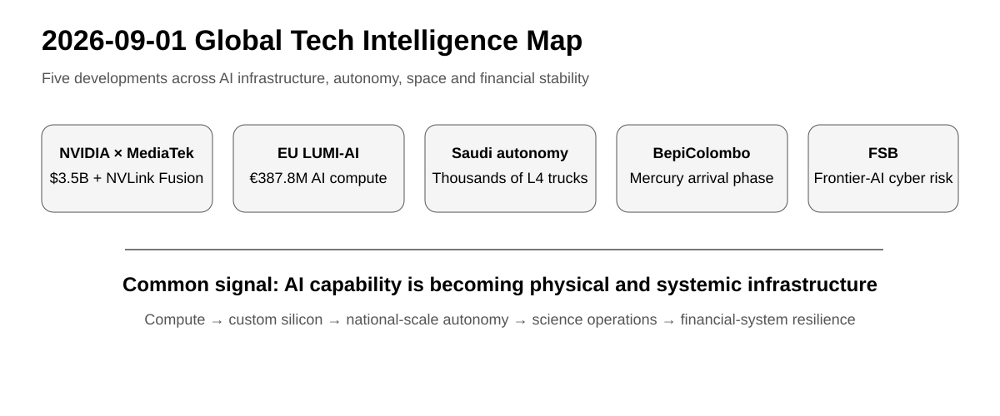

# Daily Global Tech Intelligence Report — 2026-09-01

> **Coverage cutoff:** 2026-09-01 08:15 KST / 2026-08-31 23:15 UTC  
> **Rule:** 새로운 발전을 우선하고 FACT / ANALYSIS / UNCERTAINTY / WATCH를 분리한다.  
> **Source ledger:** [sources/2026/09/2026-09-01.md](../../../sources/2026/09/2026-09-01.md)

<p align="center"></p>
<p align="center"><sub>Repository-created overview · aspect ratio preserved · source-backed labels only</sub></p>

## Executive Summary

오늘의 공통 흐름은 **AI가 모델 산업을 넘어 반도체 생태계, 국가 컴퓨팅 인프라, 실물 자율시스템, 금융안정 규제까지 동시에 확장되고 있다는 것**이다.

NVIDIA는 MediaTek의 전환사채에 35억달러를 투자하고 NVLink Fusion을 중심으로 AI 인프라·PC·자동차 협력을 확대했다. 유럽에서는 EuroHPC가 핀란드 LUMI-AI 구축을 위해 총 3억8780만유로 규모 계약을 체결했고, 사우디에서는 HUMAIN과 Applied Intuition이 2030년까지 수천 대의 자율주행 트럭을 배치한다는 국가 단위 Physical AI 계획을 발표했다. 우주과학에서는 ESA가 BepiColombo의 수성 도착 단계 직전 운영 계획을 공개했으며, 금융안정위원회(FSB)는 frontier AI가 사이버 위험의 속도·규모·경제성을 바꿀 수 있다고 G20에 경고했다.

## Evidence Snapshot

| # | Category | Development | Evidence | Confidence |
|---|---|---|---|---|
| 1 | AI / Semiconductors | NVIDIA, MediaTek에 $3.5B 투자·NVLink 협력 확대 | NVIDIA + MediaTek + Reuters | High |
| 2 | AI Infrastructure | EuroHPC, €387.8M LUMI-AI 구축 계약 | EuroHPC + Reuters | High |
| 3 | Robotics / Autonomy | HUMAIN·Applied Intuition, 사우디 대규모 L4 트럭 계획 | Applied Intuition | Medium-High |
| 4 | Space / Science | ESA, BepiColombo 수성 도착 단계 운영계획 브리핑 | ESA | High |
| 5 | Economy / Financial Stability | FSB, frontier-AI 사이버 위험을 핵심 금융안정 우려로 지목 | FSB + Reuters | High |

---

## 1. AI & Semiconductors — NVIDIA, MediaTek에 35억달러 투자

| Priority | Published | Confidence |
|---|---|---|
| High | 2026-08-31 | High |

### FACT

NVIDIA와 MediaTek은 8월 31일 장기 협력을 확대한다고 공동 발표했다. NVIDIA는 MediaTek이 발행한 **35억달러 규모 전환사채**에 투자했으며, MediaTek은 NVIDIA의 **NVLink Fusion** 플랫폼을 채택해 hyperscaler·클라우드·frontier model 개발자가 custom XPU를 NVIDIA의 랙스케일 시스템과 연결할 수 있도록 지원할 계획이다.

양사는 협력 범위를 AI 인프라뿐 아니라 RTX Spark·DGX Spark 계열의 로컬 AI 컴퓨팅과 AI 기반 소프트웨어 정의 차량 플랫폼까지 확대한다고 밝혔다. Reuters도 투자 규모와 협력 확대를 독립적으로 확인했다.

### ANALYSIS

NVIDIA의 경쟁전략이 GPU 판매를 넘어 **상호연결 규격과 파트너의 custom silicon을 NVIDIA 시스템 안으로 끌어들이는 플랫폼 전략**으로 확장되고 있다. MediaTek 입장에서도 모바일 SoC 중심의 강점에서 데이터센터·PC·자동차용 고성능 AI 실리콘으로 영역을 넓힐 경로가 생긴다.

다만 NVIDIA가 생태계 참여사에 직접 자본을 공급하는 사례가 늘수록 실제 최종수요와 공급자 금융을 구분해 보는 것이 중요해진다.

### UNCERTAINTY

전환사채 투자가 장기적으로 어느 정도 지분으로 전환될지, NVLink Fusion 기반 custom XPU가 실제 양산·고객 채택으로 이어지는 속도는 아직 확정되지 않았다.

### WATCH

- MediaTek custom XPU의 첫 고객·양산 일정
- NVLink Fusion 채택 파트너 확대
- 투자와 실제 최종 AI 수요 간 관계
- PC·자동차 플랫폼의 상용 제품 출시

**Sources:** [NVIDIA](https://nvidianews.nvidia.com/news/nvidia-and-mediatek-deepen-long-standing-partnership-to-build-ai-edge-to-cloud-computing-platforms) · [MediaTek](https://www.mediatek.com/press-room/nvidia-and-mediatek-deepen-long-standing-partnership-to-build-ai-edge-to-cloud-computing-platforms) · [Reuters](https://www.reuters.com/world/asia-pacific/nvidia-invests-35-billion-mediatek-convertible-bonds-2026-08-31/)

---

## 2. AI Infrastructure — 유럽, LUMI-AI 구축에 3억8780만유로

| Priority | Published | Confidence |
|---|---|---|
| High | 2026-08-31 | High |

### FACT

EuroHPC Joint Undertaking은 프랑스 Bull과 핀란드 Kajaani에 설치할 **LUMI-AI** 슈퍼컴퓨터 조달 계약을 체결했다. 총 공동투자 예산은 **€387.8 million**이며 EuroHPC와 LUMI AI Factory 컨소시엄이 절반씩 부담한다.

EuroHPC에 따르면 시스템은 차세대 AMD Instinct MI430X GPU와 6세대 AMD EPYC 256-core CPU를 기반으로 하며, 2027년 설치·사용자 제공을 목표로 한다. 스타트업·중소기업의 AI 연구혁신을 주요 대상으로 하되 연구기관과 공공·산업 사용자도 접근할 수 있다.

### ANALYSIS

유럽의 AI 정책이 규제와 연구지원에서 **직접적인 컴퓨팅 공급능력 확보**로 더 강하게 이동하고 있다. 중요한 지표는 총 투자액보다 실제 GPU 시간 공급량, 대기시간, 유럽 스타트업의 사용률과 모델·제품 출시로 이어지는지다.

### UNCERTAINTY

계약 체결은 컴퓨팅 용량이 이미 시장에 공급됐다는 의미가 아니다. 설치·통합·acceptance를 거쳐 2027년에 실제 사용 가능한 상태가 되어야 효과를 평가할 수 있다.

### WATCH

- 2027년 설치·acceptance 일정
- 실제 AI compute allocation과 대기시간
- 스타트업·SME 사용률
- 유럽 AI Factories와 Gigafactories의 후속 투자

**Sources:** [EuroHPC JU](https://www.eurohpc-ju.europa.eu/eurohpc-ju-signs-contract-deploy-lumi-ai-supercomputer-2026-08-31_en) · [Reuters](https://www.reuters.com/world/europe/europe-expands-ai-computing-network-with-390-million-order-frances-bull-2026-08-31/)

---

## 3. Robotics & Autonomy — 사우디, 수천 대 L4 자율주행 트럭 계획

| Priority | Published | Confidence |
|---|---|---|
| High | 2026-08-31 | Medium-High |

### FACT

사우디 PIF 산하 AI 기업 HUMAIN과 Applied Intuition은 국가 규모 자율주행 인프라 협력을 발표했다. 양사는 **2030년까지 사우디 주요 물류축에 수천 대의 자율주행 트럭**을 배치한다는 목표를 제시했고, 이후 로보택시·항만·광업·제조·농업·건설 등으로 확대할 계획이다.

Applied Intuition은 자사의 Self-Driving System(SDS), Vehicle OS와 관련 차량 인텔리전스 제품을 기술 기반으로 제공한다고 밝혔다. 회사는 SDS가 이미 Level-4 트럭에서 운용되고 있다고 설명했다.

### ANALYSIS

이 발표의 의미는 자율주행이 개별 도시의 로보택시를 넘어 **국가 물류 인프라와 데이터센터·sovereign AI를 연결하는 Physical AI 프로젝트**로 확장된다는 점이다. 장거리·반복 노선 중심의 트럭은 로보택시보다 운영영역을 구조화하기 쉬워 대규모 상업화를 검증할 중요한 분야다.

### UNCERTAINTY

2030년 수천 대는 목표치이며 현재 사우디에서 실제 유료 운행 중인 차량 수를 의미하지 않는다. 안전운전자 제거 시점, 규제 승인, 보험·책임체계, 실제 fleet utilization과 intervention rate는 공개되지 않았다.

### WATCH

- 첫 사우디 차량 배치·유료 화물운송 시점
- safety driver 제거 및 규제 승인
- intervention rate·사고율·가동률
- 주요 물류회사의 실제 계약 참여

**Source:** [Applied Intuition](https://www.appliedintuition.com/press-releases/applied-intuition-humain-physical-ai-saudi-arabia)

---

## 4. Space & Science — BepiColombo, 수성 도착 단계 직전

| Priority | Briefing | Confidence |
|---|---|---|
| Medium-High | 2026-08-31 | High |

### FACT

ESA는 8월 31일 ESA/JAXA 공동 수성 탐사선 **BepiColombo**의 다음 운영 단계에 대한 미디어 브리핑을 열었다. 핵심 일정은 9월 3일 Mercury Transfer Module(MTM) 분리이며, 이 작업이 Mercury Arrival Phase의 시작을 알린다.

ESA는 이후 2026년 11월 수성 궤도 진입, 12월 ESA의 Mercury Planetary Orbiter(MPO)와 JAXA의 Mio 분리를 계획하고 있다고 설명했다.

### ANALYSIS

BepiColombo의 리스크는 이제 장거리 순항보다 **복잡한 분리·궤도진입·운영 전환**에 집중된다. 성공하면 수성의 내부구조, 표면조성, 자기장, 외기권을 서로 다른 두 궤도선에서 동시에 연구할 수 있어 수성 형성과 태양계 초기 조건을 이해하는 데이터가 크게 늘어난다.

### UNCERTAINTY

9월 3일 MTM 분리와 11월 궤도진입은 예정된 미래 작업이다. 브리핑 시점에는 완료된 사건이 아니므로 성공을 전제로 표현하지 않는다.

### WATCH

- 9월 3일 MTM 분리 성공 여부
- 분리 직후 신호획득과 궤도 상태
- 11월 Mercury orbit insertion
- 12월 MPO/Mio 분리와 과학운영 준비

**Source:** [ESA](https://www.esa.int/ESA_Multimedia/Videos/2026/08/Media_briefing_BepiColombo_s_next_milestone_towards_Mercury)

---

## 5. Economy & Financial Stability — FSB, frontier AI의 사이버 위험을 G20에 경고

| Priority | Published | Confidence |
|---|---|---|
| High | 2026-08-31 | High |

### FACT

Financial Stability Board(FSB) 의장 Andrew Bailey는 G20 재무장관·중앙은행 총재 회의를 앞두고 보낸 서한에서 금융시스템에 대한 frontier AI의 가장 즉각적인 우려로 **사이버 위험**을 지목했다.

FSB는 frontier AI가 공격의 속도·규모·경제성을 실질적으로 바꿀 가능성이 있으며, 시스템 전반의 시장 신뢰를 훼손할 수 있다고 평가했다. 동시에 시장의 높은 밸류에이션, 국채시장 취약성, private credit 등 기존 금융불안 요인과 AI 위험이 결합될 수 있다고 경고했다. Reuters도 같은 서한을 보도했다.

### ANALYSIS

AI 위험이 기술기업 내부의 모델 안전 문제에서 **금융감독·운영복원력·제3자 기술집중도** 문제로 이동하고 있다. 특히 금융기관이 소수 클라우드·AI 제공자에 의존할수록 개별 기술 장애나 보안사고가 공통 실패점이 될 수 있다.

### UNCERTAINTY

FSB의 평가는 위험 시나리오와 감독 우선순위다. frontier AI 때문에 금융시스템 위기가 이미 발생했다는 의미는 아니다. 실제 시스템 리스크는 모델 배포 방식, 접근통제, 금융기관의 복원력에 따라 달라진다.

### WATCH

- G20·FSB의 AI 운영복원력 후속 권고
- 금융기관의 AI·클라우드 concentration risk 규제
- AI 기반 실제 침해사고 통계
- frontier model release·deployment에 대한 국제 기준

**Sources:** [Financial Stability Board](https://www.fsb.org/2026/08/fsb-chairs-letter-to-g20-finance-ministers-and-central-bank-governors-august-2026/) · [Reuters](https://www.reuters.com/legal/litigation/ai-driven-cyber-risk-is-top-concern-global-financial-stability-watchdog-says-2026-08-31/)

---

# Cross-Sector Intelligence

```text
NVIDIA / MediaTek ──→ custom silicon + interconnect ecosystem
                           ↓
EU LUMI-AI ──────────→ sovereign / public compute capacity
                           ↓
HUMAIN autonomy ─────→ Physical AI deployed into logistics
                           ↓
FSB ─────────────────→ cyber + concentration risk becomes systemic

BepiColombo ─────────→ complex hardware operations → scientific data infrastructure
```

## Current Thesis

1. **AI infrastructure is becoming an ecosystem, not a chip market:** custom silicon, interconnect, public compute and financing are increasingly coupled.
2. **Physical AI is moving toward infrastructure-scale deployment:** the key test is paid operations and safety data, not announced fleet targets.
3. **AI risk is moving into macroprudential policy:** cyber and provider concentration are becoming financial-stability variables.
4. **Space science value shifts at operational milestones:** BepiColombo now enters the phase where successful spacecraft operations determine future data output.

## 30–90 Day Watchlist

- MediaTek custom XPU customer and product milestones
- LUMI-AI procurement/install progress and broader EU AI Factory capacity
- first Saudi autonomous-trucking deployment and safety metrics
- BepiColombo MTM separation and Mercury orbit insertion
- FSB/G20 follow-up on frontier-AI cyber and concentration risk

## Verification Notes

- 핵심 수치와 일정은 1차 출처를 기준으로 작성했다.
- NVIDIA–MediaTek과 LUMI-AI는 Reuters로 독립 교차검증했다.
- 사우디 자율주행의 2030년 fleet 목표는 계획으로 명시하고 실제 배치와 구분했다.
- BepiColombo의 미래 마일스톤은 예정 일정이며 완료 사실로 표현하지 않았다.
- FSB의 AI 위험 평가는 감독기관의 위험평가이며 실제 금융위기 발생 사실과 구분했다.

---

*Global Tech Intelligence Report · Verified edition · 2026-09-01*
