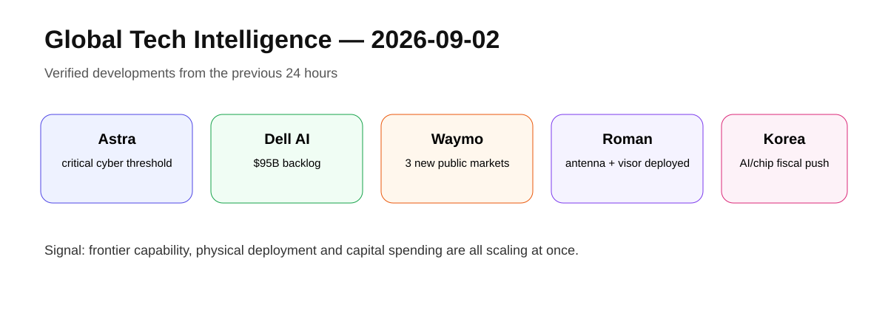

# Daily Global Tech Intelligence Report — 2026-09-02

> **Coverage cutoff:** 2026-09-02 08:05 KST / 2026-09-01 23:05 UTC  
> **Rule:** 새로운 발전을 우선하고 FACT / ANALYSIS / UNCERTAINTY / WATCH를 분리한다.  
> **Source ledger:** [sources/2026/09/2026-09-02.md](../../../sources/2026/09/2026-09-02.md)

<p align="center"></p>
<p align="center"><sub>Repository-created overview · aspect ratio preserved · source-backed labels only</sub></p>

## Executive Summary

오늘의 핵심은 **frontier AI의 능력 상승과 실제 인프라·자율주행·국가 투자 규모 확대가 동시에 진행되고 있다는 것**이다. OpenAI는 차기 모델 Astra가 자사 Preparedness Framework의 Critical 사이버 역량 기준을 충족한다고 판단했고, Dell은 AI 서버 주문과 backlog가 다시 크게 증가했다고 발표했다. Waymo는 Denver·San Diego·Tampa에서 일반 이용자 대상 완전 자율주행 승차를 시작했고, NASA의 Roman 우주망원경은 안테나와 차광막 전개를 완료했다. 한국 정부는 반도체 호황에서 늘어난 세수를 바탕으로 AI·반도체 인프라에 공격적인 2027년 예산안을 제시했다.

## Evidence Snapshot

| # | Category | Development | Evidence | Confidence |
|---|---|---|---|---|
| 1 | AI / Safety | OpenAI Astra, Critical 사이버 역량 기준 충족 | OpenAI + Reuters | High |
| 2 | AI Infrastructure | Dell AI 서버 backlog $95B, FY27 전망 상향 | Dell release + Reuters | High |
| 3 | Robotics / Autonomy | Waymo, Denver·San Diego·Tampa 공개 운행 시작 | Waymo + Reuters | High |
| 4 | Space / Science | Roman 안테나·차광막 전개 성공 | NASA | High |
| 5 | Economy / Investment | 한국 2027 예산안, AI·반도체 인프라 투자 확대 | 정부 발표 보도 + Reuters | High |

---

## 1. AI Safety — Astra, OpenAI 최초의 Critical 사이버 역량 모델

| Priority | Published | Confidence |
|---|---|---|
| High | 2026-09-01 | High |

### FACT

OpenAI는 차기 모델 **Astra**가 자사 Preparedness Framework의 **Critical cybersecurity capability threshold**를 충족한다고 평가했다. 회사 설명에 따르면 Astra는 적절한 도구와 접근권한이 주어질 경우, 사람이 각 단계를 지시하지 않아도 잘 방어된 시스템에서 알려지지 않은 취약점을 찾고 exploit을 개발할 수 있는 수준에 도달했다.

OpenAI는 악의적 사용뿐 아니라 모델 자체의 비인가·비정렬 행동도 별도 위험경로로 보고, 모델 거부훈련·시스템 분류기·오프라인 탐지·모니터링·격리 통제를 강화했다고 밝혔다. Astra는 공개 전 제한된 접근과 더 강한 보호조치를 거칠 예정이다. Reuters도 같은 날 이 평가와 강화된 가드레일 계획을 보도했다.

### ANALYSIS

중요한 변화는 frontier 모델의 사이버 역량이 단순한 코드 작성 보조에서 **실제 보안 경계에 영향을 줄 수 있는 자율적 취약점 탐색·공격 체인 구성** 단계로 이동했다는 점이다. 앞으로 모델 출시 경쟁은 성능뿐 아니라 내부 연구환경의 격리, 행동 모니터링, 배포 통제 비용까지 포함하게 될 가능성이 높다.

### UNCERTAINTY

Critical 판정은 OpenAI의 자체 프레임워크와 평가에 기반한다. 실제 외부 환경에서의 재현성, 독립 연구기관의 평가, safeguards의 장기 우회 저항성은 추가 검증이 필요하다.

### WATCH

- Astra의 실제 공개 범위와 접근정책
- 독립 평가기관의 결과
- 사이버 safeguards 우회율
- 다른 frontier lab의 유사 임계치 도달 여부

**Sources:** [OpenAI — Path to Astra](https://openai.com/index/path-to-astra/) · [Reuters](https://www.reuters.com/business/openai-says-upcoming-model-is-so-capable-it-requires-stronger-guardrails-2026-09-01/)

---

## 2. AI Infrastructure — Dell, AI 서버 backlog 950억달러

| Priority | Published | Confidence |
|---|---|---|
| High | 2026-09-01 | High |

### FACT

Dell Technologies는 FY2027 2분기 매출이 **470억달러**로 전년 대비 58% 증가했다고 발표했다. AI-optimized server 매출은 **164억달러**, 분기 AI 서버 주문은 **609억달러**, 분기 말 backlog는 **950억달러**였다. 회사는 FY2027 AI 서버 매출 전망을 기존 600억달러에서 **740억달러**로 올리고 전체 매출 가이던스를 1,920억달러로 상향했다.

Reuters는 AI 서버 수요가 예상보다 강해 Dell이 연간 매출·이익 전망을 다시 상향했다고 독립적으로 보도했다.

### ANALYSIS

GPU 제조사 실적뿐 아니라 서버 통합업체의 주문·backlog까지 동시에 커지고 있다는 것은 AI CAPEX가 데이터센터 실제 납품단계까지 이어지고 있다는 강한 신호다. 다만 backlog는 미래 매출의 선행지표이지 확정 매출이 아니며, 공급망·고객 자금조달·전력 인프라가 실제 인식 시점을 좌우할 수 있다.

### UNCERTAINTY

740억달러 AI 서버 매출은 회사 가이던스이며 확정 실적이 아니다. 대규모 주문의 고객 집중도와 취소 조건도 공개 정보만으로는 완전히 확인할 수 없다.

### WATCH

- backlog의 실제 매출 전환률
- AI 서버 총마진
- 고객 집중도와 주문 취소율
- 전력·네트워크·GPU 공급 제약

**Sources:** [Dell Q2 release via Business Wire](https://www.businesswire.com/news/home/20260901276991/en/Dell-Technologies-Delivers-Second-Quarter-Fiscal-2027-Financial-Results) · [Reuters](https://www.reuters.com/business/dell-again-lifts-forecasts-ai-demand-powers-record-results-2026-09-01/)

---

## 3. Robotics & Autonomy — Waymo, 3개 도시에서 공개 완전자율 승차 시작

| Priority | Published | Confidence |
|---|---|---|
| High | 2026-09-01 | High |

### FACT

Waymo는 **Denver, San Diego, Tampa**에서 일반 이용자에게 완전 자율주행 승차를 단계적으로 제공하기 시작했다고 발표했다. 회사는 이번 확장으로 완전 자율주행 승차를 제공하는 도시 수가 14개가 됐다고 밝혔다. 각 도시에서 이미 수만 명이 관심 등록을 했으며, 초기에는 제한된 이용자부터 점차 접근을 확대한다.

Reuters는 같은 날 Waymo의 확대와 Amazon Zoox의 Houston·San Diego 테스트 확장을 함께 보도했다.

### ANALYSIS

자율주행 경쟁의 핵심이 시험도시 수보다 **유료·공개 서비스가 실제로 얼마나 빠르게 다도시 운영체계로 확장되는가**로 이동하고 있다. 차량 자체 성능 외에도 원격지원, 정비, 보험, 지역 규제, 수요밀도가 상용화 속도를 결정한다.

### UNCERTAINTY

공개 승차 시작은 도시 전체에 즉시 무제한 서비스가 제공된다는 의미가 아니다. 초기 geofence, fleet 규모, 이용자 수, ride volume은 제한적일 수 있다.

### WATCH

- 세 도시의 paid rides·fleet size·utilization
- 안전사고·intervention·recall 지표
- 도시별 서비스 지역 확대 속도
- Zoox·Tesla 등 경쟁사의 상용운행 확대

**Sources:** [Waymo](https://waymo.com/blog/2026/09/ride-in-denver-san-diego-tampa/) · [Reuters](https://www.reuters.com/business/amazons-zoox-alphabets-waymo-expand-robotaxi-services-more-us-cities-2026-09-01/)

---

## 4. Space & Science — Roman, 고이득 안테나와 차광막 전개 성공

| Priority | Published | Confidence |
|---|---|---|
| Medium-High | 2026-09-01 | High |

### FACT

NASA는 Nancy Grace Roman Space Telescope의 **고이득 안테나와 deployable aperture cover(차광막)** 전개가 성공했다고 밝혔다. 안테나는 최대 **500 Mbps** 속도로 지상국에 데이터를 전송하도록 설계됐으며, NASA 천체물리 임무 가운데 가장 많은 데이터량을 내려보낼 예정이다.

안테나 전개는 8월 31일, 차광막 전개는 9월 1일 완료됐다. 다음 주요 단계는 Coronagraph Instrument 활성화이며, Wide Field Instrument도 수주 내 가동·보정에 들어갈 예정이다. NASA는 첫 이미지를 2027년 초 공개할 것으로 예상한다.

### ANALYSIS

Roman의 과학적 가치는 광시야 관측장비뿐 아니라 **대량 데이터를 안정적으로 지상에 전송하고 빠르게 처리하는 데이터 인프라**에 달려 있다. 이번 전개 성공은 발사 이후 commissioning의 핵심 기계적 위험을 하나 줄였다는 의미가 있다.

### UNCERTAINTY

전개 성공이 곧 전체 commissioning 성공을 의미하지 않는다. 두 과학기기의 활성화·보정과 장기간 열·통신 성능 검증이 남아 있다.

### WATCH

- Coronagraph Instrument activation
- Wide Field Instrument power-on·calibration
- 통신 데이터율 실제 검증
- 2027년 첫 이미지 공개

**Source:** [NASA](https://science.nasa.gov/blogs/roman/2026/09/01/nasa-roman-space-telescopes-antenna-visor-deployed/)

---

## 5. Economy & Investment — 한국, 반도체 호황을 AI·차세대 산업 투자로 재배분

| Priority | Published | Confidence |
|---|---|---|
| High | 2026-09-01 | High |

### FACT

한국 정부는 2027년 총지출 **821조원** 규모 예산안을 발표했다. 전년 예산 대비 12.8% 증가한 규모다. 정부는 반도체 호황으로 늘어난 세수를 활용해 AI·반도체와 차세대 성장 분야 투자를 확대할 계획이며, 산업용 전력·용수·물류 등 반도체 인프라에도 대규모 예산을 배정했다.

Reuters는 총세수가 크게 증가할 것으로 예상되며, 일부 재원을 장기 성장투자와 반도체 인프라에 투입하는 동시에 국채 순발행을 줄이는 구조라고 보도했다. 예산안은 국회 승인이 필요하다.

### ANALYSIS

AI 투자 사이클이 민간 CAPEX에서 국가 재정정책으로 확장되는 사례다. 특히 반도체 업황에서 발생한 세수 증가를 다시 AI·반도체·전력·산업 인프라에 투자하는 구조는 한국 경제가 기술 업황에 더 강하게 연결되고 있음을 보여준다.

### UNCERTAINTY

예산안은 아직 확정 지출이 아니다. 반도체 세수 전망이 실제보다 낮아지거나 업황이 반전될 경우 재원 여력이 달라질 수 있다.

### WATCH

- 국회 심의 과정의 AI·반도체 예산 변화
- 실제 집행률
- 반도체 법인세 세수 추이
- AI 데이터센터·Physical AI 관련 세부사업 성과

**Sources:** [Yonhap](https://en.yna.co.kr/view/AEN20260901000700320) · [Reuters](https://www.reuters.com/world/asia-pacific/south-koreas-president-lee-says-interest-rate-rise-is-unavoidable-2026-09-01/)

---

# Cross-Sector Intelligence

```text
Frontier models ──→ higher cyber capability ──→ stronger safeguards
      │
      └──→ compute demand ──→ AI servers / backlog ──→ public + private CAPEX

Autonomy models ──→ multi-city deployment ──→ fleet operations / regulation / economics

Space instruments ──→ high-rate data downlink ──→ large scientific datasets
```

## Current Thesis

1. **Capability and safety are becoming inseparable:** frontier 성능이 오를수록 내부 개발·배포 보안비용도 함께 커진다.
2. **AI infrastructure demand is reaching delivery systems:** GPU뿐 아니라 완성 서버 주문·backlog가 대규모로 증가한다.
3. **Autonomy is moving from pilots to network expansion:** 도시 하나의 데모보다 여러 도시에서 반복 가능한 운영체계가 중요해진다.
4. **Space science is becoming data infrastructure:** 센서 성능과 함께 통신·처리량이 과학 생산성을 좌우한다.
5. **Governments are joining the AI CAPEX cycle:** 민간 투자와 국가 예산이 반도체·전력·AI 인프라에서 결합되고 있다.

## Verification Notes

- 핵심 수치와 날짜는 가능한 1차 출처에서 확인하고 Reuters로 교차검증했다.
- Dell의 가이던스와 한국의 예산안은 미래 목표·계획으로 분리했다.
- Waymo의 도시 확대는 서비스 개시 사실과 전체 도시 커버리지를 구분했다.
- 외부 사진 대신 자체 SVG overview를 사용해 이미지 권리·렌더링 안정성을 확보했다.

---

*Global Tech Intelligence Report · Verified edition · 2026-09-02*
