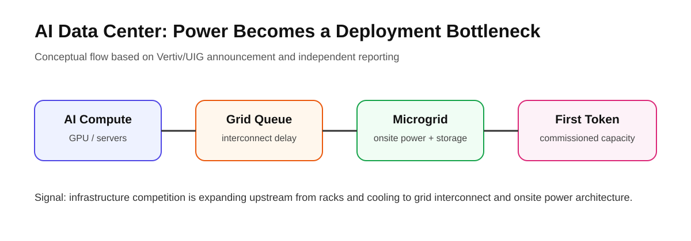

# Daily Global Tech Intelligence Report — 2026-09-03

> **Coverage cutoff:** 2026-09-03 08:09 KST / 2026-09-02 23:09 UTC  
> **Rule:** 새로운 발전을 우선하고 FACT / ANALYSIS / UNCERTAINTY / WATCH를 분리한다.  
> **Source ledger:** [sources/2026/09/2026-09-03.md](../../../sources/2026/09/2026-09-03.md)

<p align="center"></p>
<p align="center"><sub>Repository-created overview · aspect ratio preserved · source-backed labels only</sub></p>

## Executive Summary

오늘의 핵심은 **AI 확산의 병목이 모델 성능에서 제도·전력·운영·도메인 데이터로 넓어지고 있다는 것**이다. G20 혁신 장관회의에서는 AI 학습과 지식재산권을 포함한 공통 원칙이 합의됐고, 미국은 별도로 AI 학습에 폭넓은 fair-use 접근을 촉구했다. Vertiv는 AI 데이터센터의 전력 병목을 겨냥해 마이크로그리드 업체 UIG를 최대 26억달러 조건으로 인수하기로 했다. Uber는 약 3,300명 감원을 발표하면서 절감 자원을 자율주행 등 성장 영역에 재배분하겠다는 방향을 밝혔다. NASA Dragonfly는 비행용 전기 하네스 설치라는 통합 이정표를 통과했고, Owkin은 Boehringer Ingelheim에 AI Scientist K Pro와 멀티모달 환자 데이터를 라이선스한다.

## Evidence Snapshot

| # | Category | Development | Evidence | Confidence |
|---|---|---|---|---|
| 1 | AI / Policy | G20, AI·지식재산·표준 관련 혁신 원칙 합의 | White House + Reuters | High |
| 2 | AI Infrastructure / Investment | Vertiv, AI 데이터센터 전력용 UIG 인수 계약 | Vertiv + Reuters | High |
| 3 | Robotics / Autonomy | Uber, 10% 감원과 AV 중심 성장 재배분 | Reuters + Uber strategy context | Medium-High |
| 4 | Space / Science | NASA Dragonfly, 비행용 전기 하네스 설치 | NASA | High |
| 5 | AI / Biopharma | Owkin, Boehringer에 K Pro·멀티모달 데이터 라이선스 | Owkin + Reuters | High |

---

## 1. AI Policy — G20, AI 학습·지식재산·표준을 혁신정책 의제로 합의

| Priority | Published | Confidence |
|---|---|---|
| High | 2026-09-02 | High |

### FACT

미국에서 열린 G20 Innovation Ministerial은 **pro-innovation policy frameworks, technical workforce, AI 관련 intellectual property, AI standards, supply-chain investment**를 포함하는 공통 성명을 채택했다. White House는 회원국들이 ‘Carolina Principles for Emerging Technologies’에도 합의했다고 밝혔다.

Reuters는 같은 회의에서 미국 상무장관이 AI 모델 학습에 저작권물을 사용할 수 있도록 **fair use 원칙을 폭넓게 인정하는 방향**을 G20 국가들에 촉구했다고 보도했다. 이는 창작자 권리 보호와 AI 개발을 동시에 다루려는 미국의 정책 입장을 보여준다.

### ANALYSIS

AI 경쟁의 정책축이 모델 안전 규제뿐 아니라 **학습데이터 접근권, 저작권, 표준, 공급망 투자**로 이동하고 있다. 특히 학습데이터의 법적 접근성이 국가별로 달라지면 모델 개발비용과 데이터 전략에도 직접적인 차이를 만들 수 있다.

### UNCERTAINTY

G20 합의는 공통 원칙이지 각국의 즉시 적용되는 법률이 아니다. 미국의 fair-use 촉구 역시 각국 법원·입법부의 판단을 구속하지 않는다.

### WATCH

- G20 회원국별 AI 학습데이터·저작권 입법
- 미국 법원의 AI training fair-use 판례
- 창작자 보상·라이선스 시장의 제도화 여부

**Sources:** [White House](https://www.whitehouse.gov/releases/2026/09/g20-innovation-ministerial-concludes-with-consensus-statement/) · [Reuters](https://www.reuters.com/business/media-telecom/nvidia-ceo-urges-g20-avoid-ai-rules-theoretical-harms-2026-09-02/)

---

## 2. AI Infrastructure — Vertiv, ‘전력 확보 시간’을 줄이기 위해 UIG 인수

<p align="center"></p>
<p align="center"><sub>Repository-created diagram · width capped at 820 px</sub></p>

| Priority | Published | Confidence |
|---|---|---|
| High | 2026-09-02 | High |

### FACT

Vertiv는 데이터센터용 마이크로그리드, 전력제어, behind-the-meter power architecture를 제공하는 **UtilityInnovation Group(UIG)**을 인수하는 계약을 발표했다. 기본 인수가는 약 **14.5억달러 현금**이며, 향후 EBITDA 목표 달성 시 최대 **11.5억달러**의 추가 지급 조건이 붙어 총 잠재 대가는 약 26억달러다. 거래는 규제 승인 등을 거쳐 2026년 4분기 종료를 목표로 한다.

Vertiv는 이번 거래를 통해 전력망 연결, 현장 발전, 에너지저장, 마이크로그리드 제어까지 포트폴리오를 확장해 AI 데이터센터의 ‘time to power’를 줄이겠다고 밝혔다. Reuters도 AI 데이터센터의 전력 부족이 이번 거래의 핵심 배경이라고 보도했다.

### ANALYSIS

AI 인프라의 핵심 병목이 GPU·서버 공급에서 **실제 전력 인입과 현장 전력설계**로 이동하고 있다는 강한 신호다. ‘칩을 확보했는가’보다 ‘언제 전기를 받아 첫 토큰을 만들 수 있는가’가 데이터센터 경쟁력의 선행지표가 되고 있다.

### UNCERTAINTY

거래는 아직 종결되지 않았으며 earn-out 최대액도 확정 지급이 아니다. 마이크로그리드가 모든 지역의 계통 연결 지연을 해결할 수 있는 것도 아니다.

### WATCH

- Q4 거래 종결 여부
- 신규 데이터센터의 grid-independent / bridge-to-grid 적용 사례
- 전력 인입 대기시간과 실제 commissioning 기간
- 현장 발전·저장 설비의 비용과 규제

**Sources:** [Vertiv](https://investors.vertiv.com/news/news-details/2026/Vertiv-Announces-Agreement-to-Acquire-UtilityInnovation-Group-to-Accelerate-Time-to-Power-for-AI-Data-Centers/default.aspx) · [Reuters](https://www.reuters.com/legal/transactional/vertiv-strikes-145-billion-deal-microgrid-firm-utility-innovation-group-2026-09-02/)

---

## 3. Robotics & Autonomy — Uber, 10% 감원하며 자율주행 투자 우선순위 유지

| Priority | Published | Confidence |
|---|---|---|
| High | 2026-09-02 | Medium-High |

### FACT

Reuters에 따르면 Uber는 약 **3,300명**, 전 세계 인력의 약 **10%**를 줄이는 구조조정을 발표했다. 회사는 조직 계층을 줄이고 의사결정을 단순화해 확보한 자원을 성장·혁신 영역에 재투자하겠다고 밝혔으며, 자율주행은 핵심 투자 영역 가운데 하나로 언급됐다.

Uber는 올해 2월 공개한 ‘Uber Autonomous Solutions’에서 AV 파트너에게 훈련데이터, 지도, 규제지원, fleet financing, remote assistance, fleet operations 등을 제공해 자율주행 상용화를 지원하겠다는 전략을 이미 제시한 바 있다.

### ANALYSIS

Uber는 자율주행 스택 자체를 독점 개발하기보다 **수요 네트워크 + 운영 인프라 + 파트너 AV**를 결합하는 플랫폼 전략을 강화하고 있다. 이번 구조조정은 로보택시 경쟁이 차량 소프트웨어뿐 아니라 승객 수요, 원격지원, 보험, 차량운영 비용에서 결정될 가능성을 다시 보여준다.

### UNCERTAINTY

감원 자체를 AI나 자율주행 때문에 발생한 것으로 단정할 근거는 없다. Reuters 보도에서도 CEO는 감원의 직접 원인을 AI라고 규정하지 않았다. 또한 절감액이 실제 AV 투자로 얼마나 재배분되는지는 향후 확인이 필요하다.

### WATCH

- Uber의 AV 관련 CAPEX·파트너 투자 규모
- Nuro·Wayve·WeRide 등 파트너 서비스의 paid trips
- AV ride의 unit economics와 human-driver ride 대비 마진
- 감원 이후 핵심 사업의 운영효율 변화

**Sources:** [Reuters](https://www.reuters.com/business/world-at-work/uber-cut-3300-jobs-overhaul-bloomberg-news-reports-2026-09-02/) · [Uber Autonomous Solutions](https://investor.uber.com/news-events/news/press-release-details/2026/Uber-Unveils-Uber-Autonomous-Solutions-to-Accelerate-Autonomous-Mobility--Delivery-Worldwide/)

---

## 4. Space & Science — Dragonfly, Titan 비행체의 ‘신경망’ 전기 하네스 설치

| Priority | Published | Confidence |
|---|---|---|
| Medium-High | 2026-09-02 | High |

### FACT

NASA는 Johns Hopkins APL에서 제작 중인 **Dragonfly Titan rotorcraft**의 비행용 전기 하네스를 flight fuselage에 설치했다고 발표했다. 이 하네스는 약 **17,315 ft의 도선, 374개 커넥터**, 약 100 lb 규모로 컴퓨터·센서·과학장비·배터리 사이에 전력과 데이터를 전달한다.

NASA는 Dragonfly가 **2028년 여름 발사, 2034년 말 Titan 도착**을 목표로 하며, IAU가 착륙 예정 대형 사구 지역의 공식 이름을 **Ahmakiq Undae**로 승인했다고 밝혔다.

### ANALYSIS

이번 소식은 과학 결과가 아니라 **제작·통합 위험을 줄이는 공학 이정표**다. 복잡한 전기·열 환경에서 실제 비행 하드웨어 통합이 진행되고 있다는 점은 Dragonfly가 설계 단계에서 조립·시험 단계로 넘어가고 있음을 보여준다.

### UNCERTAINTY

하네스 설치 완료는 전체 우주선 통합·시험 완료를 의미하지 않는다. 과학장비 연결, 환경시험, 발사 준비 등 주요 단계가 남아 있다.

### WATCH

- 과학장비 통합과 환경시험
- 2028년 발사 일정 유지 여부
- Titan용 열관리·배터리 시스템 검증

**Source:** [NASA](https://science.nasa.gov/blogs/dragonfly/2026/09/02/nasas-dragonfly-gets-wired-up-while-titan-landing-area-is-named/)

---

## 5. AI & Biopharma — Owkin, Boehringer에 K Pro와 멀티모달 데이터 라이선스

| Priority | Published | Confidence |
|---|---|---|
| Medium-High | 2026-09-02 | High |

### FACT

Owkin은 Boehringer Ingelheim과 라이선스 계약을 체결해 **K Pro AI Scientist**와 종양학 멀티모달 환자 데이터를 제공하고, 면역학 분야의 새로운 멀티모달 데이터도 생성하기로 했다. 두 회사는 2025년 초기 pilot에서 종양 미세환경 관련 공간정보 분석을 수행한 바 있다.

Reuters는 이번 계약이 암·면역질환 후보물질 발굴을 가속하기 위한 것이며, AstraZeneca와 Sanofi에 이어 주요 제약사가 K Pro를 도입하는 흐름이라고 보도했다.

### ANALYSIS

생성형 AI의 기업 도입이 문서 보조를 넘어 **환자 데이터 + 생물학 특화 agent + 재현 가능한 분석환경**으로 이동하고 있다. 신약개발 분야에서는 범용 모델보다 데이터 접근권, 검증된 분석 파이프라인, 규제 가능한 재현성이 경쟁력을 좌우할 가능성이 크다.

### UNCERTAINTY

계약의 재무조건은 공개되지 않았고, AI 플랫폼 사용이 실제 신약 후보의 임상 성공률이나 개발기간을 얼마나 개선할지는 아직 확인되지 않았다.

### WATCH

- K Pro가 만든 후보·가설의 실제 개발 전환
- 임상 단계 진입 수와 개발기간 변화
- 제약사 내부 workflow 통합 범위

**Sources:** [Owkin](https://www.owkin.com/newsfeed/owkin-to-license-k-pro-ai-scientist-and-multimodal-oncology-and-immunology-data-to-boehringer-ingelheim) · [Reuters](https://www.reuters.com/legal/litigation/owkin-signs-ai-drug-discovery-deal-with-boehringer-cancer-immunology-2026-09-02/)

---

# Cross-Sector Intelligence

```text
AI models
   ├─→ training data / copyright rules
   ├─→ domain agents + proprietary biomedical data
   └─→ compute demand
             ↓
       data centers
             ↓
      power interconnect
             ↓
        microgrids

Autonomy models ─→ fleet operations ─→ demand network ─→ unit economics

Space mission design ─→ flight-hardware integration ─→ environmental test ─→ launch
```

## Current Thesis

1. **AI policy is moving into data-access economics:** 저작권과 학습데이터 규칙이 모델 개발비용에 직접 영향을 준다.
2. **Power is now a first-class AI bottleneck:** 전력 연결 속도와 현장 전력구성이 데이터센터 경쟁력을 좌우한다.
3. **Autonomy commercialization is an operations problem too:** 차량 AI뿐 아니라 수요·보험·원격지원·fleet operations가 규모화를 결정한다.
4. **Domain AI is becoming data-centric:** 생명과학에서는 모델보다 독점·고품질 멀티모달 데이터와 검증 workflow의 가치가 커진다.

## 30–90 Day Watchlist

- G20 회원국의 AI training·copyright 후속 정책
- Vertiv-UIG 거래 종결 및 AI 데이터센터 microgrid 수주
- Uber AV 파트너의 상용 운행 확대와 paid-trip 지표
- Dragonfly 통합·환경시험 진척
- K Pro 기반 신약개발 결과의 실제 공개

## Verification Notes

- 전날(2026-09-02) 리포트의 Astra, Dell, Waymo, Roman, 한국 예산안은 새로운 사실이 없는 한 반복하지 않았다.
- Uber 감원은 Reuters 독립보도에 의존하므로 Medium-High confidence로 처리했다.
- 회사의 계획·거래 목표는 확정 미래 사실이 아닌 회사가 제시한 목표로 분리했다.
- 모든 시각자료는 저장소 자체 SVG이며 외부 사진을 복제하지 않았다.

---

*Global Tech Intelligence Report · Verified edition · 2026-09-03*
