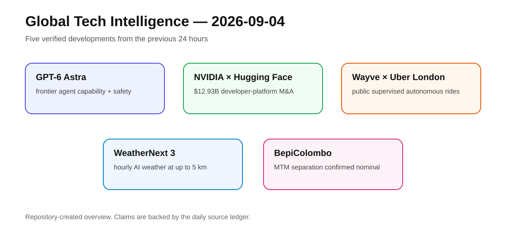
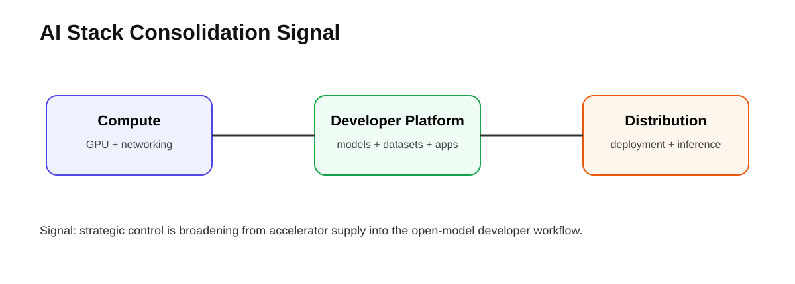

# Daily Global Tech Intelligence Report — 2026-09-04

> **Coverage cutoff:** 2026-09-04 08:24 KST / 2026-09-03 23:24 UTC  
> **Rule:** 새로운 발전을 우선하고 FACT / ANALYSIS / UNCERTAINTY / WATCH를 분리한다.  
> **Source ledger:** [sources/2026/09/2026-09-04.md](../../../sources/2026/09/2026-09-04.md)

<p align="center"></p>
<p align="center"><sub>Repository-created overview · aspect ratio preserved · all labels backed by the source ledger</sub></p>

## Executive Summary

오늘의 핵심은 **AI 경쟁이 모델 자체를 넘어 배포 통제, 개발자 플랫폼, 실제 물리 서비스, 과학·운영 데이터로 확장되고 있다는 점**이다. OpenAI는 GPT-6 Astra를 실제 배포 단계로 옮기며 높은 agentic capability와 함께 강화된 안전통제를 전면에 내세웠다. NVIDIA는 Hugging Face를 약 129.3억달러에 인수하기로 하면서 GPU 공급자에서 모델·데이터셋·개발자 워크플로까지 영향력을 넓히려 한다.

Physical AI에서는 Wayve와 Uber가 런던에서 일반 이용자가 실제로 매칭될 수 있는 supervised autonomous ride 서비스를 시작했다. Google은 WeatherNext 3를 통해 AI 예보를 시간당 갱신·최대 5 km급 공간 해상도로 끌어올리고 Search·Maps·Gemini·Cloud에 직접 연결했다. 우주에서는 ESA/JAXA BepiColombo가 수성 도착 단계의 첫 핵심 이벤트인 Mercury Transfer Module 분리를 성공적으로 완료했다.

## Evidence Snapshot

| # | Category | Development | Evidence | Confidence |
|---|---|---|---|---|
| 1 | AI / Frontier Models | OpenAI, GPT-6 Astra 실제 출시·제한 배포 시작 | OpenAI + Reuters | High |
| 2 | AI / M&A / Developer Platform | NVIDIA, Hugging Face를 $12.93B에 인수 합의 | NVIDIA + Reuters | High |
| 3 | Robotics / Autonomy | Wayve·Uber, 런던에서 일반 이용자 대상 supervised AV rides 개시 | Uber + Reuters | High |
| 4 | AI / Science / Weather | Google, WeatherNext 3 공개·제품 통합 | Google | High |
| 5 | Space / Science | BepiColombo, Mercury Transfer Module 분리 성공 | ESA | High |

---

## 1. AI Frontier — GPT-6 Astra, 평가 단계에서 실제 배포 단계로

| Priority | Published | Confidence |
|---|---|---|
| High | 2026-09-03 | High |

### FACT

OpenAI는 9월 3일 **GPT-6 Astra**를 공개하고 실제 배포를 시작했다. OpenAI API 문서에 따르면 Astra는 복잡한 reasoning, coding, computer use, research, document creation을 겨냥한 자사 최고급 모델이며 **1,050,000 token context window**와 최대 **128,000 output tokens**를 지원한다. 초기에는 Trusted Access Program의 기업을 중심으로 배포되고, 이후 API와 ChatGPT Plus·Pro·Business·Enterprise로 확대될 예정이다.

OpenAI는 같은 날 안전 개요에서 Astra가 자사 Preparedness Framework에서 **Critical 수준의 cybersecurity capability**에 도달한 첫 광범위 배포 모델이라고 밝혔다. 이에 따라 내부 격리, checkpoint 보안, trajectory monitoring, blocking alignment evaluation 등 추가 통제를 적용했다고 설명했다. Reuters도 모델 출시와 agentic AI 안전성 논쟁을 독립적으로 보도했다.

### ANALYSIS

전날까지의 핵심 질문이 “Astra가 어떤 위험 역량 수준에 도달했는가”였다면, 오늘의 변화는 **그 모델이 실제 사용자·기업 워크플로로 이동하기 시작했다는 것**이다. Frontier model 경쟁은 단순 benchmark score보다 `capability × deployment controls × monitorability × enterprise access`의 결합으로 평가해야 한다.

### UNCERTAINTY

OpenAI가 제시한 benchmark·안전평가는 자체 평가가 포함된 공식 자료다. 제한적 초기 배포의 실제 생산성, 오류율, 비용, 독립 safety evaluation은 앞으로 확인해야 한다. 또한 Critical capability 판정은 특정 평가체계의 분류이며 실제 사고 발생을 의미하지 않는다.

### WATCH

- Trusted Access 이후 일반 유료 사용자·API 확대 속도
- 독립 benchmark와 실제 agent task 성공률
- prompt injection·권한 오용 방지 성능
- 기업용 배포에서의 비용·latency·monitoring overhead

**Sources:** [OpenAI Safety Overview](https://openai.com/index/safety-overview-gpt-6-astra/) · [OpenAI API model page](https://developers.openai.com/api/docs/models/gpt-6-astra) · [Reuters](https://www.reuters.com/legal/litigation/openai-launches-new-astra-model-amid-growing-scrutiny-over-agents-safety-2026-09-03/)

---

## 2. AI Platform & Investment — NVIDIA, Hugging Face를 $12.93B에 인수

<p align="center"></p>
<p align="center"><sub>Repository-created diagram · width capped at 820 px</sub></p>

| Priority | Published | Confidence |
|---|---|---|
| High | 2026-09-03 | High |

### FACT

NVIDIA는 Hugging Face를 **$12,930,300,000**에 인수하기로 합의했다고 발표했다. NVIDIA에 따르면 Hugging Face는 1,800만 명 이상의 개발자·연구자·creator, 300만 개 이상의 모델, 50만 개 데이터셋, 100만 개 애플리케이션을 보유하고 있으며 20만 개 이상의 기업이 플랫폼을 사용한다.

NVIDIA는 인수 후에도 Hugging Face가 다양한 모델·framework·cloud·inference provider·accelerator를 지원하는 **open platform**으로 유지되며 NVIDIA compute 사용을 의무화하지 않겠다고 밝혔다. Reuters는 이번 거래를 NVIDIA가 자체 칩을 개발하는 대형 고객들에 대한 의존을 낮추고 open-model 개발자 생태계와 직접 연결하려는 전략적 베팅으로 해석했다.

### ANALYSIS

이 거래의 핵심은 단순 매출 인수가 아니라 **GPU → model repository → datasets → evaluation → deployment**로 이어지는 개발자 워크플로에서 NVIDIA의 접점을 넓히는 것이다. AI 산업의 경쟁축이 칩 성능뿐 아니라 “개발자가 어디서 모델을 찾고, 시험하고, 배포하는가”까지 확장되고 있음을 보여준다.

### UNCERTAINTY

NVIDIA의 “중립적·개방형 플랫폼 유지”는 현재의 공식 방침이다. 인수 후 실제 ranking, inference 기본값, accelerator 통합, pricing에서 플랫폼 중립성이 얼마나 유지되는지는 장기적으로 검증해야 한다. 거래 종결 조건과 규제심사도 남아 있다.

### WATCH

- 규제기관의 플랫폼·AI 생태계 경쟁 심사
- Hugging Face에서 AMD·Intel·cloud accelerator 지원 변화
- NVIDIA inference/evaluation 서비스와의 통합 방식
- 개발자·기업 이용자 수와 paid deployment 성장

**Sources:** [NVIDIA](https://blogs.nvidia.com/blog/nvidia-to-acquire-hugging-face/) · [Reuters](https://www.reuters.com/business/nvidia-buy-hugging-face-nearly-13-billion-big-bet-open-ai-models-2026-09-03/)

---

## 3. Robotics & Autonomy — Wayve·Uber, 런던에서 실제 공개 운행 시작

| Priority | Launched | Confidence |
|---|---|---|
| High | 2026-09-03 | High |

### FACT

Wayve와 Uber는 런던에서 **일반 이용자 대상 supervised autonomous rides**를 시작했다. UberX, Uber Electric, Uber Comfort를 호출한 이용자는 추가 요금 없이 Wayve AI Driver가 탑재된 전기 Ford Mustang Mach-E에 매칭될 수 있다. 이용자는 AV 매칭을 수락하거나 일반 차량으로 바꿀 수 있다.

초기 서비스는 소규모 차량으로 시작하며 공항을 제외한 런던 지역 이동을 지원한다. 다만 현재 단계에서는 **trained, TfL-licensed private-hire driver가 차량에 탑승해 운행을 감독**한다. Uber는 14만 명 이상의 런던 이용자가 AV ride preference에 opt-in했다고 밝혔다. Reuters도 런던에서의 서비스 개시를 독립 확인했다.

### ANALYSIS

전날 Uber의 AV 투자 우선순위가 ‘전략’이었다면, 오늘은 실제 소비자가 플랫폼에서 차량에 매칭되는 **operation milestone**이다. Wayve의 mapless AI와 Uber의 demand aggregation이 결합되면서 자율주행 경쟁은 모델 성능에서 `regulation × rider demand × fleet operations × repeatability`로 이동하고 있다.

### UNCERTAINTY

현재 서비스는 완전 무인 driverless ride가 아니다. 또한 초기 fleet 규모가 작기 때문에 opt-in 14만 명이 실제 ride volume을 의미하지 않는다. 도시 전체에서 안정적으로 운영되는지와 경제성은 별도 검증이 필요하다.

### WATCH

- safety driver 없이 운행하는 단계로의 전환 시점
- 실제 paid trip 수·fleet utilization·intervention rate
- 공항 및 서비스 지역 확대
- London 이후 Tokyo 등 다른 도시에서의 재현성

**Sources:** [Uber Investor Relations](https://investor.uber.com/news-events/news/press-release-details/2026/Wayve-and-Uber-Launch-First-Ever-Autonomous-Rides-in-the-UK-2026-VoFQI1WbQi/default.aspx) · [Reuters](https://www.reuters.com/business/uber-ai-firm-wayve-launch-londons-first-robotaxis-2026-09-02/)

---

## 4. AI & Science — WeatherNext 3, 실시간 위성데이터를 예보 모델에 직접 연결

| Priority | Published | Confidence |
|---|---|---|
| Medium-High | 2026-09-03 | High |

### FACT

Google은 **WeatherNext 3**를 공개했다. 새 시스템은 geostationary satellite의 실시간 데이터를 전통적 historical analysis와 함께 입력해 **매시간 새로운 예보**를 생성한다. Google은 일부 surface variables를 최대 **5 km**, 다른 표면변수를 10 km, 대기변수를 25 km 해상도로 제공하며, 이전 WeatherNext 2의 25 km·6시간 격자보다 전체적으로 훨씬 세밀한 예보를 제공한다고 설명했다.

WeatherNext 3 결과는 Google Search, Gemini, Maps, Google Maps Platform, Cloud에 통합되며 BigQuery·Earth Engine·Cloud Storage를 통해 연구자와 기업도 활용할 수 있다. 강수, 열대저기압, 풍력·태양광 등 운영 의사결정에 필요한 변수도 강화됐다.

### ANALYSIS

AI weather 경쟁은 연구 benchmark에서 **실시간 데이터 ingestion + 고해상도 forecast + 대규모 제품 distribution**으로 이동하고 있다. 특히 Search·Maps·Cloud까지 직접 배포되면 모델 개선이 곧바로 소비자·물류·에너지 운영 결정에 연결될 수 있다.

### UNCERTAINTY

“5배 더 세밀하다”는 표현은 해상도·갱신주기 관점의 Google 설명이며 모든 변수와 모든 지역에서 예보 정확도가 동일 비율로 향상됐다는 뜻은 아니다. 독립적인 장기 검증과 극단기상에서의 reliability가 중요하다.

### WATCH

- 독립 기관의 medium-range·extreme-weather 검증
- 에너지·항공·물류 분야 실제 운영 도입
- traditional NWP와의 hybrid workflow
- 실시간 위성 데이터 결손 상황에서의 성능

**Source:** [Google — WeatherNext 3](https://blog.google/innovation-and-ai/models-and-research/google-deepmind/introducing-weathernext-3/)

---

## 5. Space & Science — BepiColombo, 수성 도착단계 첫 핵심 분리 성공

| Priority | Event | Confidence |
|---|---|---|
| Medium-High | 2026-09-03 | High |

### FACT

ESA는 9월 3일 BepiColombo의 **Mercury Transfer Module (MTM)**이 우주선 stack에서 성공적으로 분리됐다고 확인했다. 스페인 Cebreros와 아르헨티나 Malargüe의 두 Estrack 심우주 안테나가 신호를 확보했고, telemetry는 시스템이 nominal 상태이며 Mercury Planetary Orbiter의 태양전지가 배터리를 충전하고 있음을 보여줬다.

BepiColombo는 ESA와 JAXA의 공동 수성 탐사 임무다. 향후 **2026년 11월 21일 수성 궤도진입**, 12월 9–10일 ESA MPO와 JAXA Mio 분리, **2027년 4월 과학관측 시작**을 목표로 한다.

### ANALYSIS

BepiColombo의 위험구간은 장거리 순항에서 **분리 → 궤도진입 → 두 과학궤도선 분리 → commissioning**으로 이동했다. 2억 km 이상 떨어진 곳에서 실시간 개입 없이 수행되는 sequence가 정상 완료됐다는 점은 수성 과학임무의 실제 운영 리스크를 한 단계 낮춘다.

### UNCERTAINTY

MTM 분리 성공은 수성 궤도진입이나 과학임무 성공을 보장하지 않는다. 11월 궤도진입과 12월 궤도선 분리, 이후 commissioning이 남아 있다.

### WATCH

- 11월 21일 Mercury orbit insertion
- 12월 MPO/Mio 분리
- 2027년 commissioning과 첫 science data
- 열환경·전력·통신 시스템의 수성 근접 운용 안정성

**Source:** [ESA — BepiColombo arrival updates](https://www.esa.int/Science_Exploration/Space_Science/BepiColombo/Latest_updates_BepiColombo_s_arrival_at_Mercury)

---

# Cross-Sector Intelligence

```text
Frontier model capability
        ↓
Safety + controlled deployment
        ↓
Developer platforms ──→ distribution / inference
        ↓
Real-world services ──→ autonomous mobility
        ↓
Operational data / feedback

Science AI: live observations ──→ forecast model ──→ mass distribution
Space: transfer ──→ separation ──→ orbit insertion ──→ science data
```

## Current Thesis

1. **AI competition is becoming stack competition:** model quality, developer platform, deployment, evaluation, infrastructure가 하나의 전략 체인으로 묶인다.
2. **Agentic AI safety is now an operating constraint:** 강한 능력이 실제 배포로 넘어갈수록 monitoring과 access control이 제품 성능만큼 중요해진다.
3. **Autonomy is moving from permits to consumer operations:** 규제 승인 자체보다 실제 paid rides와 multi-city repeatability가 핵심 지표다.
4. **Scientific AI is becoming an operational data product:** WeatherNext 3처럼 연구모델이 Search·Maps·Cloud로 직접 배포되는 흐름이 강화된다.
5. **Space mission value depends on execution after launch:** BepiColombo는 launch보다 separation·orbit insertion·commissioning이 실제 과학가치를 결정한다.

## 30–90 Day Watchlist

- GPT-6 Astra의 일반 API 확대와 독립 agent evaluation
- NVIDIA–Hugging Face 거래의 규제심사와 platform-neutrality 지표
- 런던 Wayve/Uber의 paid trips·fleet utilization·driverless 전환
- WeatherNext 3의 독립 예보성능 검증과 에너지·물류 적용
- BepiColombo 11월 수성 궤도진입
- AI 인프라 CAPEX와 플랫폼 M&A가 실제 서비스 매출로 연결되는 속도

## Verification Notes

- 모든 핵심 사건은 해당 날짜의 공식 1차 출처를 우선 확인했다.
- OpenAI·NVIDIA·Wayve/Uber는 Reuters로 독립 맥락을 보강했다.
- Wayve/Uber 런던 서비스는 `supervised`이며 완전 무인 서비스로 표현하지 않았다.
- WeatherNext 3의 해상도는 변수별로 다르므로 단일 5 km 모델로 단정하지 않았다.
- BepiColombo는 MTM 분리 성공과 수성 궤도진입 성공을 구분했다.
- 외부 원격 사진 대신 자체 SVG를 사용해 이미지 깨짐·비율 문제를 최소화했다.

---

*Global Tech Intelligence Report · Verified edition · 2026-09-04*
