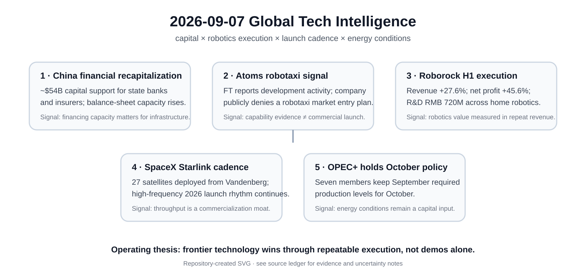

# Daily Global Tech Intelligence Report — 2026-09-07

> **Coverage cutoff:** 2026-09-07 08:18 KST / 2026-09-06 23:18 UTC  
> **Rule:** 새로운 발전을 우선하고 FACT / ANALYSIS / UNCERTAINTY / WATCH를 분리한다.  
> **Source ledger:** [sources/2026/09/2026-09-07.md](../../../sources/2026/09/2026-09-07.md)

Repository-created overview · aspect ratio preserved · claims backed by the source ledger

## Executive Summary

오늘의 핵심은 **Physical AI와 자율주행이 단순 기술 시연보다 자본·실적·운영 cadence로 평가되는 단계로 이동하는 동시에, 거시 금융환경에서는 정부의 대규모 자본확충과 에너지 공급정책이 기술투자의 자본비용과 수요조건을 계속 좌우하고 있다는 점**이다.

중국은 국유 은행·보험사에 총 약 540억달러 규모의 자본확충을 추진하며 금융기관의 손실흡수력과 대출여력을 보강하고 있다. 로봇·자율주행에서는 Travis Kalanick의 Atoms가 로보택시 기술을 개발하고 있다는 FT 보도가 나왔지만 회사는 공개적으로 로보택시 시장 진입 계획을 부인해, 기술개발 신호와 상업화 계획을 분리해 볼 필요가 있다. Roborock은 2026년 상반기 매출 100.84억위안, 순이익 9.86억위안을 발표했고 R&D에 7.20억위안을 투입했다.

우주에서는 SpaceX가 9월 6일 Vandenberg에서 Starlink 27기를 추가 배치해 2026년 Starlink 전용 발사 cadence를 80회 수준까지 끌어올렸다. 에너지에서는 OPEC+ 7개국이 10월에도 9월의 요구 생산량을 유지하기로 결정했다. 이 조합은 frontier technology의 실행력이 모델 성능뿐 아니라 **financing, fleet/launch cadence, recurring revenue, energy conditions**에 의해 결정된다는 점을 다시 보여준다.

## Evidence Snapshot

| # | Category | Development | Evidence | Confidence |
|---|---|---|---|---|
| 1 | Economy / Financial System | 중국, 국유 은행·보험사에 약 $54B 자본확충 추진 | Reuters | Medium-High |
| 2 | Robotics / Autonomy | Atoms의 robotaxi 기술개발 보도와 회사의 공개 부인 병존 | Financial Times + Atoms prior public positioning | Medium |
| 3 | Robotics / Consumer AI | Roborock H1 매출 +27.6%, 순이익 +45.6%, R&D RMB 720M | Roborock release + IDC context | Medium-High |
| 4 | Space / Commercialization | SpaceX, Starlink 27기 배치·2026년 높은 전용 발사 cadence 지속 | SpaceX public mission confirmation + launch trackers | Medium-High |
| 5 | Economy / Energy | OPEC+ 7개국, 10월 생산정책 유지 | OPEC + Reuters | High |

---

## 1. Economy & Financial System — 중국, 약 540억달러 국유 금융기관 자본확충

| Priority | Published | Confidence |
|---|---|---|
| High | 2026-09-06 | Medium-High |

### FACT

Reuters는 중국 재정부가 국유 은행·보험사의 자본을 보강하기 위해 총 **약 540억달러** 규모의 자본확충을 조정·추진한다고 보도했다. 보험 부문에서는 China Life Insurance Group, China Taiping Insurance Group, PICC 계열 등에 자본이 투입되고, 은행 부문에서는 Agricultural Bank of China와 ICBC가 대규모 주식 배치를 통해 core Tier 1 capital을 보강하는 구조가 포함됐다.

이번 조치는 2026년 3월 공개된 대형 국유은행 recapitalization 계획의 연장선이며, 저금리 환경과 금융기관 수익성 압박 속에서 손실흡수력과 신용공급 여력을 보강하려는 목적이 명시됐다.

### ANALYSIS

기술·AI 투자 측면에서 중요한 점은 중국의 정책지원이 특정 AI 기업에 직접 보조금을 주는 방식뿐 아니라 **은행·보험사의 balance-sheet capacity를 보강해 경제 전반의 신용공급 능력을 유지하는 방식**으로도 작동한다는 것이다. 데이터센터·반도체·전력망처럼 자본집약적 프로젝트는 정책금융과 대형 은행의 대출여력에 민감하므로, 이번 조치는 중국 내 frontier-infrastructure 투자환경의 하방을 완충하는 거시 신호다.

### UNCERTAINTY

총 540억달러는 여러 기관과 거래방식을 합친 규모이며 자금 투입시점과 실제 신용확대 효과가 동일하지 않다. recapitalization이 곧바로 대출수요 증가나 기술투자 가속으로 이어진다고 단정할 수 없다.

### WATCH

- 각 은행·보험사의 실제 증자 종결 시점
- core Tier 1 ratio 변화
- 제조·첨단기술·인프라 대출 증가율
- 부동산 및 지방정부 익스포저의 자본소모
- 정책자본 투입 대비 민간 신용수요 회복 여부

**Source:** [Reuters](https://www.reuters.com/world/asia-pacific/china-pump-47-bln-into-state-banks-insurers-capital-boosting-push-2026-09-06/)

---

## 2. Robotics & Autonomy — Atoms, robotaxi 기술개발 보도와 공개 부인 병존

| Priority | Published | Confidence |
|---|---|---|
| High | 2026-09-06 | Medium |

### FACT

Financial Times는 Travis Kalanick이 이끄는 **Atoms**가 robotaxi 기술을 개발하고 있으며, 과거 Uber 자율주행팀 인력을 다시 모으고 있다고 보도했다. FT에 따르면 Atoms는 2026년 7월 약 **17억달러**를 조달했고 Uber도 약 **1억달러**를 투자했다.

동시에 Atoms는 공개 입장에서 자신을 industrial AI·robotics 회사로 규정하며 **포화된 robotaxi 시장에 진입할 계획이 없다고 부인**했다. 회사는 2026년 3월 공개 당시 food, mining, transport에서 목적형 로봇을 개발하는 전략과 Pronto 인수를 중심으로 설명했다.

### ANALYSIS

이 사건의 정보가치는 '새 robotaxi 서비스가 곧 출시된다'는 데 있지 않다. 오히려 **광산·물류용 목적형 자율주행에서 축적한 기술과 인력이 도시 robotaxi로 확장될 수 있는가**라는 새로운 경쟁축을 보여준다. Uber가 자본으로 연결돼 있다는 점은 기술공급자와 ride-hailing distribution이 다시 결합할 가능성을 높이지만, 현재는 상업계약이나 공개 배치계획이 확인되지 않았다.

### UNCERTAINTY

핵심 robotaxi 주장은 익명 관계자를 인용한 FT 보도이며 회사가 공개적으로 부인하고 있다. 따라서 현재 확인 가능한 것은 **기술개발 및 인력·자본 신호**이지, 실제 robotaxi 출시·도시·fleet·상업계약이 아니다.

### WATCH

- Atoms의 공식 robotaxi 제품·사업 발표 여부
- Uber와의 실제 integration 또는 fleet 계약
- Pronto 기술의 공공도로 확장 여부
- 테스트 허가·차량·안전보고서 공개
- 17억달러 조달자금의 실제 R&D·fleet CAPEX 배분

**Sources:** [Financial Times](https://www.ft.com/content/8a708224-3a37-4d23-9f5c-158a73216018) · [Reuters background](https://www.reuters.com/business/uber-co-founder-kalanick-launches-atoms-specialized-robotics-push-2026-03-13/)

---

## 3. Robotics / Consumer AI — Roborock, H1 매출 100.84억위안·순이익 9.86억위안

| Priority | Published | Confidence |
|---|---|---|
| High | 2026-09-06 | Medium-High |

### FACT

Roborock은 2026년 상반기 매출이 **100.84억위안**으로 전년 동기 대비 **27.6% 증가**했고, 주주귀속 순이익은 **9.86억위안**으로 **45.6% 증가**했다고 발표했다. 상반기 R&D 지출은 **7.20억위안**, 전년 동기 대비 5.11% 증가했으며 매출의 7.14%였다.

회사는 IDC를 인용해 2026년 상반기 글로벌 robot vacuum 시장에서 출하량과 판매액 모두 1위를 기록했다고 밝혔다. IDC의 별도 2026년 1분기 cleaning-robot 시장 데이터는 글로벌 가정용 청소로봇 출하가 전년 동기 대비 36.7%, 로봇청소기가 29.4% 증가했다고 제시해 시장 자체의 성장 방향도 확인된다.

### ANALYSIS

Physical AI의 상업화를 볼 때 Roborock 사례는 humanoid보다 훨씬 좁은 작업범위지만 중요한 기준점을 제공한다. **정형화된 환경에서 perception·navigation·mobility를 결합한 로봇이 이미 반복 매출과 이익, 글로벌 유통, 지속적 R&D를 동시에 만들고 있다는 점** 때문이다. IFA에서 pool·lawn·wheel-leg mobility까지 제품영역을 넓힌 것도 단일 청소기에서 multi-domain home robotics로 확장하려는 신호다.

### UNCERTAINTY

시장점유율 수치는 회사 발표가 IDC·Euromonitor 결과를 인용한 것이며 지역별 시장정의와 가격대 구분에 따라 달라질 수 있다. Saros Rover 등 일부 기술은 전시·데모 단계이므로 대량판매 실적으로 간주할 수 없다.

### WATCH

- H2 매출·순이익 성장률과 gross margin
- Saros Rover의 실제 출시·가격·출하량
- pool·lawn robotics의 반복매출 비중
- R&D 비율과 perception/navigation 성능 개선
- 중국 외 지역의 유통·AS 비용과 수익성

**Sources:** [Roborock / PR Newswire](https://www.prnewswire.com/news-releases/roborock-reports-27-6-revenue-growth-in-h1-2026--reinforcing-global-market-leadership-302868216.html) · [IDC](https://www.idc.com/resource-center/blog/%E6%B8%85%E6%B4%81%E6%9C%BA%E5%99%A8%E4%BA%BAq1%E5%87%BA%E8%B4%A7893%E4%B8%87%E5%8F%B0%EF%BC%9A%E5%91%8A%E5%88%AB%E6%99%AE%E6%B6%A8%E6%97%B6%E4%BB%A3%EF%BC%8C%E5%86%B3%E8%83%9C%E7%B3%BB/)

---

## 4. Space Commercialization — SpaceX, Starlink 27기 추가 배치

| Priority | Published | Confidence |
|---|---|---|
| Medium-High | 2026-09-06 | Medium-High |

### FACT

SpaceX는 9월 6일 California Vandenberg SFB에서 Falcon 9으로 **Starlink 27기**를 발사했고, 회사 공개 채널에서 배치 완료를 확인했다. 공개 launch-tracking 자료 기준 해당 임무는 `Starlink Group 15-24`이며 발사시각은 약 **14:26 UTC**였다.

복수의 launch tracker와 보도는 이를 2026년 **80번째 Starlink 전용 임무**로 집계했다. 이번 임무 자체는 신형 로켓이나 신규 서비스 출시는 아니지만, 대규모 constellation 운영에서 반복 가능한 발사 cadence가 유지되고 있다는 운영 데이터다.

### ANALYSIS

Space commercialization의 경쟁력은 단일 발사 성공보다 **launch cadence × reusability × satellite production × network monetization**의 곱으로 봐야 한다. SpaceX의 높은 반복 발사율은 경쟁사에게 기술성능뿐 아니라 공급망·운영조직·발사장 throughput을 동시에 따라잡아야 한다는 장벽을 만든다.

### UNCERTAINTY

'80번째'라는 연간 전용임무 집계는 외부 launch database의 분류 방식에 따라 약간 달라질 수 있다. 이번 발사는 일상적 constellation replenishment 성격이 강하므로 단독으로 새로운 장기 추세를 만들었다고 보기는 어렵다.

### WATCH

- Falcon 9 연간 cadence와 booster turnaround
- Starship 기반 Starlink 배치 전환 시점
- Starlink active-satellite 증가와 가입자·ARPU
- 위성수명·deorbit·conjunction 관리
- 경쟁 LEO constellation의 deployment cadence

**Sources:** [SpaceX public mission confirmation mirrored by launch coverage](https://teslanorth.com/2026/09/06/spacex-falcon-27-starlink-california/) · [TrackStarlink](https://www.trackstarlink.com/launch/starlink-group-15-24)

---

## 5. Economy / Energy — OPEC+ 7개국, 10월 생산정책 유지

| Priority | Published | Confidence |
|---|---|---|
| Medium-High | 2026-09-06 | High |

### FACT

Saudi Arabia, Russia, Iraq, Kuwait, Kazakhstan, Algeria, Oman 등 OPEC+ 7개국은 9월 6일 화상회의에서 **2026년 10월에도 9월의 요구 생산량을 유지**하기로 결정했다. OPEC 공식 발표는 다음 회의를 10월 4일로 예고했다.

Reuters도 같은 결정을 독립 보도했으며, 최근 지정학적 공급차질로 실제 생산이 목표와 괴리되는 상황에서 정책을 동결했다고 설명했다.

### ANALYSIS

AI·데이터센터·첨단제조 투자에는 전력가격과 금리가 동시에 중요한데, 원유 공급정책은 운송·산업에너지·인플레이션 기대를 통해 자본비용에 간접 영향을 준다. 이번 동결은 OPEC+가 불확실한 공급환경에서 추가적인 정책변화를 만들기보다 **현 수준을 관찰하는 선택**을 했다는 신호다.

### UNCERTAINTY

정책상 생산량과 실제 공급량은 다르다. 지정학적 차질, 회원국 생산능력, 보상감산 이행에 따라 시장에 도달하는 물량은 목표치와 괴리될 수 있다.

### WATCH

- 10월 실제 생산량과 quota compliance
- 지정학적 공급차질 회복 여부
- Brent 가격·운송비·인플레이션 기대
- 데이터센터·제조업 전력계약에 대한 에너지비용 전이
- 10월 4일 차기 OPEC+ 결정

**Sources:** [OPEC](https://www.opec.org/pr-detail/613-6-september-2026.html) · [Reuters](https://www.reuters.com/business/energy/opec-set-keep-oil-output-policy-unchanged-sunday-sources-say-2026-09-06/)

---

## Cross-Sector Read

오늘의 다섯 사건은 서로 다른 분야에 있지만 하나의 공통축을 가진다. 기술의 장기 경쟁력은 더 이상 모델·제품의 최고성능만으로 설명되지 않는다. **금융기관의 자본여력, 실제 로봇 매출과 이익, 자율주행의 자본·인력축적, 반복 가능한 발사 cadence, 에너지 공급정책**처럼 현실 경제의 제약조건을 함께 통과해야 한다.

따라서 앞으로의 핵심 질문은 `누가 가장 인상적인 데모를 보였는가`보다 `누가 반복 가능한 운영과 현금흐름을 만들고, 필요한 자본·에너지·규제를 안정적으로 확보하는가`에 가깝다.
