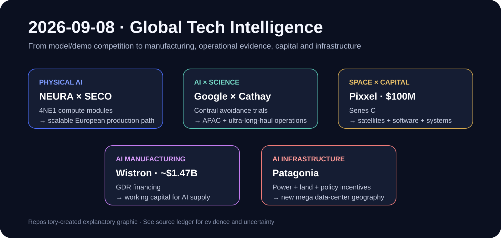

# Daily Global Tech Intelligence Report — 2026-09-08

> **Coverage cutoff:** 2026-09-08 08:31 KST / 2026-09-07 23:31 UTC  
> **Rule:** 새로운 발전을 우선하고 FACT / ANALYSIS / UNCERTAINTY / WATCH를 분리한다.  
> **Source ledger:** [sources/2026/09/2026-09-08.md](../../../sources/2026/09/2026-09-08.md)

Repository-created overview · aspect ratio preserved · claims backed by the source ledger

## Executive Summary

오늘의 핵심은 **AI와 Physical AI의 경쟁축이 모델·데모 자체에서 제조, 실증 데이터, 자본조달, 배치 인프라로 빠르게 이동하고 있다는 점**이다. NEURA Robotics와 SECO는 Qualcomm 기반 분산형 컴퓨팅 모듈을 공동 설계·제조하며 휴머노이드 4NE1을 포함한 인지형 로봇의 유럽 내 양산 경로를 구체화했다. Google과 Cathay Pacific은 AI 기반 contrail 회피 실증을 아시아·태평양과 초장거리 노선으로 확장해, AI가 항공 운항의 기후 최적화에 직접 개입하는 실제 운영 데이터를 축적하기 시작했다.

우주·투자에서는 인도·미국 기반의 Pixxel이 1억달러 Series C를 조달해 hyperspectral 위성, Earth-intelligence software, 위성 시스템과 제조 역량을 함께 확장한다. AI 인프라 공급망에서는 NVIDIA 서버 제조사 Wistron이 약 14.7억달러 규모 GDR 발행으로 원자재 조달과 생산 확대에 필요한 자본을 확보했다. 한편 Reuters는 아르헨티나 Patagonia가 풍력·가스·대형 투자 인센티브를 바탕으로 초대형 AI 데이터센터 후보지로 부상하고 있다고 보도했다. 이는 AI 인프라의 병목이 GPU뿐 아니라 **전력, 부지, 장기 정책 안정성, 제조 공급망과 자본비용**으로 확장되고 있음을 보여준다.

## Evidence Snapshot

| # | Category | Development | Evidence | Confidence |
|---|---|---|---|---|
| 1 | Robotics / Physical AI | NEURA–SECO, 4NE1 포함 로봇용 compute module 설계·제조 및 유럽 양산 협력 | NEURA + SECO | High |
| 2 | AI / Science / Aviation | Google–Cathay, AI contrail 회피를 APAC·초장거리 실제 운항으로 확대 | Google + Cathay + Reuters | High |
| 3 | Space / Investment | Pixxel, $100M Series C 조달 | Pixxel + Reuters | High |
| 4 | AI Infrastructure / Investment | Wistron, 약 $1.47B GDR 발행으로 AI 생산 확대 자본 확보 | Reuters + Wistron prior authorization | Medium-High |
| 5 | AI Infrastructure / Economy | Patagonia, 대형 AI 데이터센터 후보지로 부상 | Reuters + Argentina RIGI policy | Medium-High |

---

## 1. Robotics & Physical AI — NEURA–SECO, 인지형 로봇용 compute module 양산 협력

| Priority | Published | Confidence |
|---|---|---|
| High | 2026-09-07 | High |

### FACT

NEURA Robotics와 SECO는 9월 7일 전략적 협력을 발표했다. 양사는 **NEURA의 인지형 로봇, 휴머노이드 4NE1을 포함한 로봇용 전자 compute module을 공동 설계·엔지니어링·제조**하기로 했다. 이 모듈에는 Qualcomm Technologies의 Dragonwing 계열 프로세서가 적용되며, NEURA가 설명하는 분산형 `Brain + Nervous System` 구조의 일부로 사용된다.

양사는 반도체·전자 제조 현장에서 실제 산업 데이터를 활용한 Physical AI·자동화 솔루션도 함께 개발할 계획이라고 밝혔다. SECO는 이를 유럽 내 scalable series production을 지원하는 협력으로 명시했다.

### ANALYSIS

휴머노이드 산업에서 중요한 변화는 새로운 동작 데모보다 **컴퓨팅 아키텍처를 생산 가능한 모듈로 표준화하고 제조 파트너와 연결하는 단계**다. NEURA가 Qualcomm과 맺은 기존 기술 협력을 SECO의 embedded engineering·제조 역량까지 연결했다는 점은 prototype-to-production 병목을 줄이려는 움직임이다.

특히 고수준 perception·reasoning과 저지연 motion/control을 분산 compute 구조로 나누는 접근은 로봇의 실시간성·전력효율·안전성을 동시에 관리하기 위한 산업적 설계 방향과 맞닿아 있다. 다만 이번 발표는 생산 협력의 구조를 확정한 것이지 실제 대량 출하 실적을 의미하지는 않는다.

### UNCERTAINTY

4NE1의 실제 양산 시점, 월별 생산량, 고객 인도량, BOM 절감효과와 field reliability는 공개되지 않았다. `scalable series production`은 협력의 목표이며 이미 규모 있는 상업 생산이 이뤄졌다는 뜻은 아니다.

### WATCH

- 4NE1 실제 양산 시작 시점과 출하량
- compute module의 최종 사양·전력·열 설계
- 산업 현장 유료 배치와 가동시간
- Qualcomm–NEURA–SECO 구조가 다른 로봇 form factor로 확장되는지
- intervention rate·MTBF·작업당 비용 공개 여부

**Sources:** [NEURA Robotics](https://neura-robotics.com/neura-robotics-seco-partnership-physical-ai-europe/) · [SECO](https://www.seco.com/news/details/neura-robotics-and-seco-join-forces-to-scale-physical-ai-from-europe)

---

## 2. AI × Science / Aviation — Google–Cathay, AI contrail 회피 실증을 APAC·초장거리로 확대

| Priority | Published | Confidence |
|---|---|---|
| High | 2026-09-07 | High |

### FACT

Google과 Cathay Pacific은 AI 기반 contrail mitigation 기술의 실제 운항 시험을 확대한다고 발표했다. Cathay는 **아시아·태평양 지역에서 Google 기술을 시험하는 첫 상업 항공사**이며, **초장거리 노선에서 contrail avoidance를 시험하는 첫 항공사**라고 양측은 밝혔다.

Google은 기존 시험에서 작은 고도 조정을 통해 contrail의 warming impact를 약 40% 줄였다고 설명했으며, 이번 협력은 Cathay의 글로벌 노선에서 운영 가능성과 제약조건을 검증하고 APAC 지역의 실제 데이터를 축적하는 데 초점을 둔다. Reuters도 양사의 확대 발표를 독립 보도했다.

### ANALYSIS

이 사례의 정보가치는 AI가 단순 예측을 넘어 **실제 운항 의사결정에 개입하면서 물리 시스템의 외부효과를 줄이는 최적화 계층**으로 이동한다는 데 있다. contrail 회피는 전체 항공기 교체 없이도 소프트웨어·기상예측·운항계획 조정으로 기후효과를 낮출 수 있어, 효과가 검증될 경우 비교적 빠른 확산 경로가 존재한다.

다만 항공사는 연료소모, 비행시간, 관제 제약과 안전을 동시에 고려해야 하므로 모델 정확도만으로 상업 적용 여부가 결정되지는 않는다.

### UNCERTAINTY

40% 수치는 Google이 설명한 기존 trial 결과이며 이번 Cathay 노선에서 동일한 절감률이 재현됐다는 의미는 아니다. APAC 기상조건·항로·관제환경에서의 연료 penalty, 총 기후효과와 재현성은 추가 데이터가 필요하다.

### WATCH

- 초장거리 노선에서의 실제 contrail 감소율
- 고도 변경에 따른 추가 연료소모·비용
- 항공교통관제와의 운영 통합
- 타 항공사·지역으로의 확대
- 독립 연구에서의 climate forcing 검증

**Sources:** [Google](https://blog.google/innovation-and-ai/models-and-research/google-research/contrail-avoidance-ultra-long-haul-flights/) · [Cathay Pacific](https://news.cathaypacific.com/translation-cathay-pacific-and-google-partner-to-research-and-trial-ai-powered-contrail-avoidance) · [Reuters](https://www.reuters.com/world/asia-pacific/cathay-pacific-google-expand-ai-trials-cut-climate-warming-aircraft-contrails-2026-09-07/)

---

## 3. Space & Investment — Pixxel, 1억달러 Series C 조달

| Priority | Published | Confidence |
|---|---|---|
| High | 2026-09-07 | High |

### FACT

Pixxel은 Temasek과 Seraphim이 공동 주도한 **1억달러 Series C**를 마감했다고 발표했다. 이번 투자로 누적 조달액은 **1억9500만달러**가 됐다. 신규·기존 투자자로 360 ONE Asset, IMM Investment, Radical Ventures, growX ventures 등이 참여했다.

회사는 자금을 hyperspectral imaging을 넘어 advanced sensing satellites, Earth-intelligence software `Aurora`, sovereign space systems, satellite manufacturing까지 확장하는 데 사용할 계획이라고 밝혔다. Reuters는 이번 라운드가 인도 우주기술 기업 가운데 최대 규모의 자금조달이라고 보도했다.

### ANALYSIS

Pixxel의 변화는 Earth observation 사업이 단일 위성영상 판매에서 **sensor → constellation → analytics software → sovereign system → manufacturing**으로 수직 통합되는 흐름을 보여준다. 위성 데이터 자체가 commodity화될수록 경쟁력은 데이터의 spectral quality뿐 아니라 고객이 바로 의사결정에 사용할 수 있는 소프트웨어와 안정적인 constellation 운영에서 갈릴 가능성이 크다.

1억달러 규모의 신규자본은 위성 하드웨어와 소프트웨어를 동시에 확장할 수 있는 runway를 제공하지만, 자본집약적 우주사업에서는 실제 배치·가동·반복매출 전환이 더 중요하다.

### UNCERTAINTY

회사가 제시한 확장계획은 투자금 사용계획이며 실제 constellation 완성 시점이나 신규 고객·매출을 보장하지 않는다. `largest ever` 평가는 Reuters 보도 기준이며 시장 정의에 따라 달라질 수 있다.

### WATCH

- Honeybee 및 신규 고해상도 위성의 실제 발사·가동
- Aurora의 유료 고객·ARR 성장
- sovereign space systems 수주
- 위성 제조 capacity와 납기
- 데이터 정확도·재방문주기·고객 유지율

**Sources:** [Pixxel](https://www.pixxel.space/news/pixxel-raises-100-million-in-series-c-funding-to-build-the-infrastructure-for-a-changing-planet) · [Reuters](https://www.reuters.com/science/google-backed-indian-space-startup-raises-100-million-latest-funding-round-2026-09-07/)

---

## 4. AI Infrastructure & Investment — Wistron, 약 14.7억달러 GDR 발행

| Priority | Published | Confidence |
|---|---|---|
| High | 2026-09-07 | Medium-High |

### FACT

Reuters에 따르면 NVIDIA AI 서버 공급망의 주요 제조사인 Wistron은 **2500만 GDR, 약 14.7억달러 규모**의 글로벌 주식 발행을 진행했다. 각 GDR은 Wistron 보통주 10주에 해당하며, 신규 발행분은 전체 주식수 기준 약 7.29% 희석에 해당한다.

회사는 조달자금을 외화 원자재 구매에 사용할 계획이다. Wistron은 앞서 2026년 3월 이사회에서 최대 2억5000만주의 신규주식 발행안을 승인했고, 미국 Texas의 신규 AI 시스템 제조거점과 멕시코 AI 서버 생산능력 확대를 추진해 왔다.

### ANALYSIS

AI 인프라 수요가 실제 제조 단계로 넘어가면서 공급망 기업은 GPU 확보뿐 아니라 **메모리·보드·전원·냉각·원자재와 운전자본**을 선제적으로 조달해야 한다. Wistron의 대규모 equity financing은 AI 서버 붐이 제조사의 balance sheet와 working-capital 수요까지 확대시키고 있다는 신호다.

즉 AI CAPEX 사이클은 hyperscaler의 데이터센터 투자만으로 측정하기 어렵고, upstream 제조사의 증자·설비투자·원자재 재고까지 함께 봐야 한다.

### UNCERTAINTY

증자 규모 자체가 최종 AI 서버 수요를 보장하지 않는다. 원자재 구매가 실제 출하량·마진 확대에 얼마나 연결될지는 고객 주문과 부품가격, 제품 mix에 달려 있다.

### WATCH

- Texas·Mexico 공장의 실제 ramp
- AI server 매출 비중과 gross margin
- inventory·working capital 변화
- NVIDIA 차세대 플랫폼 전환 속도
- 추가 증자·채권발행 여부

**Sources:** [Reuters](https://www.reuters.com/world/asia-pacific/taiwans-wistron-launches-up-15-billion-gds-sale-term-sheet-shows-2026-09-07/) · [Wistron — 2026-03-12 board authorization](https://www.wistron.com/en/Newsroom/2026-03-12) · [Wistron — Texas AI manufacturing](https://www.wistron.com/en/Newsroom/2026-07-22)

---

## 5. AI Infrastructure & Economy — Patagonia, AI 데이터센터 입지 경쟁의 새 후보

| Priority | Published | Confidence |
|---|---|---|
| Medium-High | 2026-09-07 | Medium-High |

### FACT

Reuters는 글로벌 기술기업과 투자자들이 대형 AI 데이터센터 후보지로 아르헨티나 Patagonia를 검토하고 있다고 보도했다. 기사에서 주요 매력으로 거론된 것은 **강한 풍력 자원, Vaca Muerta의 가스 공급, 넓은 부지, 대규모 투자 인센티브와 장기 정책 안정성을 제공하는 RIGI 체계**다.

아르헨티나 정부는 2026년 RIGI 관련 공식 데이터·프로젝트 정보를 공개하고 가입기한을 연장했으며, 대규모 신규 투자를 유치하기 위한 제도적 프레임을 계속 확대하고 있다.

### ANALYSIS

AI 데이터센터 경쟁은 북미·유럽의 기존 허브에서 전력과 토지의 제약을 받으면서 **전력원이 풍부하고 장기 투자규칙을 제공할 수 있는 신규 지역을 찾는 단계**로 이동하고 있다. Patagonia가 실제 프로젝트를 유치한다면 이는 데이터센터 입지의 비교우위가 네트워크 연결성뿐 아니라 전력가격·전력원 다변화·세제·정책 안정성의 조합으로 재편되고 있음을 보여준다.

### UNCERTAINTY

Reuters가 보도한 다수 프로젝트는 검토·탐색 단계이며 최종 투자결정(FID), 전력계약, 건설 착수, 고객확약이 확인된 것은 아니다. 관심 증가를 실제 capacity로 동일시하면 안 된다.

### WATCH

- 구체적 기업명과 FID 발표
- 전력구매계약(PPA) 및 가스·송전 인프라
- 데이터센터 MW 규모와 건설 일정
- 장거리 광통신·네트워크 latency 조건
- RIGI 적용 승인과 실제 자본집행

**Sources:** [Reuters](https://www.reuters.com/business/energy/tech-companies-look-argentinas-windswept-patagonia-build-massive-data-centers-2026-09-07/) · [Argentina Ministry of Economy — RIGI](https://www.argentina.gob.ar/econom%C3%ADa/rigi) · [Argentina government — RIGI extension](https://www.argentina.gob.ar/node/492596)

---

## Cross-Sector Takeaway

오늘의 다섯 사건은 서로 다른 분야에 있지만 공통된 구조를 가진다. **AI의 가치가 실제 세계에 도달하려면 모델 성능 다음 단계의 제조·운영·과학적 검증·전력·자본이 필요하다.** NEURA는 로봇 compute를 제조 파트너와 연결했고, Google–Cathay는 AI를 실제 항공운항 데이터에 연결했다. Pixxel은 위성과 분석 소프트웨어를 함께 확장하기 위해 대규모 자본을 확보했고, Wistron은 AI 서버 생산 확대에 필요한 운전자본을 조달했다. Patagonia 사례는 그 모든 compute가 결국 전력·부지·정책환경 위에서 작동한다는 사실을 보여준다.

따라서 향후 frontier-technology 경쟁을 볼 때는 benchmark와 demo뿐 아니라 **production ramp, paid deployment, operating data, energy availability, financing cost, recurring revenue**를 함께 추적해야 한다.
