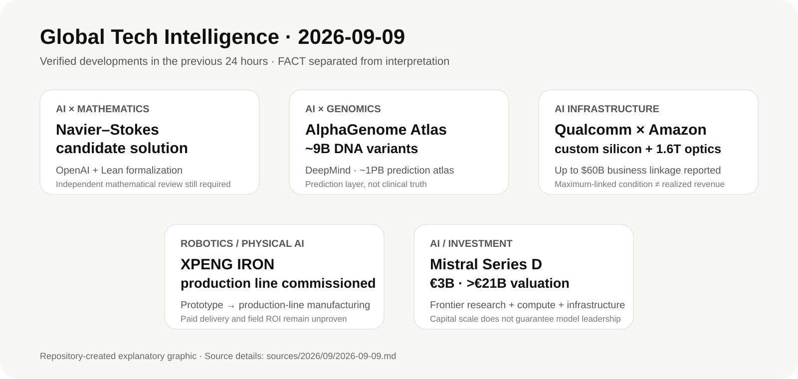

# Daily Global Tech Intelligence Report — 2026-09-09

> **Coverage cutoff:** 2026-09-09 08:17 KST / 2026-09-08 23:17 UTC  
> **Rule:** 새로운 발전을 우선하고 FACT / ANALYSIS / UNCERTAINTY / WATCH를 분리한다.  
> **Source ledger:** [sources/2026/09/2026-09-09.md](../../../sources/2026/09/2026-09-09.md)

Repository-created overview · aspect ratio preserved · claims backed by the source ledger

## Executive Summary

오늘의 가장 강한 신호는 **AI가 단순 소프트웨어 생산성 도구를 넘어 과학 발견, 반도체 설계·인프라, 로봇 제조, 국가 단위 AI 자본조달의 공통 실행계층으로 이동하고 있다는 점**이다.

OpenAI는 Navier–Stokes Millennium Prize Problem에 대한 AI 생성 해법과 Lean 형식증명을 공개했다. 이것은 아직 수학계의 독립 검증을 거쳐야 하므로 `해결 확정`으로 다뤄서는 안 되지만, frontier AI가 인간 전문가의 보조를 넘어 장기간 미해결 수학문제의 후보 해법을 생성·형식검증하는 단계로 진입했다는 점에서 정보가치가 매우 크다. 같은 날 Google DeepMind는 인간 유전체에서 가능한 약 **90억 개의 단일염기 변이**에 대한 분자적 영향 예측을 사전 계산한 AlphaGenome Atlas를 공개했다. 이 역시 예측 데이터베이스이지 임상적 진실 그 자체는 아니지만, AI가 대규모 과학 탐색공간을 사전에 계산해 연구자의 검색 비용을 줄이는 새로운 과학 인프라 형태를 보여준다.

산업 측에서는 Qualcomm과 Amazon이 여러 세대에 걸친 AI 데이터센터용 custom silicon 및 optical connectivity 협력을 발표했고, Reuters는 이 거래가 최대 **600억달러 규모 사업 조건**과 Amazon의 Qualcomm 지분 매입권이 결합된 구조라고 보도했다. 이는 AI 인프라 경쟁이 GPU 단품에서 inference용 custom silicon, 1.6T급 광연결, 전략적 고객-공급자 자본연계로 넓어지고 있음을 보여준다.

Physical AI에서는 XPENG이 IRON 휴머노이드의 전용 생산라인 가동과 생산라인 제조 첫 기체의 자율 보행 출고를 발표했다. 대량 상용출하가 검증된 것은 아니지만, 자동차급 제조 시스템을 로봇 양산에 이식하는 단계가 구체화됐다. 투자 측에서는 Mistral AI가 **30억유로 Series D, 210억유로 초과 post-money valuation**을 발표했다. 자금은 frontier research, compute, 인프라와 글로벌 확장에 투입될 예정이며, 유럽의 AI 주권 경쟁이 단순 모델 개발이 아니라 모델·컴퓨트·배포·자본을 한 스택으로 묶는 방향으로 이동하고 있음을 강화한다.

## Evidence Snapshot

| # | Category | Development | Evidence | Confidence |
|---|---|---|---|---|
| 1 | AI / Science | OpenAI, Navier–Stokes Millennium Problem 후보 해법·Lean proof 공개 | OpenAI + Nature | Medium-High |
| 2 | AI / Genomics | DeepMind, 90억 단일염기 변이 예측 AlphaGenome Atlas 공개 | Google DeepMind + Nature | High |
| 3 | AI Infrastructure / Economy | Qualcomm–Amazon, custom AI silicon·1.6T optical collaboration; 최대 $60B business linkage | Qualcomm + Reuters | High |
| 4 | Robotics / Physical AI | XPENG, IRON 휴머노이드 생산라인 가동·첫 생산라인 제조 기체 공개 | XPENG | Medium-High |
| 5 | AI / Investment | Mistral, €3B Series D·>€21B post-money valuation | Mistral + Reuters | High |

---

## 1. AI × Mathematics — OpenAI, Navier–Stokes Millennium Problem 후보 해법 공개

| Priority | Published | Confidence |
|---|---|---|
| High | 2026-09-08 | Medium-High |

### FACT

OpenAI는 9월 8일 **Navier–Stokes Millennium Prize Problem에 대한 AI 생성 해법을 제안**했다고 공개했다. OpenAI의 연구 인덱스는 writeup과 Lean 형식증명을 함께 공유한다고 명시한다. Nature는 같은 날 이를 주요 수학적 돌파구 주장으로 보도하면서, OpenAI가 Navier–Stokes 방정식의 특정 조건에서의 breakdown을 보이는 해법을 제시했다고 전했다.

중요한 구분은 이것이 **OpenAI가 제안한 해법**이라는 점이다. Millennium Prize Problem의 공식 해결 인정은 외부 수학자들의 장기간 검토와 해당 기관의 절차를 필요로 하므로, 현 단계에서 `문제가 공식적으로 해결됐다`고 표현하는 것은 과도하다.

### ANALYSIS

이번 발표가 맞다면 가장 중요한 변화는 AI가 수학 연구에서 정리 검색·계산·증명 보조를 넘어서 **문제 설정 → 해법 탐색 → 인간 검토 → 형식증명**으로 이어지는 연구 파이프라인에 직접 들어왔다는 점이다. 특히 Lean proof의 공개는 자연어 증명만 제시하는 것보다 검증 가능성을 높인다.

산업적으로는 과학·수학 AI의 평가 기준이 일반 벤치마크 점수에서 **실제 미해결 문제에 대한 novel result, 재현 가능한 formal certificate, 독립 전문가 검증**으로 이동할 가능성이 커졌다. 이는 향후 제약·재료·공학·소프트웨어 검증 등에서도 비슷한 구조가 확산될 수 있음을 시사한다.

### UNCERTAINTY

- 수학계의 독립 검증은 아직 진행 단계다.
- formal proof가 존재하더라도 문제 정의·가정·정리의 범위가 Millennium Problem의 공식 조건과 정확히 일치하는지 외부 검토가 필요하다.
- 공개 직후 일부 연구자들은 아이디어 출처와 모델 학습·도구사용 경로에 대한 우려를 제기했다. 이 논점은 별도의 사실검증이 필요하다.

### WATCH

- 독립 수학자들의 proof audit
- Clay Mathematics Institute 등 공식 인정 절차 여부
- Lean proof의 재현성 및 오류 보고
- 외부 연구팀의 동일 결과 재도출
- AI 연구 provenance·학습데이터·사용자 데이터 정책 논쟁

**Sources:** [OpenAI Research](https://openai.com/research/index/publication/) · [Nature](https://www.nature.com/articles/d41586-026-02842-5)

---

## 2. AI × Genomics — DeepMind, 90억 변이 예측 AlphaGenome Atlas 공개

| Priority | Published | Confidence |
|---|---|---|
| High | 2026-09-08 | High |

### FACT

Google DeepMind는 9월 8일 **AlphaGenome Atlas**를 공개했다. 이 플랫폼은 인간 유전체에서 가능한 모든 단일염기 변화 약 **90억 개**의 분자적 영향을 AlphaGenome으로 사전 예측해 제공한다. DeepMind는 이를 약 1PB 규모의 데이터셋으로 설명하며, 각 변이에 AlphaGenome Variant Impact(AVI) score를 제공한다고 밝혔다.

DeepMind는 학술 연구자가 웹 포털과 API를 통해 접근할 수 있도록 했고, 단백질 코딩 영역뿐 아니라 인간 유전체의 대부분을 차지하는 비코딩 영역의 변이 영향도 다룬다고 설명했다. Nature도 같은 날 AlphaGenome Atlas 공개와 90억 변이 예측 범위를 독립 보도했다.

### ANALYSIS

핵심 변화는 AI가 개별 변이를 요청할 때마다 계산하는 모델에서 **전체 탐색공간을 미리 계산해 연구 인프라로 제공하는 단계**로 이동했다는 것이다. 연구자는 수십억 후보를 모두 실험할 수 없기 때문에, 이런 대규모 예측 atlas는 실험 우선순위 선정 비용을 크게 낮출 수 있다.

AI 과학의 가치가 모델 accuracy만이 아니라 `precompute + searchable atlas + API + downstream validation`으로 구성되는 플랫폼 경제로 이동한다는 점도 중요하다. 향후 생물학·재료과학·화학에서도 유사한 사전 계산형 knowledge layer가 늘어날 가능성이 있다.

### UNCERTAINTY

AlphaGenome Atlas의 값은 **예측**이다. 변이의 실제 질병 원인성, 임상적 유용성, 치료반응을 직접 증명하지 않는다. 특정 조직·세포 상태·환경 상호작용에서는 모델 예측과 실제 생물학이 다를 수 있다.

### WATCH

- 독립 benchmark 및 rare-disease validation 결과
- 임상 유전체 파이프라인에서의 채택
- false-positive / false-negative 특성
- API 사용량과 연구 생산성 개선 효과
- 실제 실험으로 검증된 신규 발견 수

**Sources:** [Google DeepMind](https://deepmind.google/blog/alphagenome-atlas-a-predictive-map-of-every-possible-dna-letter-change-in-the-human-genome/) · [Nature](https://www.nature.com/articles/d41586-026-02835-4)

---

## 3. AI Infrastructure — Qualcomm–Amazon, custom inference silicon·optical interconnect 장기 협력

| Priority | Published | Confidence |
|---|---|---|
| High | 2026-09-08 | High |

### FACT

Qualcomm은 Amazon과 **여러 세대에 걸친 customized silicon 협력**을 발표했다. 양사는 대규모 AI 데이터센터의 inference용 custom silicon과 최대 **1.6T급 optical connectivity**를 공동 개발하며, Qualcomm은 AWS AI 인프라와 Amazon Bedrock을 EDA 워크로드에 더 활용해 칩 설계주기를 단축하는 방안도 추진한다.

Reuters는 규제공시를 근거로 Amazon이 Qualcomm 주식을 주당 161.26달러에 매입할 수 있는 warrant를 부여받았으며, 이 권리가 최대 **600억달러 규모의 거래 조건**과 연계돼 있다고 보도했다. Reuters는 warrant의 잠재가치를 약 40억달러로 설명했다.

### ANALYSIS

이 거래는 AI 인프라가 `GPU → custom inference silicon → optical interconnect → cloud design workflow → strategic financing`으로 확장되고 있다는 강한 증거다. Hyperscaler는 자체 칩만 고집하기보다 외부 반도체 설계사와 공동개발해 workload별 price/performance를 최적화하고, 공급자는 장기수요를 확보하는 구조가 강화되고 있다.

또한 1.6T optical connectivity가 핵심 협력항목에 포함된 것은 compute 성능만큼 **rack-to-rack / cluster bandwidth**가 병목이라는 점을 보여준다. 향후 AI 인프라 경쟁에서 accelerator unit 성능보다 전체 시스템 수준의 전력효율·네트워크·메모리·소프트웨어 통합이 더 중요해질 가능성이 높다.

### UNCERTAINTY

최대 600억달러는 실제 확정 매출과 동일하지 않다. 계약 조건·구매달성 여부에 따라 실현규모가 달라질 수 있으며, warrant 역시 조건부 경제적 이해관계다. 실제 chip tape-out, 양산시점, AWS fleet 내 비중은 공개되지 않았다.

### WATCH

- 첫 custom inference silicon의 tape-out·양산 일정
- AWS 내 실제 배치규모
- Qualcomm 데이터센터 매출 전환
- 1.6T optical 제품의 상용 deployment
- NVIDIA·Broadcom·Marvell·자체 hyperscaler silicon 대비 TCO

**Sources:** [Qualcomm](https://www.qualcomm.com/news/releases/2026/09/qualcomm-announces-multi-generational-product-collaboration-with) · [Reuters](https://www.reuters.com/technology/qualcomm-amazon-develop-custom-chips-ai-data-centers-2026-09-08/)

---

## 4. Robotics / Physical AI — XPENG, IRON 휴머노이드 생산라인 가동

| Priority | Published | Confidence |
|---|---|---|
| High | 2026-09-08 | Medium-High |

### FACT

XPENG은 9월 8일 IRON 휴머노이드 로봇의 생산라인을 공식 가동하고, **생산라인에서 제조된 첫 advanced general-purpose humanoid robot이 자율 보행으로 라인을 나왔다**고 발표했다. 회사는 해당 생산라인의 핵심 공정 자동화율이 80%를 넘으며 자동차급 제조 역량을 로봇 생산에 적용한다고 설명했다.

XPENG은 이를 R&D prototype에서 production-line manufacturing으로 이동한 이정표로 제시했다. 다만 발표 시점에 실제 고객 인도량·월간 생산량·유료 작업 가동률은 공개하지 않았다.

### ANALYSIS

휴머노이드 경쟁의 중요 지표가 다시 **데모 능력에서 제조 재현성**으로 이동하고 있다. 자동차 기업은 이미 공급망 품질관리, 생산공정 자동화, 검사·추적 시스템, 서비스 네트워크를 갖고 있기 때문에 로봇 양산에서 구조적 이점을 가질 수 있다.

하지만 생산라인이 존재한다고 상업적 성공이 보장되는 것은 아니다. 이후 핵심은 `생산 가능`에서 `반복 유료 작업이 가능한 제품을 경제적으로 인도`하는 단계로 넘어가는 것이다.

### UNCERTAINTY

- 생산라인 자동화율은 XPENG 자체 발표다.
- 실제 월별 생산량과 yield는 공개되지 않았다.
- mass production 목표와 실제 paid delivery 시점은 분리해 봐야 한다.
- 장시간 작업 성공률, intervention rate, MTBF, 작업당 비용 데이터가 없다.

### WATCH

- 월별 IRON 생산·인도량
- 실제 유료 고객 배치
- task success / intervention / MTBF
- 생산 수율과 BOM 추세
- 자동차 공급망과 로봇 서비스망의 통합 정도

**Source:** [XPENG](https://www.xpeng.com/pressroom/news/01a080371029a057bc8e8a02a2c6012b)

---

## 5. AI / Investment — Mistral, 30억유로 Series D 조달

| Priority | Published | Confidence |
|---|---|---|
| High | 2026-09-08 | High |

### FACT

Mistral AI는 9월 8일 **30억유로 Series D**를 완료했으며 post-money valuation이 **210억유로를 초과**한다고 발표했다. Mistral은 이를 유럽 민간 기술기업 역사상 최대 규모의 equity funding이라고 설명했다.

Samsung Electronics가 투자를 주도했고 Scaleup Europe Fund와 PSG Equity가 공동 주도했다. Reuters는 €3B 조달, 약 €21B valuation, Samsung·Scaleup Europe Fund·PSG Equity의 공동 주도 구조를 독립 확인했다. 회사는 자금을 frontier AI 연구, compute 확장, 인프라·제품 개발과 국제 확장에 사용할 계획이라고 밝혔다.

### ANALYSIS

이 라운드는 유럽 AI 전략이 `유럽산 모델`이라는 상징성만으로는 충분하지 않고 **compute, infrastructure, enterprise deployment, 자본 규모**까지 동시에 확보해야 한다는 현실을 보여준다. 특히 반도체 기업 Samsung이 lead investor로 들어온 것은 모델·컴퓨트·하드웨어 공급망의 이해관계가 더 촘촘히 연결되는 신호다.

Mistral이 sovereign/open-weight 포지셔닝을 유지하면서 자체 인프라와 enterprise distribution을 강화한다면 미국 hyperscaler·frontier lab 중심 구조와 다른 유럽형 풀스택 전략이 형성될 수 있다.

### UNCERTAINTY

높은 valuation과 대규모 자금조달은 모델 경쟁력이나 장기수익성을 보장하지 않는다. Mistral의 frontier performance, 자체 인프라 utilization, gross margin, 고객 유지와 실제 ARR 전환을 별도로 검증해야 한다.

### WATCH

- €3B의 실제 compute / data center 집행
- 신규 frontier model 성능
- 2026년말 ARR 목표 달성 여부
- 유럽 sovereign AI 고객계약
- compute 사업의 utilization·margin
- 향후 IPO 여부

**Sources:** [Mistral](https://mistral.ai/news/) · [Reuters](https://www.reuters.com/world/europe/french-ai-company-mistral-hits-24-billion-valuation-funding-round-2026-09-08/)

---

## Cross-Sector Interpretation

오늘 다섯 사건은 서로 다른 분야처럼 보이지만 공통 방향이 있다.

1. **AI가 연구결과를 생성하는 도구에서 연구 인프라가 되고 있다.** Navier–Stokes 후보 해법은 고난도 수학 탐색, AlphaGenome Atlas는 대규모 생물학 탐색공간의 사전 계산을 보여준다.
2. **AI 인프라는 단일 칩이 아니라 시스템 계약으로 이동한다.** Qualcomm–Amazon은 custom silicon, 광연결, cloud EDA, 장기 구매관계를 한 구조로 묶는다.
3. **Physical AI는 제조공정 검증 단계로 이동한다.** XPENG IRON은 prototype 자체보다 생산라인이 핵심 뉴스다.
4. **AI 경쟁의 자본 규모가 국가·산업정책 변수로 커지고 있다.** Mistral의 €3B 라운드는 유럽 AI 주권 전략이 대규모 private capital과 산업 파트너 없이는 유지되기 어렵다는 점을 보여준다.

## 30–90 Day Composite Watch

- OpenAI Navier–Stokes proof의 독립 검증 결과
- AlphaGenome Atlas에서 나온 신규 실험 검증 사례
- Qualcomm–Amazon 첫 silicon 사양·양산 일정
- XPENG IRON 실제 고객 인도·운영 데이터
- Mistral의 compute CAPEX와 신규 frontier model 공개
- AI 과학 결과의 provenance·formal verification 표준

## Repetition Check

전날 리포트는 NEURA–SECO 로봇 compute manufacturing, Google–Cathay contrail trial, Pixxel Series C, Wistron GDR, Patagonia AI data-center location을 다뤘다. 오늘 선정한 다섯 사건은 각각 **새로운 수학 연구결과 주장, 신규 유전체 atlas, 신규 hyperscaler–chip 공급계약, 신규 휴머노이드 생산라인 가동, 신규 대형 AI funding close**로 전날 사건을 단순 반복하지 않는다.
