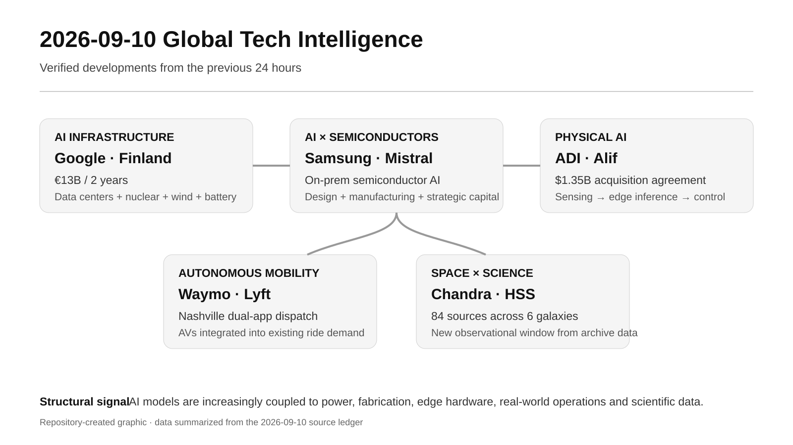

# Daily Global Tech Intelligence Report — 2026-09-10

> **Coverage cutoff:** 2026-09-10 08:24 KST / 2026-09-09 23:24 UTC  
> **Rule:** 새로운 발전을 우선하고 FACT / ANALYSIS / UNCERTAINTY / WATCH를 분리한다.  
> **Source ledger:** [sources/2026/09/2026-09-10.md](../../../sources/2026/09/2026-09-10.md)

Repository-created overview · aspect ratio preserved · claims backed by the source ledger

## Executive Summary

지난 24시간의 핵심 신호는 **AI 경쟁이 모델 성능만이 아니라 전력·반도체 제조·엣지 연산·실제 서비스 운영·과학 관측까지 동시에 재구성하고 있다는 점**이다. Google은 핀란드에 2년간 €13B를 투입하고 22년 장기 원전 관련 전력계약을 포함한 에너지 포트폴리오를 결합했다. Samsung은 Mistral AI와 반도체 설계·제조용 온프레미스 AI를 공동 구축하고 전략적 투자를 병행했다. Analog Devices는 Alif Semiconductor를 $1.35B에 인수하기로 하며 센싱·전력·신호처리와 저전력 AI 프로세서를 묶는 Physical AI 스택 확장을 선택했다.

자율주행에서는 Waymo 차량이 Nashville에서 Lyft 앱의 일반 호출 흐름에 실제로 편입되기 시작했다. 이는 단순 기술 시연보다 **기존 모빌리티 플랫폼의 수요·디스패치·정비 인프라에 AV를 통합하는 단계**가 중요해지고 있음을 보여준다. 과학에서는 Chandra 아카이브 분석으로 기존 분류에 잘 잡히지 않았던 `hypersoft X-ray sources` 84개가 6개 은하에서 보고되어, Ia형 초신성 전구체와 은하 가스 이온화 연구에 새로운 관측창을 열었다.

## Evidence Snapshot

| # | Category | Development | Evidence | Confidence |
|---|---|---|---|---|
| 1 | AI Infrastructure / Economy | Google, 핀란드 AI 인프라에 €13B 투자·22년 원전 관련 전력계약 | Google + Reuters | High |
| 2 | AI / Semiconductors / Investment | Samsung–Mistral, 반도체용 온프레미스 AI 협력·전략 투자 | Samsung + Reuters/FT | High |
| 3 | Physical AI / Semiconductors | Analog Devices, Alif Semiconductor $1.35B 인수 합의 | ADI + Reuters | High |
| 4 | Robotics / Autonomy | Nashville에서 Waymo 차량의 Lyft 앱 매칭 서비스 개시 | Lyft + Waymo background | High |
| 5 | Space / Science | Chandra 데이터에서 hypersoft X-ray source 신규 계열 84개 보고 | Nature Astronomy + NASA | High |

---

## 1. AI Infrastructure — Google, 핀란드에 €13B 투자하고 장기 원전 전력계약 결합

| Priority | Published | Confidence |
|---|---|---|
| High | 2026-09-09 | High |

### FACT

Google은 9월 9일 향후 2년간 핀란드의 디지털 인프라·청정에너지·지역 파트너십에 **€13B**를 투자한다고 발표했다. 회사는 이를 유럽 내 단일 투자로는 최대 규모라고 설명했다. Hamina, Kajaani, Muhos, Vaala에서 데이터센터 및 관련 인프라를 확대하고, Gemini를 포함한 서비스 수요 대응에 활용할 계획이다.

에너지 측에서는 Loviisa 원전의 수명연장·출력증강을 지원하는 **22년 계약**, 신규 육상풍력, 94MW 배터리 시스템을 포함한 포트폴리오를 제시했다. Reuters도 투자규모와 원전 연계 계약을 독립 보도했다.

### ANALYSIS

AI 인프라 입지 경쟁의 단위가 `GPU 구매`에서 **장기 전력확보 + 데이터센터 부지 + 냉각 + 계통안정화 + 지역 인력**로 확장됐다는 강한 증거다. 특히 장기 원전계약과 배터리·풍력을 함께 묶은 것은 hyperscaler가 전력 가격과 공급 신뢰성을 단순 운영비가 아니라 전략자산으로 보기 시작했음을 강화한다.

### UNCERTAINTY

€13B는 2년 투자계획이며 실제 집행속도와 세부 자본배분은 향후 달라질 수 있다. 고용·GDP 효과도 회사와 지역 추정치이므로 실제 운영단계 수치와 분리해 봐야 한다.

### WATCH

- 실제 데이터센터 착공·MW commissioning
- Loviisa 계약의 세부 전력량과 원전 수명연장 절차
- 핀란드 전력가격·계통 혼잡도 변화
- AI workload가 신규 용량을 얼마나 빠르게 흡수하는지

**Sources:** [Google](https://blog.google/innovation-and-ai/infrastructure-and-cloud/global-network/google-ai-commitment-to-finland/) · [Google Energy](https://blog.google/innovation-and-ai/infrastructure-and-cloud/global-network/clean-energy-finland/) · [Reuters](https://www.reuters.com/business/media-telecom/google-invest-15-billion-ai-infrastructure-finland-2026-09-09/)

---

## 2. AI × Semiconductors — Samsung–Mistral, 반도체 설계·제조용 온프레미스 AI 협력

| Priority | Published | Confidence |
|---|---|---|
| High | 2026-09-09 | High |

### FACT

Samsung Electronics는 Mistral AI와 전략적 파트너십을 체결하고, Samsung의 반도체 운영 전반에 Mistral의 AI 서비스와 모델을 적용해 **맞춤형 온프레미스 AI 모델**을 개발한다고 발표했다. 적용범위는 설계·제조 데이터 분석, 개발주기 단축, 제조 정밀도와 수율 안정화 등이다.

Samsung은 동시에 Mistral의 자금조달 라운드에 전략적 투자를 집행했다고 밝혔다. Reuters는 Mistral이 €3B를 조달해 약 €21B 가치평가를 받았으며 Samsung이 신규 투자자 중 하나라고 보도했다. 당일 Samsung 발표는 단순 지분투자보다 **반도체 현장용 AI 공동 적용**을 구체화했다는 점이 새로운 정보다.

### ANALYSIS

AI가 반도체의 최종 수요를 만드는 것뿐 아니라 **반도체를 설계하고 제조하는 도구**로 다시 투입되는 순환구조가 강화되고 있다. 민감한 공정·설계 데이터를 외부 SaaS로 보내기 어려운 산업에서는 온프레미스 모델, 데이터 통제, 맞춤형 추론이 기업 AI 채택의 핵심 조건이 될 가능성이 높다.

### UNCERTAINTY

AI 도입이 실제 수율·개발기간·원가 개선으로 어느 정도 이어질지는 아직 공개되지 않았다. 투자규모 역시 Samsung 공식 발표에서 구체적 금액이 명시되지 않았다.

### WATCH

- 메모리·파운드리별 실제 배치 범위
- 수율·cycle time·defect prediction 개선 수치
- Mistral 모델의 온프레미스 운영비와 보안 검증
- 공동개발 결과가 Samsung 협력사·고객 생태계로 확장되는지

**Sources:** [Samsung Global Newsroom](https://news.samsung.com/global/samsung-and-mistral-ai-announce-strategic-partnership-for-intelligence-driven-semiconductor-infrastructure) · [Samsung Semiconductor](https://news.samsungsemiconductor.com/global/samsung-and-mistral-ai-announce-strategic-partnership-for-intelligence-driven-semiconductor-infrastructure/) · [Reuters](https://www.reuters.com/world/europe/french-ai-company-mistral-hits-24-billion-valuation-funding-round-2026-09-08/)

---

## 3. Physical AI — Analog Devices, Alif Semiconductor를 $1.35B에 인수하기로 합의

| Priority | Published | Confidence |
|---|---|---|
| High | 2026-09-09 | High |

### FACT

Analog Devices(ADI)는 Alif Semiconductor를 **$1.35B 현금**에 인수하는 최종 계약을 체결했다고 발표했다. 조건에 따라 최대 **$200M 추가 대가**가 지급될 수 있으며, 거래는 규제승인을 거쳐 2026년 말 이전 종결을 목표로 한다.

Alif는 저전력 AI-native MCU와 fusion processor를 공급하며, ADI는 자사의 센싱·신호처리·전력·연결 기술과 결합해 로봇·산업·헬스·웨어러블 등에서 로컬 실시간 추론을 강화하겠다고 설명했다. Reuters도 거래규모와 전략적 목적을 교차확인했다.

### ANALYSIS

Physical AI에서 경쟁력은 고성능 중앙연산만으로 결정되지 않는다. 실제 기기는 **센서 입력 → 신호처리 → 저전력 추론 → 제어 → 전력관리**가 하나의 시스템으로 동작해야 한다. ADI의 인수는 아날로그·센서 강자가 엣지 AI 프로세서를 직접 확보해 이 경계를 수직 통합하려는 움직임으로 볼 수 있다.

### UNCERTAINTY

거래 종결은 규제승인 등 조건에 달려 있으며, 인수 후 제품통합 속도와 고객 채택은 아직 검증되지 않았다. `Physical Intelligence`는 ADI의 전략적 프레이밍이며 시장 전체의 표준 용어로 간주해서는 안 된다.

### WATCH

- 규제승인·거래종결
- Alif 제품과 ADI 센서/전력 포트폴리오의 실제 통합 제품
- 로봇·산업 고객 design win
- 전력효율·latency·field reliability 데이터

**Sources:** [Analog Devices](https://www.analog.com/en/newsroom/press-releases/2026/9-9-2026-adi-to-acquire-alif-semiconductor.html) · [Reuters](https://www.reuters.com/technology/analog-devices-buy-alif-semiconductor-135-billion-2026-09-09/)

---

## 4. Autonomous Mobility — Waymo 차량, Nashville에서 Lyft 일반 호출 흐름에 편입

| Priority | Published | Confidence |
|---|---|---|
| High | 2026-09-09 | High |

### FACT

Lyft와 Waymo는 9월 9일부터 Nashville에서 Lyft 이용자가 Standard, Priority Pickup, Wait & Save, Extra Comfort 등을 호출할 때 **완전자율 Waymo 차량과 매칭될 수 있도록** 서비스를 시작했다. 동일 차량군은 Waymo 앱과 Lyft 앱 양쪽에서 동적으로 배차된다.

Lyft는 이것이 Waymo 차량이 두 앱에 동시에 공급되는 첫 시장이라고 밝혔다. 이용자는 자율주행 차량을 거부하거나 opt-out할 수 있으며, 인간 운전자 차량도 계속 함께 운영된다.

### ANALYSIS

자율주행 상용화의 경쟁축이 `차량이 스스로 운전 가능한가`에서 **기존 수요 플랫폼과 fleet operations에 얼마나 자연스럽게 통합되는가**로 이동하고 있다. 수요집계·배차·충전·정비·고객지원이 AV 기술과 분리된 독립 경쟁력이라는 점을 보여준다.

### UNCERTAINTY

초기 제공지역과 차량수는 제한적이며, 대규모 확장 시 unit economics·가동률·정비비·고객선호가 동일하게 유지될지는 불확실하다.

### WATCH

- Nashville fleet 규모와 rides/day
- Waymo 앱 대비 Lyft 유입 비중
- fleet utilization·충전·정비 turnaround
- 이용자 opt-out 비율과 반복사용률
- 다른 도시로 동일 운영모델 확장 여부

**Sources:** [Lyft](https://www.lyft.com/blog/posts/waymo-rides-now-available-on-the-lyft-app-in-nashville) · [Waymo partnership background](https://waymo.com/blog/2025/09/waymo-is-coming-to-nashville-in-partnership-with-lyft/)

---

## 5. Space × Science — Chandra 데이터에서 새로운 `hypersoft X-ray source` 계열 보고

| Priority | Published | Confidence |
|---|---|---|
| High | 2026-09-09 | High |

### FACT

Nature Astronomy에 발표된 연구는 Chandra X-ray Observatory 아카이브에서 **0.3 keV 이하의 매우 낮은 에너지 X-ray가 지배적인 밝은 비핵 점광원**을 새로운 관측 계열 `hypersoft X-ray sources`로 보고했다. 연구팀은 M101을 포함한 **6개 은하에서 총 84개**를 식별했다.

논문은 이 광원들이 일부는 accreting white dwarf/post-nova 계열, 일부는 accreting black hole 계열일 가능성을 제시하며, Ia형 초신성 전구체 연구와 은하 가스 이온화에 영향을 줄 수 있다고 설명한다. NASA도 같은 날 Chandra 공식 페이지에서 결과를 소개했다. 데이터와 최소 재현 데이터셋·코드는 공개돼 있다.

### ANALYSIS

중요한 점은 새로운 망원경 발사가 아니라 **기존 관측 아카이브를 다른 에너지 구간과 분류기준으로 재분석해 새로운 천체 집단을 추출했다는 것**이다. 향후 과학 경쟁력은 관측장비뿐 아니라 장기 데이터 보존·재분석·자동 분류 파이프라인의 품질에도 좌우될 가능성이 크다.

### UNCERTAINTY

`새로운 계열`은 관측적 분류이며 모든 광원이 동일한 물리적 기원을 가진다고 확정된 것은 아니다. Ia형 초신성 전구체와의 연결도 후보 해석 중 하나다.

### WATCH

- 추가 은하에서의 독립 탐색
- 후속 UV/광학 분광관측
- 광원별 실제 compact-object 유형 확인
- Type Ia supernova progenitor population 추정치 변화
- archival astronomy에 AI/자동분류 적용 확대

**Sources:** [Nature Astronomy](https://www.nature.com/articles/s41550-026-02959-7) · [NASA Chandra](https://science.nasa.gov/missions/chandra/nasas-chandra-unveils-mysterious-x-ray-objects/)

---

## Daily Synthesis

오늘의 5개 사건을 하나로 묶으면 `AI model → semiconductor design/manufacturing → edge inference → data-center power → physical service → scientific discovery`가 서로 분리된 시장이 아니라 **하나의 기술·자본·운영 체인**으로 결합되는 흐름이 보인다. 단기적으로는 투자계획과 파트너십 발표보다 실제 MW commissioning, 반도체 수율 개선, edge-AI design win, AV rides/day, 과학 결과의 독립 후속관측처럼 **관측 가능한 실행지표**를 우선 추적해야 한다.
