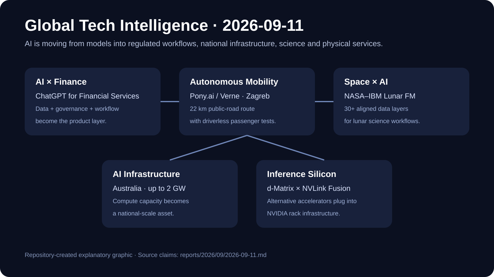

# Daily Global Tech Intelligence Report — 2026-09-11

> **Coverage cutoff:** 2026-09-11 08:52 KST / 2026-09-10 23:52 UTC  
> **Rule:** 새로운 발전을 우선하고 FACT / ANALYSIS / UNCERTAINTY / WATCH를 분리한다.  
> **Source ledger:** [sources/2026/09/2026-09-11.md](../../../sources/2026/09/2026-09-11.md)

Repository-created overview · aspect ratio preserved · claims backed by the source ledger

## Executive Summary

지난 24시간의 핵심 흐름은 **AI가 특정 산업용 제품, 국가 단위 인프라, 비(非)NVIDIA 가속기 생태계, 과학 데이터 분석, 실제 자율주행 서비스로 동시에 깊어지고 있다는 점**이다. OpenAI는 금융기관용 ChatGPT를 공개해 범용 챗봇을 규제산업의 데이터·감사·업무흐름에 직접 결합했고, NVIDIA는 호주 파트너들과 최대 2GW 규모의 AI 인프라 구축 계획을 제시했다. 동시에 d-Matrix는 자사 추론용 XPU를 NVIDIA의 NVLink Fusion·MGX 랙 생태계 안에 넣기로 하면서, 경쟁 가속기가 NVIDIA 플랫폼을 완전히 대체하기보다 그 랙·네트워크·공급망을 활용하는 경로가 부상했다.

과학·우주에서는 IBM과 NASA가 30개가 넘는 정렬된 데이터 레이어를 학습한 공개형 Lunar Foundation Model을 내놓아 달 표면의 얼음 후보·크레이터·화산 지형 분석에 AI를 직접 적용했다. 자율주행에서는 Pony.ai와 Verne가 크로아티아 자그레브 공공도로에서 승객을 태운 완전 무인 로보택시 시험을 시작했다. 이는 유럽의 AV 경쟁이 단순 지도작성·안전운전자 동승을 넘어 **driverless passenger testing과 상업서비스 전환 검증**으로 이동하고 있음을 보여준다.

## Evidence Snapshot

| # | Category | Development | Evidence | Confidence |
|---|---|---|---|---|
| 1 | AI / Finance | OpenAI, 금융기관용 ChatGPT 공개 | OpenAI + Reuters | High |
| 2 | Robotics / Autonomy | Pony.ai·Verne, 자그레브 완전 무인 승객 시험 시작 | Pony.ai | Medium-High |
| 3 | Space / Science / AI | IBM·NASA, 오픈소스 Lunar Foundation Model 공개 | IBM/NASA + Reuters | High |
| 4 | AI Infrastructure / Investment | NVIDIA·호주 파트너, 최대 2GW AI 인프라 계획 | NVIDIA + Reuters | High |
| 5 | Semiconductors / AI Infrastructure | d-Matrix, Raptor XPU를 NVIDIA NVLink Fusion/MGX에 통합 | d-Matrix + NVIDIA + Reuters | High |

---

## 1. AI × Finance — OpenAI, 금융기관용 ChatGPT 공개

| Priority | Published | Confidence |
|---|---|---|
| High | 2026-09-10 | High |

### FACT

OpenAI는 9월 10일 투자은행·주식리서치 등 금융서비스 업무를 겨냥한 **ChatGPT for Financial Services**를 공개했다. Reuters에 따르면 이 제품은 Morgan Stanley와 Evercore가 설계 파트너로 참여했고, LSEG·PitchBook·Daloopa·Crunchbase·Quartr 등의 데이터를 활용해 리서치, 금융모델 작성, 고객자료 생성 등을 지원한다. 기업이 보유한 FactSet·S&P Global·Preqin·Datasite 등의 구독 데이터도 연결할 수 있다.

OpenAI의 금융서비스 공식 페이지는 금융 데이터 분석, 리서치 합성, Excel 기반 모델링, 규제·거버넌스 요구를 중심 사용사례로 제시하고 있다. Reuters는 새 제품이 역할기반 접근제어, 암호화, 감사 로그 같은 ChatGPT Enterprise의 통제 기능을 활용한다고 보도했다.

### ANALYSIS

이번 발표의 핵심은 모델 자체보다 **산업별 데이터·업무흐름·보안 통제를 하나의 제품으로 묶는 vertical AI**다. 금융처럼 데이터 출처 추적과 감사 가능성이 중요한 산업에서는 최고 성능 모델만으로는 채택이 어렵고, 신뢰 가능한 데이터 연결·인용·권한통제가 실제 경쟁력이 된다. 범용 AI 제품의 다음 성장축이 `모델 API`에서 `산업별 운영체계`로 이동하는 신호다.

### UNCERTAINTY

초기 고객의 실제 비용절감, 오류율, 규제 대응 성과는 공개되지 않았다. 금융모델과 투자 리서치의 품질은 데이터 라이선스, 내부 검토절차, 사용자 숙련도에 따라 크게 달라질 수 있다.

### WATCH

- 투자은행·자산운용사의 실제 좌석 확대율과 반복사용률
- 분석 오류·출처 추적·감사 대응 지표
- 금융데이터 제공사와의 추가 계약
- 금융 외 규제산업으로 vertical 제품이 확장되는지

**Sources:** [OpenAI Financial Services](https://openai.com/solutions/industries/financial-services/) · [OpenAI event](https://openai.com/business/learn/intelligence-at-work-financial-services/) · [Reuters](https://www.reuters.com/business/openai-launches-chatgpt-financial-services-industry-2026-09-10/)

---

## 2. Autonomous Mobility — Pony.ai·Verne, 자그레브에서 승객 탑승 완전 무인 시험 시작

| Priority | Published | Confidence |
|---|---|---|
| High | 2026-09-10 | Medium-High |

### FACT

Pony.ai와 Verne는 9월 10일 크로아티아 자그레브 공공도로에서 **안전운전자 없이 승객을 태운 로보택시 시험**을 시작했다고 발표했다. 초기 노선은 Verne 본사·주요 비즈니스 지구와 Franjo Tuđman 공항을 잇는 약 22km 구간이며 향후 운영구역 전체로 확대할 계획이다.

회사는 4월 시작한 기존 서비스가 그동안 20만km 이상을 주행하고 수천 건의 고객 승차를 완료했으며 평균 승객 평점이 4.7/5라고 밝혔다. 이번 단계는 기존 AV operator 동승 운영에서 완전 무인 승객 시험으로 전환한 것이다.

### ANALYSIS

유럽 자율주행 경쟁의 중요한 기준이 `허가 획득`에서 **supervised → driverless → paid commercial service** 순서의 실제 전환속도로 바뀌고 있다. 특히 공항 연결 같은 반복 수요가 높은 노선은 초기 로보택시 경제성을 검증하기 좋은 구조다. 중국에서 축적한 완전 무인 운영 경험을 유럽 규제환경에 이식할 수 있는지가 Pony.ai의 해외 확장성을 가르는 핵심 변수가 된다.

### UNCERTAINTY

`유럽 최초`라는 표현과 누적 운행 수치·평점은 회사 발표에 의존한다. 시험 규모, 차량 대수, intervention·incident 지표, 유료 완전 무인 서비스 전환 일정은 아직 충분히 공개되지 않았다.

### WATCH

- 완전 무인 시험 차량 수와 실제 승객 운행량
- intervention / remote assistance rate
- 사고·중단·규제 이벤트
- 시험에서 유료 완전 무인 상업서비스로 전환되는 시점
- Uber 연계 호출과 fleet utilization

**Sources:** [Pony.ai IR](https://ir.pony.ai/news-releases/news-release-details/pony-ai-inc-and-verne-kick-fully-driverless-robotaxi-test-rides)

---

## 3. Space × AI — IBM·NASA, Lunar Foundation Model 공개

| Priority | Published | Confidence |
|---|---|---|
| High | 2026-09-10 | High |

### FACT

IBM과 NASA는 달 과학용 **NASA-IBM Lunar Foundation Model**을 오픈소스로 공개했다. IBM에 따르면 모델과 함께 공개된 머신러닝용 데이터셋은 NASA LRO·GRAIL, JAXA SELENE/Kaguya 등의 관측을 포함해 4개 임무, 9개 기기에서 얻은 **30개 이상의 공간정렬 데이터 레이어**를 통합한다.

IBM은 얼음 가능성이 높은 지역 예측에서 비교 모델 대비 RMSE를 최대 22% 낮췄고, 약 100m 문맥 해상도의 크레이터 탐지에서는 절반의 훈련데이터로 비교 모델보다 약 19% 높은 성능을 냈다고 설명했다. Reuters는 모델 공개와 달 얼음·크레이터·화산 지형 분석 목적을 독립 보도했다.

### ANALYSIS

과학용 foundation model의 장점은 개별 연구질문마다 모델을 새로 만드는 대신 **여러 센서·해상도·임무 데이터를 하나의 학습기반으로 재사용**할 수 있다는 점이다. 이 방식이 검증되면 AI는 우주탐사에서 단순 이미지 분류가 아니라 착륙지 선정, 자원탐사, 지질학 연구를 위한 공통 분석층으로 자리잡을 수 있다.

### UNCERTAINTY

벤치마크 개선은 특정 태스크와 비교모델에 대한 결과이며 실제 임무 의사결정 정확도를 보장하지 않는다. 얼음 후보 탐지는 자원 존재를 직접 확정하는 것이 아니며 현장·추가 관측 검증이 필요하다.

### WATCH

- 독립 연구팀의 재현 결과
- Artemis 착륙지·자원탐사 워크플로 사용 여부
- 추가 달 데이터·센서 통합
- 동일 접근이 화성·소행성 등으로 확장되는지

**Sources:** [IBM Newsroom](https://newsroom.ibm.com/2026-09-10-ibm-and-nasa-release-open-source-ai-model-to-support-lunar-exploration) · [Reuters](https://www.reuters.com/science/ibm-nasa-launch-ai-model-help-map-ice-craters-moon-2026-09-10/)

---

## 4. AI Infrastructure — NVIDIA·호주 파트너, 최대 2GW AI 인프라 구축 계획

| Priority | Published | Confidence |
|---|---|---|
| High | 2026-09-10 | High |

### FACT

NVIDIA는 호주의 Firmus, Sharon AI, IREN, ResetData, Megaport, CDC, NEXTDC, AirTrunk 등과 협력해 **2027년까지 최대 2GW 규모**의 AI 인프라 구축을 지원한다고 밝혔다. 해당 시설은 NVIDIA DSX 기반 AI factory로 설계되며 파트너들이 데이터센터를 운영하고 NVIDIA가 컴퓨팅·네트워킹·소프트웨어·레퍼런스 아키텍처를 제공한다.

Reuters는 호주의 현재 데이터센터 컴퓨팅 용량을 업계 추정 약 1.6GW로 전하며, 발표된 2GW 계획이 실현될 경우 현지 AI 컴퓨팅 기반을 크게 확대할 수 있다고 보도했다.

### ANALYSIS

AI 인프라 경쟁이 미국·유럽 핵심 허브뿐 아니라 **전력·토지·연결성이 있는 지역의 국가 단위 compute capacity 확보**로 확산되고 있다. 특히 NVIDIA가 칩 공급자가 아니라 시설·랙·네트워크·소프트웨어까지 포함한 DSX 플랫폼을 제시하는 것은 AI 인프라의 가치단위가 개별 GPU에서 `운영 가능한 AI factory`로 커지고 있음을 보여준다.

### UNCERTAINTY

2GW는 여러 파트너의 계획을 합친 최대 목표치이며 실제 전력 인가·착공·GPU 설치·가동 시점은 프로젝트별로 다르다. 전력·물 사용, 계통연결, 규제·지역사회 수용성도 속도를 제한할 수 있다.

### WATCH

- 프로젝트별 실제 착공·commissioning MW
- 전력망 연결과 신규 발전 프로젝트
- GPU/랙 설치율과 실제 이용률
- 호주 내 AI 수요가 공급 증가를 얼마나 흡수하는지

**Sources:** [NVIDIA Newsroom](https://nvidianews.nvidia.com/news/nvidia-expands-ai-infrastructure-capacity-in-partnership-with-australias-data-center-ecosystem) · [Reuters](https://www.reuters.com/world/asia-pacific/nvidia-teams-up-with-australian-partners-build-ai-factory-capacity-2026-09-10/)

---

## 5. AI Semiconductors — d-Matrix, Raptor XPU를 NVIDIA 랙 생태계에 통합

| Priority | Published | Confidence |
|---|---|---|
| Medium-High | 2026-09-10 | High |

### FACT

d-Matrix는 차세대 추론용 **Raptor XPU**를 NVIDIA의 NVLink Fusion과 MGX 랙 아키텍처에 통합하는 다년 협력 로드맵을 발표했다. NVIDIA도 Raptor가 NVLink scale-up, Spectrum-X scale-out 네트워킹, MGX 랙과 결합될 것이라고 확인했다. d-Matrix는 Astera Labs와도 고속 데이터경로를 공동 설계한다.

Reuters에 따르면 Raptor의 최종 설계 단계는 2026년 말 완료를 목표로 하며 NVIDIA 호환 랙은 2027년 제공될 예정이다. 협력의 재무조건은 공개되지 않았다.

### ANALYSIS

이는 AI 가속기 경쟁을 `NVIDIA 대 대안칩`이라는 단순 구도로 보기 어렵다는 증거다. 추론 특화 칩 업체가 NVIDIA의 랙·인터커넥트·네트워킹·공급망을 활용하면 고객은 새로운 가속기를 도입하면서도 이미 구축된 데이터센터 표준을 유지할 수 있다. NVIDIA 입장에서도 NVLink Fusion을 통해 **경쟁 실리콘까지 자사 시스템 생태계 안으로 흡수하는 플랫폼 전략**을 강화할 수 있다.

### UNCERTAINTY

Raptor는 아직 최종 설계·대규모 양산·고객 배치가 완료되지 않았다. 발표된 성능 목표와 실제 2027년 production workload의 비용·전력·latency는 별도 검증이 필요하다.

### WATCH

- Raptor tape-out·양산 일정
- MGX 랙 기반 실제 고객 deployment
- token/s, latency, watt당 성능, TCO
- 다른 custom accelerator의 NVLink Fusion 참여 확대

**Sources:** [d-Matrix announcement](https://www.prnewswire.com/news-releases/d-matrix-adopts-nvidia-nvlink-fusion-rackscale-infrastructure-for-ultra-low-latency-ai-inference-302875104.html) · [NVIDIA](https://blogs.nvidia.com/blog/d-matrix-nvlink-fusion/) · [Reuters](https://www.reuters.com/business/media-telecom/chip-startup-d-matrix-use-nvidia-chip-linking-tech-ai-servers-2026-09-10/)

---

## Cross-sector Takeaway

오늘의 5개 발전은 하나의 방향으로 수렴한다. **AI의 경쟁단위가 모델 자체에서 산업 데이터·규제 통제·전력과 데이터센터·랙 수준 표준·과학 데이터 플랫폼·실제 물리 서비스 운영까지 확대**되고 있다. 앞으로는 모델 benchmark보다 `실제 채택`, `운영경제성`, `검증 가능한 성과`, `인프라 가동`, `규제 통과`가 더 중요한 선행지표가 된다.
