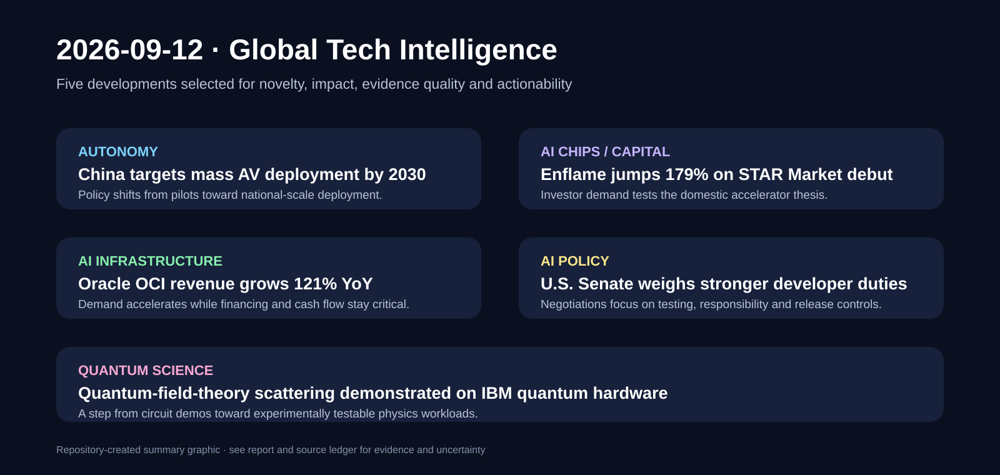

# Daily Global Tech Intelligence Report — 2026-09-12

> **Coverage cutoff:** 2026-09-12 08:57 KST / 2026-09-11 23:57 UTC  
> **Rule:** 새로운 발전을 우선하고 FACT / ANALYSIS / UNCERTAINTY / WATCH를 분리한다.  
> **Source ledger:** [sources/2026/09/2026-09-12.md](../../../sources/2026/09/2026-09-12.md)

Repository-created overview · aspect ratio preserved · claims backed by the source ledger

## Executive Summary

지난 24시간의 핵심은 **자율주행의 국가 단위 확산 목표, 중국 AI 반도체의 자본시장 검증, AI 클라우드의 폭발적 수요와 자금조달 부담, 첨단 AI 규제 논의, 양자컴퓨팅의 실제 물리 시뮬레이션 진전**이다. 중국은 2030년까지 자율주행차의 대규모 보급을 목표로 하는 스마트·신에너지차 로드맵을 제시했고, Enflame은 상하이 STAR Market 상장 첫날 급등하면서 중국산 AI 가속기 기업에 대한 강한 투자 수요를 확인했다. Oracle은 FY27 1분기 클라우드 인프라 매출이 전년 대비 121% 증가했다고 발표했지만, 동시에 AI 인프라 확장을 위한 막대한 자본조달과 구조조정 비용 부담도 드러냈다.

미국에서는 첨단 AI 개발사가 알려진 중대 위험을 완화하도록 의무를 부과하는 초당적 상원 법안이 협상 중이라는 보도가 나와, AI 경쟁의 병목이 성능뿐 아니라 책임·테스트·출시 통제로 이동할 가능성을 보여줬다. 과학 분야에서는 Nature Physics에 실제 IBM 양자컴퓨터를 이용해 양자장론의 산란과 입자 생성 동역학을 시뮬레이션한 연구가 발표됐다. 아직 규모와 오류 한계는 분명하지만, 양자컴퓨팅이 단순한 알고리즘 시연에서 물리학의 실제 계산 문제로 조금씩 이동하고 있다는 신호다.

## Evidence Snapshot

| # | Category | Development | Evidence | Confidence |
|---|---|---|---|---|
| 1 | Robotics / Autonomy | 중국, 2030년 자율주행차 대규모 보급 목표 제시 | MIIT + Reuters | High |
| 2 | AI Semiconductors / Investment | Enflame, STAR Market 상장 첫날 179% 상승 | SSE + Reuters | High |
| 3 | AI Infrastructure / Economy | Oracle OCI 매출 121% 성장, AI 투자·자금조달 부담 병존 | Oracle + Reuters | High |
| 4 | AI Policy | 미 상원, 첨단 AI 개발사 의무 강화 법안 협상 | Reuters | Medium-High |
| 5 | Science / Quantum Computing | 양자장론 산란을 실제 IBM 양자컴퓨터에서 시뮬레이션 | Nature Physics | High |

---

## 1. Autonomous Mobility — 중국, 2030년 자율주행차 대규모 보급 목표

| Priority | Published | Confidence |
|---|---|---|
| High | 2026-09-11 | High |

### FACT

중국 공업정보화부(MIIT)는 9월 11일 스마트·커넥티드 신에너지차 산업의 향후 계획을 설명하는 공식 기자회견을 열었다. Reuters는 해당 로드맵이 **2030년까지 자율주행 차량의 대규모 보급**을 목표로 하며, 기술개발·규제체계·산업 협력을 함께 강화하는 내용을 담고 있다고 보도했다.

MIIT는 같은 날 산업 발전 현황을 설명하면서 배터리·전동화뿐 아니라 지능형·커넥티드 차량을 중국 자동차 산업 전환의 핵심 축으로 제시했다. 이는 2027년 시행 예정인 L3·L4 자율주행 시스템 안전 국가표준 등 기존 규제 기반 위에 상용 보급 목표를 더한 것이다.

### ANALYSIS

중요한 변화는 중국의 자율주행 전략이 개별 도시의 시험·로보택시 허가를 넘어 **국가 산업정책의 대량 보급 목표**로 올라갔다는 점이다. 향후 경쟁은 알고리즘 성능뿐 아니라 차량 인증, 도로·통신 인프라, 보험·책임 체계, 대량생산 비용을 함께 맞추는 능력으로 이동할 가능성이 높다.

### UNCERTAINTY

2030년의 `mass deployment`가 차량 대수·지역 커버리지·L3/L4 비중 중 어떤 정량 기준을 의미하는지는 아직 충분히 구체화되지 않았다. 정책 목표와 실제 상용 서비스 규모 사이에는 규제·안전·소비자 수용성 변수가 남아 있다.

### WATCH

- 2030 목표의 정량 KPI와 세부 시행계획
- L3/L4 인증 차량 수와 실제 판매·운행량
- 완전 무인 유료 서비스의 도시별 확대 속도
- 사고율·intervention rate·보험 및 책임 규정

**Sources:** [MIIT press conference](https://wap.miit.gov.cn/xwfb/xwfbh/bxwfbh/art/2026/art_05c4683ad9ee4c3c880485f7a8873601.html) · [Reuters](https://www.reuters.com/business/autos-transportation/china-targets-mass-deployment-self-driving-vehicles-by-2030-2026-09-11/)

---

## 2. AI Chips × Investment — Enflame, STAR Market 상장 첫날 179% 상승

| Priority | Published | Confidence |
|---|---|---|
| High | 2026-09-11 | High |

### FACT

상하이증권거래소(SSE)는 중국 AI 가속기 업체 Enflame Technology(燧原科技)의 A주 상장식을 9월 11일 진행했다고 확인했다. Reuters에 따르면 Enflame은 약 **9억1200만 달러 규모 IPO** 이후 상장 첫날 종가 기준 179% 상승했고, 시가총액은 공모가 기준 약 612억 위안에서 약 1710억 위안으로 확대됐다.

Reuters는 Enflame의 2025년 매출이 약 9억9020만 위안이었으며 아직 순이익을 내지 못하고 있다고 전했다. 회사는 IPO 자금을 차세대 AI 칩과 컴퓨팅 시스템 개발에 투입할 계획이다.

### ANALYSIS

첫날 급등은 실적 자체보다 **중국 내 AI 가속기 자립에 대한 희소성 프리미엄과 자본시장 기대**를 보여준다. 다만 높은 밸류에이션이 지속되려면 실제 출하량, 대형 고객 다변화, 소프트웨어 생태계, 제조 수율이 따라와야 한다. 중국 AI 칩 산업은 기술 경쟁과 동시에 자본조달 경쟁 단계로 진입하고 있다.

### UNCERTAINTY

상장 첫날 가격은 유통주식 수와 투자심리에 크게 영향을 받기 때문에 장기 기업가치의 직접 지표가 아니다. 회사는 아직 적자이며 주요 고객 의존도와 향후 제품 경쟁력도 지속 검증이 필요하다.

### WATCH

- 차세대 가속기 실제 출시·출하량
- 주요 고객 집중도 변화
- 매출 성장 대비 손실 축소 속도
- CUDA 대체·호환 소프트웨어 생태계의 개발자 채택

**Sources:** [Shanghai Stock Exchange](https://star.sse.com.cn/aboutus/mediacenter/ceremony/) · [Reuters](https://www.reuters.com/world/asia-pacific/tencent-backed-enflame-open-up-188-shanghai-debut-after-912-million-ipo-2026-09-11/)

---

## 3. AI Infrastructure — Oracle, OCI 121% 성장과 대규모 투자 부담이 동시에 확인

| Priority | Published | Confidence |
|---|---|---|
| High | 2026-09-10–11 | High |

### FACT

Oracle은 FY2027 1분기 매출이 전년 대비 30% 증가한 **193억 달러**, 전체 클라우드 매출이 62% 증가한 **116억 달러**, OCI 매출이 121% 증가한 **74억 달러**라고 발표했다. RPO(remaining performance obligations)는 전년 대비 2090억 달러 증가한 **6640억 달러**였다.

Reuters는 9월 11일 Oracle이 FY2026 구조조정 계획의 예상 비용을 약 7억 달러 늘려 총 **28억 달러** 수준으로 예상한다고 보도했다. 회사는 현 회계연도에 부채와 주식 발행을 합쳐 400억 달러를 조달할 계획이며, 직전 분기 free cash flow는 -54억 달러였다.

### ANALYSIS

Oracle 사례는 AI 클라우드 수요가 실제 매출과 백로그로 빠르게 전환되는 동시에, **데이터센터·전력·가속기 확보를 위한 자본비용이 성장의 핵심 제약**이 되고 있음을 보여준다. AI 인프라의 승자는 계약 규모뿐 아니라 고객 선급금, 외부 자금조달, 자산 회전율을 이용해 성장 속도를 얼마나 재무적으로 감당할 수 있는지가 중요해지고 있다.

### UNCERTAINTY

RPO는 미래 매출 가능성을 보여주지만 실제 인식 시점과 마진을 보장하지 않는다. 고객이 직접 칩을 공급하거나 선급금을 제공하는 계약 구조가 전체 포트폴리오에서 어느 정도 비중인지도 제한적으로 공개돼 있다.

### WATCH

- RPO의 실제 매출 전환 속도와 gross margin
- 분기별 free cash flow 개선 여부
- 신규 데이터센터 용량 투입과 utilization
- 부채비율·이자비용·추가 증자 여부

**Sources:** [Oracle Q1 FY27](https://wwwcmsapi.oracle.com/news/announcement/q1fy27-earnings-release-2026-09-10/) · [Reuters](https://www.reuters.com/business/retail-consumer/oracle-shares-rise-ai-cloud-backlog-beats-estimates-2026-09-11/)

---

## 4. AI Policy — 미국 상원, 첨단 AI 개발사에 ‘duty of care’ 부과하는 법안 협상

| Priority | Published | Confidence |
|---|---|---|
| Medium-High | 2026-09-11 | Medium-High |

### FACT

Reuters는 미국 상원 협상가들이 첨단 AI 개발사에 **알려진 중대한 위험을 줄이기 위한 주의의무(duty of care)**를 부과하는 초당적 법안을 논의하고 있다고 보도했다. 보도에 따르면 연방정부가 안전상 문제가 큰 모델의 공개를 제한할 수 있는 절차와 국가 연구소에서의 모델 테스트 방안도 협상 대상에 포함돼 있다.

법안은 아직 최종 문안이 아니며, 의회 일정상 실제 상정·통과 시점도 확정되지 않았다.

### ANALYSIS

규제 논의의 초점이 단순 투명성·표시 의무에서 **개발사의 사전 위험관리 책임과 출시 통제**로 이동한다면, 프런티어 모델 개발비용에는 평가·감사·안전검증 비용이 구조적으로 추가될 수 있다. 반대로 명확한 연방 기준은 주별 규제 파편화를 줄일 수도 있다.

### UNCERTAINTY

현재는 협상 중인 초안 단계이며 적용 대상, 위험의 정의, 연방-주 규정 관계가 변경될 가능성이 높다. Reuters의 취재 내용 외에 확정된 법안 전문이 아직 공개된 단계는 아니다.

### WATCH

- 실제 법안 공개 여부와 적용 기업 기준
- 독립 평가·국가 연구소 테스트 의무의 범위
- 주 규제 선점(preemption) 조항 포함 여부
- 업계와 시민사회 반응

**Source:** [Reuters](https://www.reuters.com/legal/litigation/us-senate-negotiators-consider-requiring-ai-firms-mitigate-known-major-risks-2026-09-11/)

---

## 5. Quantum Science — 양자장론 산란을 실제 양자컴퓨터에서 시뮬레이션

| Priority | Published | Confidence |
|---|---|---|
| Medium-High | 2026-09-11 | High |

### FACT

Nature Physics는 9월 11일 Caltech·University of Washington 연구진이 **양자장론의 산란 과정과 충돌 후 입자 생성 동역학을 디지털 양자컴퓨터에서 시뮬레이션**한 연구를 게재했다. 연구팀은 W-state 기반 파동묶음 준비 방법을 설계하고 고전 시뮬레이션으로 회로를 검증한 뒤 IBM 양자컴퓨터에서 실험을 수행했다.

이 연구는 고에너지 충돌처럼 비평형 상태의 시간 진화와 생성 입자 수를 양자회로로 추적하는 방법을 제시한다.

### ANALYSIS

현재 규모는 제한적이지만, 의미는 양자컴퓨팅이 단순 회로 벤치마크를 넘어 **기존 계산이 어려운 동역학적 물리 문제를 직접 표현하는 연구도구**로 이동하고 있다는 점이다. 오류율과 시스템 크기가 개선되면 입자물리·물질과학의 일부 문제에서 양자 시뮬레이션의 실용성을 판단할 수 있는 기준점이 될 수 있다.

### UNCERTAINTY

이번 결과가 고전 슈퍼컴퓨터보다 계산 우위를 입증한 것은 아니다. 실제 물리학 문제에 필요한 격자 크기와 정밀도로 확장하려면 하드웨어 오류와 회로 깊이 문제가 남아 있다.

### WATCH

- 더 큰 격자·더 복잡한 장론으로의 확장
- error mitigation / error correction 적용 결과
- 고전 시뮬레이션 대비 자원 요구량 비교
- 다른 양자 하드웨어에서의 재현

**Source:** [Nature Physics](https://www.nature.com/articles/s41567-026-03436-8)

---

## Cross-Sector Takeaway

오늘의 다섯 사건은 하나의 공통 구조를 보여준다. **AI·자율주행·양자기술의 경쟁은 이제 ‘가능한가’보다 ‘대규모로 운영·자금조달·규제·검증할 수 있는가’로 이동 중**이다. 중국의 자율주행 로드맵은 국가 규모 deployment를, Enflame과 Oracle은 자본시장·현금흐름을, 미국 상원 논의는 책임체계를, 양자 시뮬레이션 연구는 실제 검증 가능한 계산 문제로의 이동을 각각 보여준다.
