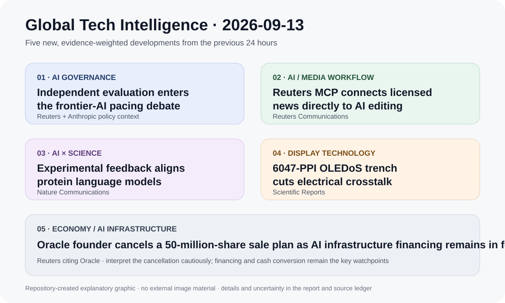

# Daily Global Tech Intelligence Report — 2026-09-13

> **Coverage cutoff:** 2026-09-13 08:51 KST / 2026-09-12 23:51 UTC  
> **Rule:** 새로운 발전을 우선하고 FACT / ANALYSIS / UNCERTAINTY / WATCH를 분리한다.  
> **Source ledger:** [sources/2026/09/2026-09-13.md](../../../sources/2026/09/2026-09-13.md)

Repository-created overview · aspect ratio preserved · claims backed by the source ledger

## Executive Summary

지난 24시간의 핵심은 **frontier AI의 개발 속도와 외부 검증을 둘러싼 자율 거버넌스 논의, 신뢰 가능한 미디어 콘텐츠를 직접 AI 워크플로에 연결하는 MCP 통합, 실험 피드백으로 단백질 생성모델을 기능 목표에 맞추는 연구, 초고해상도 OLED-on-silicon의 전기적 누설 억제, AI 인프라 투자 국면에서 Oracle 지배주주의 대규모 주식매각 계획 철회**였다.

가장 구조적인 신호는 AI 경쟁의 평가축이 단순 성능에서 **배포 속도·독립 평가·검증 가능한 데이터 연결·실험 피드백·자본조달 지속가능성**까지 넓어지고 있다는 점이다. 반면 이번 24시간에는 로봇·자율주행과 우주 분야에서 TOP 5에 넣을 만큼 새롭고 검증 가능한 독립 발전이 상대적으로 적어, 기존 사건을 재탕하지 않고 더 강한 신규 증거를 우선했다.

## Evidence Snapshot

| # | Category | Development | Evidence | Confidence |
|---|---|---|---|---|
| 1 | AI Governance | Anthropic CEO, frontier 모델 개발 속도 완화와 상시 독립 평가자 제안 | Reuters + Anthropic policy context | Medium-High |
| 2 | AI / Media Tech | Reuters MCP와 CuttingRoom AI 편집 플랫폼 직접 통합 | Reuters Communications | High |
| 3 | AI × Science | 실험 피드백 RL로 단백질 언어모델을 기능 목표에 정렬 | Nature Communications + bioRxiv history | High |
| 4 | Display Technology | 6047 PPI tandem OLEDoS에서 trench 구조로 crosstalk 대폭 억제 | Scientific Reports | High |
| 5 | Economy / AI Infrastructure | Larry Ellison, Oracle 5천만 주 매각 계획 철회 | Reuters citing Oracle | Medium-High |

---

## 1. AI Governance — Anthropic CEO, frontier 모델 개발 속도 완화와 상시 독립 평가 제안

| Priority | Published | Confidence |
|---|---|---|
| High | 2026-09-12 | Medium-High |

### FACT

Reuters는 9월 12일 Anthropic CEO Dario Amodei가 frontier AI 기업들에 모델 capability 개선 속도를 다소 늦추고, 확보된 시간을 안전 검증에 사용하자는 3단계 구상을 공개했다고 보도했다. 핵심은 **기업 내부에 상시 독립 평가자를 두는 방식, frontier 기업 간 안전기준 조율, 국제 공조**다. Reuters에 따르면 OpenAI CEO Sam Altman도 상시 독립 평가자 구상에 동의한다는 입장을 밝혔다.

Anthropic의 기존 Responsible Scaling Policy 역시 모델 역량이 높아질수록 위험에 비례해 평가·보안·배포 통제를 강화하는 구조를 두고 있어, 이번 제안은 기존 자율규제 프레임을 기업 간 조율과 외부 검증으로 넓히려는 움직임으로 볼 수 있다.

### ANALYSIS

중요한 점은 safety가 내부 평가 체크리스트를 넘어 **개발 속도 자체와 외부 검증권한을 조정하는 경쟁 규칙**으로 이동하고 있다는 것이다. 실제로 여러 frontier 기업이 비슷한 형태의 독립 평가를 수용한다면, 향후 모델 경쟁은 출시 주기만이 아니라 `capability gain / verified safety / deployment control`의 결합으로 평가될 가능성이 높다.

### UNCERTAINTY

이번 구상은 법적 구속력이 있는 합의가 아니라 공개 제안 단계다. 기업 간 조율은 경쟁법·국가안보·시장점유 경쟁과 충돌할 수 있으며, 독립 평가자에게 어느 수준의 내부 접근권을 줄지도 정해지지 않았다.

### WATCH

- Anthropic·OpenAI 등 주요 기업의 구체적 독립 평가자 운영안
- 기업 간 공통 safety standard의 문서화 여부
- 미국 의회·규제기관이 자율규제안을 법제화할지 여부
- 모델 출시 주기와 외부 평가 공개 범위의 실제 변화

**Sources:** [Reuters](https://www.reuters.com/business/anthropic-ceo-urges-ai-companies-slow-model-development-2026-09-12/) · [Anthropic Responsible Scaling Policy](https://www.anthropic.com/responsible-scaling-policy)

---

## 2. AI / Media Tech — Reuters MCP가 AI 영상 편집 워크플로에 직접 연결

| Priority | Published | Confidence |
|---|---|---|
| Medium-High | 2026-09-12 | High |

### FACT

Reuters Communications는 9월 12일 Reuters Model Context Protocol(MCP) server와 CuttingRoom의 브라우저 기반 AI 편집 플랫폼 ShortCut을 직접 통합한다고 발표했다. 편집자는 자연어로 Reuters 영상 자료를 검색하고, 같은 인터페이스 안에서 컷 편집·오디오 믹싱·색보정·자막·플랫폼별 화면비 재구성 작업을 수행할 수 있다.

Reuters는 각 고객사가 자신의 Reuters 계정과 ShortCut을 연결하고, 뉴스룸별 편집규칙을 자연어로 설정하며, 고객 자료는 고객 인프라 안에 유지된다고 설명했다.

### ANALYSIS

이 사례는 MCP가 단순한 개발자용 연결 규격을 넘어 **검증된 상용 콘텐츠와 실제 제작도구를 묶는 배포 계층**으로 이동하고 있음을 보여준다. 생성형 AI 도입의 병목이 모델 자체보다 데이터 권한·출처·편집규칙·감사 가능성에 있다는 점도 선명해진다.

### UNCERTAINTY

Reuters의 발표는 제품 통합 사실을 확인하지만, 실제 편집시간 절감률·오류율·고객 채택률은 아직 공개되지 않았다. AI 보조 편집이 편집자 승인 없이 자동 게시되는 구조도 아니다.

### WATCH

- 실제 뉴스룸 고객 수와 사용량
- 편집시간 절감·오류율·인간 검수 비율
- 다른 라이선스 콘텐츠 사업자의 MCP 연동 확대
- provenance·rights management를 포함한 표준화 진전

**Source:** [Reuters Communications](https://www.reuters.com/media-center/reuters-cuttingroom-partner-provide-newsrooms-with-ai-assisted-video-editing-2026-09-12/)

---

## 3. AI × Science — 실험 피드백으로 단백질 언어모델을 기능 목표에 정렬

| Priority | Published | Confidence |
|---|---|---|
| High | 2026-09-12 | High |

### FACT

Nature Communications는 9월 12일 `Reinforcement Learning from eXperimental Feedback (RLXF)`를 이용해 protein language model을 실제 실험에서 측정한 기능 목표에 맞추는 연구를 게재했다. 연구진은 다섯 종류의 단백질 패밀리에서 사전학습 모델 대비 고기능 변이 생성 성능이 개선됐다고 보고했다.

연구진은 산소 비의존성 형광 단백질 CreiLOV 사례에서 RLXF 정렬 모델이 더 높은 형광을 보이는 서열을 생성했으며, 사전학습 모델의 진화적 지식과 실험 데이터를 함께 이용하면 단순 zero-shot 또는 진화 기반 탐색보다 기능 중심 설계의 성공률을 높일 수 있다고 제시했다.

### ANALYSIS

핵심은 생명과학 생성모델이 자연 서열의 통계적 모방에서 **실험 피드백으로 원하는 기능을 직접 최적화하는 closed-loop 설계**로 이동하고 있다는 점이다. 이 접근이 재현된다면 실험 횟수가 비싼 단백질 공학에서 모델-실험 반복 주기를 줄이는 도구가 될 수 있다.

### UNCERTAINTY

다섯 패밀리의 결과가 모든 단백질·복잡한 다중목표 설계로 일반화된다고 볼 수는 없다. 기능 향상은 각 assay의 품질과 reward model의 편향에 민감하며, 실제 치료·산업용 단백질 개발에는 안정성·생산성·독성 등 별도 검증이 필요하다.

### WATCH

- 외부 연구팀의 독립 재현
- 소량 실험 데이터 환경에서의 성능 유지
- 다중목표 최적화와 실제 산업 단백질로의 확장
- wet-lab 자동화와 결합한 closed-loop 설계 속도

**Sources:** [Nature Communications](https://www.nature.com/articles/s41467-026-77557-2) · [bioRxiv preprint history](https://www.biorxiv.org/content/10.1101/2025.05.02.651993v2)

---

## 4. Display Technology — 6047 PPI tandem OLEDoS의 전기적 crosstalk 억제

| Priority | Published | Confidence |
|---|---|---|
| Medium-High | 2026-09-12 | High |

### FACT

Scientific Reports에 9월 12일 공개된 숙명여대·ETRI 연구진의 논문은 **6047 PPI stripe pixel 구조의 top-emitting white tandem OLED-on-silicon**에서 전극 사이 절연층에 trench 구조를 넣어 lateral leakage current를 줄이는 방법을 제시했다.

논문에 따르면 trench 적용 시 lateral leakage current가 7배 이상 감소했고, 인접 off-state pixel로 새는 광량은 활성 pixel 휘도 대비 약 13–15%에서 약 2% 수준으로 줄었다. 연구진은 이를 초고해상도 OLED의 색 왜곡과 crosstalk를 줄이는 구조적 방법으로 제안했다.

### ANALYSIS

수천 PPI급 OLEDoS는 XR·near-eye display에서 중요한데, 해상도가 올라갈수록 픽셀 간 전기적 간섭이 화질을 제한한다. 이번 결과는 재료 성능 향상만이 아니라 **픽셀 구조 설계로 누설 경로 자체를 길게 만들어 문제를 완화**했다는 점에서 제조 적용 가능성이 있다.

### UNCERTAINTY

논문 수준의 소자 결과가 대면적·고수율 양산 공정에서도 동일하게 유지되는지는 별도 검증이 필요하다. trench 공정이 수율·균일도·비용에 미치는 영향도 공개된 연구만으로는 판단하기 어렵다.

### WATCH

- 대면적 wafer 공정에서의 수율과 균일도
- full-color microdisplay 구현 시 crosstalk 감소 재현성
- 밝기·수명·전력소모와의 trade-off
- 상용 XR용 OLEDoS 공정 채택 여부

**Source:** [Scientific Reports](https://www.nature.com/articles/s41598-026-71264-0)

---

## 5. Economy / AI Infrastructure — Larry Ellison, Oracle 5천만 주 매각 계획 철회

| Priority | Published | Confidence |
|---|---|---|
| Medium | 2026-09-12 | Medium-High |

### FACT

Reuters는 9월 12일 Oracle이 Executive Chairman Larry Ellison의 **최대 5천만 주 매각 계획이 취소됐으며 해당 계획 아래 실제 매각된 주식은 없었다**고 밝혔다고 보도했다. 이는 Ellison이 매각 가능 trading plan을 밝힌 지 하루 만의 변경이다.

Reuters는 Oracle이 2026년 전체로 부채와 주식 발행을 합쳐 450억~500억 달러를 조달해 클라우드 인프라 용량을 확대할 계획이며, 현 회계연도에도 400억 달러 규모의 debt/equity financing을 계획하고 있다고 전했다.

### ANALYSIS

Ellison 개인의 매각 철회가 Oracle의 AI 사업가치를 직접 증명하는 것은 아니지만, 시장이 AI 인프라 성장과 그에 따른 **대규모 자본조달·희석·현금흐름 부담을 동시에 가격에 반영하는 시기**라는 점을 보여준다. Oracle의 향후 핵심 검증지표는 주가 자체보다 backlog가 매출과 현금흐름으로 얼마나 빠르게 전환되는지다.

### UNCERTAINTY

개인 주식매각 계획 철회 이유는 상세히 설명되지 않았다. 따라서 이를 경영진의 장기 기업가치 판단이나 주가 전망으로 단정해서는 안 된다.

### WATCH

- Oracle의 debt/equity 조달 실행 속도와 조건
- AI cloud backlog의 매출 전환
- free cash flow와 자본지출 추이
- 추가 지분발행에 따른 희석 규모

**Source:** [Reuters](https://www.reuters.com/business/larry-ellison-cancels-plan-sell-oracle-stock-2026-09-12/)

---

## Trend / Signal Decision

오늘의 5개 사건은 기존 장기 방향을 보강하지만, `trends/` 또는 `signals/`의 핵심 thesis를 다시 정의할 정도의 구조 변화는 아직 확인되지 않았다. 따라서 일일 리포트와 source ledger에 근거를 축적하고, 추가 기업 채택·독립 재현·정책 공식화가 확인될 때 장기 문서를 갱신한다.
