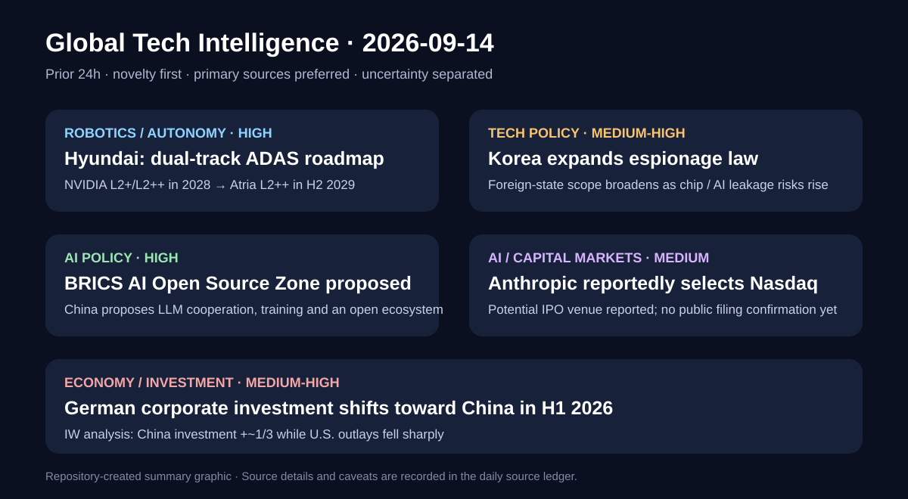

# Daily Global Tech Intelligence Report — 2026-09-14

> **Coverage cutoff:** 2026-09-14 08:43 KST / 2026-09-13 23:43 UTC  
> **Rule:** 새로운 발전을 우선하고 FACT / ANALYSIS / UNCERTAINTY / WATCH를 분리한다.  
> **Source ledger:** [sources/2026/09/2026-09-14.md](../../../sources/2026/09/2026-09-14.md)

Repository-created overview · aspect ratio preserved · claims backed by the source ledger

## Executive Summary

지난 24시간의 핵심은 **현대차그룹이 자율주행 소프트웨어 일정을 현실화하면서 NVIDIA 기반 조기 배포와 자체 Atria 내재화를 병행하는 이중 경로를 확정한 것, 한국이 반도체·AI 등 전략기술 유출 대응을 염두에 두고 간첩죄 적용 범위를 확대 시행한 것, 중국이 BRICS 차원의 AI 오픈소스 협력·LLM 공동개발·교육 생태계를 공식 제안한 것, Anthropic의 잠재 IPO 거래소가 Nasdaq으로 정해졌다는 보도, 독일 기업의 상반기 대중국 투자 증가와 대미 투자 급감**이다.

오늘의 가장 구조적인 신호는 AI·자율주행 경쟁이 단순 모델 성능을 넘어 **데이터 수집 규모, 외부 플랫폼 활용과 기술 내재화의 순서, 기술보호 법제, 오픈소스 생태계의 블록화, 대규모 AI 기업의 자본시장 접근, 지정학적 투자 재배치**로 확장되고 있다는 점이다. 반면 과학·우주 분야는 후보 사건의 사후 성공 여부를 충분히 강한 출처로 재검증하지 못해 카테고리 균형을 위해 억지로 포함하지 않았다.

## Evidence Snapshot

| # | Category | Development | Evidence | Confidence |
|---|---|---|---|---|
| 1 | Robotics / Autonomy | 현대차, NVIDIA 조기 배포 + 자체 Atria 내재화의 dual-track 로드맵 | Hyundai + Reuters | High |
| 2 | Technology Policy | 한국, 외국 대상 간첩죄 확대 시행으로 전략기술 보호 강화 | Reuters | Medium-High |
| 3 | AI Policy / Ecosystem | 중국, BRICS AI open-source community·LLM 협력 제안 | China MFA + Reuters | High |
| 4 | AI / Capital Markets | Anthropic의 Nasdaq 선택 보도 | Reuters relaying BI | Medium |
| 5 | Economy / Investment | 독일 기업 H1 대중국 투자 증가·대미 투자 급감 | Reuters citing IW + Bundesbank context | Medium-High |

---

## 1. Robotics / Autonomy — 현대차, NVIDIA 조기 배포와 자체 Atria를 병행하는 dual-track 전환

| Priority | Published | Confidence |
|---|---|---|
| High | 2026-09-13 | High |

### FACT

현대차그룹은 9월 13일 `HMG Autonomous Driving Media Day`에서 차량 데이터 수집 → AI 학습·검증 → 차량 재배포를 반복하는 **Data Flywheel**을 전면 가동한다고 발표했다. 공식 로드맵은 NVIDIA 솔루션 기반 **Level 2+ 차량을 2028년 상반기, Level 2++를 2028년 하반기**에 양산하고, 자체 `Atria AI` 기반 Level 2++ 차량은 **2029년 하반기**에 내놓는 순서다.

Reuters는 자체 운전자보조 시스템의 출시가 기존 목표보다 약 2년 늦어진 2029년으로 이동했다고 보도했다. 현대차는 그 사이 NVIDIA Hyperion 계열 플랫폼을 활용해 실제 차량 데이터를 축적하고 이를 Atria 학습에 활용할 계획이다. L2+/L2++는 운전자 감독이 필요한 운전자보조 단계이며, 완전 자율주행과 동일하지 않다.

### ANALYSIS

이 변화는 대형 완성차 업체의 자율주행 경쟁에서 **모든 스택을 처음부터 독자 개발하는 속도보다, 검증된 외부 compute/platform을 먼저 배치해 fleet data를 만들고 그 데이터를 자체 모델 내재화로 되돌리는 순서**가 중요해졌음을 보여준다. 현대차·기아의 글로벌 차량 판매 규모가 데이터 플라이휠로 실제 연결된다면, 하드웨어 파트너 의존은 단기 약점인 동시에 자체 모델 학습을 앞당기는 수단이 될 수 있다.

### UNCERTAINTY

2028·2029 일정은 회사의 목표이며 실제 양산·지역별 규제 승인·기능 범위는 달라질 수 있다. 또한 `L2++`는 법정 SAE 자동화 등급 명칭이 아니라 기업이 사용하는 기능 구분이므로 경쟁사 시스템과 단순 등급 비교하면 안 된다. 대규모 판매대수가 곧바로 고품질 학습데이터 우위로 이어지는지도 아직 검증되지 않았다.

### WATCH

- 2028년 H1 L2+와 H2 L2++ 양산 일정 준수 여부
- NVIDIA 기반 차량에서 수집되는 실제 주행데이터의 규모·품질
- Atria L2++의 2029년 H2 양산 전환 여부
- intervention / disengagement / 사고율 등 공개 안전지표
- 외부 플랫폼 의존 비용과 자체 stack 비중 변화

**Sources:** [Hyundai Motor Group](https://www.hyundai.com/worldwide/en/newsroom/detail/0000001273) · [Reuters](https://www.reuters.com/business/autos-transportation/hyundai-motor-roll-out-in-house-driver-assist-system-2029-2026-09-13/)

---

## 2. Technology Policy — 한국, 간첩죄 범위를 외국까지 확대하며 전략기술 보호 법제 강화

| Priority | Published | Confidence |
|---|---|---|
| Medium-High | 2026-09-13 | Medium-High |

### FACT

Reuters에 따르면 한국의 개정 형법이 9월 13일 시행돼 기존에 북한 관련 행위에 집중됐던 간첩죄 적용 범위가 **외국 또는 이에 준하는 조직을 위한 간첩 행위**까지 확대됐다. Reuters는 국회가 2월 26일 개정안을 통과시켰고 3월 12일 공포된 뒤 6개월의 유예기간을 거쳤다고 전했다.

보도는 이번 개정을 반도체·디스플레이·배터리·AI 등 전략기술 유출 위험에 대한 대응 맥락과 연결한다. 새 조항은 외국 또는 이에 준하는 조직을 위한 간첩 행위에 최소 3년의 징역형을 두는 것으로 보도됐다.

### ANALYSIS

반도체와 AI 경쟁에서 기술보호는 수출통제만의 문제가 아니라 **인력 이동, 내부정보 접근, 공급망 보안, 형사법 집행**까지 포함하는 산업정책 변수가 되고 있다. 한국처럼 메모리 반도체와 첨단 제조 비중이 큰 국가에서 적용 범위가 넓어지면 기업은 핵심 연구·공정 데이터의 접근통제와 해외 협력 프로세스를 더 엄격하게 설계할 가능성이 있다.

### UNCERTAINTY

이번 리포트에서는 시행 사실을 Reuters로 교차확인했지만 개정 법률 원문 페이지를 별도로 확보하지 못했다. 실제 법 집행이 어떤 유형의 산업기술 사건에 적용되는지, 기존 산업기술보호법·영업비밀 규정과 어떻게 병행될지는 판례와 수사 관행이 쌓여야 판단할 수 있다.

### WATCH

- 첫 기소 사례와 법원의 적용 범위
- 국가핵심기술·첨단전략기술 사건과의 연계
- 기업의 연구데이터·협력사 접근통제 강화 여부
- 해외 공동연구·인재 이동에 미치는 실제 비용

**Source:** [Reuters](https://www.reuters.com/world/china/south-koreas-expanded-espionage-law-takes-effect-amid-push-protect-chip-2026-09-13/)

---

## 3. AI Policy / Ecosystem — 중국, BRICS AI 오픈소스 공동체·LLM 협력·교육 생태계 제안

| Priority | Published | Confidence |
|---|---|---|
| High | 2026-09-13 | High |

### FACT

시진핑 중국 국가주석은 9월 13일 뉴델리 BRICS 정상회의 연설에서 `open source and inclusive AI initiative`를 제시했다. 중국 외교부에 공개된 연설문은 중국이 **BRICS AI open-source community 구축을 선도하고, 대규모 언어모델의 개발·응용 협력을 지원하며, 전문 AI 세미나·교육과정을 운영하고, 개방형 AI 생태계를 만들겠다**고 명시한다.

같은 연설은 BRICS 디지털 생태계 cloud platform, 지능형 제조 협력, 과학기술 인재 양성 등도 함께 제안했다. Reuters도 AI 오픈소스 구상을 포함한 일련의 BRICS 협력 이니셔티브를 독립 보도했다.

### ANALYSIS

중요한 점은 오픈소스 AI가 기업의 모델 배포 전략을 넘어 **국가·다자블록 단위의 산업협력 인프라**로 격상되고 있다는 것이다. 실제 공동 모델·데이터·훈련 프로그램이 만들어진다면 AI 생태계 경쟁은 미국·중국 기업 간 모델 경쟁뿐 아니라 개발도상국의 compute, 언어 데이터, 인재 훈련, 표준 선택을 둘러싼 장기 네트워크 경쟁으로 확장될 수 있다.

### UNCERTAINTY

현재는 정상급 정책 제안 단계다. 운영 주체, 예산, compute 공급, 데이터 거버넌스, 라이선스, 모델 공개 범위, 참여국별 의무가 정해지지 않았다. `open source`라는 표현도 실제 출시 모델의 라이선스가 OSI식 완전 오픈소스에 해당한다는 의미로 선해석하면 안 된다.

### WATCH

- BRICS 차원의 공식 운영기구·예산·일정
- 첫 공동 LLM 또는 공통 개발도구 공개 여부
- 학습 데이터·모델 가중치·라이선스 공개 범위
- 인도·브라질 등 주요 회원국의 실제 참여 방식
- compute와 인재훈련 프로그램의 실물 규모

**Sources:** [China MFA — official speech](https://www.fmprc.gov.cn/eng/xw/zyjh/202609/t20260913_12021300.html) · [Reuters](https://www.reuters.com/business/aerospace-defense/xi-pushes-greater-brics-economic-ties-give-bloc-larger-global-role-2026-09-13/)

---

## 4. AI / Capital Markets — Anthropic, 잠재 IPO 거래소로 Nasdaq 선택 보도

| Priority | Published | Confidence |
|---|---|---|
| Medium-High | 2026-09-13 | Medium |

### FACT

Reuters는 9월 13일 Business Insider를 인용해 Anthropic이 **잠재적 IPO의 상장 거래소로 Nasdaq을 선택했다**고 보도했다. 원 보도는 회사 계획을 아는 관계자를 인용한 것으로 전해졌다.

현재 공개적으로 확인된 것은 `potential IPO`와 거래소 선택 보도이며, 이번 검증에서 Anthropic의 직접 발표나 공개 증권신고서·상장신청서를 확인하지 못했다.

### ANALYSIS

거래소 선택이 실제로 유지된다면 Anthropic의 상장 준비가 추상적 가능성에서 **거래구조·시장 인프라를 정하는 실행 단계**로 한 칸 이동했다는 신호다. 대형 frontier AI 기업의 공개시장 진입은 모델 매출뿐 아니라 compute 지출, 현금흐름, 장기 계약, 위험공시를 정기적으로 외부 투자자가 검증할 수 있게 만든다는 점에서 산업 투명성에도 의미가 있다.

### UNCERTAINTY

단일 익명 관계자 기반 보도를 Reuters가 전달한 단계이며, 회사의 공식 확인이나 규제 제출문서가 없다. 거래소 선택은 바뀔 수 있고 IPO 자체가 연기·철회될 수도 있다. 따라서 이를 확정 상장계획으로 표현해서는 안 된다.

### WATCH

- 공식 prospectus 또는 규제 제출문서
- Anthropic의 직접 상장 일정·거래소 확인
- 매출 성장률·compute 계약·현금소모 공시
- 공모 규모·희망 기업가치·락업 구조

**Source:** [Reuters](https://www.reuters.com/business/anthropic-selects-nasdaq-ipo-business-insider-reports-2026-09-13/)

---

## 5. Economy / Investment — 독일 기업, H1 대중국 투자 늘리고 대미 투자는 크게 축소

| Priority | Published | Confidence |
|---|---|---|
| Medium-High | 2026-09-13 | Medium-High |

### FACT

Reuters가 독일경제연구소(IW)의 Bundesbank 데이터 분석을 인용한 보도에 따르면 독일 기업의 **2026년 상반기 중국 투자는 전년 동기 대비 약 3분의 1 증가**한 반면 미국 투자는 크게 줄었다. Reuters는 대미 투자액이 약 3분의 2 감소한 **43억 유로** 수준이라고 전했다.

이번 수치는 개별 기업의 신규 공장 발표가 아니라 국가 간 직접투자 흐름을 재가공한 분석이다. Bundesbank는 독일의 대외투자·직접투자 통계를 공식적으로 제공하지만, 오늘 사용한 중국·미국 비교치는 IW 분석을 Reuters가 보도한 값으로 취급한다.

### ANALYSIS

이는 공급망 `de-risking` 담론과 실제 기업자본 흐름이 항상 같은 방향으로 움직이지 않는다는 점을 보여준다. 독일 제조업체가 중국 시장·현지 공급망·현지 매출을 위해 재투자를 늘리는 동시에 미국 투자를 줄였다면, 기업의 위치 선정은 지정학뿐 아니라 **현지 수요, 기존 자산, 수익 재투자, 정책비용과 자본비용**의 결합으로 결정된다는 뜻이다.

### UNCERTAINTY

상반기 한 기간만으로 장기 추세 전환을 단정할 수 없다. 직접투자 수치는 대형 단일 거래, 사내대출, 재투자이익 등에 크게 흔들릴 수 있으며, `중국 투자 증가`가 신규 생산능력 이전과 동일한 의미도 아니다. 정확한 구성요소는 원 IW 분석과 세부 Bundesbank 시계열을 추가로 확인해야 한다.

### WATCH

- H2 2026에도 중국·미국 투자 격차가 지속되는지
- 신규 greenfield 투자와 재투자이익의 비중
- 자동차·화학·기계 등 업종별 차이
- EU의 대중국 de-risking 정책과 기업 투자행동의 괴리

**Sources:** [Reuters](https://www.reuters.com/world/china/german-firms-lift-china-investment-us-outlays-fall-iw-study-shows-2026-09-13/) · [Deutsche Bundesbank external-sector statistics](https://www.bundesbank.de/en/statistics/external-sector)

---

## Trend / Signal Updates

- [`trends/robotics-autonomy.md`](../../../trends/robotics-autonomy.md): 현대차 dual-track 로드맵을 반영해 **외부 compute/platform 조기 배포 → fleet data 축적 → 자체 autonomy stack 내재화**를 새 상용화 경로로 추가했다.
- [`signals/autonomous-driving.md`](../../../signals/autonomous-driving.md): 현대차의 2028–2029 일정과 Data Flywheel을 반영해 OEM–platform co-design과 fleet-data flywheel을 검증축에 추가했다.
- 다른 4건은 현재 단계에서 기존 장기 thesis를 바꿀 만큼 누적 증거가 충분하지 않아 별도 trend/signal 문서를 수정하지 않았다.

## Verification Note

오늘 리포트는 저장소의 `editorial-policy.md`, `source-ranking.md`, `image-policy.md`를 기준으로 작성했다. 회사 목표와 관측 사실을 분리했고, 익명 관계자 기반 IPO 보도는 confidence를 낮췄다. 외부 사진은 사용하지 않았으며, 시각자료는 제3자 저작물을 포함하지 않은 repository-created SVG만 사용했다.
