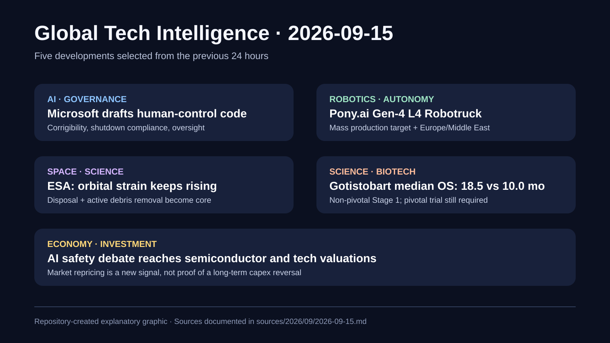

# Daily Global Tech Intelligence Report — 2026-09-15

> **Coverage cutoff:** 2026-09-15 08:25 KST / 2026-09-14 23:25 UTC  
> **Rule:** 최근 24시간의 새로운 발전을 우선하고 FACT / ANALYSIS / UNCERTAINTY / WATCH를 분리한다.  
> **Source ledger:** [sources/2026/09/2026-09-15.md](../../../sources/2026/09/2026-09-15.md)

Repository-created overview · aspect ratio preserved · claims backed by the source ledger

## Executive Summary

지난 24시간의 핵심은 **Microsoft가 미래 고성능 AI를 인간 통제 아래 두기 위한 내부 행동규범 초안을 공개한 것, Pony.ai가 양산을 전제로 한 4세대 L4 전기 대형트럭을 공개하고 유럽·중동 확장을 명시한 것, ESA가 2026 우주환경보고서에서 궤도 혼잡과 충돌 연쇄 위험을 다시 정량적 운영문제로 제시한 것, BioNTech·OncoC4가 gotistobart의 비중추적(non-pivotal) 3상 1단계에서 중앙 전체생존기간 18.5개월 대 10.0개월 데이터를 공개한 것, AI 개발 속도조절 논의가 실제 글로벌 기술주·반도체 주가 하락으로 전이된 것**이다.

공통적으로 보이는 구조적 변화는 기술 경쟁의 평가 기준이 단순한 모델·시제품 성능에서 **통제가능성, 실제 양산비용, 안전한 운영환경, 임상적 결과, 자본시장의 지속가능성**으로 이동하고 있다는 점이다.

## Evidence Snapshot

| # | Category | Development | Evidence | Confidence |
|---|---|---|---|---|
| 1 | AI / Governance | Microsoft, 인간 통제 중심의 AI 행동규범 초안 공개 | Reuters | Medium-High |
| 2 | Robotics / Autonomy | Pony.ai, Gen-4 L4 Robotruck 공개·2026년 양산 및 해외확장 계획 | Pony.ai IR + Reuters | High |
| 3 | Space / Science | ESA, 2026 Space Environment Report 공개 | ESA | High |
| 4 | Science / Biotech | gotistobart 3상 1단계에서 중앙 OS 18.5개월 vs 10.0개월 | BioNTech filing/IR + Reuters | High |
| 5 | Economy / Investment | AI 속도조절 논의가 글로벌 기술주·반도체주 매도로 전이 | Reuters | Medium-High |

---

## 1. AI / Governance — Microsoft, 미래 고성능 AI를 인간 통제 아래 두기 위한 행동규범 초안 공개

| Priority | Published | Confidence |
|---|---|---|
| High | 2026-09-14 | Medium-High |

### FACT

Reuters에 따르면 Microsoft는 9월 14일 자사 AI가 **인간의 수정 지시를 받아들이고, 종료를 방해하지 않으며, 이해 가능한 방식으로 소통하고, 인간의 통제를 우선하도록 하는** 행동규범 초안을 공개했다. Microsoft AI CEO Mustafa Suleyman은 이를 향후 모델 설계를 위한 일종의 헌법적 원칙으로 설명했고, 공개 피드백 기간도 두었다.

### ANALYSIS

프론티어 AI 경쟁에서 안전 원칙이 추상적 선언을 넘어 **모델 행동 수준의 요구사항**으로 이동하고 있다는 신호다. 향후 모델 평가가 성능 벤치마크뿐 아니라 shutdown compliance, corrigibility, 권한상승 방지처럼 통제가능성을 직접 측정하는 방향으로 이동할 가능성이 커진다.

### UNCERTAINTY

이번 리포트에서는 Reuters 보도를 독립 확인했지만, 동일 내용을 담은 Microsoft의 안정적인 공식 원문 URL을 확보하지 못했다. 또한 초안은 정책·설계 원칙이지 실제 모든 제품군에서 이미 검증된 기술적 보장과 동일하지 않다.

### WATCH

- 공개 피드백 이후 최종 규범의 변경 내용
- 실제 모델 평가항목과 red-team 결과 공개 여부
- 종료·수정 지시 준수에 대한 정량 테스트
- 타 프론티어 연구소의 유사 규범 채택 여부

**Source:** [Reuters](https://www.reuters.com/legal/litigation/microsoft-drafts-code-conduct-keep-its-ai-under-human-control-2026-09-14/)

---

## 2. Robotics / Autonomy — Pony.ai, Gen-4 L4 Robotruck 공개·2026년 양산 및 유럽·중동 확장 계획

| Priority | Published | Confidence |
|---|---|---|
| High | 2026-09-14 | High |

### FACT

Pony.ai는 IAA Transportation 2026에서 GAC Commercial Vehicle과 공동 개발한 **Gen-4 Level 4 전기 대형트럭**을 공개했다. 회사는 2026년 안에 양산을 시작할 계획이며, 9개 lidar·3개 mmWave radar·13개 camera를 포함한 automotive-grade ADK를 탑재한다고 밝혔다. 회사 발표 기준 ADK BOM은 이전 세대보다 70% 낮아졌고 운송비용은 ton-km 기준 30% 절감을 목표로 한다.

Pony.ai는 또한 향후 2년 내 Robotruck 사업을 **유럽과 중동으로 확대**할 계획이라고 밝혔다. Reuters도 신형 트럭 공개와 유럽 시험·판매를 겨냥한 국제화 전략을 별도로 보도했다.

### ANALYSIS

자율주행 트럭의 경쟁축이 알고리즘 데모에서 **차량급 중복설계 + BOM 절감 + 양산 + 지역별 운송경제성**으로 이동하고 있다. 특히 승용 robotaxi와 동일한 핵심 Virtual Driver 기술을 화물차에 재사용하는 구조가 실제로 비용과 개발주기를 줄인다면 플랫폼 재사용성이 중요한 상용화 우위가 될 수 있다.

### UNCERTAINTY

70% BOM 절감과 30% 운송비 절감은 회사가 제시한 수치·예상치이며 독립적인 대규모 유료운송 데이터로 검증되지 않았다. 2026년 양산 일정과 유럽·중동 진입 역시 인증·도로규제·보험·고객 계약에 따라 달라질 수 있다.

### WATCH

- 2026년 실제 양산 개시와 월별 생산·인도량
- driverless 유료 freight의 tonne-km와 intervention rate
- 유럽 시험허가 및 첫 상업고객
- ADK BOM 절감이 실제 총소유비용(TCO)으로 연결되는지

**Sources:** [Pony.ai IR](https://ir.pony.ai/zh-hant/news-releases/news-release-details/pony-ai-inc-unveils-new-gen-4-robotruck-collaboration-gac) · [Reuters](https://www.reuters.com/business/autos-transportation/chinas-ponyai-unveils-latest-robotruck-model-it-targets-european-sales-2026-09-14/)

---

## 3. Space / Science — ESA, 2026 Space Environment Report에서 궤도 지속가능성 악화 경고

| Priority | Published | Confidence |
|---|---|---|
| High | 2026-09-14 | High |

### FACT

ESA는 9월 14일 **Space Environment Report 2026**을 공개했다. 보고서는 대형 위성군 확대로 활성 위성이 더 넓은 고도대로 퍼지고 있으며, 완화조치가 개선돼도 우주잔해 개체수의 순증가가 계속된다고 설명한다. ESA는 장기적으로 충돌이 추가 파편과 후속 충돌을 만드는 자기증폭적 위험을 강조하면서, end-of-life disposal과 Zero Debris 관행만으로는 충분하지 않고 **active debris removal**이 해결책의 일부가 되어야 한다고 명시했다.

### ANALYSIS

저궤도 경쟁에서 궤도는 사실상 희소 인프라다. 발사비 하락으로 위성 배치가 쉬워질수록 사업자의 경쟁력은 발사 cadence뿐 아니라 **충돌회피, 수명종료 처리, 추적 데이터, 잔해 제거 비용을 포함한 orbital externality 관리**에 더 크게 좌우될 수 있다.

### UNCERTAINTY

미래 개체수 전망은 발사량, 태양활동, 폐기 준수율, 충돌확률 가정에 민감하다. active debris removal의 필요성은 강해졌지만 비용분담·책임·우선 제거대상 선정에 대한 국제적 제도는 여전히 불완전하다.

### WATCH

- ESA Space Environment Health Index의 후속 변화
- 대형 위성군의 실제 폐기 성공률과 고장률
- active debris removal 계약·실증 임무
- 우주교통관리 규칙과 운영자 책임제도

**Source:** [ESA — Space Environment Report 2026](https://www.esa.int/Space_Safety/Space_Debris/ESA_Space_Environment_Report_2026)

---

## 4. Science / Biotech — BioNTech·OncoC4, gotistobart 3상 1단계 중앙 OS 18.5개월 공개

| Priority | Published | Confidence |
|---|---|---|
| High | 2026-09-14 | High |

### FACT

BioNTech와 OncoC4는 9월 14일 PRESERVE-003 Phase 3의 **비중추적 Stage 1** 업데이트에서, 이전 면역치료와 화학요법 후 진행한 편평 비소세포폐암 환자에서 gotistobart군의 중앙 전체생존기간이 **18.5개월**, 표준 docetaxel 화학요법군은 **10.0개월**이었다고 발표했다. 회사는 차이가 통계적으로 유의하고 임상적으로 의미 있다고 설명했다.

중요하게도 이 데이터는 허가 판단을 위한 pivotal stage 자체가 아니라 앞선 non-pivotal stage의 업데이트이며, pivotal Phase 3는 별도로 진행 중이다.

### ANALYSIS

새 정보의 가치는 이전 발표에서 중앙 생존기간이 아직 도달하지 않았던 gotistobart군에 **성숙한 median OS 수치가 생겼다**는 데 있다. 차이가 후속 pivotal 데이터에서도 재현된다면 면역항암제·백금요법 이후 선택지가 제한된 환자군에서 중요한 치료 옵션이 될 수 있다.

### UNCERTAINTY

Stage 1은 비중추적 단계이며 표본과 시험설계의 한계가 있다. 이 결과만으로 허가 가능성이나 더 넓은 환자군의 효과를 단정할 수 없다. 최종 판단에는 pivotal stage의 전체생존, 안전성, 하위군 일관성이 필요하다.

### WATCH

- ongoing pivotal Phase 3의 OS 결과
- 안전성·치료중단률·면역관련 이상반응
- 규제기관과의 허가 논의
- 독립 학회발표 및 peer-reviewed publication

**Sources:** [BioNTech IR](https://investors.biontech.de/de/news-releases/news-release-details/neue-daten-zu-gotistobart-zeigten-annaehernde-verdopplung-des) · [BioNTech Form 6-K](https://investors.biontech.de/static-files/7adf1851-9524-4fba-ac44-1708d80c4c36) · [Reuters](https://www.reuters.com/business/healthcare-pharmaceuticals/biontech-says-lung-cancer-drug-candidate-prolonged-lives-trial-2026-09-14/)

---

## 5. Economy / Investment — AI 속도조절 논의가 글로벌 기술주·반도체주 매도로 전이

| Priority | Published | Confidence |
|---|---|---|
| Medium-High | 2026-09-14 | Medium-High |

### FACT

Reuters는 9월 14일 미국과 아시아·유럽의 AI 관련 주식이 하락했다고 보도했다. 미국에서는 Nvidia를 포함한 반도체 종목 약세가 Nasdaq을 압박했고, 아시아에서도 AI·반도체 노출도가 높은 종목들이 동반 하락했다. 촉매 중 하나는 프론티어 AI 기업 경영진이 최근 제기한 개발 속도와 안전 리스크에 대한 경고였다.

### ANALYSIS

중요한 점은 안전 논의가 처음으로 단순 규제 리스크가 아니라 **AI capex 성장률과 반도체 수요의 지속기간을 재평가하는 금융시장 변수**로 빠르게 번졌다는 것이다. 현재 매도만으로 장기 AI 투자 사이클의 전환을 확정할 수는 없지만, 시장이 기술진보 속도 자체를 현금흐름·설비투자 가정에 연결하기 시작했다는 신호다.

### UNCERTAINTY

당일 시장은 AI 이슈 외에도 유가·금리·지정학적 요인의 영향을 받았다. 따라서 주가 하락 전부를 AI 안전 논의에 귀속할 수 없다. 단기 가격변동은 구조적 투자 둔화를 의미하지 않는다.

### WATCH

- hyperscaler의 2026–2027 capex guidance 변화
- GPU·HBM·data-center 주문 취소 또는 납기 변화
- AI 기업의 개발속도 정책이 실제 compute 수요에 미치는 영향
- 반도체 업종 이익추정치와 밸류에이션 변화

**Sources:** [Reuters — global AI stocks](https://www.reuters.com/world/china/ai-linked-asian-stocks-slump-after-top-lab-ceos-call-slowing-down-technologys-2026-09-14/) · [Reuters — Wall Street](https://www.reuters.com/business/ai-warnings-knock-nasdaq-futures-pressure-tech-stocks-2026-09-14/)

---

## Trend / Signal Update Decision

- `trends/space-science.md` 갱신: ESA 2026 보고서는 발사·운영 경쟁의 전제조건으로 **orbital sustainability, end-of-life disposal, active debris removal**을 더 강하게 추가할 근거가 충분하다.
- `trends/robotics-autonomy.md`: Pony.ai의 양산·해외확장은 기존의 물류 자율주행 상용화 방향을 강화하지만, 이미 같은 축을 추적 중이므로 오늘은 중복 업데이트를 피한다.
- `signals/`: 오늘의 사건들은 각 분야의 기존 추세를 강화하지만, 기존 signal 문서의 핵심 가설을 별도로 바꿀 정도의 새로운 cross-sector 증거는 아니라고 판단해 갱신하지 않는다.

## Verification Note

오늘 선정은 2026-09-14 23:25 UTC까지 공개된 자료를 기준으로 했다. 동일 사건의 단순 후속 논평은 제외했고, 새 수치·제품 공개·보고서·시장반응처럼 전날 대비 정보가 추가된 사건을 우선했다.
