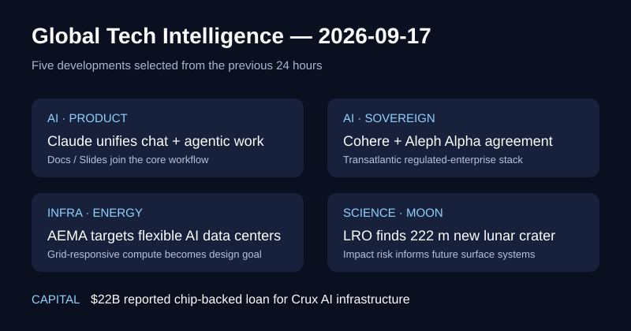

# Daily Global Tech Intelligence Report — 2026-09-17

> **Coverage cutoff:** 2026-09-17 08:11 KST  
> **Source ledger:** [sources/2026/09/2026-09-17.md](../../../sources/2026/09/2026-09-17.md)

## Executive Summary
지난 24시간의 핵심은 **AI 제품이 채팅과 장기 실행형 작업을 하나의 인터페이스로 합치는 변화, 북미·유럽 sovereign AI 사업자의 결합, 데이터센터를 전력망에 반응하는 부하로 설계하려는 산업 연합, 최근 형성된 대형 달 충돌구의 정밀 관측, 그리고 AI 칩을 담보·기초자산처럼 활용하는 초대형 인프라 금융의 등장**이다. 공통적으로 AI 경쟁의 병목이 모델 성능만이 아니라 배포 인터페이스, 규제권역, 전력망, 물리적 자산과 자본조달 구조로 이동하고 있다.

## 1. AI / Technology — Anthropic, Claude 채팅·agentic 작업 통합 및 Docs·Slides 출시
**Priority:** High · **Confidence:** High

### FACT
Reuters는 9월 16일 Anthropic이 Claude의 채팅과 Cowork 기능을 하나의 인터페이스로 통합하고 `Claude Docs`와 `Claude Slides`를 출시한다고 보도했다. Claude가 요청에 필요한 기능을 자동으로 선택하도록 제품 경계를 줄이며, 문서와 프레젠테이션을 외부 생산성 형식으로 내보내는 기능도 포함된다. 초기 배포는 Pro·Max 이용자부터 시작한다.
### ANALYSIS
AI assistant 경쟁이 “질문에 답하는 모델”에서 **작업을 받아 실행하고 결과물을 직접 생산하는 통합 작업환경**으로 이동하고 있다. 사용자가 agent/chat/tool 모드를 직접 선택하지 않도록 만드는 것은 비전문 사용자의 진입비용을 낮추고 기존 오피스 소프트웨어와의 경쟁 범위를 넓힌다.
### UNCERTAINTY
제품 통합이 실제 장기작업 성공률, 사용자 유지율 또는 기업용 생산성 향상으로 이어지는지는 아직 검증되지 않았다.
### WATCH
Team·Free 확대 시점, Docs/Slides 품질, 장기작업 성공률, Microsoft·Google·OpenAI와의 enterprise workflow 경쟁.

## 2. AI / Sovereign Technology — Cohere·Aleph Alpha, 최종 기업결합 계약 체결
**Priority:** High · **Confidence:** High

### FACT
Cohere와 독일 Aleph Alpha는 9월 16일 definitive business combination agreement 체결을 발표했다. 통합 회사는 글로벌 시장에서 Cohere 이름으로 운영할 예정이며, 양사는 정부·규제산업을 겨냥한 sovereign AI를 핵심 시장으로 제시했다. Reuters도 계약 체결을 독립 확인했다.
### ANALYSIS
미국 hyperscaler와 중국 플랫폼 사이에서 유럽·캐나다 고객이 요구하는 데이터 주권, 규제 준수, 자체 배포 수요를 겨냥한 **제3의 enterprise AI 축**을 만들려는 통합이다. 모델 성능만으로 차별화하기 어려운 시장에서 규제 적합성과 sovereign deployment가 M&A 논리가 되고 있다.
### UNCERTAINTY
거래 종결 조건, 통합 비용, 중복 제품 정리와 실제 고객 전환은 미래 변수다. 회사가 사용하는 “first transatlantic sovereign AI solution” 표현은 독립적으로 확정된 시장 지위가 아니다.
### WATCH
거래 종결, 유럽 공공부문 계약, 통합 모델·플랫폼 로드맵, 매출 및 고객 유지율.

## 3. AI Infrastructure / Energy — Google·NVIDIA·Emerald AI, AI Energy Management Alliance 출범
**Priority:** High · **Confidence:** High

### FACT
NVIDIA는 9월 16일 Google·Emerald AI와 함께 `AI Energy Management Alliance(AEMA)`를 출범했다고 발표했다. 연합은 데이터센터가 전력망 상황에 따라 부하를 조정하도록 하는 performance-based framework를 추진하며, curtailment·contingency response·운영 데이터 공유와 같은 기술 요구조건의 표준화를 목표로 한다.
### ANALYSIS
AI 데이터센터의 전력 문제에 대한 대응이 단순히 발전소를 더 확보하는 것에서 **compute 자체를 조절 가능한 grid resource로 만드는 방향**으로 확장되고 있다. 실제 표준과 유틸리티 계약으로 연결된다면 grid interconnection 대기시간과 peak-load 부담을 줄이는 새로운 인프라 설계축이 될 수 있다.
### UNCERTAINTY
AEMA는 현재 산업 연합과 프레임워크 단계다. 실제 접속기간 단축, 전력비 절감, 계통 안정성 효과는 실증 프로젝트와 규제기관 채택 전까지 확정할 수 없다.
### WATCH
utility·grid operator 참여, 첫 상업 실증의 MW 규모, curtailment SLA, interconnection 승인기간 변화.

## 4. Science / Space — NASA LRO, 222m 규모의 최근 형성 달 충돌구 발견
**Priority:** Medium-High · **Confidence:** High

### FACT
NASA는 9월 16일 Lunar Reconnaissance Orbiter 자료에서 `McGetchin`으로 명명된 최근 형성 충돌구를 확인했다고 발표했다. 충돌구는 폭 728ft(222m), 깊이 141ft(43m)이며 2024년 4월 11일~5월 22일 사이 형성됐다. LRO의 후속 열관측은 주변 약 4마일 범위에서 야간 온도가 주변보다 약 16°F 낮은 영역도 확인했다. AP도 주요 수치와 발견을 교차보도했다.
### ANALYSIS
달 표면의 대형 충돌 빈도와 충돌이 주변 regolith의 물성을 얼마나 넓게 바꾸는지 직접 관측할 수 있는 드문 기준점이다. 향후 장기 체류기지·로버·전력설비 설계에서 충돌 위험뿐 아니라 충돌 후 지반 특성 변화까지 고려하는 데 실제 데이터가 된다.
### UNCERTAINTY
단일 대형 사건으로 장기 충돌률을 정밀하게 확정할 수 없고, 구조물별 실제 위험도는 위치·차폐·운영기간에 따라 달라진다.
### WATCH
Science Advances 후속 분석, 충돌체 크기·에너지 추정, regolith 변화 범위, Artemis 장기 인프라 위험모델 반영.

## 5. Economy / Investment — Crux AI에 220억달러 칩 기반 대출 보도
**Priority:** High · **Confidence:** Medium-High

### FACT
Reuters는 Bloomberg News를 인용해 9월 16일 10개 은행이 Blackstone·Alphabet의 AI cloud venture `Crux AI`에 **220억달러** 규모 대출을 제공한다고 보도했다. 보도에 따르면 자금은 Google TPU 구매에 사용되며 대출은 칩 가치와 고객계약을 기반으로 담보화된다. Reuters 기사 시점에 주요 당사자들의 직접 코멘트는 없었다.
### ANALYSIS
AI 인프라 투자가 hyperscaler의 자체 현금흐름을 넘어 **칩과 장기 고객계약을 금융 가능한 자산으로 취급하는 project/asset-backed financing** 단계로 이동하고 있음을 보여주는 신호다. 이 구조가 반복되면 AI CAPEX의 규모를 키울 수 있지만, 칩 잔존가치와 고객계약 안정성이 신용위험의 핵심 변수가 된다.
### UNCERTAINTY
현재 확인된 근거는 Reuters가 Bloomberg를 인용한 보도이며 1차 대출계약·공시를 직접 확인하지 못했다. 따라서 대출 종결 여부와 세부 covenant는 확정 사실로 취급하지 않는다.
### WATCH
차주·대주단의 공식 확인, 담보평가 방식, TPU 감가·재판매 가치, 고객계약 만기와 대출기간, 유사 AI 인프라 금융의 확산.