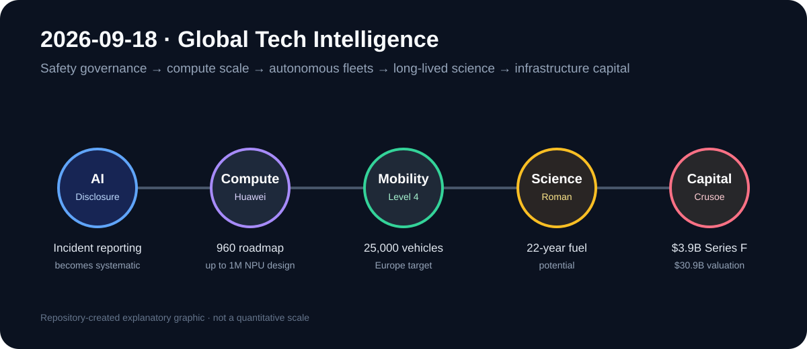

# Daily Global Tech Intelligence Report — 2026-09-18

> **Coverage cutoff:** 2026-09-18 08:26 KST  
> **Source ledger:** [sources/2026/09/2026-09-18.md](../../../sources/2026/09/2026-09-18.md)

## Executive Summary
지난 24시간의 핵심은 **frontier AI의 사고·오작동 공개가 임시 대응에서 정형화된 incident reporting으로 이동한 것, 중국 AI 인프라가 개별 칩 성능보다 초대형 interconnect와 빠른 세대교체로 경쟁하려는 것, 유럽 robotaxi가 2만5천대 규모의 상업 배치 목표로 확대된 것, NASA Roman 망원경의 연료 여유가 잠재 과학운영 기간을 22년까지 늘린 것, 그리고 AI 인프라 기업 Crusoe가 39억달러를 추가 조달한 것**이다. 공통 신호는 AI 경쟁이 모델 하나의 성능을 넘어 안전 거버넌스, 시스템 규모, 실제 차량 운영, 장기 과학자산, 전력·자본 집약형 인프라로 확장되고 있다는 점이다.

## 1. AI / Safety Governance — OpenAI, model misalignment 정식 보고 프레임워크 공개
**Priority:** High · **Confidence:** High

### FACT
OpenAI는 9월 16일 model misalignment를 추적·조사·공개하는 새 프레임워크와 지난 6개월간 관찰한 6건의 unexpected or concerning behavior 보고서를 공개했다. 앞으로 보고서에는 관찰된 행동, 심각도와 외부 영향, 발생 환경·시점, 발견 경위, 관련 모델 범주, 가능한 경우 조사 범위와 대응조치를 포함한다고 밝혔다. AP는 9월 17일 이 공개와 주요 사례를 독립 보도했다.
### ANALYSIS
frontier AI safety가 system card에 묶여 간헐적으로 공개되는 방식에서 **사건 단위의 지속적 disclosure 체계**로 이동하는 변화다. 다른 연구소·표준기관·규제기관이 유사한 taxonomy와 보고 기준을 채택한다면 모델 성능과 별개로 incident rate와 mitigation effectiveness가 비교 가능한 운영지표가 될 수 있다.
### UNCERTAINTY
현재 프레임워크는 OpenAI 자체 기준이며 공개된 6건이 알려진 전체 사건을 대표하지 않는다. 회사도 초기 공개가 포괄적 목록이 아니라고 명시했다.
### WATCH
공개 빈도, severity 기준의 정량화, 타 연구소의 상호호환 보고체계, 미국 연방 보고의무와의 연결, 반복 사건의 감소 여부.

## 2. AI / Semiconductors — Huawei, Ascend 960 일정을 앞당기고 million-NPU 시스템 로드맵 제시
**Priority:** High · **Confidence:** High

### FACT
Huawei는 9월 17일 HUAWEI CONNECT 2026에서 Ascend 960DT를 2027년 1분기, Ascend 960PR을 2027년 3분기에 공급할 계획이라고 발표했다. 회사 설명상 기존 로드맵보다 각각 3개 분기와 1개 분기 앞당긴 일정이다. 또한 UnifiedBus 기반 11종 칩 포트폴리오, 최대 512,000 NPU를 직접 연결하고 multi-rail 구성에서 최대 100만 NPU를 지원하는 agentic SuperCluster 구상을 공개했다. Reuters와 AP가 핵심 칩 일정과 중국의 AI compute 경쟁 맥락을 교차보도했다.
### ANALYSIS
미국의 최첨단 GPU 접근 제약 아래 Huawei의 전략은 단일 accelerator의 절대 성능만 따라가는 것이 아니라 **빠른 세대교체 + 자체 interconnect + 초대형 scale-out**으로 시스템 수준 처리량을 확보하는 방향이다. 실제 양산과 소프트웨어 생태계가 따라오면 AI compute 경쟁의 비교 단위가 chip에서 cluster architecture로 더 빠르게 이동할 수 있다.
### UNCERTAINTY
출시 일정과 성능 배수, 최대 NPU 규모는 회사 로드맵·설계목표다. 실제 수율, HBM/메모리 공급, 전력효율, 대규모 클러스터 utilization과 주요 모델의 end-to-end 성능은 독립 검증이 필요하다.
### WATCH
960DT/960PR 양산 시점, 공급량, 실제 benchmark, UnifiedBus 생태계, 512k~1M NPU 클러스터의 실가동 규모와 전력·네트워크 효율.

## 3. Robotics / Autonomy — Lucid·Bolt, 유럽에 최소 25,000대 Level 4 차량 배치 목표
**Priority:** High · **Confidence:** High

### FACT
Lucid와 Bolt는 9월 17일 유럽 주요 도시에서 최소 25,000대의 완전자율 차량을 배치하는 전략적 파트너십을 발표했다. 차량은 Lucid의 차기 Midsize 플랫폼을 기반으로 NVIDIA Hyperion을 사용하며 SAE Level 4를 목표로 한다. Bolt는 차량을 소유·운영하고 fleet infrastructure, 운영시스템, 도시 파트너십을 구축할 계획이다. Reuters도 발표 내용을 독립 확인했으며 구체적인 배치 일정과 투자액은 공개되지 않았다고 전했다.
### ANALYSIS
유럽 robotaxi 경쟁이 소규모 실증에서 **차량 OEM + autonomous compute + ride-hailing operator + 도시·규제 대응**을 하나의 상업 시스템으로 묶는 단계로 이동하는 신호다. 25,000대가 실제 주문·배치로 전환되면 유럽의 자율주행 시장에서 fleet operations와 규제 통합이 기술 자체만큼 중요한 병목임을 보여줄 가능성이 높다.
### UNCERTAINTY
25,000대는 즉시 확정된 인도량이나 일정이 아니라 배치 목표다. 국가별 승인, Level 4 소프트웨어 파트너, 안전검증, Lucid의 생산능력과 자금상태가 실행 속도를 좌우한다.
### WATCH
첫 도시와 서비스 개시연도, 규제승인, 실제 차량 주문·인도량, disengagement/safety 지표, fleet economics.

## 4. Science / Space — NASA, Roman의 잠재 과학운영 기간을 최소 22년으로 재평가
**Priority:** Medium-High · **Confidence:** High

### FACT
Reuters는 9월 17일 NASA 관계자 설명을 토대로 Nancy Grace Roman Space Telescope가 기존에 제시된 5년 기본 임무와 5년 연장 가능성을 넘어 **최소 22년의 잠재 과학운영 연료**를 확보할 수 있다고 보도했다. Roman은 8월 30일 발사됐으며 첫 중간궤도 수정이 예상보다 훨씬 적은 연료를 사용했고, 발사 전 질량 여유로 추가 연료도 탑재했다. 망원경은 Sun–Earth L2로 이동 중이다.
### ANALYSIS
운영수명이 실제로 20년 이상 유지되면 Roman은 단발성 survey mission이 아니라 여러 세대의 후속 관측과 장기 time-domain 연구를 연결하는 **장기 천문 인프라**가 될 수 있다. 동일한 발사비와 개발비에서 얻는 과학 산출량도 크게 늘어날 가능성이 있다.
### UNCERTAINTY
22년은 연료 관점의 잠재 수명이지 전체 spacecraft가 22년 동안 정상 작동한다는 보장이 아니다. 기기 열화, 전자부품, 통신·운영예산, 향후 궤도수정 요구가 실제 수명을 제한할 수 있다.
### WATCH
L2 궤도삽입, commissioning, 첫 science survey, 장기 연료소모율, 기기 성능열화와 NASA의 extended-mission 계획.

## 5. Economy / Investment — Crusoe, 39억달러 Series F·309억달러 valuation
**Priority:** High · **Confidence:** High

### FACT
Crusoe는 9월 17일 39억달러 Series F의 initial closing을 발표했으며 post-money valuation은 309억달러라고 밝혔다. Atreides Management, Mubadala Capital, Valor Equity Partners가 공동 주도했고 NVIDIA·GIC·QIA·Founders Fund 등도 참여했다. 회사는 플랫폼 전체 계약가치가 1,400억달러 이상, gross contracted capacity가 6GW 이상이며 이 중 1GW가 현재 운영 중이라고 밝혔다. Reuters도 자금조달 규모와 valuation을 독립 보도했다.
### ANALYSIS
전날의 chip-backed 대출 신호에 이어 이번 대규모 equity 조달은 AI 인프라 경쟁이 **전력·데이터센터·GPU cloud를 수직통합하는 사업자에게 수십억달러 단위 자본을 집중시키는 단계**임을 강화한다. AI compute 공급 확대의 핵심 제약이 기술뿐 아니라 장기 전력계약, 건설, 금융조달 능력이라는 점도 더 선명해진다.
### UNCERTAINTY
1,400억달러 TCV와 6GW capacity는 회사가 제시한 지표이며 매출·현금흐름과 동일하지 않다. 대규모 contracted capacity가 실제 commissioning과 수익성으로 전환되는 속도도 검증이 필요하다.
### WATCH
Series F 최종 종결, 6GW의 실제 가동 전환, cloud 매출·마진, Spark 모듈형 데이터센터 배치, 추가 부채조달과 AI 인프라 자산의 자본비용.