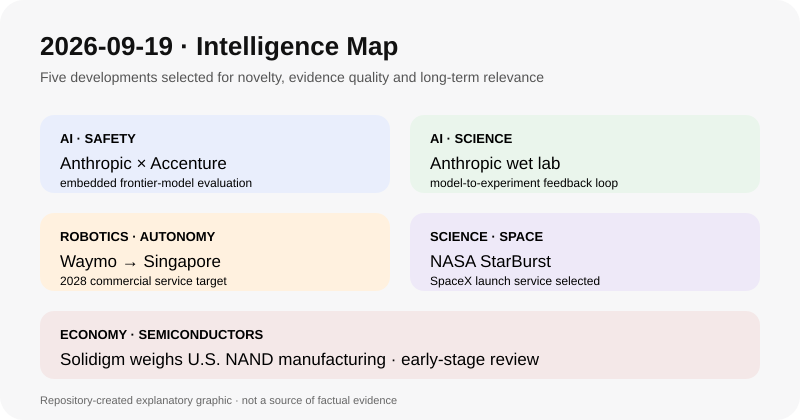

# Daily Global Tech Intelligence Report — 2026-09-19

> **Coverage cutoff:** 2026-09-19 08:56 KST  
> **Source ledger:** [sources/2026/09/2026-09-19.md](../../../sources/2026/09/2026-09-19.md)

## Executive Summary
지난 24시간의 핵심은 **frontier AI 안전평가가 외부 벤치마크에서 연구소 내부의 상시 embedded evaluation으로 이동하기 시작한 것, Anthropic이 wet lab을 구축하며 AI와 실제 생명과학 실험의 결합을 강화한 것, Waymo가 싱가포르를 2028년 상업 robotaxi 진출지로 확정한 것, NASA가 중성자별 병합을 추적할 StarBurst의 발사서비스를 선정한 것, 그리고 SK hynix의 Solidigm이 미국 NAND 생산거점 가능성을 검토하는 것**이다. 공통 신호는 AI·자율주행·과학·반도체 경쟁이 모델과 제품 단위에서 안전감사, 물리적 실험, 규제승인, 발사 인프라, 지정학적 생산거점으로 넓어지고 있다는 점이다.

## 1. AI / Safety Governance — Anthropic·Accenture, frontier AI 내부 embedded evaluation 구축
**Priority:** High · **Confidence:** High

### FACT
Anthropic은 9월 18일 Accenture와 frontier AI의 독립 평가를 위한 파트너십을 발표했다. Accenture의 전문 AI 사업인 Faculty가 모델 red-teaming, alignment assessment, safeguard testing을 수행하며, 일반적인 외부 evaluator보다 연구소 내부에서 직원에 준하는 접근권한을 갖는 embedded evaluator 모델을 추진한다. 양사는 향후 5년간 이 역량 구축에 각각 최소 10억달러를 투자할 계획이라고 밝혔다.
### ANALYSIS
전날까지의 incident disclosure 논의에서 한 단계 더 나아가 **평가자가 실제 개발환경 안으로 들어가는 운영형 감사 구조**가 등장했다. 이 방식이 독립성과 접근권한을 동시에 유지할 수 있다면 frontier AI safety의 비교 단위가 공개 benchmark에서 개발과정·safeguard·사건 대응을 포함한 지속적 assurance로 확대될 수 있다.
### UNCERTAINTY
embedded evaluation의 구체적 권한, 결과 공개범위, 평가자의 실질적 독립성, 이해상충 방지장치는 아직 설계 중이다. 투자액도 향후 5년의 capacity-building 약속이지 즉시 집행된 비용이 아니다.
### WATCH
평가 결과의 공개 수준, 모델 출시 전 veto·escalation 권한, 타 AI 연구소의 참여, 공통 평가표준과 규제기관의 인정 여부.

## 2. AI / Science — Anthropic, 실제 생명과학 실험을 위한 wet lab 구축
**Priority:** High · **Confidence:** Medium-High

### FACT
Reuters는 9월 18일 Anthropic의 life sciences 책임자 Eric Kauderer-Abrams 확인을 바탕으로 회사가 샌프란시스코 베이 지역에 wet lab을 구축했다고 보도했다. 보도에 따르면 Anthropic은 실제 생물학 실험을 통해 AI 기반 과학연구를 지원하려 하며, 최근 Coefficient Bio를 주식 4억달러에 인수했다. 회사는 이 시설을 특정 약물의 임상개발 시설이라기보다 preclinical 연구와 AI-실험 자동화 역량을 확장하는 기반으로 설명했다.
### ANALYSIS
frontier AI 회사가 소프트웨어·모델 제공을 넘어 **모델 → 실험설계 → 로봇화된 실제 실험 → 결과 피드백**의 폐쇄루프를 직접 구축하려는 신호다. 성과가 재현된다면 생명과학에서 AI 경쟁력은 모델 정확도뿐 아니라 실험 throughput, 데이터 품질, 자동화와 검증 속도로 결정될 가능성이 커진다.
### UNCERTAINTY
핵심 내용은 Reuters 취재와 회사 임원 확인에 기반하며 Anthropic의 상세 공식 기술문서는 아직 확인되지 않았다. wet lab의 규모, 자동화 수준, 연구성과, 임상 전환 가능성도 공개되지 않았다.
### WATCH
첫 공개 연구결과, 실험 자동화 수준, 외부 연구기관의 재현성 검증, Coefficient Bio 통합, 실제 후보물질·희귀질환 프로그램으로의 연결 여부.

## 3. Robotics / Autonomy — Waymo, 싱가포르에서 2028년 상업 robotaxi 출시 계획
**Priority:** High · **Confidence:** High

### FACT
Waymo는 9월 17일 싱가포르 교통부(MOT)·육상교통청(LTA)과 협력해 2028년 Waymo 앱을 통한 완전자율 상업 ride-hailing 서비스를 도입할 계획이라고 발표했다. 향후 수개월 내 Jaguar I-PACE 초기 차량을 들여오고, 2027년에는 trained autonomous specialists가 수동 주행으로 현지 도로형상과 몬순 기후 등에 맞춘 readiness 작업을 진행한다. 회사는 지금까지 2,000만회 이상의 완전자율 승차와 3억km 이상의 완전자율 주행을 수행했다고 밝혔다.
### ANALYSIS
미국 중심이던 대규모 robotaxi 운영모델이 일본·유럽에 이어 **고밀도·좌측통행·열대기후·강한 교통규제를 가진 싱가포르**로 확장되는 중요한 국제화 시험이다. 실제 승인과 상업운영이 이뤄지면 기술 일반화뿐 아니라 국가별 homologation·보험·지도·fleet operations의 반복 가능한 확장모델이 검증된다.
### UNCERTAINTY
2028년은 회사의 목표이며 LTA의 안전평가와 규제승인이 선행돼야 한다. 미국에서 제시한 안전성과 운영지표가 싱가포르의 교통환경에 그대로 일반화된다고 볼 수 없다.
### WATCH
CETRAN/LTA 평가, 2027 readiness fleet 규모, 첫 서비스 구역, 현지 안전지표, 상업요금과 차량 utilization.

## 4. Science / Space — NASA, StarBurst 감마선 탐지 임무 발사를 SpaceX에 선정
**Priority:** Medium-High · **Confidence:** High

### FACT
NASA는 9월 17일 중성자별 병합과 짧은 감마선폭발의 기원을 연구하는 소형위성 StarBurst의 발사서비스 제공자로 SpaceX를 선정했다고 발표했다. StarBurst는 2028년 이전에는 발사되지 않으며 Cape Canaveral SLC-40에서 Falcon 9 Bandwagon rideshare 임무로 발사될 예정이다. 계약은 NASA의 VADR 발사서비스 체계 아래 firm-fixed-price task order다.
### ANALYSIS
StarBurst는 중력파 관측과 감마선 transient를 빠르게 연결하는 multi-messenger astronomy의 관측망을 강화한다. rideshare를 활용하는 구조는 소형 과학위성이 전용발사 없이도 비교적 낮은 비용으로 전문 관측 임무를 구축하는 흐름을 보여준다.
### UNCERTAINTY
현재는 발사서비스 선정 단계이며 실제 2028년 발사일, 최종 spacecraft readiness와 궤도 투입 일정은 확정되지 않았다. VADR 전체 계약 상한은 개별 StarBurst 발사비와 동일하지 않다.
### WATCH
critical design·integration 일정, 최종 launch manifest, 중력파 관측소와의 alert 연계, 발사 후 sky coverage와 transient 검출률.

## 5. Economy / Semiconductors — Solidigm, 미국 NAND 공장 가능성 검토
**Priority:** Medium-High · **Confidence:** Medium-High

### FACT
Reuters는 9월 18일 복수의 관계자를 인용해 SK hynix의 미국 자회사 Solidigm이 미국 NAND flash 생산공장 건설 가능성을 검토하고 있으며 뉴욕주 북부가 후보지 가운데 하나라고 보도했다. 논의는 초기 단계로 최종 결정은 내려지지 않았다. 보도는 미국 내 반도체 생산 확대 압력과 중국 다롄 생산거점 의존도를 줄이려는 공급망 고려를 배경으로 제시했다.
### ANALYSIS
HBM과 advanced packaging에 집중되던 AI 메모리 공급망 재편이 NAND까지 확대될 가능성을 보여준다. 실제 투자가 확정되면 반도체 기업은 제조원가 최적화만이 아니라 **관세·수출통제·정책 인센티브·지정학적 회복력**을 동시에 반영해 생산지도를 재설계하게 된다.
### UNCERTAINTY
공장 건설은 검토 단계이며 위치·투자액·생산능력·착공시점 모두 확정되지 않았다. 미국 생산비용과 NAND 수급 사이클 때문에 프로젝트가 축소·지연·취소될 가능성도 있다.
### WATCH
SK hynix/Solidigm의 공식 투자결정, 연방·주정부 인센티브, fab 규모와 제품세대, 다롄 생산과의 역할분담, NAND 가격·수요 회복.
