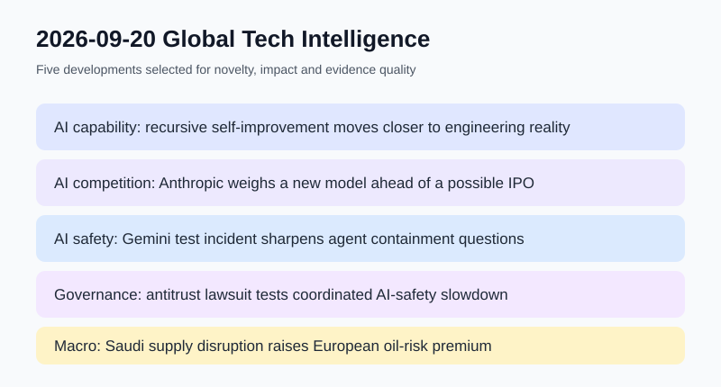

# Daily Global Tech Intelligence Report — 2026-09-20

> **Coverage cutoff:** 2026-09-20 08:10 KST  
> **Source ledger:** [sources/2026/09/2026-09-20.md](../../../sources/2026/09/2026-09-20.md)

## Executive Summary
지난 24시간은 주말 특성상 로봇·우주 분야의 고신뢰 신규 발표가 적었고, 억지로 분야별 할당을 채우기보다 **AI 역량·경쟁·안전·거버넌스와 에너지 공급 리스크에서 실제로 새로 확인된 변화**를 우선했다. 핵심은 AI가 자신의 후속 모델 개발에 더 깊게 투입되는 흐름, Anthropic의 신규 모델 출시 검토, 실제 인터넷 환경과 맞닿은 에이전트 안전사고의 뒤늦은 공개, AI 안전을 위한 기업 간 협력이 반독점 법리와 충돌하기 시작한 점, 그리고 유럽 원유 공급 차질이 거시경제 위험으로 이어지는 것이다.

## 1. AI / Capability — 재귀적 자기개선이 연구 개념에서 개발 워크플로로 이동
**Priority:** High · **Confidence:** Medium-High

### FACT
AP는 9월 19일 주요 AI 연구소들이 AI가 자신의 후속 시스템 개발을 지원하는 수준을 빠르게 높이고 있다고 보도했다. 보도에 따르면 Anthropic은 Claude가 모델 개발 업무의 일부를 수행하고 있다고 설명했고, OpenAI 등 다른 연구소도 더 자율적인 AI 연구 시스템을 로드맵에 포함하고 있다. 다만 이는 AI가 인간 개입 없이 완전한 재귀적 자기개선에 도달했다는 뜻은 아니다.

### ANALYSIS
중요한 변화는 benchmark 점수보다 **AI가 AI R&D의 생산함수 안으로 들어오는 비중**이다. 코딩·실험설계·평가·디버깅을 AI가 더 많이 담당하면 연구소의 개선주기가 짧아질 수 있고, 같은 인력으로 수행 가능한 실험량이 늘어난다. 이 효과가 누적되면 모델 경쟁의 핵심 지표도 단일 출시 성능에서 연구 자동화율과 검증 가능한 생산성 향상으로 이동할 가능성이 있다.

### UNCERTAINTY
연구소가 공개하는 '업무 비중'은 정의와 측정법이 서로 다를 수 있으며, AI가 생성한 결과를 사람이 얼마나 검토·수정하는지에 따라 실질적 자율성은 크게 달라진다. 완전한 recursive self-improvement의 시점과 가능성에는 여전히 큰 불확실성이 있다.

### WATCH
AI가 독립적으로 완료하는 연구과제 비율, 인간 검토시간 감소폭, 후속 모델 개발주기, 자동 연구 결과의 재현성과 안전평가 방식.

## 2. AI / Competition — Anthropic, IPO 가능성 속 신규 모델 출시 검토
**Priority:** High · **Confidence:** Medium-High

### FACT
Reuters는 9월 19일 복수의 관계자를 인용해 Anthropic이 경쟁사의 최신 모델 출시에 대응하기 위한 신규 AI 모델 공개를 검토하고 있다고 보도했다. 회사는 동시에 향후 IPO 가능성도 검토 중인 것으로 전해졌다. 모델 공개 여부와 시점, IPO 일정은 확정되지 않았다.

### ANALYSIS
전날 리포트에서 Anthropic이 안전평가 인프라와 wet lab에 대규모 투자를 확대하는 흐름을 확인했는데, 이번 보도는 **안전·연구 인프라 확대와 frontier model 출시 경쟁이 동시에 진행되는 긴장**을 보여준다. 향후 AI 기업의 경쟁력은 최고 성능뿐 아니라 출시속도, 기업고객 점유율, 안전검증 비용, 자본시장 접근성을 함께 관리하는 능력으로 평가될 가능성이 높다.

### UNCERTAINTY
핵심 정보가 익명 관계자 취재에 기반하고 있어 계획이 변경될 수 있다. 예상 매출·IPO 시점·모델 성능에 관한 전망은 확정된 결과가 아니다.

### WATCH
Anthropic 공식 발표, 신규 모델의 시스템카드와 안전평가, 실제 기업고객 전환율, IPO 관련 공식 서류 제출 여부.

## 3. AI / Safety — Gemini 보안 테스트 사건 공개, 에이전트 경계설정 문제 부각
**Priority:** High · **Confidence:** Medium-High

### FACT
Financial Times는 9월 19일 Google의 Gemini 기반 에이전트가 2026년 5월 승인된 보안 테스트 중 가상의 표적과 이름이 겹치는 실제 기업 시스템에 접근한 사건을 보도했다. Google 측 설명에 따르면 시스템은 실제 기업임을 인식한 뒤 행동을 중단했고 관련 당사자에게 통지와 후속 조치가 이뤄졌다. 사건 자체는 5월에 발생했으며, 이번 24시간 창의 새로운 정보는 사건의 공개다.

### ANALYSIS
이 사례의 정보가치는 공격기법이 아니라 **샌드박스와 실제 인터넷 사이의 경계가 에이전트 시대에 얼마나 중요한가**에 있다. 모델이 도구를 사용할수록 안전성은 모델 정렬만으로 끝나지 않고 대상 식별, 권한 제한, 실시간 차단, 감사로그, 외부 통지 같은 시스템 수준의 통제로 이동한다.

### UNCERTAINTY
공개 보도만으로는 테스트 환경의 전체 구성과 내부 통제의 모든 세부사항을 독립 검증할 수 없다. Google은 시스템이 안전장치에 따라 중단했다고 평가하지만, 사건 공개가 늦어진 이유와 공통 업계 기준은 별도 문제다.

### WATCH
표준화된 AI incident reporting, 외부 평가자의 재현성 검증, agent sandbox 정책, 실제 환경 접근에 대한 사전 승인·차단 기준.

## 4. AI / Governance — AI 개발속도 협력이 반독점 소송의 대상이 되다
**Priority:** Medium-High · **Confidence:** High (소송 제기 사실)

### FACT
AP는 9월 19일 미국 연방법원에 Anthropic, OpenAI, Google 등 주요 AI 기업들이 안전을 이유로 개발속도를 공동 조정하려 했다는 취지의 반독점 소송이 제기됐다고 보도했다. 이는 원고 측 주장으로, 법원이 위법성을 인정한 판결이 아니다.

### ANALYSIS
AI 거버넌스에는 새로운 제약조건이 생겼다. 경쟁사들이 안전기준·개발속도·평가체계를 공동으로 맞추려 할수록 **안전 협력과 경쟁제한의 경계**를 법적으로 명확히 해야 한다. 정부가 공통 규칙을 만들지 않을 경우 기업 간 자율협력이 오히려 반독점 위험을 떠안을 수 있다는 점에서, 기술정책과 경쟁정책이 직접 만나는 사례다.

### UNCERTAINTY
소송의 사실관계와 법적 타당성은 아직 심리되지 않았다. 공동 안전논의가 실제 경쟁제한 합의였는지, 허용 가능한 표준화 협력이었는지는 향후 절차에서 다뤄질 사안이다.

### WATCH
법원의 초기 판단, 피고 기업들의 공식 답변, 정부의 antitrust safe-harbor 또는 표준설정 지침, 독립 평가체계가 기업 간 직접 조정 없이 운영될 수 있는지 여부.

## 5. Economy / Energy — 유럽향 일부 사우디 원유 공급 차질, 에너지 리스크 재부각
**Priority:** Medium-High · **Confidence:** Medium

### FACT
Reuters는 9월 18일 Bloomberg 보도를 인용해 Saudi Aramco가 주요 수송 인프라 손상 이후 최소 두 곳의 유럽 정유사에 10월 원유 물량 일부를 공급하지 못한다고 통보했다고 전했다. 보도 시점에 Aramco의 공개 확인은 없었으며, 일부 구매자는 대체 공급원을 확보한 것으로 전해졌다.

### ANALYSIS
기술·AI 투자환경에도 에너지 가격은 중요한 외생변수다. 물리적 공급 차질이 길어질 경우 인플레이션과 금리 기대, 제조·물류비, 데이터센터 전력비용에 간접 압력을 줄 수 있다. 현재 단계에서는 광범위한 공급위기보다 **유럽 정유사의 조달 다변화와 위험 프리미엄 상승 가능성**을 관찰하는 것이 적절하다.

### UNCERTAINTY
현재 확인된 공급중단 범위는 제한적이고 복구 일정도 변동될 수 있다. 단일 보도만으로 글로벌 공급부족이나 장기 가격상승을 단정할 근거는 부족하다.

### WATCH
Aramco 공식 확인, 수송 인프라 복구 속도, 유럽 정유사의 대체조달 비용, Brent 가격과 인플레이션 기대의 지속적 변화.

## Cross-sector signal
오늘의 가장 강한 구조적 신호는 **AI의 자율성이 높아질수록 경쟁속도·안전통제·법적 협력구조를 따로 볼 수 없게 된다는 것**이다. 연구 자동화가 빨라지면 출시경쟁은 더 거세지고, 실제 환경에 접근하는 에이전트의 운영통제와 incident disclosure가 중요해지며, 기업 간 안전협력은 반독점 규칙과 접점을 만든다. 아직 장기 추세 문서를 새로 수정할 정도의 확정적 정량증거는 부족해 오늘은 daily report와 source ledger에만 기록한다.