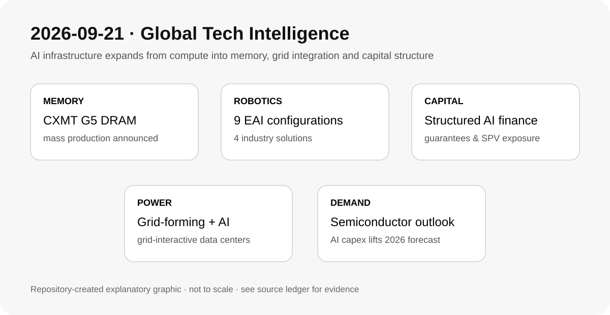

# Daily Global Tech Intelligence Report — 2026-09-21

> **Coverage cutoff:** 2026-09-21 08:10 KST  
> **Source ledger:** [sources/2026/09/2026-09-21.md](../../../sources/2026/09/2026-09-21.md)

## Executive Summary
지난 24시간의 가장 강한 신규 신호는 **AI 인프라 경쟁이 메모리 공정·전력망 통합·자본조달 구조까지 확장되는 것**이다. 중국 CXMT는 5세대 DRAM 플랫폼의 양산을 공식화했고, Huawei는 grid-forming과 AI를 결합한 전력·데이터센터 솔루션을 공개했다. 동시에 FT는 대형 기술기업들이 AI 인프라 금융에서 잔존가치보증 등 구조를 활용해 상당한 경제적 노출을 재무제표 밖 구조로 배치하고 있다고 분석했다. 로봇에서는 Faraday Future가 9개 EAI 기기 구성과 4개 산업 솔루션을 출시했다. 한국수출입은행 연구를 인용한 국내 보도는 2026년 세계 반도체 시장 전망이 AI 인프라 투자에 힘입어 크게 상향됐다고 전했다. 주말 특성상 과학·우주에서 TOP 5 기준을 충족하는 신규 고신뢰 발전은 확인되지 않아 억지로 포함하지 않았다.

## 1. Semiconductors / Memory — CXMT, 5세대 DRAM 플랫폼 양산 공식화
**Priority:** High · **Confidence:** High

### FACT
CXMT는 9월 20일 허페이 World Manufacturing Convention에서 5세대 DRAM 기술 플랫폼(G5)의 양산을 공식 발표했다. 회사는 SAQP 기반 active-area half-pitch 11.95nm, capacitor aspect ratio 45:1을 제시했고 G5 기반 24Gb LPDDR5X 제품군도 공개했다. Reuters는 같은 날 이 발표를 독립 보도하며 중국의 DRAM 자립 진전이라는 맥락을 확인했다.

### ANALYSIS
이 사건의 핵심은 연구개발 성과가 아니라 **양산 전환**이다. 중국 메모리 업체가 더 높은 집적도와 모바일용 LPDDR5X 공급능력을 확보하면 삼성전자·SK hynix·Micron 중심의 시장에서 중장기 가격·점유율 경쟁 압력이 커질 수 있다. AI 인프라가 HBM에 집중돼 있어도 범용 DRAM의 공정 진전은 장비·소재·수율 학습을 축적한다는 점에서 전략적 의미가 있다.

### UNCERTAINTY
CXMT가 제시한 공정지표와 수율·원가·실제 출하량은 동일한 개념이 아니다. 글로벌 선두업체와의 실질 격차는 제품별 성능, 수율, 고객 인증, 생산량을 추가 확인해야 한다.

### WATCH
G5 월간 wafer capacity, LPDDR5X 고객 인증과 출하량, 수율·원가, HBM 계열로의 공정 학습 전이, 미국 수출통제의 장비·소재 영향.

## 2. Robotics / Physical AI — Faraday Future, 9개 로봇 구성과 4개 산업 솔루션 출시
**Priority:** Medium-High · **Confidence:** Medium

### FACT
Faraday Future는 9월 19일 PDT/20일 아시아 시간에 열린 919 행사에서 5개 모델에 걸친 9개 EAI Device 구성과 K-12 교육·연구·보안·검사용 4개 Industry Productivity Solution을 발표했다. 회사는 해당 제품들을 판매·배송 가능 상태라고 설명했다. 이는 9월 16일 사전 예고 이후 실제 제품 발표가 이뤄졌다는 새로운 단계다.

### ANALYSIS
휴머노이드·사족보행 로봇 시장에서 경쟁축이 단일 하드웨어 데모에서 **용도별 패키지와 배포 가능한 솔루션**으로 이동하고 있음을 보여주는 사례다. 다만 제품 수보다 실제 반복판매, 현장 가동률, 서비스 비용, 고객 ROI가 상업화의 더 중요한 검증지표다.

### UNCERTAINTY
핵심 정보가 회사 발표에 집중돼 있으며 독립적인 대규모 고객 배치·성능 검증은 제한적이다. '판매 가능'과 지속적인 양산·상업적 채택은 구분해야 한다.

### WATCH
분기별 실제 출하·매출, 외부 고객명, 현장 uptime, 유지보수 비용, 반복주문과 산업별 ROI.

## 3. AI Infrastructure / Finance — AI CAPEX의 구조화 금융 노출 확대
**Priority:** High · **Confidence:** Medium-High

### FACT
Financial Times는 9월 20일 대형 기술·반도체 기업들이 AI 데이터센터와 칩 금융에서 잔존가치보증(residual value guarantees) 등 구조를 사용해 약 3,000억달러 규모의 AI 관련 경제적 노출을 재무제표 밖 특수목적 구조와 결합하고 있다고 보도했다. 보도는 신용평가사들이 이러한 잠재노출을 별도로 조정해 본다고 설명했다.

### ANALYSIS
AI 인프라 경쟁의 병목이 GPU와 전력에서 **신용·담보가치·계약구조**로 확장되고 있다. 장기 수요가 예상대로 유지되면 자본효율을 높이는 금융기법이지만, 장비 잔존가치나 AI 서비스 수요가 예상보다 빠르게 하락하면 위험이 공급자·대주단·SPV 사이에서 재가격될 수 있다.

### UNCERTAINTY
FT가 집계한 노출은 회계상 부채와 동일하지 않으며 계약별 보증조건·상환우선순위·담보가치가 다르다. 총액을 곧바로 손실위험으로 해석해서는 안 된다.

### WATCH
신용평가사의 adjusted leverage, AI 데이터센터 SPV 스프레드, GPU 잔존가치, take-or-pay 계약 변경, hyperscaler·칩업체 보증 규모의 추가 공개.

## 4. Energy / AI Data Centers — Huawei, grid-forming + AI 전력 인프라 통합 강조
**Priority:** Medium-High · **Confidence:** Medium

### FACT
Huawei Digital Power는 9월 20일 IDEE 2026에서 grid-forming ESS, smart microgrid, 초고속 충전, grid-interactive AI data center를 포함한 솔루션을 공개했다. 회사는 FusionSolar 9.0과 AI 기반 전력 운영을 결합해 발전·저장·데이터센터 부하를 통합 관리하는 방향을 제시했다.

### ANALYSIS
AI 데이터센터가 전력망의 수동적 대형 부하가 아니라 **저장장치·인버터·부하제어를 포함한 grid participant**로 설계되는 흐름을 강화한다. 최근 grid-responsive compute 신호와 결합하면, 데이터센터 경쟁력은 확보한 MW뿐 아니라 전력망 요구에 얼마나 빠르고 검증 가능하게 반응할 수 있는지로 넓어질 수 있다.

### UNCERTAINTY
현재 발표는 공급업체의 제품·사례 설명이 중심이며, 대규모 AI 데이터센터에서의 독립 검증된 비용절감·계통기여 수치는 제한적이다.

### WATCH
실제 AIDC 적용 MW, grid-forming 인증, curtailment response time, ESS 지속시간, 전력망 사업자와의 상업계약.

## 5. Economy / Semiconductors — 2026 세계 반도체 시장 전망 급상향
**Priority:** Medium-High · **Confidence:** Medium-High

### FACT
연합뉴스는 9월 20일 한국수출입은행 해외경제연구소 자료를 인용해 2026년 세계 반도체 시장이 1.6조달러를 넘을 것으로 전망됐다고 보도했다. 기사에 따르면 이는 연초 전망보다 크게 높아진 수준이며 AI 인프라 투자와 메모리 수요가 주요 배경으로 제시됐다.

### ANALYSIS
단순한 시장 낙관론보다 중요한 점은 **AI CAPEX가 메모리·서버·네트워크를 통해 반도체 시장 전체 추정치를 재작성할 정도로 커졌다는 것**이다. CXMT의 양산 진전과 함께 보면 수요 급증과 공급경쟁 심화가 동시에 진행되는 구조다.

### UNCERTAINTY
전망치는 실제 매출이 아니며 시장조사기관별 집계범위와 환율·가격 가정에 따라 달라질 수 있다. AI 투자 둔화나 메모리 가격 조정이 발생하면 전망치는 빠르게 낮아질 수 있다.

### WATCH
WSTS·주요 리서치기관의 후속 전망, DRAM/NAND/HBM ASP, hyperscaler CAPEX, 서버 출하량, 메모리 재고일수.

## Cross-sector signal
오늘의 구조적 신호는 **AI 인프라의 경쟁단위가 연산칩에서 메모리 공정, 전력망 상호작용, 그리고 금융구조까지 넓어졌다는 것**이다. CXMT의 양산은 공급측 경쟁을, Huawei의 grid-interactive 접근은 전력 병목 대응을, FT의 구조화 금융 보도는 자본 병목 대응을 각각 보여준다. 이 세 증거가 기존 방향을 의미 있게 강화해 `signals/ai-infrastructure.md`를 갱신했다.
