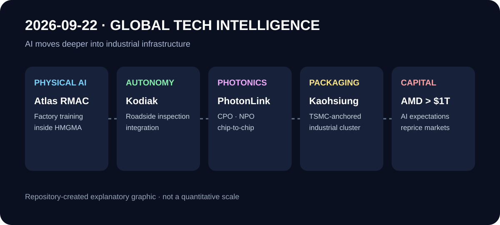

# Daily Global Tech Intelligence Report — 2026-09-22

> **Coverage cutoff:** 2026-09-22 08:43 KST  
> **Source ledger:** [sources/2026/09/2026-09-22.md](../../../sources/2026/09/2026-09-22.md)

## Executive Summary
지난 24시간의 가장 강한 신규 신호는 **AI·Physical AI가 모델·프로토타입 경쟁에서 실제 생산·도로 인프라·광통신·반도체 패키징과 자본시장으로 더 깊게 이동하고 있다는 것**이다. Boston Dynamics는 현대차 조지아 공장 안에 Atlas 훈련·통합 거점을 열었고, Kodiak AI와 PrePass는 자율주행 트럭의 강화검사 정보를 기존 주(州) 도로 단속 인프라에 연결하기 시작했다. AI 데이터센터에서는 Coherent가 CPO/NPO와 chip-to-chip을 아우르는 PhotonLink를 출시해 광연결이 컴퓨트 실리콘 가까이 이동하는 흐름을 구체화했다. 대만은 TSMC를 중심으로 첨단 패키징 산업단지 착공에 들어갔고, 시장에서는 AMD가 처음으로 시가총액 1조달러를 넘기며 AI 컴퓨팅 기대가 자본시장 가치평가에 다시 강하게 반영됐다. 과학·우주 분야에서는 이번 24시간 안에 TOP 5 기준을 충족하는 별도의 신규 고신뢰 발전을 확인하지 못해 억지로 포함하지 않았다.

## 1. Robotics / Physical AI — Boston Dynamics, 현대차 공장 안에 Atlas 실전 훈련 거점 개소
**Priority:** High · **Confidence:** High

### FACT
Boston Dynamics는 9월 21일 미국 조지아주 Hyundai Motor Group Metaplant America 내부에 Robotics Metaplant Application Center(RMAC)를 열었다고 발표했다. Atlas는 실제 자동차 제조 환경에서 부품 물류와 조립 전 sequencing 같은 작업을 훈련하고 있으며, 회사는 2027년 더 큰 시설로 확대할 계획이라고 밝혔다. Axios도 같은 날 시설 개소와 현대차 제조현장을 Atlas의 상용화 시험장으로 사용하는 방향을 독립 보도했다.

### ANALYSIS
휴머노이드 경쟁에서 중요한 단계가 공개 데모에서 **실제 고객 생산라인과 동일한 환경의 반복 훈련·통합**으로 이동하고 있다. 특히 로봇 제조사와 완성차 OEM이 같은 그룹 안에 있다는 점은 작업 데이터, 공정 엔지니어링, 유지보수 피드백을 짧은 주기로 연결할 수 있는 구조적 이점이 될 수 있다. 다만 훈련센터 개소 자체가 생산라인의 유료·무인 대규모 배치를 의미하지는 않는다.

### UNCERTAINTY
Atlas의 실제 cycle time, 작업 성공률, 사람 개입 빈도, 가동률, 총소유비용과 공장별 배치 대수는 아직 충분히 공개되지 않았다. 2027년 확장 계획도 목표이며 실제 상업적 성과와 구분해야 한다.

### WATCH
Atlas의 생산라인 투입 대수, 작업당 cycle time, intervention rate, uptime, 안전인증, 기존 자동화 대비 비용, 다른 현대차·기아 공장으로의 확산.

## 2. Autonomous Trucking — Kodiak·PrePass, 무인 트럭을 기존 도로 단속 인프라에 연결
**Priority:** High · **Confidence:** High

### FACT
Kodiak AI와 PrePass는 9월 21일 자율주행 트럭의 CVSA Enhanced Inspection 정보를 주(州) 단속기관의 기존 roadside screening 시스템에 전달하는 자동화 bypass 절차를 발표했다. 초기 구현은 이날 텍사스와 루이지애나에서 시작됐다. PrePass 네트워크는 580개가 넘는 검사·screening 지점을 포함하며, Kodiak은 연말까지 공공 고속도로에서 장거리 driverless commercial operations를 시작할 준비를 하고 있다고 밝혔다.

### ANALYSIS
자율주행 트럭의 확장 병목이 차량 내부의 perception/planning만이 아니라 **검사·단속·주간(interstate) 운영 인프라와의 상호운용성**으로 이동하고 있음을 보여준다. 기존 단속망을 교체하지 않고 자율주행 차량의 검증 데이터를 연결하는 방식은 주별 확장 비용과 운영 마찰을 줄일 가능성이 있다.

### UNCERTAINTY
텍사스·루이지애나에서의 초기 구현이 곧 전국적인 무인운행 허가를 의미하지 않는다. Enhanced Inspection은 최대 24시간 유효하지만 적용 요건이 있으며, 실제 무인 장거리 서비스 일정은 회사의 미래 목표다.

### WATCH
추가 참여 주, 실제 driverless highway 운행 개시, bypass 승인률, 검사 실패·원격지원 사례, CVSA 프로그램 변경, 보험·책임체계.

## 3. AI Infrastructure / Photonics — Coherent, PhotonLink 통합 광학 플랫폼 출시
**Priority:** High · **Confidence:** Medium-High

### FACT
Coherent는 9월 21일 ECOC 2026에서 AI 데이터센터용 PhotonLink를 공식 출시했다. 이 플랫폼은 InP 레이저, VCSEL, silicon photonics, specialty fiber, micro-optics, detector와 조립·테스트를 통합해 CPO, NPO, emerging chip-to-chip 연결을 지원한다. 회사는 CPO와 NPO 각각 10건이 넘는 고객 engagement와 anchor customer·장기계약을 확보했으며 PhotonLink 매출이 2026년 4분기부터 증가하기 시작할 것으로 예상한다고 밝혔다.

### ANALYSIS
AI 클러스터의 병목이 연산칩 자체에서 **대역폭 밀도·전력/bit·패키지 근접 연결**로 이동하면서 광학 부품의 수직통합과 제조능력이 전략적 가치가 되고 있다. 고객 engagement와 매출 ramp 시점이 함께 제시됐다는 점은 단순 기술 데모보다 상업화 단계가 앞서 있다는 신호다.

### UNCERTAINTY
고객 engagement는 양산 매출과 동일하지 않으며 고객명, 계약 규모, 실제 CPO/NPO 채택 속도는 공개가 제한적이다. Q4 매출 ramp는 회사 전망이다.

### WATCH
PhotonLink 분기 매출, 공개 anchor customer, CPO/NPO 양산 qualification, 6-inch InP 증설, 전력/bit와 수율, switch/GPU 플랫폼 채택.

## 4. Semiconductors — 대만, TSMC 중심 첨단 패키징 산업단지 착공
**Priority:** High · **Confidence:** High

### FACT
Reuters는 9월 21일 대만이 가오슝 Baipu Industrial Park 착공에 들어갔다고 보도했다. 88.7헥타르 규모 단지 가운데 53.6헥타르가 산업용이며, TSMC는 기술검증 연구소와 인재훈련센터를 설치해 2029년 4분기 가동을 목표로 한다. 대만 정부는 AI·고성능컴퓨팅에서 첨단 패키징의 중요성을 강조했다.

### ANALYSIS
AI 반도체의 경쟁단위가 leading-edge wafer fabrication만이 아니라 **패키징·장비검증·소재·인력 생태계를 한 지역에 묶는 산업 클러스터**로 확대되고 있다. CoWoS류 패키징 수요가 지속된다면 이런 인프라는 공정 전환과 공급망 qualification 시간을 줄이는 장기 경쟁력 요소가 될 수 있다.

### UNCERTAINTY
2029년 가동 목표는 장기 일정이며 실제 입주업체, 생산능력, 투자액, 전력·용수 확보와 공정 ramp 속도는 향후 달라질 수 있다.

### WATCH
TSMC 첨단 패키징 capacity 계획, 장비·소재 업체 입주, 2029 일정, 전력 공급, CoWoS/SoIC 수요와 lead time.

## 5. Economy / Investment — AMD, AI 기대 속 첫 1조달러 시가총액 돌파
**Priority:** Medium-High · **Confidence:** High

### FACT
Reuters에 따르면 AMD 주가는 9월 21일 9.6% 상승한 613.31달러로 사상 최고치를 기록하며 처음으로 시가총액 1조달러를 넘어섰다. 2026년 들어 주가는 185% 상승했으며, Reuters는 AMD가 개별 칩에서 완전한 AI 시스템으로 사업 범위를 넓히고 서버 CPU에서도 점유율을 확대하는 점을 투자자 기대의 배경으로 들었다.

### ANALYSIS
이는 기술 성과 자체보다 **AI 인프라 경쟁에 대한 자본시장의 기대가 GPU 단일 공급자에서 대체 가속기·CPU·시스템 공급자까지 넓어지고 있다는 시장 신호**다. 동시에 높은 가치평가는 향후 매출 성장과 점유율 확대가 실제 실적으로 확인돼야 유지될 수 있다는 압력도 키운다.

### UNCERTAINTY
시가총액은 미래 현금흐름 기대가 반영된 시장가격이며 기술적 우위나 장기 점유율을 직접 증명하지 않는다. 하루 주가 움직임을 산업 펀더멘털과 동일시해서는 안 된다.

### WATCH
AMD 데이터센터 매출, AI accelerator 출하와 고객, gross margin, NVIDIA 대비 시스템 경쟁력, hyperscaler CAPEX, valuation multiple 변화.

## Cross-sector signal
오늘의 공통 구조는 **AI가 '모델 성능'에서 실제 산업 인프라의 통합 문제로 이동하고 있다는 것**이다. Atlas는 제조현장 데이터·공정통합, Kodiak은 도로 단속 인프라, PhotonLink는 광학 연결, 대만의 패키징 단지는 제조 생태계, AMD의 1조달러 평가는 이를 뒷받침하는 자본 배분을 각각 보여준다. 다만 하루의 사건만으로 새로운 장기 추세 문서를 추가하기보다는 실제 배치·매출·가동률이 후속 확인되는지를 우선 관찰한다.
