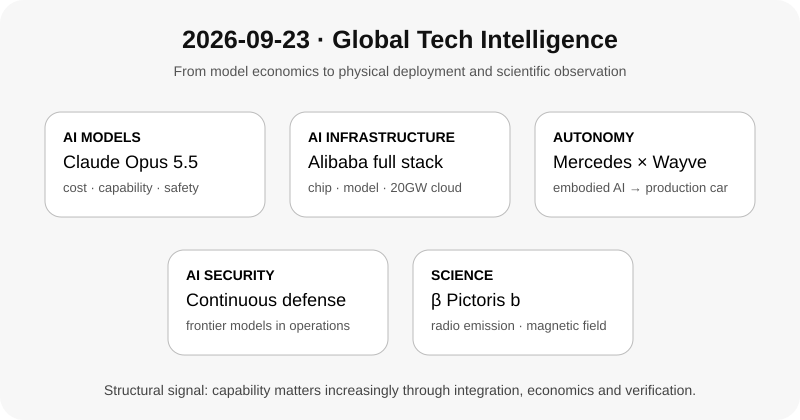

# Daily Global Tech Intelligence Report — 2026-09-23

> **Coverage cutoff:** 2026-09-23 08:06 KST  
> **Source ledger:** [sources/2026/09/2026-09-23.md](../../../sources/2026/09/2026-09-23.md)

## Executive Summary
지난 24시간의 핵심은 **AI 경쟁이 모델 성능 하나가 아니라 비용·안전, 자체 반도체와 전력, 실제 차량 통합, 보안 운영, 그리고 과학 관측 도구로 동시에 확장되고 있다는 점**이다. Anthropic은 Claude Opus 5.5에서 비용과 안전성 개선을 전면에 내세웠고, Alibaba는 AI 칩·초대형 모델·20GW 데이터센터 목표를 하나의 full-stack 로드맵으로 묶었다. Mercedes-Benz는 Wayve의 embodied-AI 운전 기술을 양산차에 통합하기로 하며 자동차 OEM의 외부 AI 플랫폼 채택을 확대했다. Palo Alto Networks는 frontier 모델을 상시 보안평가 서비스에 투입했고, 천문학에서는 β Pictoris b에서 직접 국소화된 전파 방출을 보고한 preprint가 외계행성 자기장 연구의 새로운 관측 경로를 제시했다.

## 1. AI / Models — Anthropic, Claude Opus 5.5 출시: 성능 경쟁에 비용·안전성 동시 압박
**Priority:** High · **Confidence:** High

### FACT
Anthropic은 9월 22일 Claude Opus 5.5를 공개했다. 회사는 일반적인 workload에서 Opus 5보다 실행비용이 40% 낮고, agentic coding·computer use·knowledge work에서 성능을 높였다고 밝혔다. Reuters는 새 모델이 Anthropic의 상위 Fable 5.1과 비슷한 수준의 성능을 더 낮은 비용으로 제공한다는 회사 설명과 함께 출시를 독립 보도했다. Anthropic은 benchmark의 작은 격차가 실제 사용 차이를 과대평가할 수 있다고도 명시했다.

### ANALYSIS
frontier 경쟁의 평가축이 단순 benchmark 최고점에서 **성능 × 추론비용 × 속도 × 안전장치**로 이동하고 있다는 신호다. 비슷한 업무 성능을 더 낮은 단가로 제공할 수 있다면 기업의 모델 선택은 절대 성능보다 workload당 총비용과 신뢰성에 더 민감해질 수 있다.

### UNCERTAINTY
성능·비용 수치는 상당 부분 Anthropic 자체 평가에 기반하며 실제 기업 workload에서의 비용절감 폭은 prompt 길이, tool use, cache, latency 요구에 따라 달라진다. 독립 benchmark와 장기 운영 데이터가 더 필요하다.

### WATCH
실사용 token economics, 독립 agent/coding 평가, enterprise adoption, 안전성 외부평가, 후속 Sonnet/Haiku 5.5의 가격·성능.

## 2. AI Infrastructure / China — Alibaba, Zhenwu V900·최대 10조 parameter 모델·20GW 데이터센터 로드맵 제시
**Priority:** High · **Confidence:** High

### FACT
Alibaba는 9월 22일 Apsara Conference에서 Zhenwu V900 AI accelerator와 차세대 Qwen 로드맵을 공개했다. AP와 Reuters에 따르면 회사는 V900이 이전 세대보다 약 3배 높은 성능을 낸다고 주장했고, 향후 5조~10조 parameter 규모 모델을 개발하며 2032년까지 전 세계 데이터센터 capacity를 20GW 이상으로 확대할 계획이라고 밝혔다.

### ANALYSIS
미·중 AI 경쟁이 모델만의 경쟁이 아니라 **accelerator → cloud → model → agent → 전력·데이터센터**를 한 기업 안에서 묶는 full-stack 경쟁으로 이동하는 강한 사례다. 특히 20GW 목표는 중국 AI 생태계의 병목이 고성능 칩 접근성뿐 아니라 전력과 데이터센터 capacity 확보에도 있음을 보여준다.

### UNCERTAINTY
칩 성능은 회사 주장이고 독립 benchmark가 부족하다. 5~10조 parameter와 20GW는 미래 목표이며 실제 모델 품질·학습 효율·전력 확보·가동률을 보장하지 않는다. parameter 수 자체도 모델 유용성의 직접 지표가 아니다.

### WATCH
V900 외부 benchmark와 출하량, Qwen 차세대 모델 실제 규모·성능, 20GW capacity의 단계별 commissioning, 전력조달, 중국 내 accelerator 공급망.

## 3. Robotics / Autonomous Driving — Mercedes-Benz, Wayve AI Driver 양산차 통합 협력
**Priority:** High · **Confidence:** Medium-High

### FACT
Reuters는 9월 22일 Mercedes-Benz와 영국 자율주행 AI 기업 Wayve가 Wayve의 운전 기술을 미래 Mercedes 차량에 통합하는 계약을 체결했다고 보도했다. 통합은 향후 약 2년 내 시작될 것으로 예상된다. Wayve는 데이터 기반 end-to-end embodied AI를 여러 차량·지역에 적용하는 전략을 추진하고 있으며, Mercedes-Benz는 Wayve의 2026년 Series D 투자에도 참여했다.

### ANALYSIS
완성차 업체가 자율주행 stack 전체를 독자 개발하기보다 **외부 범용 driving foundation platform을 차량 아키텍처에 통합하는 multi-partner 전략**을 택하는 흐름이 강화된다. Wayve가 Nissan·Uber 협력에 이어 Mercedes 양산차까지 연결한다면, end-to-end driving AI의 핵심 검증 포인트는 데모가 아니라 서로 다른 OEM 하드웨어에서의 반복 가능한 통합·안전성·비용이 된다.

### UNCERTAINTY
구체 모델, 국가, 기능 수준, 센서 구성과 출시일은 제한적으로 공개됐다. 계약 체결은 규제 승인이나 실제 대규모 고객 사용을 의미하지 않는다.

### WATCH
첫 Mercedes 적용 모델, supervised/eyes-off 기능 범위, homologation, 실제 출시 국가, disengagement·safety data, 다른 OEM으로의 재사용성.

## 4. AI Security — Palo Alto Networks, frontier 모델 기반 상시 보안평가 서비스 출시
**Priority:** Medium-High · **Confidence:** High

### FACT
Palo Alto Networks는 9월 22일 Unit 42 Continuous Frontier AI Defense를 발표했다. 회사 설명에 따르면 이 서비스는 Anthropic과 OpenAI 계열 모델 등을 활용해 웹 애플리케이션·API·클라우드 환경의 취약 가능성을 지속적으로 평가하고 방어 측 remediation을 지원한다. Reuters도 같은 날 서비스 출시와 여러 frontier 모델을 조합하는 구조를 보도했다.

### ANALYSIS
AI 보안의 경쟁축이 사람이 주기적으로 수행하는 평가에서 **지속적·자동화된 방어 검증**으로 이동하고 있다. 중요한 변화는 frontier 모델 자체가 제품이 아니라 보안 운영 workflow의 한 구성요소로 들어간다는 점이다. 이는 기업이 모델 성능뿐 아니라 권한관리, 검증, 감사가능성까지 함께 구매해야 한다는 의미다.

### UNCERTAINTY
실제 탐지 정확도, false positive, 고객환경별 비용, 기존 보안팀 대비 생산성 향상은 아직 공개 검증이 제한적이다. 모델의 높은 capability가 곧 안정적인 보안 결과를 보장하지 않는다.

### WATCH
독립 성능평가, enterprise adoption, false-positive/false-negative 지표, human approval 구조, 감사·권한관리 체계.

## 5. Science / Exoplanets — β Pictoris b에서 직접 국소화된 전파 방출 보고
**Priority:** High · **Confidence:** Medium-High

### FACT
Kevin N. Ortiz Ceballos, Edo Berger, Yvette Cendes 연구팀은 9월 15일 제출한 arXiv preprint에서 남아프리카 MeerKAT 관측으로 β Pictoris b에서 0.85~3.5GHz의 빠르고 반복적이며 강하게 원편광된 전파 burst와 지속 방출을 검출했다고 보고했다. 연구팀은 이를 electron cyclotron maser 기반 auroral emission으로 해석하고 방출 위치의 자기장을 최소 약 1.25kG로 추정했다. Science News는 9월 21일 결과와 함께 아직 peer review 전이며 추가적인 주기성 확인이 중요하다는 외부 전문가 평가를 전했다.

### ANALYSIS
결과가 재현된다면 외계행성 연구에 **대기 스펙트럼·직접영상과 별개의 자기장 관측 채널**이 추가된다. 자기장은 대기 손실과 항성풍 상호작용을 이해하는 핵심 변수이므로, 향후 더 민감한 전파망원경이 giant exoplanet의 내부·대기 환경을 비교하는 도구가 될 수 있다.

### UNCERTAINTY
아직 peer-reviewed 결과가 아니다. auroral interpretation을 더 강하게 확정하려면 행성 자전에 따른 반복 패턴과 독립 관측 재현이 필요하다. 이번 대상은 매우 큰 gas giant이므로 지구형 행성의 자기장 탐지 가능성으로 바로 일반화할 수 없다.

### WATCH
peer review, 반복 관측에서의 periodicity, 다른 망원경의 독립 검출, 추가 giant exoplanet survey, 더 낮은 자기장 세기에 대한 sensitivity.

## Cross-sector signal
오늘의 다섯 사건은 **AI가 독립된 소프트웨어 모델이 아니라 물리·운영 시스템 안의 범용 계층으로 들어가는 과정**을 보여준다. Anthropic은 모델 economics, Alibaba는 칩·전력·cloud, Mercedes–Wayve는 차량, Palo Alto Networks는 보안 운영으로 확장하고 있다. 동시에 β Pictoris b 연구는 고감도 관측 인프라가 이전에 직접 측정하기 어려웠던 물리량을 데이터화하는 과학적 병렬 흐름을 보여준다. 장기적으로는 성능 자체보다 실제 시스템에 통합했을 때의 비용·안전·검증가능성이 더 중요한 경쟁변수가 될 가능성이 커지고 있다.
