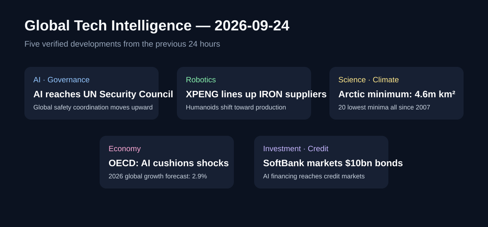

# Daily Global Tech Intelligence Report — 2026-09-24

> **Coverage cutoff:** 2026-09-24 08:05 KST  
> **Source ledger:** [sources/2026/09/2026-09-24.md](../../../sources/2026/09/2026-09-24.md)

## Executive Summary
지난 24시간의 핵심은 **AI가 기술산업 내부의 경쟁을 넘어 국제안보·거시경제·신용시장과 물리적 생산체계까지 연결되고 있다는 점**이다. OpenAI와 Anthropic 경영진이 UN 안전보장이사회에서 AI 국제협력을 직접 논의했고, XPENG은 휴머노이드 IRON의 공급망 지정계약과 생산 일정 조율을 공개했다. NASA·NSIDC는 2026년 북극 해빙 최소 면적을 4.6백만 km²로 확정했고, OECD는 AI 관련 투자가 에너지 충격 속 세계 성장의 완충재가 되고 있다고 평가했다. 동시에 SoftBank의 대규모 채권 조달은 AI 투자 붐이 이제 주식·벤처뿐 아니라 고수익 회사채 시장의 자금조달 구조에도 직접 영향을 주고 있음을 보여준다.

## 1. AI / Governance — OpenAI·Anthropic 경영진, UN 안전보장이사회에서 AI 국제안보 논의
**Priority:** High · **Confidence:** Medium-High

### FACT
9월 23일 UN 안전보장이사회 AI 관련 회의에서 OpenAI CEO Sam Altman과 Anthropic CEO Dario Amodei가 각각 AI의 국제적 위험관리와 협력 필요성을 설명했다. Reuters와 복수의 독립 매체는 두 경영진이 인간의 통제, 국제적 기준, 정부 간 협력 필요성을 강조했다고 보도했다. 이번 사건의 새로운 정보는 AI 안전 논의가 기업·국내 규제기관 수준을 넘어 국제안보를 다루는 안전보장이사회 의제로 직접 올라왔다는 점이다.

### ANALYSIS
AI 거버넌스의 단위가 **기업 자율규칙 → 국가 규제 → 국제 공통 기준**으로 확장되는 신호다. 향후 모델 평가, 사고보고, 공통 안전기준이 실제 제도화된다면 frontier AI 기업의 출시 절차와 비용 구조에도 영향을 줄 수 있다.

### UNCERTAINTY
회의 발언은 구속력 있는 국제협정이 아니다. 미국·중국을 포함한 주요국의 이해관계가 다르므로 공통 기준이 실제 규범이나 집행체계로 이어질지는 불확실하다.

### WATCH
후속 UN 문서, 공통 평가기준·사고보고 체계의 구체화, 주요국 참여 범위, 기업 자율규칙이 정부 규제로 전환되는지 여부.

## 2. Robotics / Humanoids — XPENG, IRON 공급망 지정계약·생산 일정 조율 공개
**Priority:** High · **Confidence:** Medium-High

### FACT
XPENG은 9월 23일 공개한 자료에서 전날 첫 Robotics Supply Chain Partner Conference를 열었으며 로봇 관절 모듈, actuator, 정밀 구조부품 등 핵심 부품 공급사들이 참여했다고 밝혔다. 회사는 로봇 사업이 공급망 파트너들과 지정계약을 체결했고 생산라인 일정을 조율 중이라고 설명했다. 이는 9월 초 IRON 전용 생산라인 가동 발표 이후 공급망 실행 단계가 추가로 공개된 것이다.

### ANALYSIS
휴머노이드 경쟁의 병목이 prototype 성능에서 **부품 표준화·수율·공급망·양산 운영**으로 이동하고 있다는 구체적 신호다. 자동차 제조 경험을 가진 XPENG이 공급사 지정과 생산 스케줄 단계까지 공개했다는 점은 Physical AI 경쟁에서 제조 execution이 모델 성능만큼 중요해지고 있음을 강화한다.

### UNCERTAINTY
공급사 명단, 계약 규모, 실제 생산량, 수율, 원가와 고객 인도량은 공개되지 않았다. 회사가 말하는 생산 준비가 곧 대규모 상업 판매를 의미하지 않는다.

### WATCH
IRON 실제 월 생산량, 외부 고객 인도, 핵심 actuator 원가·수율, 공급사 공개, 2027년 상업화 일정의 준수 여부.

## 3. Science / Climate — NASA·NSIDC, 2026 북극 해빙 최소 면적 4.6백만 km² 발표
**Priority:** High · **Confidence:** High

### FACT
NASA와 미국 National Snow and Ice Data Center는 북극 해빙이 9월 12일 약 1.78백만 제곱마일(4.6백만 km²)의 연간 최소 면적에 도달했다고 9월 23일 발표했다. 이는 위성 연속관측 기록에서 공동 10번째로 낮은 수준이다. 또한 2007년부터 2026년까지의 20년이 1978년 말 이후 관측된 연간 최소 면적 가운데 가장 낮은 20개 해를 모두 차지했다.

### ANALYSIS
단일 연도의 순위보다 더 중요한 정보는 최근 20년이 역사적 저점 20개를 모두 차지한다는 **장기 분포 이동**이다. 연간 변동성이 존재하더라도 위성관측 시대의 북극 해빙 체계가 과거와 다른 낮은 범위에 머물고 있음을 보여준다.

### UNCERTAINTY
한 해의 최소 면적만으로 향후 특정 연도의 해빙을 예측할 수 없다. 해빙의 두께·부피·지역별 분포까지 함께 봐야 전체 상태를 평가할 수 있다.

### WATCH
겨울 재결빙 속도, 다년생 해빙 비율과 두께, 2027년 melt season, NSIDC의 후속 분석.

## 4. Economy / AI — OECD, AI 투자가 에너지 충격 속 세계 성장 완충한다고 평가
**Priority:** High · **Confidence:** High

### FACT
OECD는 9월 23일 Interim Economic Outlook에서 2026년 세계 성장률을 2.9%, 2027년을 3.0%로 전망했다. 공식 보고서는 AI 관련 투자와 생산의 빠른 증가가 일부 경제에서 데이터센터 건설과 기술장비 투자를 끌어올리고, 한국·일본 등 반도체 생산국의 기술수출에도 기여했다고 설명했다. 동시에 전력·첨단 반도체 병목, 투자수익 실망, 레버리지와 신용위험을 하방 위험으로 지목했다.

### ANALYSIS
AI capex가 특정 기술주의 valuation 이야기를 넘어 **실물 GDP·건설·장비·수출**에 측정 가능한 거시경제 변수로 자리 잡았다는 의미가 크다. 다만 같은 보고서가 자금조달과 투자수익 위험도 함께 지적했다는 점에서, AI 투자의 규모보다 생산성·현금흐름으로의 전환이 다음 검증 단계다.

### UNCERTAINTY
OECD 전망은 기준 시나리오이며 에너지 가격과 지정학적 상황 변화에 민감하다. AI 투자 증가가 장기 생산성 향상으로 이어지는 속도와 폭도 아직 불확실하다.

### WATCH
데이터센터 투자 증가율, 반도체 수출, 전력 병목, AI 기업 earnings, 2027 성장률 수정, AI capex의 생산성 지표 반영 여부.

## 5. Investment / Credit — SoftBank, OpenAI 투자 재원 위한 100억달러 채권 주문 접수
**Priority:** High · **Confidence:** Medium-High

### FACT
Reuters가 확인한 term sheet에 따르면 SoftBank Group은 OpenAI 투자 재원을 마련하기 위해 총 100억달러 규모의 달러 표시 채권에 대한 투자자 주문을 9월 23일 받고 있었다. 구조는 3.5년·5.5년·7.5년 만기로 나뉘며, 당시 제시된 금리 가이던스는 각 구간에서 높은 한 자릿수 수준이었다. 최종 가격결정과 결제는 아직 완료 전이므로 이 사건은 '발행 완료'가 아니라 대규모 자금조달이 실제 채권시장에 제시된 단계로 분류한다.

### ANALYSIS
AI 투자 붐의 자금원이 venture·equity에서 **대형 회사채와 레버리지**로 확대되는 사례다. 이는 AI 생태계가 기술 성능뿐 아니라 금리, 신용스프레드, 투자자의 위험선호에 더 직접 노출된다는 뜻이다. OECD가 같은 날 AI 기업의 복잡한 financing과 credit risk를 거시 하방 위험으로 지목한 점과도 맞물린다.

### UNCERTAINTY
최종 발행규모·금리·수요는 가격결정 전까지 달라질 수 있다. SoftBank의 자금조달 자체가 OpenAI 투자의 향후 수익성이나 현금흐름을 보장하지 않는다.

### WATCH
최종 pricing과 order book, 신용등급 변화, SoftBank leverage, OpenAI 투자 집행, 다른 AI 인프라·모델 기업의 회사채 발행 확대 여부.

## Cross-sector signal
오늘의 사건들은 AI가 하나의 소프트웨어 산업에서 **국제 거버넌스·로봇 제조·거시 성장·신용시장**을 동시에 움직이는 범용 산업계층으로 확대되고 있음을 보여준다. 특히 OECD의 거시 데이터와 SoftBank의 채권 조달은 AI capex가 경제를 지지하는 힘과 금융 취약성을 동시에 키울 수 있다는 양면성을 드러낸다. XPENG 사례는 같은 자본집약적 전환이 Physical AI에서도 공급망·양산 문제로 나타나고 있음을 보여준다.