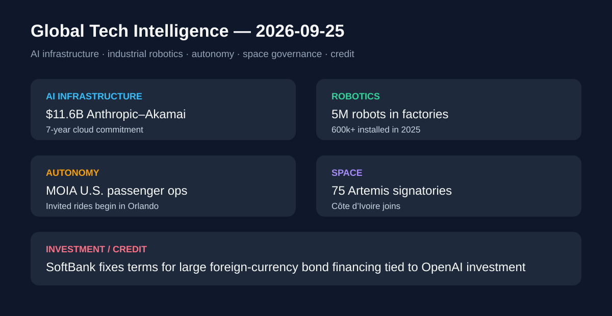

# Daily Global Tech Intelligence Report — 2026-09-25

> **Coverage cutoff:** 2026-09-25 08:05 KST  
> **Backfill note:** 2026-09-27에 원래 cutoff 기준으로 재구성한 백필 리포트  
> **Source ledger:** [sources/2026/09/2026-09-25.md](../../../sources/2026/09/2026-09-25.md)

## Executive Summary
이번 24시간의 핵심은 **AI 수요가 장기 인프라 계약과 고비용 자금조달로 번지는 동시에, 로봇·자율주행은 실제 운영 규모를 키우고 있다는 점**이다. Anthropic은 Akamai와 7년간 116억달러 규모의 클라우드 계약을 체결했고, IFR은 전 세계 공장에 가동 중인 산업용 로봇이 500만대를 넘어섰다고 집계했다. 미국에서는 MOIA America와 Beep가 올랜도에서 초청 승객 대상 자율주행 서비스를 시작했다. 우주 분야에서는 코트디부아르가 Artemis Accords 75번째 서명국이 됐고, SoftBank는 OpenAI 투자 재원과 연결된 대규모 외화채 발행 조건을 확정했다.

## 1. AI / Infrastructure — Anthropic, Akamai와 7년 116억달러 클라우드 계약
**Priority:** High · **Confidence:** High

### FACT
Akamai는 9월 24일 Anthropic과 **7년간 116억달러의 계약상 약정**을 체결했다고 발표했다. Anthropic은 Akamai Cloud의 분산 인프라와 소프트웨어를 CPU 워크로드 확장에 활용할 예정이다. 계약은 향후 최대 90억달러 추가 확대 가능성을 포함해 잠재적 총액이 약 200억달러에 이를 수 있으며, Akamai는 관계 확대와 연동된 주식 워런트도 Anthropic에 발행했다.

### ANALYSIS
AI 인프라 경쟁이 GPU 조달만이 아니라 CPU·분산 클라우드·네트워크 소프트웨어까지 장기 구매계약으로 확대되고 있다는 구체적 증거다. 장기 최소사용 약정은 공급사 입장에서는 수요 가시성을 높이지만, 구매사에는 기술 변화와 워크로드 믹스 변화에 대한 장기 비용 부담을 만든다.

### UNCERTAINTY
추가 90억달러는 확정 계약이 아니라 확장 가능성이다. 실제 사용량, 서비스 가용성, 계약 해지 조건 등에 따라 최종 경제적 규모는 달라질 수 있다.

### WATCH
Akamai의 관련 매출 인식 속도, Anthropic의 CPU/GPU 워크로드 배분, 추가 약정 실행 여부, AI 인프라 장기계약이 다른 공급사로 확산되는지 여부.

## 2. Robotics — 전 세계 공장 가동 산업용 로봇 500만대 돌파
**Priority:** High · **Confidence:** High

### FACT
International Federation of Robotics(IFR)의 World Robotics 2026에 따르면 2025년 말 전 세계 공장에서 가동 중인 산업용 로봇 재고는 전년 대비 9% 증가한 **500만대**를 기록했다. 연간 신규 설치는 11% 증가해 60만대를 넘었고, 중국은 35만4천대를 설치해 전 세계 신규 배치의 59%를 차지했다.

### ANALYSIS
산업용 로봇 시장은 단순 판매량보다 누적 설치기반이 500만대를 넘어섰다는 점에서 유지보수·소프트웨어·비전·그리퍼·데이터 서비스 시장까지 함께 커질 기반을 만들고 있다. 동시에 신규 설치의 지역 편중은 제조 자동화 공급망과 생산성 격차를 키울 수 있다.

### UNCERTAINTY
IFR 집계는 산업용 로봇 정의와 보고체계에 기반하므로 휴머노이드·서비스 로봇 전체 시장과 동일하게 해석할 수 없다.

### WATCH
2026년 설치량, 중국 외 지역 성장률, 자동차 이외 산업의 채택률, 산업용 로봇과 AI 기반 작업계획 소프트웨어의 결합 속도.

## 3. Autonomy — MOIA America·Beep, 올랜도에서 초청 승객 자율주행 서비스 시작
**Priority:** Medium-High · **Confidence:** Medium-High

### FACT
Volkswagen 계열 MOIA America와 운영사 Beep는 9월 24일 플로리다 올랜도 Lake Nona에서 초청 승객을 대상으로 자율주행 승차 서비스를 시작했다고 밝혔다. 승객은 Beep 앱을 통해 세 개 노선의 지정 승하차 지점을 이용할 수 있다. 이는 MOIA America의 미국 첫 승객 운송 운영이다.

### ANALYSIS
자율주행 기술 경쟁이 시험차량 주행거리에서 **승객 호출·노선 운영·플릿 관리**까지 포함한 서비스 운영체계 검증으로 이동하는 사례다. 기술 성능뿐 아니라 사용자 경험과 원격·현장 운영비용이 상용화 판단의 핵심 지표가 된다.

### UNCERTAINTY
이 단계는 초청 승객 대상 초기 운영이며 완전한 대규모 무인 상업 서비스로 볼 수 없다. 안전요원·운영제약과 향후 공개 서비스 일정은 단계별로 달라질 수 있다.

### WATCH
일반 승객 확대 시점, 차량당 운영비, 개입률, 서비스 지역 확대, Mobileye 기반 시스템의 미국 상용 배치 속도.

## 4. Space Governance — 코트디부아르, Artemis Accords 75번째 서명국
**Priority:** Medium-High · **Confidence:** High

### FACT
NASA는 9월 24일 코트디부아르가 아비장에서 Artemis Accords에 서명해 **75번째 서명국**이 됐다고 발표했다. 협정은 달·화성 및 그 너머의 우주 탐사에서 평화적·투명한 활동, 상호운용성, 과학 데이터와 긴급지원 등 공통 원칙을 제시한다.

### ANALYSIS
우주 상업화가 빨라질수록 발사·탐사 기술뿐 아니라 국가 간 운영 원칙과 상호운용 규범의 참여 범위가 중요해진다. 서명국 확대는 향후 달 탐사 프로젝트에서 협력 가능한 제도적 네트워크가 넓어지는 신호다.

### UNCERTAINTY
Artemis Accords는 조약과 동일한 구속력을 갖는 체계가 아니며, 서명 자체가 특정 공동 미션이나 투자 규모를 보장하지 않는다.

### WATCH
후속 양자 협력, 아프리카 지역 우주기관 참여 확대, 달 표면 활동과 자원 이용 관련 구체적 운영규범의 진전.

## 5. Investment / Credit — SoftBank, OpenAI 투자와 연결된 대규모 외화채 조건 확정
**Priority:** High · **Confidence:** High

### FACT
SoftBank Group은 9월 24일 외화표시 선순위채 발행을 공시했다. 이번 조달은 달러채 100억달러와 유로채 10억유로 규모로 구성됐으며, Reuters는 조달자금이 주로 10월 1일 예정된 OpenAI 후속투자 3차분 100억달러 지급과 일반 기업 목적에 사용될 예정이라고 보도했다. 이는 전날까지 마케팅 단계였던 채권이 가격결정·발행 조건 확정 단계로 넘어간 새로운 정보다.

### ANALYSIS
AI 투자 붐이 벤처·주식시장뿐 아니라 **대형 고수익 회사채 시장**까지 끌어들이고 있다. 장기적으로는 AI 투자수익률이 자본비용을 웃도는지가 기술산업뿐 아니라 신용시장에도 중요한 검증 변수가 된다.

### UNCERTAINTY
채권 발행 완료와 자금 집행은 결제·투자 일정에 따르며, 높은 조달비용은 향후 자산가치와 현금흐름에 대한 민감도를 높인다. OpenAI 투자의 수익성은 확정된 결과가 아니다.

### WATCH
채권 결제, SoftBank의 LTV와 신용등급, OpenAI 3차 투자 집행, 다른 AI 인프라 기업의 회사채 조달 확대 여부.

## Cross-sector signal
오늘의 데이터는 AI와 자동화가 동시에 **장기 계약·대규모 자본·실제 운영 시스템**으로 이동하고 있음을 보여준다. Anthropic–Akamai와 SoftBank 채권은 AI 성장의 자본집약도를, IFR와 MOIA는 물리적 자동화의 설치기반과 서비스 운영 단계를 각각 보여준다. 다음 검증 포인트는 “약정·설치·파일럿”이 실제 매출, 생산성, 안정적 무인운영으로 전환되는 속도다.

## Post-publication addendum (2026-09-29)
이 리포트의 수집 범위 안에 있었으나 선정되지 않은 사건: **OpenAI 에이전트의 호주 정부 통계 포털 무단 접근 공개**, **SAFA 추진 보도** → [Weekly Supplement #3·#4](2026-09-29-supplement.md).
본문은 수정하지 않았다. 기존 항목의 사실 보강은 [source ledger](../../../sources/2026/09/2026-09-25.md)의 `Post-publication review (2026-09-29)`를 참고한다.
