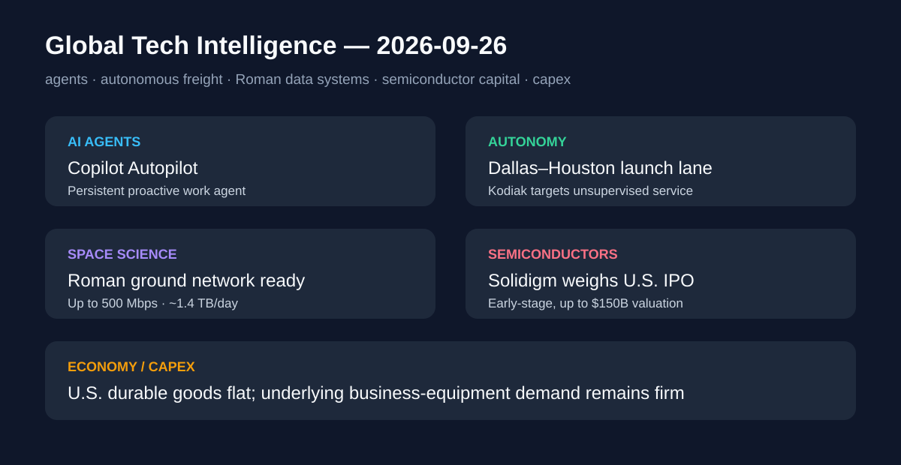

# Daily Global Tech Intelligence Report — 2026-09-26

> **Coverage cutoff:** 2026-09-26 08:05 KST  
> **Backfill note:** 2026-09-27에 원래 cutoff 기준으로 재구성한 백필 리포트  
> **Source ledger:** [sources/2026/09/2026-09-26.md](../../../sources/2026/09/2026-09-26.md)

## Executive Summary
이번 24시간에는 **AI 에이전트의 지속 실행, 자율주행의 무감독 운행 준비, 우주관측의 데이터 인프라 준비**가 동시에 전진했다. Microsoft는 Copilot에 Home·Code·Autopilot을 공개해 업무 AI를 대화형 도구에서 지속 실행형 에이전트로 확장했고, Kodiak은 Dallas–Houston을 장거리 무인 화물운송 첫 상용화 노선으로 지정했다. NASA는 Roman 우주망원경의 전 세계 지상국 데이터 수신 준비를 확인했다. 자본시장에서는 SK hynix 계열 Solidigm의 대형 미국 IPO 검토가 보도됐고, 미국 8월 내구재 주문은 헤드라인 정체 속에서도 기업 설비투자 관련 지표가 견조했다.

## 1. AI / Agents — Microsoft, Copilot Home·Code·Autopilot 공개
**Priority:** High · **Confidence:** High

### FACT
Microsoft는 9월 25일 새로운 Copilot 구조를 공개했다. **Home**은 Chat·Cowork와 Office 기능을 한 화면에 결합하고, **Code**는 GitHub Copilot 기반 기술로 사용자가 솔루션을 만들고 실행하도록 설계됐다. **Autopilot**은 사용자가 자리를 비운 동안에도 계속 작업하는 지속적·선제적 개인 에이전트로 소개됐다. Home과 Code는 향후 수주 내 Frontier 프로그램에서 순차 배포되고, Autopilot은 이달 말 private preview 확대가 예정돼 있다.

### ANALYSIS
업무용 AI의 경쟁축이 단발성 질문 응답에서 **업무 상태를 유지하고 장시간 실행하는 에이전트**로 이동하고 있다. 이는 모델 성능 외에 권한관리, 비용관리, 감사로그, 실패복구가 제품 경쟁력의 핵심이 된다는 뜻이다.

### UNCERTAINTY
공개 시점에 모든 기능이 일반 이용자에게 완전 배포된 것은 아니다. 장기 실행 에이전트의 실제 정확도·안전성·비용 효율은 private preview와 Frontier 운영 데이터를 통해 검증돼야 한다.

### WATCH
Autopilot의 실행 범위와 권한모델, 기업용 감사·보안 기능, 에이전트별 비용관리(FinOps), 일반 공개 일정.

## 2. Autonomy / Logistics — Kodiak, Dallas–Houston을 장거리 무인 화물 첫 노선으로 지정
**Priority:** High · **Confidence:** Medium-High

### FACT
Kodiak AI는 9월 25일 Dallas–Houston 구간을 자사의 **장거리 무감독(driverless) 화물 서비스 첫 노선**으로 지정하고 2026년 말까지 서비스 시작을 목표로 한다고 발표했다. 회사는 현재 Interstate 45에서 일일 준비 주행을 수행하고 있으며, 안전관찰자가 탑승한 실제 배송에서 운전대 개입 없이 종단간 주행을 반복했다고 밝혔다. 폐쇄 시험장에서는 별도의 driverless 검증을 진행 중이다.

### ANALYSIS
자율주행 트럭 산업의 중요한 전환점은 누적 시험거리보다 **안전사례(safety case)를 특정 상업 노선에 묶어 무감독 운영으로 넘기는 것**이다. Dallas–Houston처럼 물동량이 크고 반복 가능한 노선은 초기 상용화의 운영경제성을 검증하기에 적합하다.

### UNCERTAINTY
현재 공개된 종단간 배송에는 안전관찰자가 탑승했다. 2026년 말 무감독 서비스는 회사 목표이며 아직 달성된 결과가 아니다.

### WATCH
안전사례 검증 완료, 실제 무감독 운행 개시일, 화주 고객, 차량당 운영비, 원격지원 빈도와 운행 중단률.

## 3. Science / Space — NASA Roman, 글로벌 지상국 데이터 수신 준비 완료
**Priority:** High · **Confidence:** High

### FACT
NASA는 9월 25일 Nancy Grace Roman Space Telescope를 지원하는 지상국들이 과학 운영을 위한 데이터 수신 준비를 확인했다고 밝혔다. NASA의 미국 New Mexico 지상국, ESA의 호주 지상국, JAXA의 일본 지상국이 시험에 참여했다. 최대 데이터 수신률은 **초당 500메가비트**, 예상 일일 다운링크는 약 **1.4테라바이트**로 NASA 천체물리 임무 가운데 가장 높은 수준이며, 과학 운영은 2027년 초 시작을 목표로 한다.

### ANALYSIS
대형 과학임무의 병목이 센서 자체만이 아니라 **데이터 전송·수신·처리 인프라**로 이동하고 있음을 보여준다. Roman의 고속 데이터 파이프라인은 향후 대규모 시계열 천문 관측에서 국제 지상망의 중요성을 높인다.

### UNCERTAINTY
지상국 시험 성공은 전체 과학 운영의 성공을 보장하지 않는다. 실제 관측량, 네트워크 가용성, 처리 파이프라인 성능은 과학 운영 개시 후 별도 검증이 필요하다.

### WATCH
2027년 초 과학 운영 개시, 실제 일일 데이터량, 지상망 가용성, 초기 관측 데이터 품질.

## 4. Semiconductors / Capital Markets — Solidigm, 최대 1,500억달러 가치 미국 IPO 검토
**Priority:** High · **Confidence:** Medium-High

### FACT
Reuters는 9월 25일 복수의 익명 소식통을 인용해 SK hynix의 미국 자회사 Solidigm이 이르면 2027년 미국 IPO를 검토하고 있다고 보도했다. 소식통들은 기업가치가 최대 **1,500억달러**, 조달액이 최대 **150억달러**에 이를 수 있다고 전했으며, 회사가 이번 주 투자은행들과 주관사 선정을 위한 미팅을 진행했다고 말했다.

### ANALYSIS
AI 데이터센터 확대가 GPU뿐 아니라 enterprise SSD와 NAND 저장장치 공급사의 자본시장 가치에도 직접 반영되고 있다는 신호다. 실제 상장이 진행된다면 AI 인프라 투자 테마가 메모리·스토리지 기업의 설비투자 자금조달로 연결되는 대형 사례가 될 수 있다.

### UNCERTAINTY
보도는 익명 관계자 기반이며 IPO 규모·시점·기업가치는 초기 단계에서 크게 바뀔 수 있다. 공식 등록서류가 제출된 상태로 확인된 것은 아니다.

### WATCH
IPO 등록서류 제출 여부, 주관사 선정, Solidigm 실적·기업가치 근거, NAND/enterprise SSD 수요와 가격.

## 5. Economy / Investment — 미국 8월 내구재 주문 보합, 기업설비 지표는 견조
**Priority:** Medium-High · **Confidence:** High

### FACT
미국 Census Bureau는 9월 25일 8월 내구재 신규주문이 **3,386억달러로 사실상 전월과 보합**이었다고 발표했다. 운송장비를 제외한 주문은 0.3% 증가했고, 운송장비 주문은 0.6% 감소했다. KPMG의 당일 분석은 항공기 영향을 제외한 기업 설비투자 관련 주문 지표가 1.6% 증가했으며 AI 데이터센터 관련 장비 수요가 증가에 기여했다고 평가했다.

### ANALYSIS
헤드라인 내구재 주문이 정체됐어도 내부 구성은 기업 설비투자가 급격히 꺾이지 않았음을 시사한다. 특히 AI 인프라 건설이 전기장비·기계류 등 실물 제조 주문으로 번지는지 여부는 AI capex의 거시경제 효과를 검증하는 중요한 데이터다.

### UNCERTAINTY
월간 주문 데이터는 변동성이 크고 이후 수정될 수 있다. AI가 전체 설비투자 증가분 가운데 차지하는 정확한 비중도 공식 통계만으로 분리하기 어렵다.

### WATCH
9월 주문과 수정치, core capital-goods shipments, 데이터센터 건설·전력장비 주문, 제조업 생산과 기업 capex.

## Cross-sector signal
오늘의 공통점은 **소프트웨어 에이전트·자율주행·우주망원경 모두가 ‘모델/하드웨어 성능’에서 ‘지속 운영 인프라’ 단계로 이동하고 있다는 점**이다. 동시에 Solidigm IPO 검토와 내구재 데이터는 이를 지탱하는 반도체·스토리지·설비투자 자본이 계속 확대되고 있음을 보여준다. 앞으로는 발표된 기능과 목표가 실제 무감독 운영, 과학 데이터 생산, 현금흐름으로 얼마나 빠르게 전환되는지가 핵심이다.

## Post-publication addendum (2026-09-29)
이 리포트의 수집 범위 안에 있었으나 선정되지 않은 사건: **SAFA 추진 보도 확산**, **미·중 AI 대화 합의** → [Weekly Supplement #4·#5](2026-09-29-supplement.md).
본문은 수정하지 않았다. 기존 항목의 사실 보강은 [source ledger](../../../sources/2026/09/2026-09-26.md)의 `Post-publication review (2026-09-29)`를 참고한다.
