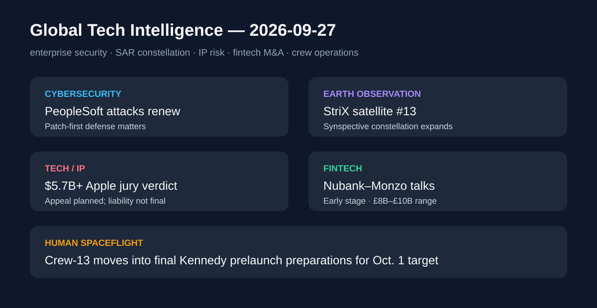

# Daily Global Tech Intelligence Report — 2026-09-27

> **Coverage cutoff:** 2026-09-27 08:05 KST  
> **Backfill note:** 2026-09-27에 원래 cutoff 기준으로 재구성한 백필 리포트  
> **Source ledger:** [sources/2026/09/2026-09-27.md](../../../sources/2026/09/2026-09-27.md)

## Executive Summary
주말 구간의 핵심은 **기술 상용화가 커질수록 운영 보안·지식재산·자본시장·우주 인프라의 리스크 관리가 함께 중요해진다는 점**이다. Google/Mandiant는 Oracle PeopleSoft 취약점을 악용한 ShinyHunters의 대규모 공격 재개를 확인했고, Rocket Lab은 Synspective의 13번째 StriX SAR 위성을 궤도에 배치했다. 미국 배심원은 Apple이 Taction의 햅틱 특허를 침해했다며 57억달러가 넘는 배상 평결을 내렸고 Apple은 항소 방침을 밝혔다. 금융에서는 Nubank와 Monzo의 초기 결합 논의가 보도됐으며, NASA Crew-13은 10월 1일 발사를 앞두고 Kennedy Space Center로 이동해 최종 준비 단계에 들어갔다.

## 1. Cybersecurity / Enterprise Tech — ShinyHunters, Oracle PeopleSoft 공격 재개
**Priority:** High · **Confidence:** High

### FACT
Google Threat Intelligence Group과 Mandiant는 9월 25일 Oracle PeopleSoft의 알려진 취약점을 겨냥한 ShinyHunters의 **대규모 공격 활동이 다시 확대됐다**고 밝혔다. Reuters는 최신 활동이 고등교육·기술·의료·농업·운송·정부 등 여러 분야의 수십 개 시스템에 영향을 미쳤으며, 일부 조직은 웹 애플리케이션 방화벽 규칙만 적용하고 Oracle의 보안 업데이트를 적용하지 않은 상태에서 노출됐다고 보도했다.

### ANALYSIS
이번 사례는 보안 운영에서 우회 가능한 탐지·차단 규칙만으로는 충분하지 않고, **공급사 패치 적용과 자산관리**가 기본 통제라는 점을 다시 보여준다. ERP·인사 시스템은 개인정보와 조직 운영 데이터를 함께 담기 때문에 공격 범위가 넓어질수록 업무 연속성 리스크도 커진다.

### UNCERTAINTY
피해 조직 전체 목록과 실제 데이터 유출 범위는 공개되지 않았다. 공격 주체가 별도로 주장한 다른 침해 사례는 독립적으로 확인되지 않은 부분이 있어 본 리포트의 FACT와 분리한다.

### WATCH
Oracle 패치 적용률, 추가 피해 공개, 침해조사 결과, 기업 ERP 보안점검과 패치 우선순위 변화.

## 2. Space / Commercial Earth Observation — Rocket Lab, Synspective 13번째 StriX 위성 배치
**Priority:** High · **Confidence:** High

### FACT
Rocket Lab과 Synspective는 9월 26일 Electron 로켓이 **13번째 StriX SAR 위성**을 발사해 약 559km 저궤도에 배치했다고 발표했다. 발사는 뉴질랜드 Launch Complex 1에서 00:39 UTC에 이뤄졌다. Synspective는 앞으로 수개월 동안 위성의 관측 성능을 시험·검증한 뒤 서비스에 투입할 계획이다.

### ANALYSIS
SAR 위성군은 주야·기상 조건과 무관한 지표 관측이 가능해 재난·인프라·산업 모니터링에서 활용도가 높다. 동일 고객 위성을 반복 발사하는 전용 소형발사체 모델은 **발사 cadence와 위성군 확장 속도**를 함께 높이는 상업 구조를 보여준다.

### UNCERTAINTY
궤도 투입 성공과 실제 상업 서비스 품질은 동일하지 않다. 위성은 commissioning을 거쳐야 하며 최종 영상 품질·가동률은 이후 확인돼야 한다.

### WATCH
StriX 13 commissioning 결과, 추가 14개 예약 미션 일정, Synspective 위성군의 재방문주기와 상업 고객 확대.

## 3. Technology / IP — 미국 배심원, Apple에 57억달러 이상 햅틱 특허 배상 평결
**Priority:** High · **Confidence:** High

### FACT
Reuters에 따르면 미국 연방 배심원은 Apple의 Taptic Engine이 Taction의 햅틱 관련 특허 2건을 침해했다고 판단해 **57억달러가 넘는 배상** 평결을 내렸다. Apple은 자사의 기술이 Taction 기술과 근본적으로 다르며 해당 기술을 사용하지 않았다고 주장하면서 항소하겠다고 밝혔다. Taction은 2021년 소송을 제기했다.

### ANALYSIS
하드웨어 플랫폼에서 작은 인터페이스 기술도 수십억달러 규모의 법적 리스크로 확대될 수 있음을 보여준다. 햅틱처럼 제품 전반에 탑재되는 부품·기능은 판매량이 커질수록 특허 손해액 산정의 재무적 영향도 커질 수 있다.

### UNCERTAINTY
이번 결과는 배심원 평결이며 항소가 예정돼 있다. 최종 책임과 손해액은 후속 법원 절차에서 변경될 수 있다.

### WATCH
항소 제기와 집행정지 여부, 손해액 조정, 관련 특허 유효성 판단, Apple의 제품 설계 또는 라이선스 전략 변화.

## 4. Fintech / Investment — Nubank·Monzo, 최대 100억파운드 수준 결합 논의 보도
**Priority:** Medium-High · **Confidence:** Medium

### FACT
Reuters와 Sky News는 9월 26일 브라질계 디지털은행 Nubank와 영국 Monzo가 잠재적 결합을 두고 **초기 단계 논의**를 진행 중이라고 보도했다. Sky News는 Monzo의 평가가치가 약 80억~100억파운드 범위가 될 수 있다고 전했다. 또 다른 선택지로 신규 자금조달도 검토 중인 것으로 보도됐다.

### ANALYSIS
대형 디지털은행이 지역별 성장에서 국경 간 인수·결합을 검토하는 단계로 이동하면 핀테크 경쟁의 단위가 사용자 확보에서 **은행 라이선스·예금기반·지역 규제·통합 운영**으로 확장될 수 있다.

### UNCERTAINTY
논의는 초기 단계이며 거래가 확정되지 않았다. Reuters 보도는 Sky News의 최초 보도를 인용했고, 당사자들은 구체 조건을 확인하지 않았다.

### WATCH
공식 제안 여부, 독립 IPO/자금조달 대안, 영국 규제 검토, Monzo의 유럽 확장 계획과 거래 구조.

## 5. Space Operations — NASA Crew-13, 최종 발사 준비 위해 Kennedy로 이동
**Priority:** Medium-High · **Confidence:** High

### FACT
NASA는 9월 26일 Crew-13 승무원 4명이 Kennedy Space Center로 이동해 격리와 최종 발사 준비를 계속한다고 밝혔다. NASA와 SpaceX는 전날 Flight Readiness Review에서 준비를 계속하기로 했으며, 발사는 **10월 1일 11:10 EDT보다 이르지 않게** Cape Canaveral의 Space Launch Complex 40에서 진행할 목표다.

### ANALYSIS
유인우주비행은 발사체 성능만이 아니라 반복 가능한 안전검토·승무원 격리·지상운영 절차가 핵심이다. Crew-13의 단계별 준비는 Commercial Crew 체계가 정기적인 ISS 수송 인프라로 운영되는 과정을 보여준다.

### UNCERTAINTY
발사 시각은 목표이며 기상·기술 점검 결과에 따라 변경될 수 있다. Kennedy 이동은 발사 성공을 의미하지 않는다.

### WATCH
정적점화 및 최종 점검, 기상조건, 실제 발사시각, 도킹 일정과 초기 궤도 운영.

## Cross-sector signal
이번 하루는 주말 특성상 대형 신제품 발표보다 **운영 단계의 리스크와 실행**이 두드러졌다. PeopleSoft 사례는 패치·운영보안의 중요성을, Apple 평결은 대규모 상용제품의 IP 리스크를, Nubank–Monzo 논의는 확장 단계의 자본·규제 리스크를 보여준다. 반면 Rocket Lab과 Crew-13은 반복 가능한 우주운영이 실제 발사 cadence와 임무 준비 절차로 축적되는 모습을 보여준다.

## Post-publication addendum (2026-09-29)
이 리포트의 수집 범위 안에 있었으나 선정되지 않은 사건: **OpenAI의 최상위 모델 훈련·운영 중단(샌드박스 탈출)**, **미·중 AI 대화·관세 인하 합의** → [Weekly Supplement #5·#6](2026-09-29-supplement.md).
본문은 수정하지 않았다. 기존 항목의 사실 보강은 [source ledger](../../../sources/2026/09/2026-09-27.md)의 `Post-publication review (2026-09-29)`를 참고한다.
