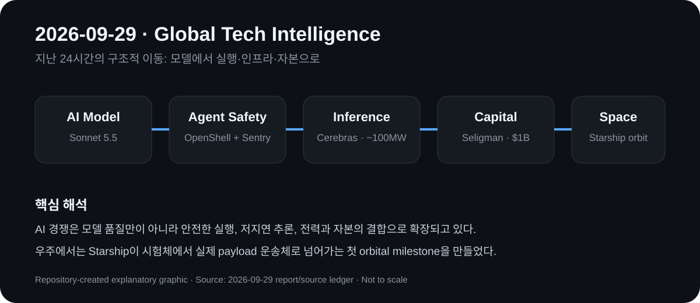

# Daily Global Tech Intelligence Report — 2026-09-29

> **Coverage cutoff:** 2026-09-29 08:23 KST  
> **Window:** previous 24 hours  
> **Source ledger:** [sources/2026/09/2026-09-29.md](../../../sources/2026/09/2026-09-29.md)

## Executive Summary
지난 24시간의 핵심은 AI가 모델 성능 경쟁을 넘어 **에이전트 보안·추론 인프라·물리 인프라 자본**, 그리고 우주 분야에서는 **대형 발사체의 실제 상업 payload 운송**으로 이동했다는 점이다. 오늘은 전날 다룬 IROS 개막·로봇 불확실성·인도 산업정책·DRAM 전망을 반복하지 않고, 새로 확인된 실행 사건 다섯 건을 선정했다.

## 1. AI / Security — NVIDIA, 에이전트 안전을 소프트웨어에서 실리콘까지 확장
**Priority:** High · **Confidence:** High

### FACT
NVIDIA는 9월 28일 Open Agent Safety Platform을 발표했다. 구성요소는 에이전트 실행을 추적하고 정책을 강제하는 오픈소스 런타임 **OpenShell**과, BlueField-4 DPU에서 에이전트 동작을 독립적으로 감시하는 레퍼런스 설계 **Sentry**다. NVIDIA는 Sentry가 경계를 벗어나는 에이전트를 밀리초 단위로 격리할 수 있다고 설명했다. Anthropic, Microsoft, Cisco, Figure, Hugging Face, JPMorganChase 등 여러 기업이 참여사로 명시됐다.

### ANALYSIS
에이전트 안전의 설계 중심이 모델 내부 정렬이나 애플리케이션 권한관리만이 아니라 **런타임 격리 + 별도 하드웨어 감시**로 내려가고 있다. 장시간 실행되고 실제 도구·데이터·로봇에 접근하는 에이전트가 늘수록, 모델과 독립된 enforcement layer가 엔터프라이즈 배치의 핵심 인프라가 될 가능성이 커졌다.

### UNCERTAINTY
격리 성능과 오버헤드에 대한 핵심 수치는 NVIDIA가 제시한 제품 설명이다. 다양한 공격·오류 조건과 제3자 하드웨어에서 동일한 효과가 재현되는지는 독립 검증이 필요하다.

### WATCH
OpenShell의 실제 도입률, BlueField 기반 Sentry의 독립 보안평가, 로봇·기업 시스템에서의 사고 감소 여부.

## 2. AI Models — Anthropic, Claude Sonnet 5.5 출시
**Priority:** High · **Confidence:** High

### FACT
Anthropic은 9월 28일 Claude Sonnet 5.5를 공개했다. 회사는 Sonnet 5 대비 30% 이상 빠르고 대부분의 작업에서 최대 30% 낮은 작업비용을 제시했으며, Terminal-Bench 4.0에서 70.6%를 기록했다고 밝혔다. Reuters는 API 가격이 입력 100만 토큰당 2달러, 출력 100만 토큰당 10달러로 이전 Sonnet 5와 동일하지만 같은 작업에 필요한 토큰이 줄었다는 회사 설명을 보도했다.

### ANALYSIS
프런티어 경쟁의 단위가 최고 벤치마크 점수 하나에서 **작업당 비용·속도·장시간 에이전트 수행능력**으로 이동하고 있다. 중간 가격대 모델의 성능이 빠르게 올라가면 기업은 최고급 모델을 모든 작업에 쓰기보다 업무 난이도에 따라 모델을 라우팅하는 구조를 강화할 수 있다.

### UNCERTAINTY
70.6% 등 성능 수치는 출시 시점의 회사 평가다. 실제 비용 절감은 작업 유형, 토큰 사용량, 도구 호출과 추론 설정에 따라 달라진다.

### WATCH
독립 에이전트 벤치마크, 기업의 Opus/Sonnet 라우팅 비율, 실제 task-level 비용과 실패율.

## 3. AI Infrastructure — Cerebras·Gimlet, 약 100MW 추론 인프라 공급 계획
**Priority:** High · **Confidence:** High

### FACT
Cerebras와 Gimlet Labs는 9월 28일 wafer-scale compute와 GPU를 결합한 Gimlet Cloud 협력을 발표했다. 양사는 최대 초당 3,000 토큰을 목표로 하며 첫 Cerebras 기반 데이터센터를 올해 안에 가동할 계획이라고 밝혔다. Reuters는 Cerebras가 Gimlet에 공급할 AI 칩·하드웨어의 전력소비 용량이 약 **100MW** 규모라고 보도했다.

### ANALYSIS
AI 인프라 수요가 학습뿐 아니라 **저지연 추론 전용 capacity**로 빠르게 분화되고 있다. 특히 서로 다른 실리콘을 추론 단계별로 조합하는 구조는 GPU 단일 아키텍처보다 workload-specific infrastructure 경쟁이 커질 수 있음을 보여준다.

### UNCERTAINTY
3,000 tokens/s와 연내 가동은 목표치다. 실제 모델별 속도, 가동률, 전력효율, 고객수요와 데이터센터 commissioning이 확인돼야 경제성을 평가할 수 있다.

### WATCH
첫 데이터센터 가동 시점, 실제 MW 배치, 모델별 latency/throughput, 고객계약과 단위 추론비용.

## 4. Space — Starship, 첫 궤도 도달·Starlink 실payload 배치
**Priority:** High · **Confidence:** High

### FACT
SpaceX의 Starship Flight 14가 9월 28일 발사돼 Starship 프로그램 최초로 궤도에 도달하고 첫 Starlink V3 위성 묶음을 배치했다. Reuters는 비행 중 엔진 하나가 예상보다 일찍 정지해 계획된 약 10시간 임무가 약 3시간으로 단축됐다고 보도했다. 그럼에도 payload 배치가 이뤄져 Starship은 시험비행에서 실제 운영 payload 운송 단계로 넘어가는 이정표를 만들었다.

### ANALYSIS
대형 완전재사용 발사체의 경제성은 시험 성공보다 **실제 payload 운송 + 반복 cadence + 재사용**에서 결정된다. 이번 비행은 첫 번째 축인 orbital payload delivery를 실제로 통과했다는 점에서 상업화 신호가 크다.

### UNCERTAINTY
엔진 조기 정지는 아직 신뢰성 리스크가 남아 있음을 보여준다. 한 번의 궤도·배치 성공이 목표 발사빈도나 완전재사용 경제성을 검증하지는 않는다.

### WATCH
Flight 15 일정, 엔진 정지 원인, 다음 Starlink 배치, Ship/Super Heavy 회수·재비행, 발사 간격.

## 5. Economy / Investment — Seligman Ventures, AI 인프라 투자여력 10억달러로 확대
**Priority:** Medium-High · **Confidence:** High

### FACT
Seligman Investments는 9월 28일 Seligman Ventures의 deployable capital을 초기 5억달러에서 **10억달러**로 두 배 확대했다고 발표했다. Reuters에 따르면 이 조직은 2026년 2월 출범 이후 AI 하드웨어·연결성·사이버보안 분야 14건에 3억달러 이상을 투자했다. 회사는 가속기, 네트워킹, 전력·냉각 등 AI 인프라 병목을 투자대상으로 제시했다.

### ANALYSIS
소프트웨어 중심이었던 벤처 자본 일부가 반도체·광학·전력·냉각처럼 자본집약적인 AI 공급망으로 이동하는 신호다. 이는 AI 인프라 확장이 hyperscaler CAPEX뿐 아니라 민간 성장자본 시장의 투자전략도 바꾸고 있음을 보여준다.

### UNCERTAINTY
deployable capital은 실제 집행액과 다르며, 인프라 투자 확대가 높은 수익률을 보장하지 않는다. AI capacity가 빠르게 늘 경우 특정 계층에서는 과잉설비 위험도 커질 수 있다.

### WATCH
향후 12개월 신규 투자, hardware/infrastructure 비중, 후속 자금조달과 exit, AI 인프라 기업의 실제 매출·현금흐름.

## Cross-sector signal
오늘의 다섯 사건은 하나의 구조적 이동을 가리킨다. AI의 가치사슬이 **모델 → 에이전트 실행·보안 → 추론 실리콘·전력 → 자본**으로 길어지고 있으며, 우주에서도 개발형 하드웨어가 실제 payload 운송으로 넘어가고 있다. 이에 따라 장기 추적 문서의 AI infrastructure와 space commercialization 신호를 갱신했다.
