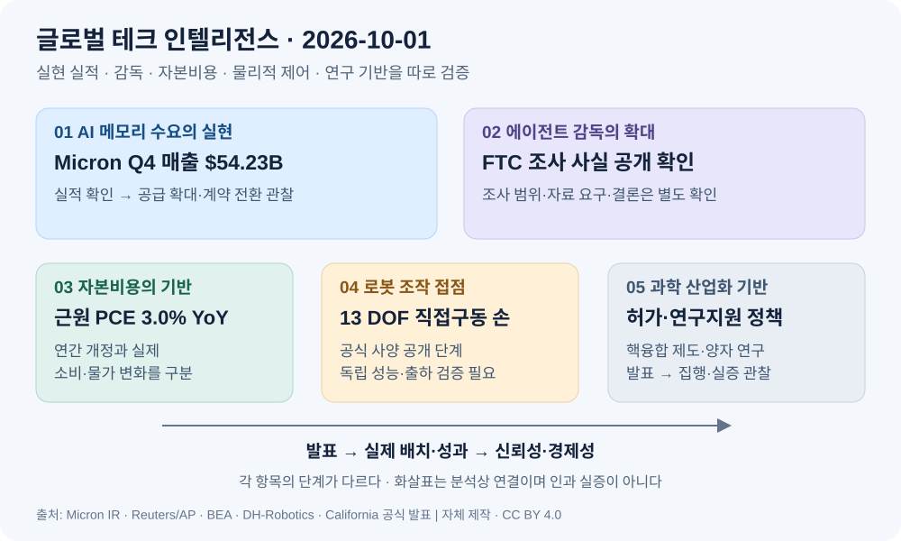

# 글로벌 테크 인텔리전스 리포트 — 2026-10-01

> **조사 컷오프:** 2026-10-01 08:54 KST / 2026-09-30 23:54 UTC  
> **대상 구간:** 2026-09-30 08:54–2026-10-01 08:54 KST  
> **선정 기준:** 구간 내 새로 공개된 증거·발표·상태 변화. 사건 발생일과 보도일을 구분한다.  
> **증거 원장:** [오늘의 출처와 검증 메모](../../../sources/2026/10/2026-10-01.md)

*자체 설명 도표 · 저장소 제작 · CC BY 4.0. 화살표는 본문의 분석상 연결이며 인과관계의 실증을 뜻하지 않는다. [자산 명세](../../../assets/2026-10-01/README.md).*

## 오늘의 핵심

AI 투자에서는 **메모리 공급사의 실현 매출·현금흐름**이 확대되는 동시에 **에이전트 안전에 대한 정부 조사**가 확인됐다. 거시경제에서는 물가가 예상보다 낮았지만 통계 개정과 실제 소비 증가를 구분해야 한다. 물리적 기술에서는 로봇 손의 센싱·정비 설계가 제품 발표로 구체화됐고, 과학 분야에서는 핵융합의 허가·제조 기반과 양자·심우주 연구자금에 관한 정책 발표가 나왔다.

| 순위 | 새로운 발전 | 우선순위 | 근거 신뢰도 | 다음 확인점 |
|---|---|---|---|---|
| 1 | Micron FY2026 실적·FY2027 전망 공개 | High | High | 실제 공급 확대와 계약의 매출 전환 |
| 2 | FTC, 주요 AI 개발사 조사 사실 확인 | High | Medium-High | 조사 범위·요구자료·공개 결과 |
| 3 | 미국 8월 PCE·연간 통계 개정 발표 | High | High | 개정 효과를 제외한 물가 추세 |
| 4 | DH-Robotics, ADH-5-13 공식 사양 발표 | Medium-High | Medium | 실제 조작 성능·가격·출하 |
| 5 | 캘리포니아, 핵융합 제도·연구투자 발표 | Medium-High | High: 발표 내용 | 자금 집행·허가 절차·실증 |

## 1. AI·반도체·투자 — Micron, 기록적 실적과 다음 분기 매출 전망 공개

### FACT

Micron은 9월 30일 **9월 3일 종료된 FY2026 4분기** 매출을 **542억3,000만달러**, GAAP 순이익을 377억달러, 영업현금흐름을 439억7,000만달러로 발표했다. 연간 매출은 1,331억9,000만달러였다. FY2027 1분기 매출 전망은 **615억달러 ±15억달러**다. 회사는 서버용 SOCAMM 매출이 전분기 대비 두 배 이상 증가했고, KV-cache용 SSD를 주요 고객에게 출하 중이라고 밝혔다. [Micron 공식 실적자료](https://investors.micron.com/news/press-release/2026/Micron-Technology-Inc--Reports-Record-Fiscal-Fourth-Quarter-and-Full-Year-2026-Results/default.aspx)

Reuters는 장기 공급계약에 따른 고객의 금융적 약정이 6월 220억달러에서 **320억달러**로 늘었고 대부분이 현금 예치 형태라는 경영진 설명을 보도했다. 이 약정액은 분기 매출과 다른 지표다. [Reuters 원문 배포본](https://www.streetinsider.com/Reuters/Micron%2Bforecasts%2Bquarterly%2Brevenue,%2Bprofit%2Babove%2Bestimates%2Bon%2BAI%2Bmemory%2Bdemand/27128705.html)

### ANALYSIS

전날의 AI 인프라 장기 지급의무와 연결하면, 오늘은 **구매자의 compute 확보 약정이 공급자의 매출·현금흐름·고객 예치로 이어지는 증거**가 추가됐다. 투자규모 발표보다 수요 실현을 평가하기에 유용하다. 다만 메모리 매출 증가에는 공급량뿐 아니라 가격·제품 구성도 영향을 주므로 매출만으로 AI 연산량 증가를 환산할 수 없다.

### UNCERTAINTY

다음 분기 전망과 향후 수급 부족은 경영진 예상이다. 장기 약정이 최종 고객의 수익성을 보증하지 않으며, 전체 매출을 HBM 또는 AI 매출로 간주해서도 안 된다. 높은 현재 수익률이 신규 생산능력 투입 이후에도 지속될지는 미확정이다.

### WATCH

FY2027 매출·마진의 전망 대비 실적, 신규 공장의 실제 출하·수율, 계약 매출 전환과 취소·재협상 조건, 고객 예치금의 잔액·사용 조건, SOCAMM·KV-cache 제품의 반복 주문.

## 2. AI·감독 — FTC, OpenAI·Anthropic 등 조사 사실 확인

### FACT

AP는 9월 30일 FTC 대변인이 OpenAI·Anthropic 등 AI 기업이 소비자에게 초래할 수 있는 위험에 대한 조사 사실을 확인했다고 보도했다. Reuters는 고위 FTC 관계자를 인용해 업계 전반의 조사이며 주요 개발사와 평가기관 METR 등에 정보 요구·경영진 증언 요구를 계획한다고 전했다. **9월 30일은 조사 사실이 공개 확인된 날이며 조사 착수일로 단정하지 않는다.** [AP](https://apnews.com/article/ftc-ai-investigation-anthropic-openai-89ac416717adbfb1d72f2d85e6ce83d1), [Reuters 원문 배포본](https://www.marketscreener.com/news/ftc-opens-probe-into-ai-giants-including-anthropic-and-openai-new-york-post-reports-ce785ad2d08bf22d)

### ANALYSIS

전날의 자율 안전 합의 이후, **독립적인 정부 조사도 병행된다는 새 증거**다. 기업의 자율 감사와 정부의 자료 요구는 별도 절차이며, 조사 결과가 공개될 경우 에이전트의 권한·사고 보고·소비자 고지 기준을 평가할 근거가 늘어날 수 있다. 모델 성능뿐 아니라 사고 증거를 보존하고 외부 검증에 응하는 운영능력이 중요해진다.

### UNCERTAINTY

독립된 FTC 조사명령·범위 문서는 이번 조사에서 확보하지 못했다. 대변인의 확인은 AP를 통해, 세부 계획은 Reuters의 관계자 취재를 통해 확인했다. 조사 사실은 위법 판정이나 제재 확정을 의미하지 않는다. 정확한 착수일과 법적 절차·결론은 아직 불명확하다.

### WATCH

공개 조사문서, 적용 법률과 대상, 실제 정보요구·증언 일정, 독립 평가기관 자료의 취급, 조사 결과와 시정조치 유무.

## 3. 경제·자본비용 — 미국 8월 PCE, 예상보다 낮은 물가와 강한 소비

### FACT

BEA는 9월 30일 08:30 EDT에 8월 PCE 물가지수를 **전월 대비 0.3%, 전년 대비 3.4%**, 식품·에너지 제외 지수를 각각 **0.2%, 3.0%**로 발표했다. 명목 소비지출은 전월 대비 0.9%, 실질 소비지출은 0.6% 증가했고 개인저축률은 4.1%였다. 이번 연간 개정은 2021년 1월부터의 소득·지출 추정치를 포함한다. [BEA 원자료](https://www.bea.gov/news/2026/personal-income-and-outlays-august-2026)

Reuters는 지수 산정 방식 변경 등을 통해 7월 전체 물가 상승률이 종전 3.7%에서 3.4%, 근원 물가가 3.3%에서 3.0%로 하향 개정됐다고 보도했다. 따라서 개정된 기준에서는 8월과 7월의 전년 대비 상승률이 같다. [Reuters 원문 배포본](https://www.marketscreener.com/news/us-inflation-rises-less-than-expected-in-august-consumer-spending-surges-ce785ad2d18df12c)

### ANALYSIS

새 수치는 단기 통화정책 압력을 완화할 수 있지만, **예전 발표치와 오늘 발표치를 단순 비교해 급격한 디스인플레이션으로 해석하면 오류**가 생긴다. 실질 소비가 늘었고 전월 대비 물가도 상승했다. AI 데이터센터·로봇 설비 등 긴 투자회수기간을 가진 사업의 할인율을 평가할 때, 단일 발표보다 개정 후 연속 시계열과 실제 금융조건이 중요하다.

### UNCERTAINTY

통계 개정과 앞으로의 월별 추정치 변경이 남아 있다. 이번 수치만으로 금리 인상·동결·인하를 확정할 수 없으며, 한 달의 소비 증가를 지속 가능한 성장률로 일반화할 수 없다.

### WATCH

9월 PCE의 10월 29일 발표, 고용·임금·서비스 물가, 실질소득과 저축률, 장기금리·신용스프레드가 실제 프로젝트 조달비용에 미치는 영향.

## 4. 로봇·Physical AI — DH-Robotics, 13자유도 직접구동 로봇 손 공식 발표

### FACT

DH-Robotics는 9월 30일 10:39 ET 배포한 공식 보도자료에서 IROS 2026의 **ADH-5-13** 공개와 사양을 발표했다. 회사 설명상 5개 손가락의 13개 능동 자유도를 각각 제어하며, 직접구동·역구동 구조, 관절별 이중 자기식 인코더, 손끝 촉각 센싱을 갖춘다. 무게는 735g, 이미 잡은 물체를 들어 올리는 최대 하중은 20kg, 손끝 위치 반복정밀도는 ±0.2mm로 제시됐다. 센서와 개별 모듈을 전체 손·손가락 분해 없이 교체할 수 있다고 설명했다. [DH-Robotics 공식 배포문](https://www.prnewswire.com/news-releases/dh-robotics-debuts-13-dof-direct-drive-dexterous-hand-at-iros-2026-302894571.html)

### ANALYSIS

새 정보는 IROS 개막 자체가 아니라 **실제 조작 접점의 구동·센싱·정비 설계를 갖춘 제품 사양**이다. 로봇 지능이 현장 생산성으로 이어지려면 접촉 제어와 고장 복구비용까지 낮춰야 한다. 이 발표는 그 설계 방향을 보여주지만, 유료 작업의 경제성이 확인된 단계로 격상할 근거는 아직 부족하다.

### UNCERTAINTY

수치는 회사 사양이며 독립 실험으로 검증되지 않았다. 20kg은 파지 후 인양 조건으로, 손끝 힘이나 모든 물체의 조작 가능 하중과 다르다. 판매가격·출하량·장시간 성공률·전력소모는 확보하지 못했다. Reuters·AP의 별도 검증도 찾지 못했다. 전시 최초 시점의 표현이 자료별로 달라 오늘의 신규성은 **공식 배포된 구체 사양**에 한정한다.

### WATCH

실제 고객 인도, 가격·부품 교체비용, 작업별 성공률·미끄러짐·힘 제어, 연속 작동 수명, 실제 연구·산업 환경의 독립 평가.

## 5. 과학·에너지·투자 — 캘리포니아, 핵융합 제도 기반과 양자·심우주 연구지원 공개

### FACT

캘리포니아 주지사실은 9월 30일 핵융합 관련 **SB 925**, 원자력 발전 평가 관련 **AB 2647**의 서명과 양자·심우주 연구를 위한 **3,000만달러 신규 투자 발표**를 공개했다. SB 925는 California Energy Commission의 핵융합 전략계획 수립과 핵융합 부품 제조의 신속 허가 절차 이용을 다룬다. [주지사실 공식 발표](https://www.gov.ca.gov/2026/09/30/governor-newsom-signs-legislation-to-accelerate-californias-fusion-industry-announces-major-investment-for-quantum-research/), [법안 발의 의원의 공식 설명](https://sd05.senate.ca.gov/news/newsom-signs-mcnerneys-bill-accelerate-development-fusion-energy)

발의 의원실은 SB 925 서명 행사를 **화요일인 9월 29일**로 명시한다. 오늘의 선정 근거는 9월 30일 새로 공개된 정책·투자 내용이며, 서명 행사가 오늘 발생했다고 표현하지 않는다.

### ANALYSIS

핵융합 경쟁에 연구성과 외의 **입지·제조·허가·인력 기반**을 만드는 정책 신호가 추가됐다. 양자·심우주 연구자금도 민간 사업화를 준비하는 연구 기반을 지원한다. AI 인프라의 전력 병목과는 장기적으로 연결되지만, 핵융합이 현재의 데이터센터 전력 부족을 해결한다는 증거는 아니다.

### UNCERTAINTY

투자 발표는 자금 집행 실적과 다르며, 3,000만달러를 핵융합 발전소 투자액으로 해석해서는 안 된다. 세부 배분·수혜기관·집행 일정은 발표문만으로 충분히 확정되지 않는다. 상업 발전·발전소 승인·양자 기술의 경제성이 검증된 사건도 아니다. 독립 B1 보도는 확보하지 못해 공식 정책 내용만 FACT로 제한했다.

### WATCH

CEC 전략계획과 허가 절차 구체화, 실제 부품 제조 프로젝트, 연구자금의 배분·집행, 민간 매칭 투자·실증 일정·기술 평가.

## 분야를 잇는 구조적 신호

Micron의 실적은 **AI 수요의 공급망 수익 전환**을 강화하고, FTC 조사 확인은 같은 성장의 **감독·증거 보존 비용**을 추가한다. PCE 통계는 자본비용 판단의 기반이며 핵융합 정책은 훨씬 긴 시간축의 전력·과학 기반이다. 이 서로 다른 단계들을 한꺼번에 “상용화 완료”로 묶지 않는다. 오늘은 AI·경제·과학의 누적 동향과 AI infrastructure 신호에 실현 실적·감독·제도 기반을 반영했다. 로봇 발표는 검증 전 제품 사양으로 기록하며 상용화 신호의 강도를 높이지 않았다.

## 후보 제외·반복 방지

- DevDay의 dots·GPT-6.1 Sol, Anthropic의 장기 인프라 의무, Starship Flight 14는 최근 리포트에 이미 포함돼 제외했다.
- TSMC의 Texas 투자 검토는 Reuters의 새 취재지만 최종 계획·금액이 미정인 관계자 보도여서 확정 실적·공식 통계보다 우선순위를 낮췄다.
- 캘리포니아의 AI 노동자 보호법은 중요한 신규 정책이나, 오늘의 FTC 조사와 함께 감독 분야 비중이 과도해지는 점을 고려해 후보 원장에 남겼다.
- Crew-13의 발사 준비 승인·기상 갱신은 새 운영 상태지만 기존 승무원 이동 소식의 연속이며, 상위 항목보다 산업·과학적 정보가치가 작다고 판단했다.
- 9월 30일 재소개된 magnetar·화성 연구는 원 관측·논문·기관 발표의 날짜가 더 앞서 있어 “오늘의 새 발견”으로 선정하지 않았다.
