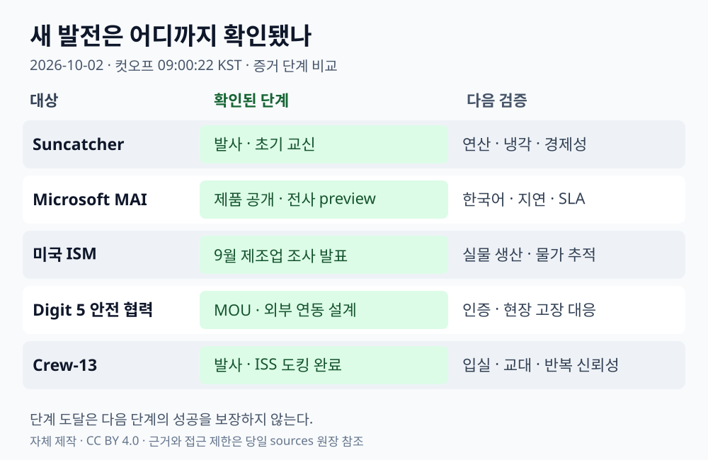

# 글로벌 테크 인텔리전스 리포트 — 2026-10-02

> **조사 컷오프:** 2026-10-02 09:00:22 KST / 2026-10-02 00:00:22 UTC  
> **대상 구간:** 2026-10-01 09:00:22–2026-10-02 09:00:22 KST  
> **선정 기준:** 새 제품의 접근 가능성, 실제 운영 단계 변화, 새로운 경제 데이터. 보도 날짜가 최근이어도 최초 발표가 구간 밖이면 제외한다.  
> **증거 원장:** [원본 URL·날짜·검증·접근 제한](../../../sources/2026/10/2026-10-02.md)

*저장소 제작 설명 도표 · CC BY 4.0 · 사건 사진이 아닌 증거 단계 비교. [자산 명세](../../../assets/2026-10-02/README.md).*

## 오늘의 핵심

AI 인프라의 새로운 실험 장소가 **궤도**로 확장됐다. Project Suncatcher는 발사와 초기 교신 단계에 들어갔지만 냉각·연산·경제성이 입증된 것은 아니다. 실용 AI에서는 Microsoft의 실시간 음성 모델 3종이 공개됐고, 휴머노이드에서는 로봇 밖의 안전 장치와 연결하는 협력이 공식화됐다. 미국 제조업은 확장세를 유지하면서 투입가격 압력이 커졌으며, Crew-13은 준비 단계에서 실제 ISS 도킹으로 넘어갔다.

| 순위 | 새로운 발전 | 우선순위 | 근거 신뢰도 | 다음 확인점 |
|---|---|---|---|---|
| 1 | Suncatcher 첫 TPU 시험 위성 발사·초기 교신 | High | Medium-High | 궤도 연산·냉각·방사선 오류 데이터 |
| 2 | Microsoft, 실시간 전사·음성 생성 모델 공개 | High | High: 제품·가격 / Medium: 성능 주장 | 한국어·실제 회선에서 지연·정확도 |
| 3 | 미국 9월 ISM: 제조업 확장과 가격 압력 동시 지속 | High | High | 물가·고용·실물 생산의 후속 확인 |
| 4 | Agility·FORT, Digit 5 외부 안전 연동 협력 MOU | Medium-High | High: MOU / Medium: 구현 효과 | 인증·고장 대응·현장 설치 실적 |
| 5 | Crew-13, 발사 후 7시간55분 만에 ISS 도킹 | Medium-High | High | 승무원 교대·연구·다음 임무 신뢰성 |

## 1. AI·우주 인프라 — Suncatcher, 발사와 초기 교신 단계에 진입

### FACT

Planet은 10월 1일 **Project Suncatcher 시험 위성의 발사 성공과 초기 교신, 시운전 착수**를 발표했다. 이날 Transporter-18에 탑승했다는 발표는 Via Satellite와 NPR 보도로 대조했다. 원래 Business Wire 페이지 접근이 제한돼, 회사 명의 배포본 전문을 확인했다. [Planet 발표 배포본](https://c4d9sdgnewsgroup.marketminute.com/article/bizwire-2026-10-1-planet-launches-suncatcher-tanager-2-and-18-superdove-satellites) · [Via Satellite](https://www.satellitetoday.com/launch/2026/10/01/the-first-mission-milestones-onboard-spacexs-transporter-18-rideshare-launch/)

NASA의 같은 비행 기록은 발사 시각을 **10월 1일 11:32 PDT / 18:32 UTC / 10월 2일 03:32 KST**로 확인한다. NPR은 시제품에 **TPU 4개**가 실렸으며 열관리 제약 때문에 Gemma 실행을 한 번에 15분씩 계획한다고 보도했다. 이는 지속 연산 실적이 아니다. [NASA 발사 기록](https://www.nasa.gov/blogs/smallsatellites/2026/10/01/nasa-smallsats-launch-to-advance-science-technology-orbital-operations/) · [NPR/GPB](https://www.gpb.org/news/2026/10/01/google-launches-project-suncatcher-step-towards-ai-data-centers-in-space)

### ANALYSIS

9월 24일의 발사 예고와 달리 오늘은 실제 하드웨어가 궤도 시험 단계로 넘어간 변화다. 지상 전력·냉각 병목에 대한 대안 연구가 물리적 실험으로 이동했다는 의미는 크다. 그러나 투자 판단에는 칩 생존 여부, 유효 처리량, 통신·냉각 질량, 발사·수리 비용을 함께 봐야 한다.

### UNCERTAINTY

초기 교신은 Planet의 자체 확인이며 원래 배포 페이지에 직접 접근하지 못했다. 궤도에서 TPU가 실제로 장시간 모델을 실행한 결과, 상용 고객 서비스, 지상 대비 비용 우위는 확인되지 않았다. Google의 2027년 두 위성 간 고대역폭 레이저 연결 시험도 향후 계획이다. NPR 인터뷰에서 프로젝트 책임자는 5년 안에 지상보다 저렴해질 것으로 보지 않는다고 말했다. NPR은 Google의 재정 지원을 받는다고 공개했다. [Google 기술 배경·9월 24일 발표](https://blog.google/innovation-and-ai/models-and-research/google-research/google-project-suncatcher-facts/?trk=public_post_comment-text) · [NPR/GPB](https://www.gpb.org/news/2026/10/01/google-launches-project-suncatcher-step-towards-ai-data-centers-in-space)

### WATCH

최초 TPU 가동·워크로드 로그, 오류율·재부팅 빈도, 열평형과 연속 실행시간, 시운전 완료, 레이저 연결 시험, 실제 처리량당 총비용. 같은 비행의 NASA SSPICY는 2027년 위성 검사를 시작할 계획이므로 발사와 자율 검사 성공을 구분해 추적한다. [NASA](https://www.nasa.gov/blogs/smallsatellites/2026/10/01/nasa-smallsats-launch-to-advance-science-technology-orbital-operations/)

## 2. AI·개발자 도구 — Microsoft, 스트리밍 전사와 다국어 음성 생성 공개

### FACT

Microsoft는 10월 1일 **MAI-Transcribe-2-Streaming, MAI-Voice-2.1, MAI-Voice-2.1-Flash**를 공개했다. 회사가 제시한 전사 지원 범위는 60개 언어, 음성 생성은 23개 언어·26개 로케일이다. 전사는 연말까지 오디오 시간당 **0.54달러**의 도입 가격, 음성 생성은 100만 문자당 **22달러**, Flash는 **15달러**다. [Microsoft AI 공식 발표](https://microsoft.ai/news/our-first-streaming-transcription-model/)

Microsoft Learn은 스트리밍 전사를 **public preview, SLA 없음**으로 명시하며, 연속 오디오의 중간 결과와 최종 결과를 받는 방식으로 설명한다. 발표 페이지의 “사용 가능”과 정식 상용 서비스 보장을 구분해야 한다. [공식 제품 문서](https://learn.microsoft.com/en-us/azure/ai-services/speech-service/mai-transcribe-2-streaming)

### ANALYSIS

음성 에이전트의 가치는 전사·추론·도구 호출·음성 생성 전체 시간에서 결정된다. 중간 전사 결과를 활용하면 추론을 일찍 시작할 수 있지만, 뒤에 수정되는 문장 때문에 도구 실행을 잘못 시작할 수도 있다. 한국어 상담·자막 프로젝트에서는 최종 정확도뿐 아니라 부분 전사의 안정성, 발화 중단 대응, 총 통화비용을 함께 비교할 만하다.

### UNCERTAINTY

회사는 100ms를 조금 넘는 시점의 첫 부분 결과와 Artificial Analysis 정확도 1위를 주장한다. 독립 평가 페이지를 열었으나 이번 접근에서는 해당 모델의 표 행을 추출하지 못해 순위·수치를 독립 확인으로 취급하지 않았다. 실제 회선 지연, 억양·잡음·한국어 성능, 지역별 제공 범위도 직접 시험하지 않았다. Reuters·AP의 별도 성능 검증은 찾지 못했다. [평가 원문](https://artificialanalysis.ai/speech-to-text/streaming)

### WATCH

한국어·다화자·잡음 테스트, 부분 결과의 번복률, 첫 응답·최종 응답 지연, 도구 호출 취소·확인 설계, preview 종료·SLA·가격 변화. 60개 전사 언어를 60개 음성 생성 언어로 확대 해석하지 않는다.

## 3. 경제·투자 — 제조업 확장 속 투입가격 지수 재상승

### FACT

ISM이 10월 1일 10:00 EDT 발표한 **9월 미국 제조업 PMI는 54.5**, 8월 54.6보다 0.1포인트 낮으며 9개월 연속 확장이다. 신규 주문은 **53.7→55.3**, 생산은 **58.3→56.7**, 고용은 **51.2→52.7**, 투입가격은 **71.1→77.9**다. 투입가격 지수는 한 달에 6.8포인트 상승했다. [ISM 원문 배포본](https://www.prnewswire.com/news-releases/manufacturing-pmi-at-54-5-september-2026-ism-manufacturing-pmi-report-302894520.html)

Reuters 배포본의 핵심 수치를 원문과 대조했다. Reuters는 AI 인프라 투자와 재고 재축적이 제조업을 지지하되, AI와 관련이 약한 부문은 전쟁·에너지·공급망 충격에 더 취약할 수 있다고 보도했다. [Reuters 배포본](https://www.investing.com/news/economic-indicators/us-manufacturing-steady-in-september-input-prices-increase-4927718)

### ANALYSIS

전날 PCE 통계 개정만으로 자본비용 압력이 해소됐다고 판단하기 어렵게 만드는 새 관측이다. 주문 증가와 가격 압력이 함께 나타나므로 기술 공급업체의 매출 증가, 원가 부담, 고객의 투자 지연을 분리해서 봐야 한다. AI 투자 수혜가 제조업 전체에 고르게 퍼졌는지 확인하는 것이 유용하다.

### UNCERTAINTY

PMI와 가격 지수는 응답의 확산지수다. **77.9는 가격이 77.9% 상승했다는 뜻이 아니며**, PMI 54.5도 생산량 증가율이 아니다. 표본 기업의 설명만으로 AI가 전체 물가 상승을 일으켰다고 단정할 수 없다. 한 달 조사로 장기 성장·금리 경로를 확정하지 않는다.

### WATCH

9월 고용보고서와 생산·PPI, 후속 신규 주문·가격 지수, 공급 지연과 마진, AI 관련·비관련 산업의 투자 차이. 후속 발표 결과는 오늘 컷오프 이후 데이터와 분리한다.

## 4. 로봇·자율성 — Digit 5 안전 범위를 로봇 밖으로 확장하는 협력

### FACT

Agility와 FORT는 10월 1일 **Digit 5 안전 인프라 협력 MOU 체결**을 발표했다. 내용은 안전 pendant, 로봇 내 통신, 외부 안전 시스템과 연결하는 **Offboard Safety Bridge**의 3부분 구조다. 양사는 공동 하드웨어 개발·규제 준수·배치 지원을 협력 범위로 밝혔다. 양쪽 공식 페이지에서 같은 발표를 확인했다. [Agility](https://www.agilityrobotics.com/content/agility-and-fort-robotics-announce-strategic-partnership-to-advance-humanoid-robot-safety) · [FORT](https://www.fortrobotics.com/news/agility-and-fort-robotics-announce-strategic-partnership-to-advance-humanoid-robot-safety)

### ANALYSIS

사람과 함께 쓰는 휴머노이드의 배치 단위가 로봇 한 대에서 공장·창고의 안전 체계로 넓어지는 설계 방향이다. 외부 정지 장치·센서와의 연결, 수동 개입, 안전 상태 전파가 통합 비용과 실제 가동시간에 영향을 줄 수 있다. 손 자유도나 단일 작업 영상과 다른 실용화 평가 축이다.

### UNCERTAINTY

MOU와 설계 의도는 인증 완료·사고율 감소·현장 성능의 증거가 아니다. 두 회사는 이해관계자이고 동일 발표를 게시했으므로 **독립 교차검증 2건으로 계산하지 않는다**. 구현 일정·인증 범위·설치 비용·고장 대응 실적은 확인되지 않았다. Digit 5 자체 공개는 9월 15일 사건으로 오늘의 신규 발표에 포함하지 않는다.

### WATCH

안전 인증과 시험 조건, 통신 끊김·전원 고장 때의 동작, 현장별 위험성 평가, 사람 접근 시 정지·재개 성능, 고객 설치·운영 로그·총비용.

## 5. 우주·과학 운영 — Crew-13, 실제 발사·도킹 완료

### FACT

NASA는 Crew-13의 10월 1일 **11:10 EDT 발사**, **19:05 EDT ISS 도킹**을 확인했다. 한국시간으로 각각 10월 2일 **00:10, 08:05**이며, 발사에서 도킹까지 **7시간55분**이다. NASA는 ISS 역사상 미국 우주선의 최단 발사–도킹 기록으로 명시했다. 도킹 직후에는 해치 개방 전 누설 점검·가압 절차가 예정됐다. [NASA 발사 발표](https://www.nasa.gov/news-release/nasas-spacex-crew-13-launches-to-international-space-station/) · [NASA 도킹 원문](https://www.nasa.gov/blogs/spacestation/2026/10/01/dragon-docks-bringing-spacex-crew-13-to-station/)

AP 검색 제공 본문도 도착과 약 8시간 비행을 보도한다. AP 원문 접근 제한과 검색의 시각 메타데이터 불일치는 원장에 남겼으며 정확한 시각·기록 범위는 NASA 원문을 따른다. [AP](https://apnews.com/article/d885ec0dcb9fab8bbf8977103118caa0)

### ANALYSIS

[9월 27일 발사 준비](../09/2026-09-27.md)와 구별되는 실제 승무원 수송 성과다. 더 짧은 이동은 승무원 부담과 수송 운영을 개선할 수 있지만, 궤도 위치·발사 창 등 특정 조건에 의존한다. 모든 후속 임무가 같은 속도로 운용될 것이라는 증거는 아니다.

### UNCERTAINTY

컷오프는 예정 해치 개방 시각보다 빠르므로 입실·교대 완료를 확정하지 않는다. 기록은 **ISS행 미국 우주선** 범위이며 세계 모든 유인우주선의 최단 기록으로 쓰지 않는다. 빠른 도킹만으로 발사·우주선의 장기 안전성과 비용 효율을 판단할 수 없다.

### WATCH

실제 해치 개방·교대, 연구 수행, 이전 승무원 귀환, 이후 임무의 지연·정비·반복 신뢰성.

## 분야 간 연결과 누적 반영

오늘의 구조적 변화는 **AI 연산 인프라의 위치 선택이 전력·냉각·통신·우주 운용 비용과 함께 검증되는 단계**로 확장된 점이다. Suncatcher의 발사·교신은 시험 경로를 강화하지만 상용 궤도 데이터센터의 경제성을 강화한 증거는 아니다. [AI 인프라 신호](../../../signals/ai-infrastructure.md)와 [우주 상용화 신호](../../../signals/space-commercialization.md)에 근거·한계·관찰 지표를 함께 누적한다.

[AI 트렌드](../../../trends/artificial-intelligence.md)는 음성 인터페이스의 제품 접근성과 preview 제약을, [우주·과학 트렌드](../../../trends/space-science.md)는 발사 이후 교신·시운전·연산 검증 단계를 반영한다. ISM 한 달 수치와 로봇 MOU만으로 경제·로봇 분야의 장기 방향을 상향 조정하지 않았다. 기존 IROS 행사 브리핑은 별도 문서로 유지한다.
