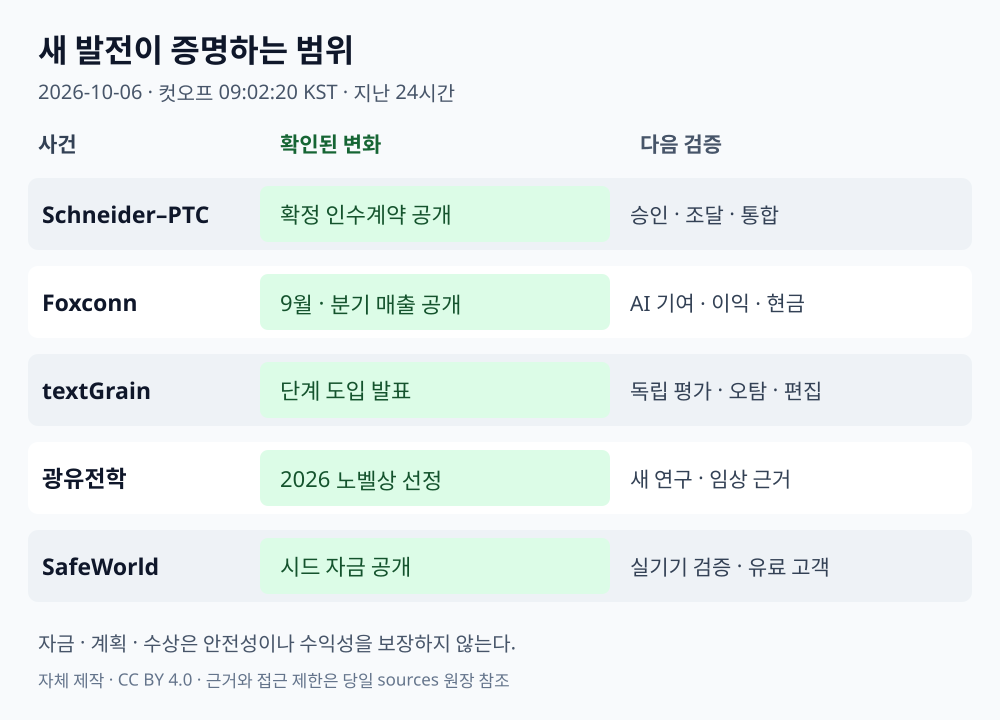

# 글로벌 테크 인텔리전스 리포트 — 2026-10-06

> **조사 컷오프:** 2026-10-06 09:02:20 KST / 00:02:20 UTC  
> **대상 구간:** 2026-10-05 09:02:20–2026-10-06 09:02:20 KST  
> **증거 원장:** [원본 URL·등급·시각·검증 메모](../../../sources/2026/10/2026-10-06.md)

*자체 제작 설명 도표 · CC BY 4.0 · 사건 사진이 아닌 증거 단계 비교. [자산 명세](../../../assets/2026-10-06/README.md).*

## 오늘의 핵심

산업 AI의 경쟁 범위가 **전력·서버에서 설계 데이터와 검증 체계까지** 넓어지고 있다. Schneider–PTC의 확정 인수계약 공개와 Foxconn의 새 매출은 각각 미래의 결합 전략과 현재의 수요 전환을 보여준다. 텍스트 출처 표시와 로봇 안전 평가에는 실제 도입 경로가 추가됐지만, 탐지 결과·시뮬레이션만으로 진실성·안전성을 확정할 수 없다. 과학에서는 광유전학의 노벨상 수상 발표를 다루며, 오래된 발견과 오늘의 새 수상 결정을 구분한다.

| 순위 | 새로운 발전 | 우선순위 | 근거 신뢰도 | 다음 확인 |
|---|---|---|---|---|
| 1 | Schneider–PTC, 지분가치 226억달러 인수계약 공개 | High | High: 계약·조건 / Medium: 효과 전망 | 승인·조달·통합 성과 |
| 2 | Foxconn, 9월 매출과 3분기 실현 매출 공개 | High | High: 미감사 매출 | AI 기여분·마진·현금흐름 |
| 3 | OpenAI, textGrain 단계 도입 발표 | High | High: 발표 / Medium: 회사 성능 평가 | 언어·편집별 독립 평가 |
| 4 | 2026 노벨 생리의학상, 광유전학 연구자 3명 선정 | Medium-High | High | 후속 연구·임상 근거 |
| 5 | SafeWorld, 로봇 안전 평가용 1,220만달러 시드 공개 | Medium-High | High: 발표 / Medium: 효용 | 실기기 검증·유료 고객 |

## 1. 산업 AI·경제 — Schneider Electric, PTC 확정 인수계약 공개

### FACT

10월 5일 공개된 공동 발표는 Schneider가 PTC 주식 전부를 **주당 205달러 현금**에 인수하는 확정 계약을 확인한다. **지분가치 약 226억달러, 기업가치 237억달러**, 직전 종가 대비 프리미엄 42.3%다. 설계·엔지니어링 데이터를 에너지·산업 운영 데이터와 연결하는 전략을 제시했다. [SEC 제출 공동 발표](https://www.sec.gov/Archives/edgar/data/857005/000119312526413124/d174191dex991.htm) · [Reuters/Euronext](https://live.euronext.com/en/financial-news/schneider-electric-buy-us-software-firm-ptc-226-billion-deal)

### ANALYSIS

AI를 산업 현장에 적용하려면 현재 센서값뿐 아니라 설계 의도·제품 변경 이력·운영 조건이 필요하다. 전력·자동화 기업의 제품 생애주기 소프트웨어 확보는 이 데이터 연결에 자본을 배분하는 변화다. 데이터 연결의 가치와 높은 인수가격을 정당화할 수익은 별도로 검증해야 한다.

### UNCERTAINTY

**인수 완료가 아니다.** PTC 주주·규제 승인 등을 거쳐 2027년 3분기까지 종결할 계획이다. 신규 주식 50억–60억유로·부채 160억–170억유로 조달, 비용·매출 시너지는 회사 계획이며 실현 성과가 아니다. Reuters는 당일 초기 파리 거래에서 Schneider 주가가 약 10% 하락했다고 보도했다. 이는 거래 부담의 시장 반응이며 장기 실패 판정은 아니다.

### WATCH

승인·종결 일정, 실제 증자와 차입 조건, 고객의 데이터 연결·상호운용성, 통합 비용, 반복매출·현금흐름. 비교할 때 지분가치와 기업가치를 혼합하지 않는다.

## 2. 경제·AI 하드웨어 — Foxconn, 9월·3분기 매출로 수요 전환 확인

### FACT

Foxconn의 10월 5일 공식 **미감사** 표에서 9월 연결 매출은 **1조1,586억3,300만 대만달러**, 전년 동월 대비 **38.42%**, 전월 대비 **25.70%** 증가했다. 원문 단위는 NT$ million이다. 7·8·9월 합계는 **3조269억1,100만 대만달러**이며 Reuters의 반올림 3.03조·전년 동기 대비 약 47%와 일치한다. [공식 발표](https://www.honhai.com/en-us/press-center/press-releases/latest-news/2112) · [직접 확인한 원문 표](https://image.honhai.com/upload/202610/news/Hon_Hai_Monthly_Revenue_Report_September_2026_EN_page-0001_20261005_4738.jpg) · [Reuters/MarketScreener](https://uk.marketscreener.com/news/foxconn-third-quarter-revenue-jumps-47-y-y-beats-market-forecast-ce785ddbde81f221)

### ANALYSIS

이미 다룬 8월 실적과 다른 새 관측이다. AI 투자의 수요가 서버·시스템 통합 공급자의 매출로 이어지는 방향을 9월과 분기 단위로 보강한다. 구매자 CAPEX 발표와 공급자의 실현 매출을 연결하되, 매출 성장만으로 투자 회수나 공급자 수익성을 인정하지 않는다.

### UNCERTAINTY

전체 연결 매출을 AI 서버 매출로 읽으면 안 된다. 공식 표의 제품별 성장 순위도 비중·이익률을 보여주지 않는다. 소비자 전자제품의 계절성, 제품 믹스, 매출채권·재고를 분리해야 한다. 분기 손익·현금흐름은 이 월별 자료로 확정할 수 없다.

### WATCH

분기 세부 매출·마진, 서버 인도·가동률, 재고·매출채권·현금 전환, 신규 CAPEX와 고객의 장기 약정. [이전 8월 리포트](../09/2026-09-06.md)와 같은 단위·기간으로 비교한다.

## 3. AI·출처 검증 — OpenAI, textGrain 단계 도입 발표

### FACT

OpenAI는 10월 5일 텍스트 워터마크 **textGrain**을 발표했다. 일부 모델의 API 출력에는 전 세계 고객이 선택해 적용할 수 있으며 기본값은 꺼짐이다. EU의 적격 ChatGPT·Codex 출력에는 **향후 수주에 걸쳐** 적용할 계획이고, 탐지기는 초기 승인 연구자·전문기관에 제한한다. [공식 발표](https://openai.com/index/eu-text-provenance/)

### ANALYSIS

생성 시점에 출처 신호를 넣고 후속 평가를 축적하는 경로가 구체화됐다. 기업 문서·게시물에서 출처 이력과 사람이 수행한 편집을 함께 관리할 필요가 커진다. 출처 신호를 사실검증이나 사람의 기여도 측정과 동일시하면 잘못된 판단을 만들 수 있다.

### UNCERTAINTY

OpenAI의 자체 시험에서 400토큰 텍스트의 단어 10%를 동의어로 바꾸면 탐지율이 약 92%에서 66%로 낮아졌다. 짧은 글·수학·번역에서의 한계도 명시됐다. 이는 독립 성능 인증이 아니다. 워터마크 미검출은 인간 작성 증거가 아니며 검출도 정확성·소유권·사용자 신원을 입증하지 않는다. [기술 보고서](https://cdn.openai.com/pdf/e9508624-d767-41b6-a26d-e34ca798ada6/textgrain-entropy-calibrated-watermarking-for-language-model-text.pdf)

### WATCH

한국어·번역·편집별 오탐·누락, 독립 재현, 적용 모델·지역, 탐지기 접근 확대. 일반 공개 탐지기가 이미 제공된다고 쓰지 않는다.

## 4. 과학 — 광유전학의 2026 노벨 생리의학상 수상 발표

### FACT

노벨위원회는 10월 5일 **Karl Deisseroth, Peter Hegemann, Georg Nagel**을 빛으로 열리는 이온 통로와 광유전학 연구로 공동 선정했다. 공식 발표 전문과 Stanford의 기관 발표를 확인하고 AP의 수상자·연구 분야 보도와 대조했다. [노벨 공식 발표](https://www.nobelprize.org/prizes/medicine/2026/press-release/) · [Stanford](https://med.stanford.edu/news/all-news/2026/10/deisseroth-nobel-prize.html) · [AP](https://apnews.com/article/nobel-prize-medicine-sweden-2efe9ee7eae9d808fd49a6da1f53ceba)

### ANALYSIS

광유전학은 특정 신경세포를 빛으로 제어해 회로와 행동 사이의 인과관계를 실험하는 도구다. 오늘의 새 정보는 수상 결정이다. 이 사례는 관찰 데이터 확대와 함께 정밀 개입·재현 가능한 실험 도구가 과학적 이해의 질을 바꾼다는 관점을 보여준다.

### UNCERTAINTY

오늘 새 치료법이나 임상 성공이 발표된 것은 아니다. 과거 연구 성과를 24시간 내 신규 발견으로 재분류하지 않는다. 수상 사실만으로 특정 질환 치료의 효과·안전성·규제 승인을 추론할 수 없다.

### WATCH

임상 전환의 개별 시험·독립 재현·효과 지속성, 연구 도구의 접근성과 데이터 공유. 노벨상 수상만으로 기존 우주·과학 트렌드의 강도를 상향하지 않았다.

## 5. 로봇·투자 — SafeWorld, 안전 평가 인프라의 시드 자금 공개

### FACT

SafeWorld의 10월 5일 회사 명의 발표는 **1,220만달러 시드**, Shine Capital·a16z Speedrun 공동 주도를 공개했다. 사람과 로봇의 드문 위험 상황을 시뮬레이션하고 소프트웨어·환경 변경 후 반복 평가하는 도구를 개발한다. [회사 발표 배포본](https://www.webwire.com/ViewPressRel.asp?aId=361384) · [TechCrunch 별도 취재](https://techcrunch.com/2026/10/05/can-safeworld-convince-people-that-gen-ai-robots-wont-hurt-them/)

### ANALYSIS

신규 로봇 제작 외에 평가·증거 보존을 제공하는 공급자에도 자본이 유입되는 변화다. 안전 시험을 업데이트마다 반복할 수 있다면 배치 판단을 더 구체적으로 만들 수 있다. 이 가치는 시나리오 범위와 실기기 결과의 일치도로 평가해야 한다.

### UNCERTAINTY

회사 소개 블로그는 **10월 2일**이다. 오늘 새 발전은 자금조달 공개이며 최초 회사 소개로 쓰지 않는다. 초기 파일럿은 회사 설명이고, 독립 안전 인증·사고율 감소·유료 대규모 배치 증거는 미확인이다. 시뮬레이션은 실제 환경 시험을 대체하지 않는다. [이전 회사 소개](https://www.safeworld.ai/blog/building-safeworld-team)

### WATCH

공개 평가 방법·벤치마크, 실기기와 시뮬레이션의 차이, 놓친 위험의 비율, 변경 후 재검증, 유료 고객·평가 비용. 자금조달액을 안전성의 증거로 사용하지 않는다.

## 분야 간 연결과 누적 반영

오늘의 연결은 **물리 인프라 수요 → 설계·운영 데이터 연결 → 출처·안전 증거 관리**다. Foxconn은 현재 매출, Schneider는 미래의 기업 결합, SafeWorld·textGrain은 평가 경로에 대한 증거다. 이들은 같은 종류의 성과가 아니며 하나가 다른 하나의 수익성·안전성을 보장하지 않는다.

[AI](../../../trends/artificial-intelligence.md), [경제·투자](../../../trends/economy-investment.md), [로봇·자율주행](../../../trends/robotics-autonomy.md) 동향과 [AI 인프라](../../../signals/ai-infrastructure.md), [Physical AI](../../../signals/physical-ai.md) 신호에 근거·한계·관찰 지표를 누적했다. 새 상용 운용 증거가 없는 우주·자율주행 신호의 강도는 유지한다.

10월 3–5일의 미발행 구간을 오늘 뉴스로 채우지 않았다. 오늘 문서는 위 24시간만 다루며 과거 날짜 보고서를 소급 작성한 결과가 아니다.
