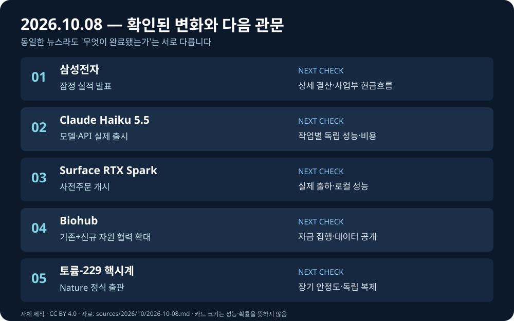

# 글로벌 테크 인텔리전스 리포트 — 2026-10-08

> **컷오프:** 2026-10-08 08:49:07 KST / 2026-10-07 23:49:07 UTC  
> **조사 구간:** 2026-10-07 08:49:07–10-08 08:49:07 KST (2026-10-06 23:49:07–10-07 23:49:07 UTC)  
> **[증거 원장](../../../sources/2026/10/2026-10-08.md)** · **[자산 명세](../../../assets/2026-10-08/README.md)**

*직접 제작한 설명 도표(CC BY 4.0). 실제 사건 사진이나 정량적 성능 비교가 아닙니다.*

## 핵심 요약

오늘의 공통축은 **AI 수요의 실적 전환, 추론 단가와 배치 장소의 재설계, 과학 데이터·장비의 검증 단계**다. 삼성전자는 대규모 잠정 실적을, Anthropic은 저가 모델 실제 출시를, Microsoft는 로컬 AI PC 사전주문을 공개했다. Biohub의 데이터 협력은 확대됐으나 발표 총액에 기존 자원이 포함된다. 핵시계 연구는 6월 preprint 이후 10월 7일 동료심사 정식 게재라는 새로운 증거를 얻었다. 로봇·자율주행의 새로운 실기기 운용 성과는 이번 상위 5건보다 검증 수준이 높지 않아 억지로 할당하지 않았다.

| 순위 | 새 발전 | 우선순위 | 확인 단계 |
|---|---|---|---|
| 1 | 삼성전자 3분기 매출 195조·영업이익 107.4조원 | High | 잠정 실적 |
| 2 | Claude Haiku 5.5 출시·새 API 단가 | High | 실제 출시, 성능은 회사 평가 |
| 3 | Surface Laptop Ultra·RTX Spark Dev Box | High | 사전주문, 배송 전 |
| 4 | Biohub Virtual Biology 총 18억달러 협력 | High | 기존+신규 자원·약정 |
| 5 | 토륨-229 핵시계 Nature 논문 2편 | Medium-High | 정식 게재, 상용화 전 |

## 1. 경제·AI 반도체 — 삼성전자 잠정 실적

### FACT
삼성전자는 **10월 8일** 연결기준 2026년 3분기 **매출 약 195조원, 영업이익 약 107.40조원**의 잠정치를 발표했다. 2025년 3분기 영업이익 12.17조원 대비 약 **782.5% 증가**다. 비교 대상인 2026년 2분기 매출은 171.5조원, 영업이익은 89.49조원이다. [삼성전자 공식 잠정실적](https://news.samsung.com/global/samsung-electronics-announces-earnings-guidance-for-third-quarter-2026) · [Reuters](https://www.reuters.com/business/samsung-q3-profit-jumps-783-ai-memory-boom-lifts-chip-earnings-2026-10-07/).

### ANALYSIS
Micron·Foxconn의 앞선 공급망 매출 증거에 이어 **새 분기의 메모리 공급자 이익 규모**가 확인됐다. Reuters는 AI용 HBM과 일반 메모리 공급 제약을 배경으로 지목한다. 그러나 이익 증가 전체를 AI 매출이나 HBM4 출하량 증가로 간주하면 안 된다. 가격·믹스·환율·다른 사업부 기여를 분리해야 한다.

### UNCERTAINTY
**확정 결산이 아니다.** 공식 자료의 추정범위는 매출 194–196조원, 영업이익 107.3–107.5조원이며 공개치는 중간값이다. DS부문별 이익·현금흐름·HBM4 수율과 실제 출하량은 미공개다. Reuters가 인용한 애널리스트 전망은 공식 실적과 다른 종류의 숫자다.

### WATCH
**10월 29일 상세 실적 예정**: 사업부별 이익·HBM 믹스·마진·현금흐름, 고객의 장기 구매계약, 모바일·가전 원가 부담.

## 2. AI — Anthropic Claude Haiku 5.5 출시

### FACT
Anthropic은 **10월 7일** `claude-haiku-5-5`를 출시했다. **100,000토큰 이하 프롬프트**의 100만 입력/출력 토큰 가격은 **$0.10/$0.50**, 이를 초과하면 **$0.50/$2.50**이다. 회사는 평균 작업비용이 Haiku 4.5보다 약 75% 낮다고 주장하며 Sonnet 5.5 캐시 읽기 가격도 100만 토큰당 $0.20에서 $0.10으로 낮췄다. [공식 출시·가격표](https://www.anthropic.com/claude-haiku-5-5) · [Reuters](https://www.investing.com/news/stock-market-news/anthropic-launches-third-claude-55-model-expanding-ai-lineup-before-planned-ipo-4937326).

### ANALYSIS
고난도 작업은 큰 모델에, 추출·분류·서브에이전트는 저비용 모델에 맡기는 **작업별 모델 라우팅**의 경제성이 강화된다. 실제 절감은 재시도·토큰화·캐시 적중률과 오류 비용까지 계산해야 한다.

### UNCERTAINTY
75%는 **회사 평균 추정**이지 독립적 비용 실측이 아니다. 100k 경계 위에서는 명목 토큰 단가가 5배이며 새 tokenizer로 동일 텍스트의 청구 토큰 수도 달라질 수 있다. 초기 고객 성능 평가는 독립 실험이 아니다.

### WATCH
실제 업무당 총비용·정확도·지연, 100k 경계 전후 비용, 독립 평가와 캐시 인하 적용.

## 3. AI 컴퓨팅 — Microsoft·NVIDIA 로컬 AI PC

### FACT
Microsoft는 **10월 7일** NVIDIA RTX Spark 기반 **Surface Laptop Ultra**와 **Surface RTX Spark Dev Box**의 사전주문을 시작했다. Laptop Ultra는 최대 **128GB 통합 메모리**, **120B 초과 파라미터 모델의 로컬 실행**을 내세우며 **$2,599부터**, **10월 16일 판매 시작 예정**이다. Dev Box는 **$5,999**, 미국 배송은 **11월 예정**이다. Windows용 **Microsoft Execution Containers(MXC) 일반 제공**도 같은 날 발표됐다. [Microsoft 기기 발표](https://blogs.windows.com/devices/2026/10/07/pre-order-our-most-powerful-surface-devices-ever/) · [Windows 기술 발표](https://blogs.windows.com/windowsexperience/2026/10/07/building-windows-for-hybrid-intelligence/) · [NVIDIA 발표](https://blogs.nvidia.com/blog/local-ai-rtx-spark-microsoft-windows-event/).

### ANALYSIS
로컬·클라우드 추론 배치, PC 자본비용, 에이전트 파일·네트워크 권한 통제를 한 시스템으로 묶으려는 시도다. MXC의 실행 격리와 에이전트 식별은 로컬 자동화의 운영 조건이다.

### UNCERTAINTY
**사전주문은 실제 출하·사용 성과가 아니다.** 최대 1 PFLOP는 희소성 가정의 이론적 FP4 성능이다. GitHub HydraFusion의 로컬 모델 라우팅은 **10월 말 실험적 프리뷰 예정**, Copilot 일부 로컬 기능도 수개월 후 예정으로, 현재 정식 제공으로 표현할 수 없다. 독립 성능·보안 시험 미확인.

### WATCH
10월 16일 실제 출하, 독립 로컬 추론 처리량·전력·비용, MXC 권한 격리 검증, 프리뷰 일정.

## 4. AI·생명과학 — Biohub Virtual Biology 자원 확대

### FACT
Biohub는 **10월 7일** DOE·NIH·민간기업과 AI 생물학 데이터 협력을 확대하며 **총 $1.8B 규모의 자금·데이터·컴퓨팅·측정기술 자원**을 제시했다. 세부 구성은 Biohub의 **4월 기존 $500M**, DOE의 **5년간 $500M 초과 계획**, Google DeepMind·Isomorphic Labs·Meta의 **합계 $300M**, NIH의 **기존 $500M 초과 연방투자에 기반한 데이터 자원 조정**이다. [Biohub 원문](https://biohub.org/news/virtual-biology-initiative-expansion/) · [Reuters](https://www.investing.com/news/stock-market-news/usgovernment-google-join-zuckerbergbacked-biohub-in-18-billion-push-for-ai-biology-data-4936795).

### ANALYSIS
생명과학 AI의 병목이 모델뿐 아니라 **표준화된 세포 개입-반응 데이터·측정 장비·공유 인프라**라는 점을 보여준다. 실험 데이터의 품질·재현성·접근 조건이 모델의 실제 연구 효용을 좌우한다.

### UNCERTAINTY
**$1.8B 전액을 새로 조달한 현금으로 계산하면 오류**다. NIH 항목은 과거 투자가 만든 자원이고 Biohub $500M도 4월 기존 약정이다. Reuters는 상업 참여자에게 공개 전 접근 기간이 있을 수 있다고 전한다. 완성된 공개 데이터셋·치료 성과는 아직 없다.

### WATCH
신규 자금 집행, 엠바고·공개 일정, 데이터 표준과 독립 재현, 실험 검증 결과.

## 5. 기초과학 — 토륨-229 핵시계 연구 정식 게재

### FACT
**10월 7일** `Nature`에 오스트리아 빈공대·독일 PTB 협력진과 중국 칭화대 연구진의 **작동하는 토륨-229 핵시계** 논문 두 편이 게재됐다. 빈 연구는 **148nm 핵전이에 레이저 피드백을 적용**해 시계를 안정화했고, 중국 연구는 독립적 동기화·재현성 경로를 제시했다. [빈 연구 원 논문](https://www.nature.com/articles/s41586-026-11084-4) · [중국 연구 원 논문](https://www.nature.com/articles/s41586-026-11122-1) · [APS 학술 해설](https://physics.aps.org/articles/v19/139).

### ANALYSIS
원자 **전자** 전이가 아닌 **원자핵** 전이를 시간·주파수 기준으로 제어하는 실험 장치가 구체화됐다. 정밀 측정·기초물리 연구에 유망하나 항법·통신에 즉시 상용 적용되는 단계는 아니다.

### UNCERTAINTY
**실험 최초 수행일이 10월 7일이라는 뜻이 아니다.** 양쪽 연구는 **6월 preprint**가 이미 존재하며 이번의 새로운 증거는 **동료심사 정식 출판**이다. 현재 프로토타입은 최고 광학 원자시계의 안정성에 못 미친다. 원 논문 페이지 일부 본문 접근 제한이 있어 성능의 직접 비교는 보류했다.

### WATCH
24시간 이상 안정도·실험실 간 재현, 레이저·결정 개선, 토륨 공급, 독립 검증과 응용 실증.

## 누적 추세 반영

삼성 잠정 실적은 [경제 트렌드](../../../trends/economy-investment.md)와 [AI 인프라 신호](../../../signals/ai-infrastructure.md)에, Haiku·로컬 PC·생물학 데이터 협력은 [AI 트렌드](../../../trends/artificial-intelligence.md)에, 핵시계 출판은 [과학 트렌드](../../../trends/space-science.md)에 **새 증거·한계·관찰 지표**를 추가했다. 로봇 관련 기존 [트렌드](../../../trends/robotics-autonomy.md)는 신규 실기기 검증 없이 수정하지 않았다. 이는 연구용 정보이며 투자 조언이 아니다.
