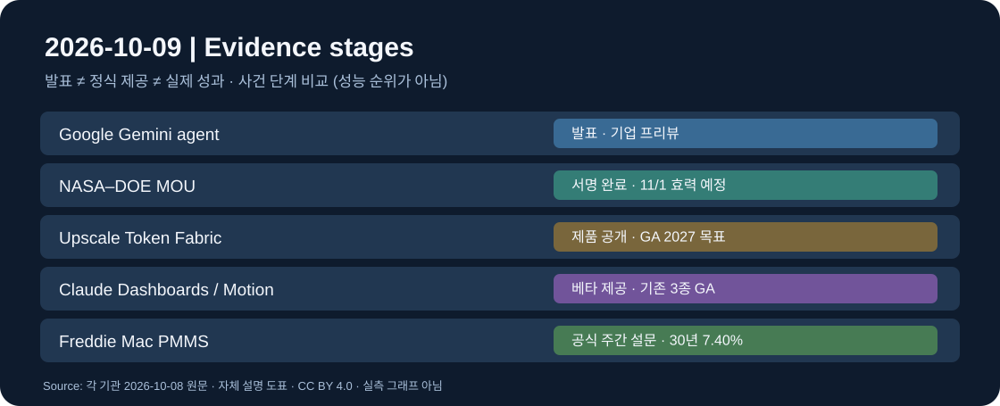

# 글로벌 테크 인텔리전스 리포트 — 2026-10-09

> **컷오프:** 2026-10-09 08:44:28 KST / 2026-10-08 23:44:28 UTC  
> **조사 구간:** 2026-10-08 08:44:28–2026-10-09 08:44:28 KST = 2026-10-07 23:44:28–2026-10-08 23:44:28 UTC. 직전 정식 리포트(10/8) 컷오프 08:49:07 KST와 **4분 39초 중첩**되지만 재선정 사건은 없다.  
> [증거 원장](../../../sources/2026/10/2026-10-09.md) · [시각자료 명세](../../../assets/2026-10-09/README.md)

*직접 제작한 사건 단계 구분 도표(CC BY 4.0). 실제 현장 사진이나 성능 비교 그래프가 아닙니다.*

## 핵심 요약

**에이전트는 기업의 업무시스템 안으로, AI 인프라는 이종 가속기 연결로 확장**됐다. 그러나 발표와 실제 고객 운영을 구분해야 한다. 우주 분야에서는 미국 NASA·DOE의 새 협력 문서가 서명됐으나 비행·실증 성과는 아니다. 금융 측면에서는 미국 주택대출 금리의 재상승이 자본비용 부담을 확인시켰다. 로봇·자율주행 분야도 별도로 조사했으나 이 24시간에 해당하는 독립적 신규 실기기 성과보다 아래 다섯 사건의 증거·영향을 우선했다.

| 순위 | 사건과 새 증거 | 분야 | 우선순위 | 확인 단계 |
|---|---|---|---|---|
| 1 | Google Cloud의 업무용 Gemini agent 통합 발표 | AI·테크 | High | 제품 발표·제한적 프리뷰 |
| 2 | NASA–DOE 우주 원자력 협력 MOU 서명 | 과학·우주 | High | **서명**, 11/1 효력 예정 |
| 3 | Upscale Token Fabric 이종 AI 칩 네트워크 포트폴리오 공개 | AI 인프라 | Medium-High | **제품 발표**, GA 2027년 초 계획 |
| 4 | Claude Dashboards·Motion 베타, Docs·Slides·Design 정식 전환 | AI·테크 | Medium-High | 베타 제공·기존 기능 GA |
| 5 | 미국 30년 고정 주택담보대출 평균 7.40% | 경제·투자 | High | 공식 주간 설문 통계 |

## 1. AI·테크 — Google Cloud, 범용 업무 에이전트 발표

### FACT
Google Cloud는 **10월 8일** Gemini at Work 2026에서 **Gemini agent**를 발표했다. Google Workspace의 메일·문서·시트·일정 및 외부 업무 도구를 잇고, 장기 작업·하위 에이전트·조직별 권한과 감사기록을 지향한다. Google은 Gemini 계열과 Anthropic Claude 모델을 작업별로 선택하는 멀티모델 라우팅, 예산 상한과 기업용 관리 기능도 제시했다. 금융·법률 특화는 **프리뷰**, 정부·의료·유통 특화는 **향후 예정**이다. [Google Cloud 공식 발표](https://cloud.google.com/blog/products/ai-machine-learning/welcome-to-gemini-at-work-2026) · [Reuters 전재 원문](https://www.investing.com/news/stock-market-news/google-cloud-introduces-gemini-agent-for-work-as-ai-race-heats-up-4939419).

### ANALYSIS
기업용 에이전트 경쟁의 핵심은 단일 모델의 벤치마크에서 **업무 데이터 접근권한·지속 실행·비용통제·실행 감사**로 이동한다. 특히 모델 선택을 에이전트 인터페이스와 분리하면 공급자 교체와 작업별 단가 최적화가 쉬워질 수 있다. 10/7 ChatGPT 기본 모델 배포(전일 보완)와는 **기업 업무 에이전트 아키텍처 공개**라는 새로운 사건으로 구분한다.

### UNCERTAINTY
발표된 기능이 **모든 고객에게 즉시 정식 제공된 것은 아니다**. [The Verge](https://www.theverge.com/tech/1007904/google-gemini-ai-agent-enterprise)는 새 에이전트의 제공 상태를 기업 대상 **private preview**로 설명한다. 공식 발표에 다수 고객 활용 사례가 있으나 각각이 **새 Gemini agent 자체의 공개 GA 실적**을 뜻하지 않는다. 실제 보안·작업완료율·비용은 독립 검증 전이다.

### WATCH
프리뷰→GA 날짜·지역·요금, 최소권한·감사로그 실측, 장기 실행 실패율, 외부 SaaS 권한 범위, 모델 라우팅의 작업당 총비용.

## 2. 과학·우주 — NASA와 DOE, 우주 전력·추진 협력 MOU 서명

### FACT
**10월 8일** NASA와 미국 에너지부(DOE)가 우주용 원자력 전력·추진의 연구·시험·발사 통합·운용을 포괄하는 **양해각서(MOU)에 서명**했다. NASA 보도자료상 **효력 발생일은 11월 1일**이다. NASA는 Space Reactor-1 Freedom의 **2028년 발사 목표**와 달 표면용 Lunar Reactor-1, **2030년까지 발사 준비가 된 달 표면 원자로 개발 목표**를 설명했다. 이는 완료가 아닌 기관의 일정·정책 목표다. [NASA 공식 보도자료](https://www.nasa.gov/news-release/nasa-energy-department-advance-new-era-of-nuclear-powered-exploration/).

### ANALYSIS
심우주 임무의 전력 공급은 탐사선·장비 운영시간과 달 표면 거점의 야간 가용성을 제약한다. 기관 간 책임을 한 프레임에 묶는 문서는 장기 연구·조달·시험을 조율하는 제도적 진전이다. 다만 **실제 비행 성공·달 기지 가동·상업 계약 성사와는 다른 단계**다.

### UNCERTAINTY
**새 협력이 처음 시작된 것은 아니다.** [NASA의 2026년 1월 기존 협력 발표](https://www.nasa.gov/news-release/nasa-department-of-energy-to-develop-lunar-surface-reactor-by-2030/)가 있으며, 이번 신규 증거는 **10/8 별도 MOU 서명과 범위**다. 예산·세부 기술 성능·승인 일정·목표 달성 가능성은 확정되지 않았다. 이 발표만으로 민간 우주 상용화 수익이 실현됐다고 볼 수 없다.

### WATCH
11/1 효력·기관별 예산과 책임 분담, 시험 및 안전심사 이정표, 2028년 계획 대비 실제 일정, 2030년 달 표면 전력계통의 실증 단계.

## 3. AI 인프라 — Upscale, Token Fabric 이종 가속기 네트워크 공개

### FACT
Upscale은 **10월 8일** Token Fabric을 발표했다. 자체 SkyFabriX scale-up 칩·시스템, NVIDIA Spectrum-X 기반 scale-out 장비, SkyOS/SkyCMD 관리 소프트웨어를 한 포트폴리오로 묶어 서로 다른 AI 가속기를 연결하는 구상이다. 회사가 제시한 **115.2 Tbps**는 SkyFabriX 설계 사양으로, 운영 고객의 실측 처리량이 아니다. 회사는 **2027년 초 일반 제공(GA)을 계획**하고 있으며 조기 접근·공동 검증은 진행 중이라고 밝혔다. [Upscale 원문](https://upscale.com/blogs/upscale-introduces-token-fabric-the-industrys-most-comprehensive-standards-based-networking-portfolio-for-ai-factories) · [Reuters](https://www.investing.com/news/stock-market-news/nvidiabacked-upscale-ai-launches-platform-to-connect-chips-from-rival-suppliers-4938802).

### ANALYSIS
메모리·연산 칩뿐 아니라 **이종 칩 사이 데이터 이동·운영 소프트웨어**가 AI 설비의 비용과 가동률을 좌우한다는 기존 인프라 신호를 구체화한다. GPU와 다른 XPU를 혼용하는 사업자에게 개방형 인터커넥트가 중요해질 수 있다.

### UNCERTAINTY
**10/8은 제품 포트폴리오 공개이지 전체 시스템의 GA가 아니다.** Reuters는 첫 구성요소의 4분기 출시와 2027년 단계적 전개를 전했으나, 공식 보도자료는 **2027년 초 전체 GA 목표**를 명시한다. 범위가 다르므로 모순으로 단정하지 않고, **실제 출하·호환성·독립 성능은 미확인**으로 둔다. 매출 전망도 CEO의 예상치다.

### WATCH
2026년 4분기 첫 구성품 출하 여부, 2027년 초 GA, 이종 GPU/XPU 상호운용성·실측 지연/대역폭, 고객 매출·가동률과 장애 복구.

## 4. AI 생산성 — Claude 대시보드·애니메이션 베타 공개

### FACT
Anthropic은 **10월 8일** Claude Dashboards를 **유료 플랜 베타**, Claude Motion을 **Team·Enterprise 베타**로 공개했다. Dashboards는 BigQuery·Databricks·Snowflake 등 데이터 원천을 연결해 갱신되는 차트를 만들고 쿼리와 데이터 갱신 시점을 보여준다. Motion은 편집 가능한 코드 기반 애니메이션과 MP4 내보내기를 제공하며, 회사는 생성형 영상 모델을 사용하는 기능이 아니라고 명시했다. 기존 Claude Docs·Slides·Design은 **베타를 종료하고 Free 포함 전 플랜에서 제공**한다. [Claude 공식 발표](https://claude.com/de/resources/articles/dashboards-and-motion) · [Reuters 전재](https://www.aol.com/articles/anthropic-launches-dashboard-animation-tools-190112000.html).

### ANALYSIS
텍스트 답변이 아니라 **지속 갱신되는 분석물·편집 가능한 산출물**을 직접 전달하는 경쟁이 강화된다. 회사 데이터와 생성 코드가 연결되므로 데이터 권한·쿼리 정확도·공유 정책이 실용성을 결정한다.

### UNCERTAINTY
대시보드·Motion은 아직 **베타**이며 기업 관리자에게 기본 비활성 상태일 수 있다. 차트의 수치가 자동으로 검증되거나 모든 커넥터가 즉시 제공된다는 뜻은 아니다. 10/7 Haiku 5.5 출시와는 **다른 기능의 10/8 신규 배포**다.

### WATCH
베타→GA 일정, SQL 재현성·권한 누출·데이터 최신성, 실제 사용자 수정률, 관리자 설정과 가격 정책.

## 5. 경제·투자 — 미국 주택대출 평균 금리 7.40%

### FACT
미국 주택금융기관 Freddie Mac의 **10월 8일 주간 PMMS 조사**에서 30년 고정 주택담보대출 평균은 **7.40%**, 전주 **7.28% 대비 +12bp**였다. 15년 고정은 **6.73%**, 전주 **6.60% 대비 +13bp**였다. 전년 동기 30년 고정은 **6.30%**였다. 이는 특정 차주의 실제 제안금리가 아니라 **우량 차주·20% 계약금 등 조건의 설문 평균**이다. [Freddie Mac 원문](https://freddiemac.gcs-web.com/news-releases/news-release-details/mortgage-rates-average-740) · [Reuters](https://www.investing.com/news/economy-news/us-30year-fixedrate-mortgage-rate-jumps-to-740-4939500) · [AP](https://apnews.com/article/e9badb974fbb8e3f7ca2ae25fbe556fa).

### ANALYSIS
장기금리 상승이 주택 구매·재융자 비용으로 전이되는 경로를 수치로 확인했다. Reuters·AP는 채권수익률과 에너지 가격 상승 우려를 배경으로 분석한다. AI 투자 확대와 별개로 **금융비용 상승은 기술기업·가계·부동산 투자 모두에 할인율 압력**을 준다.

### UNCERTAINTY
금리 상승의 단일 원인을 입증할 수 없고, **은행별 실제 금리·신용등급·대출비용은 다르다**. Reuters의 거시적 인과 해석과 Freddie Mac의 공식 설문값을 구분한다. 향후 추가 상승은 전망이지 확정치가 아니다.

### WATCH
10/15 PMMS, 미 10년 국채수익률·물가 지표, 주택 구매·재융자 신청량, 건설·소비 지표, 신용 스프레드.

## 분야 간 연결

- **Google·Claude:** 에이전트의 지속 작업과 시각적 산출물 경쟁은 데이터 접근통제·검증 가능성이 실제 제품의 병목임을 보여준다.
- **Upscale·Google:** 멀티모델·멀티가속기 환경에서는 작업별 라우팅과 물리적 네트워크 비용을 **함께** 관리해야 한다. 두 발표가 같은 고객 계약이라는 뜻은 아니다.
- **NASA·금리:** 장기 우주 연구와 AI 인프라는 모두 일정·자본비용·실제 시험을 구분해 추적해야 한다.

## 후보 제외·반복 방지

- **로봇·자율주행:** [FMCSA의 Aurora L4 트럭 경고장치 면제](https://www.fmcsa.dot.gov/safety/carrier-safety/grant-application-exemption-aurora-operations-inc)는 **효력 10/7**로 전날 사건이며 10/8 Reuters 보도만으로 새 결정을 10/8 사건으로 옮기지 않았다. 10/8 Tesla Optimus 관련 언론 평가는 신규 실기기 성능·상용 배치 증거가 아니므로 제외했다.
- **과학·우주:** [NASA의 LISA 시험용 망원경 개발 진전](https://science.nasa.gov/missions/lisa/nasa-advances-lisa-mission-contributions-with-new-test-telescope/)은 10/8 공식 발표로 유효한 후보이나, 이번에는 기관 간 신규 MOU의 영향 범위를 더 높게 평가했다. LISA는 비행 장비 납품 완료가 아닌 시험 장비 개발 단계다.
- **경제:** [미 노동부의 10/8 실업수당 신규 청구 197,000건](https://www.dol.gov/newsroom/releases/eta/eta20261008)은 별도 공식 지표로 확인했으나, 이번에는 7.40% 주택금리 상승의 자본비용 전파를 상위로 선정했다.
- **기존 사건:** 10/8 정식·보완 리포트의 삼성 잠정실적, Haiku 5.5, Surface, 누리호, 노벨상은 의미 있는 새로운 사실 없이 재사용하지 않았다.

## 누적 추세

[AI 동향](../../../trends/artificial-intelligence.md), [우주·과학 동향](../../../trends/space-science.md), [AI 인프라 신호](../../../signals/ai-infrastructure.md)에 새 증거와 검증 한계를 반영했다. 경제 동향은 한 주의 금리 수치만으로 장기 방향을 새로 규정하지 않았으며, 로봇 동향도 새 실기기 근거 없이 수정하지 않았다.

*이 자료는 정보 추적·분석용이며 투자 조언이 아닙니다.*
